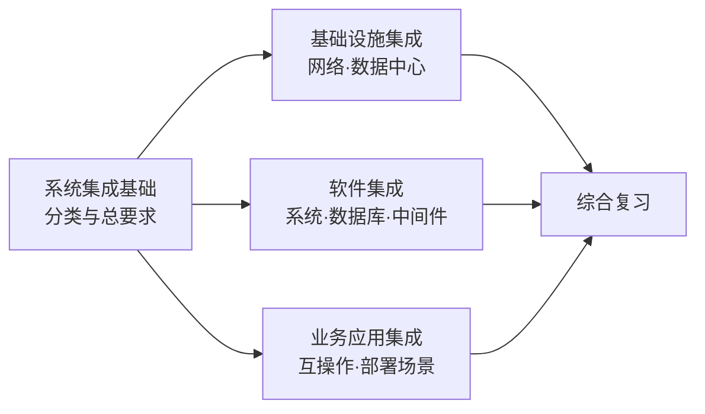

# 第七章 系统集成

## 0. 本章导航

- 返回：[[00-导航/备考首页|备考首页]]
- 练习：[[03-错题库/错题库#第七章 系统集成|本章错题]]
- 溯源：[[98-原始资料/第七章|原始笔记]]
- 学习路径：先建立“系统集成是什么”（分类与总要求），再进入基础设施集成（网络、数据中心），接着到软件集成（操作系统、数据库、中间件、组件模型），最后落到业务应用集成。

## 1. 章首速览

### 一句话总览

本章围绕系统集成展开：先界定系统集成的五分类与“目标/结构/基础/保证”总要求，再分基础设施集成、软件集成、业务应用集成三大落点逐一展开，覆盖网络、数据中心、操作系统、数据库、中间件、组件模型与集成部署场景。

### 全章主线

### 必背清单

| 主题 | 必背关键词 |
|---|---|
| 系统集成五分类 | 软件集成、硬件集成、网络集成、数据集成、业务应用集成 |
| 软硬件集成四定位 | 目标=信息的集成、结构=功能的集成、基础=平台的集成、保证=人员的集成 |
| 基础设施两大类 | 通信网络基础设施、新技术基础设施 |
| 通信网络基础设施 | 局域网、互联网、5G、物联网、工业互联网、卫星互联网 |
| 新技术基础设施 | 人工智能、云计算、区块链 |
| 基础设施集成三类 | 弱电工程、网络集成、数据中心集成 |
| 网络体系框架 | 网络传输系统、交换子系统、网管子系统、安全子系统 |
| 传输介质 | 无线（无线电波/微波/红外线）、有线（双绞线/同轴电缆/光纤） |
| 交换技术 | 局域网交换、城域网交换、广域网交换、电路交换、分组交换、混合交换 |
| 数据中心集成 | 机柜、服务器、存储、网络设备、安全设备 |
| 操作系统五功能 | 进程管理、存储管理、设备管理、文件管理、作业管理 |
| 数据库集成工作 | 安装、创建、迁移、备份与恢复、管理 |
| 中间件定位 | 操作系统软件与用户应用软件之间；提供运行与开发环境 |
| 组件模型 | CORBA、COM、DCOM、COM+、.NET |
| 业务应用集成三技术要求 | 互操作性、可移植性、透明性 |

### 高频易混预警

| 易混组合 | 快速辨识（通俗理解，不作教材定义） |
|---|---|
| 系统集成五分类 vs 软硬件集成四定位 | 分类=五种集成对象（软件/硬件/网络/数据/业务应用）；四定位=目标/结构/基础/保证。 |
| 通信网络基础设施 vs 新技术基础设施 | 前者是“网”（局域网/互联网/5G/物联网/工业互联网/卫星互联网）；后者是“新技术”（AI/云/区块链）。 |
| 传输子系统 vs 交换子系统 | 传输负责“连通介质”（无线/有线）；交换负责“转发技术”（局域网/城域网/广域网/电路/分组/混合）。 |
| 数据集成 vs 业务应用集成 | 原稿口径：数据集成=共享数据但不存储；业务应用集成=功能层面直接链接应用。“不存储”与第六章复制集成存在口径冲突，待核对。 |
| DCOM vs COM+ | 原稿口径：DCOM 看“分布式”（位置透明/网络安全/跨平台）；COM+ 看“组件服务”（异步/事件/可伸缩/继承 MTS）。“跨平台性”待核对。 |

## 2. 系统集成基础

本节界定“系统集成是什么”：先看分类与总要求，再看典型特点与信创集成。

### 2.1 分类与软硬件集成四定位

#### 系统集成五分类

**软件集成、硬件集成、网络集成、数据集成、业务应用集成**。

#### 软硬件系统集成四定位

> [!info] 教材原稿关键词
> 软硬件系统集成：目标＝**信息的集成**；结构＝**功能的集成**；基础＝**平台的集成**；保证＝**人员的集成**。满足以上要求才是系统集成。

| 维度 | 内容（原稿） |
|---|---|
| 目标 | 信息的集成 |
| 结构 | 功能的集成 |
| 基础 | 平台的集成 |
| 保证 | 人员的集成 |

> [!note] 通俗理解
> 记“目标信息、结构功能、基础平台、保证人员”——集成要打通的是信息，靠功能搭结构、靠平台打底、靠人员兜底。

#### 考试关键词

- 五分类：**软件、硬件、网络、数据、业务应用**集成。
- 四定位：**目标=信息、结构=功能、基础=平台、保证=人员**。

#### 记忆钩子

> [!tip] 四定位记“**目/结/基/保**”，对应“信息/功能/平台/人员”。

#### 主动回忆

> [!question]- 系统集成分为哪五类？
> 软件集成、硬件集成、网络集成、数据集成、业务应用集成。

> [!question]- 软硬件系统集成的目标、结构、基础、保证分别是什么？
> 目标=信息的集成；结构=功能的集成；基础=平台的集成；保证=人员的集成。

#### 原教材定位

- [[98-原始资料/第七章#系统集成基础|原稿“系统集成基础”]]：五分类、软硬件集成四定位。
- 覆盖核对：[[98-原始资料/第七章整理对照表|第七章整理对照表]]。

### 2.2 典型特点与信创集成

#### 典型系统集成特点

| # | 特点（原稿） |
|---|---|
| 1 | 集成交付队伍庞大，但是**连续性不是很强** |
| 2 | 设计人员高度专业化，**且需要多元化的知识体系**（原稿“切”为“且”误写） |
| 3 | 涉及众多承包商或服务体系，分散在多个区域 |
| 4 | 研制或开发一定量的软硬件系统 |
| 5 | 采用大量新技术、前沿技术 |
| 6 | 集成成功使用越来越好，集成实施和运维往往变得更加复杂 |

> [!caution] 待核对
> 特点 6 原稿为“集成成功使用越来越好，集成实施和运维往往变得更加复杂”，语义不完整，疑有脱字（或为“集成成功后使用越来越广泛”之类）。原稿无法确定，暂按原文保留，不自行补写。

#### 信创相关集成

| 要点（原稿） |
|---|
| 技术与产品所处的成熟度不同 |
| 信创技术产品往往迭代周期比较快，会带来标准化程度困扰 |
| 较强的自主可控能力（原稿“交强”为“较强”误写） |

#### 考试关键词

- 特点关键词：**连续性不是很强、多元化知识体系、分散多个区域、研制软硬件、大量新技术、实施运维更复杂**。
- 信创：**成熟度不同、迭代快、标准化困扰、自主可控**。

#### 易混点

1. **特点 vs 信创**：特点是“一般系统集成”的通性；信创相关集成聚焦“技术成熟度、迭代快、自主可控”。

#### 主动回忆

> [!question]- 典型系统集成有哪些特点？
> 集成交付队伍庞大但连续性不强；设计人员高度专业化且需多元化知识体系；涉及众多承包商、分散多区域；研制或开发一定量软硬件系统；采用大量新技术；集成实施与运维往往更复杂。

> [!question]- 信创相关集成有哪些要点？
> 技术与产品成熟度不同；迭代周期快、带来标准化困扰；较强的自主可控能力。

#### 原教材定位

- [[98-原始资料/第七章#系统集成基础|原稿“系统集成基础”]]：典型特点、信创相关集成。
- 覆盖核对：[[98-原始资料/第七章整理对照表|第七章整理对照表]]。

## 3. 基础设施集成

本节看信息系统基础设施与基础设施集成（弱电、网络、数据中心）。

### 3.1 信息系统基础设施与集成分类

#### 基础设施两大类

> [!info] 教材原稿关键词
> 以**局域网、互联网、5G、物联网、工业互联网、卫星互联网**为**通信网络基础设施**；以**人工智能、云计算、区块链**为**新技术基础设施**。

| 类别 | 内容（原稿） |
|---|---|
| 通信网络基础设施 | 局域网、互联网、5G、物联网、工业互联网、卫星互联网 |
| 新技术基础设施 | 人工智能、云计算、区块链 |

> [!note] 通俗理解
> “通信网络基础设施”是连网底座，“新技术基础设施”是算力/智能底座（AI、云、区块链）。

#### 基础设施集成三类

**弱电工程、网络集成、数据中心集成**。

#### 考试关键词

- 通信网络基础设施六项：**局域网、互联网、5G、物联网、工业互联网、卫星互联网**。
- 新技术基础设施三项：**人工智能、云计算、区块链**。
- 基础设施集成三类：**弱电工程、网络集成、数据中心集成**。

#### 主动回忆

> [!question]- 信息系统基础设施分为哪两大类？分别有哪些？
> 通信网络基础设施（局域网、互联网、5G、物联网、工业互联网、卫星互联网）；新技术基础设施（人工智能、云计算、区块链）。

> [!question]- 基础设施集成包括哪三类？
> 弱电工程、网络集成、数据中心集成。

#### 原教材定位

- [[98-原始资料/第七章#基础设施集成|原稿“基础设施集成”]]：基础设施分类、集成三类。
- 覆盖核对：[[98-原始资料/第七章整理对照表|第七章整理对照表]]。

### 3.2 弱电与网络集成

#### 弱电

> [!caution] 待核对
> 原稿仅一句“弱电 交流 220v，50Hz 以下”。工程常识中 220V 通常属强电/市电电压，弱电多指安全电压或信号/控制电路电压；此句疑有脱字或误记，无法确定，暂按原文保留。

#### 网络体系框架

**网络传输系统、交换子系统、网管子系统、安全子系统**。

> [!note] 通俗理解
> 原稿第 4 点写“网络传输系统”，第 5 点写“传输子系统”，指同一子系统（传输）。后文分别展开传输、交换、安全（防火墙/加密/访问控制），网管子系统的细节原稿未展开。

#### 传输子系统

> [!info] 教材原稿关键词
> 传输是网络的**核心**。传输介质分为**无线传输介质、有线传输介质**：无线含**无线电波、微波、红外线**；有线含**双绞线、同轴电缆、光纤**。

| 介质类别 | 具体介质 |
|---|---|
| 无线 | 无线电波、微波、红外线 |
| 有线 | 双绞线、同轴电缆、光纤 |

#### 交换子系统

**局域网交换技术、城域网交换技术（宽带局域网）、广域网交换技术、电路交换、分组交换、混合交换**。

> [!caution] 待核对/原稿表述
> 原稿将“城域网交换技术”括注为“宽带局域网”，但同一列表已将局域网、城域网分别列为不同范围，括注可能存在转写错误；本章保留原稿，不自行改成“宽带城域网”。

#### 安全子系统

**防火墙、数据加密、访问控制**。

#### 考试关键词

- 网络体系框架四子系统：**网络传输系统、交换子系统、网管子系统、安全子系统**。
- 传输介质：无线（无线电波/微波/红外线）、有线（双绞线/同轴电缆/光纤）；**传输是网络的核心**。
- 交换技术：局域网/城域网/广域网/电路/分组/混合交换。
- 安全：防火墙、数据加密、访问控制。

#### 易混点

1. **传输 vs 交换**：传输管“连通介质”，交换管“转发技术”。
2. **无线介质 vs 有线介质**：无线电波/微波/红外线 vs 双绞线/同轴电缆/光纤。

#### 记忆钩子

> [!tip] 传输介质：“无线=电波/微波/红外；有线=双绞/同轴/光纤”。交换技术记“三网三式”（局域网/城域网/广域网 + 电路/分组/混合）。

#### 主动回忆

> [!question]- 网络体系框架包括哪四个子系统？
> 网络传输系统、交换子系统、网管子系统、安全子系统。

> [!question]- 传输介质有哪些？交换技术有哪些？
> 无线：无线电波、微波、红外线；有线：双绞线、同轴电缆、光纤。交换：局域网交换、城域网交换（原稿括注“宽带局域网”，待核对）、广域网交换、电路交换、分组交换、混合交换。

#### 原教材定位

- [[98-原始资料/第七章#基础设施集成|原稿“基础设施集成”]]：弱电、网络体系框架、传输/交换/安全子系统。
- 覆盖核对：[[98-原始资料/第七章整理对照表|第七章整理对照表]]。

### 3.3 数据中心集成

**机柜集成、服务器集成、存储集成、网络设备集成、安全设备集成**。

#### 主动回忆

> [!question]- 数据中心集成包括哪些？
> 机柜集成、服务器集成、存储集成、网络设备集成、安全设备集成。

#### 原教材定位

- [[98-原始资料/第七章#基础设施集成|原稿“基础设施集成”]]：数据中心集成。
- 覆盖核对：[[98-原始资料/第七章整理对照表|第七章整理对照表]]。

## 4. 软件集成

本节看软件集成的核心：操作系统、数据库、中间件、组件模型（CORBA/COM/DCOM/COM+/.NET）。

### 4.1 操作系统

#### 操作系统分类与功能

| 角度 | 内容（原稿） |
|---|---|
| 运行环境角度 | 桌面、服务器、手机、嵌入式操作系统 |
| 功能角度 | 批处理、实时、分时、网络、分布式操作系统 |
| 操作系统功能 | 进程管理、存储管理、设备管理、文件管理、作业管理 |
| 网络操作系统基本功能 | 数据共享、设备共享、文件管理、名字服务、网络安全、网络管理、系统容错、网络互联、应用软件 |

> [!note] 通俗理解
> “运行环境”看装在哪（桌面/服务器/手机/嵌入式）；“功能”看干什么用（批处理/实时/分时/网络/分布式）；操作系统自身五大功能“进程、存储、设备、文件、作业”。

#### 考试关键词

- 运行环境四类：**桌面、服务器、手机、嵌入式**。
- 功能五类：**批处理、实时、分时、网络、分布式**。
- 操作系统五功能：**进程、存储、设备、文件、作业**。
- 网络操作系统基本功能（九项）：**数据共享、设备共享、文件管理、名字服务、网络安全、网络管理、系统容错、网络互联、应用软件**。

#### 主动回忆

> [!question]- 操作系统的五大功能是什么？网络操作系统有哪些基本功能？
> 五大功能：进程管理、存储管理、设备管理、文件管理、作业管理。网络操作系统：数据共享、设备共享、文件管理、名字服务、网络安全、网络管理、系统容错、网络互联、应用软件。

#### 原教材定位

- [[98-原始资料/第七章#软件集成|原稿“软件集成”]]：操作系统分类与功能。
- 覆盖核对：[[98-原始资料/第七章整理对照表|第七章整理对照表]]。

### 4.2 数据库

#### 数据库管理系统与分布式数据库

> [!info] 教材原稿关键词
> **数据库管理系统（DBMS）**是为管理数据库而设计的计算机软件系统。**分布式数据库**＝自治和协调。

#### 数据库集成工作

**数据库系统安装、数据库创建、数据库迁移、数据库备份与恢复、数据库管理**。

#### 考试关键词

- DBMS：为管理数据库而设计的计算机软件系统。
- 分布式数据库：**自治和协调**。
- 数据库集成五项：**安装、创建、迁移、备份与恢复、管理**。

#### 主动回忆

> [!question]- 数据库集成工作包括哪些？分布式数据库的两个关键词是什么？
> 数据库系统安装、数据库创建、数据库迁移、数据库备份与恢复、数据库管理；自治和协调。

#### 原教材定位

- [[98-原始资料/第七章#软件集成|原稿“软件集成”]]：数据库。
- 覆盖核对：[[98-原始资料/第七章整理对照表|第七章整理对照表]]。

### 4.3 中间件

#### 中间件定位与功能

> [!info] 教材原稿关键词
> 中间件位于**操作系统软件与用户的应用软件中间**；在操作系统、网络和数据库之上，应用软件的下层；作用是为处于上层的应用软件**提供运行与开发环境**；提供的功能有**通信支持、应用支持、公共服务**。

#### 中间件分类

**事务式中间件、过程式中间件、面向消息的中间件、面向对象的中间件、交易中间件、Web 应用服务器**。

#### 考试关键词

- 定位：操作系统与应用软件之间；操作系统/网络/数据库之上、应用软件下层。
- 作用：提供运行与开发环境。
- 功能：通信支持、应用支持、公共服务。
- 分类六种（原稿含“web 应用服务器”）。

#### 主动回忆

> [!question]- 中间件位于哪里？作用是什么？提供哪些功能？
> 位于操作系统软件与用户应用软件之间（操作系统/网络/数据库之上、应用软件下层）；为上层应用软件提供运行与开发环境；功能有通信支持、应用支持、公共服务。

#### 原教材定位

- [[98-原始资料/第七章#软件集成|原稿“软件集成”]]：中间件。
- 覆盖核对：[[98-原始资料/第七章整理对照表|第七章整理对照表]]。

### 4.4 组件模型（CORBA / COM / DCOM / COM+ / .NET）

#### CORBA

**公共对象请求代理体系结构**：对象请求代理（ORB）、对象服务、公共功能、域接口、应用接口。

#### COM

> [!info] 教材原稿关键词
> **COM（组件对象模型）**：COM 中的对象是一种**二进制代码对象**，直接注册在系统库中；COM 目标是实现对象的**可重用性、互操作性、编程语言无关性**。

#### DCOM 与 COM+

| 技术 | 特性（原稿） |
|---|---|
| DCOM（原稿“DOCM”为误写） | 位置透明性、网络安全性、跨平台性 |
| COM+ | 真正的异步通信、事件服务、可伸缩性、继承并发展 MTS 的特性、可管理和可配置性、易于开发 |

> [!caution] 待核对/原稿表述
> 原稿把“跨平台性”列为 DCOM 特性，但未给出适用边界或依据；本章按原稿保留，需对照第三版教材原文核定。

#### .NET

> [!info] 教材原稿关键词
> .NET 基于**一组开放的互联网协议**推出的产品、技术和服务；含通用语言运行环境（CLR）、基础类库（BCL）、ADO.NET 技术、ASP.NET。

#### 考试关键词

- CORBA 组成：ORB、对象服务、公共功能、域接口、应用接口。
- COM 三目标：可重用性、互操作性、编程语言无关性；二进制代码对象。
- DCOM 三特性（原稿口径）：位置透明性、网络安全性、跨平台性；其中“跨平台性”待核对。
- COM+ 六特性：异步通信、事件服务、可伸缩性、继承 MTS、可管理可配置、易于开发。
- .NET 组成：CLR、BCL、ADO.NET、ASP.NET。

#### 易混点

1. **DCOM vs COM+**：DCOM 强调分布式（位置透明/网络安全/跨平台）；COM+ 强调组件服务能力（异步/事件/可伸缩/继承 MTS）。
2. **CORBA vs COM**：CORBA 是公共对象请求代理体系结构（含 ORB）；COM 是二进制组件对象模型（可重用/互操作/语言无关）。

#### 记忆钩子

> [!tip] 组件模型记“三 C 一 .NET”：CORBA、COM、DCOM/COM+、.NET。

#### 主动回忆

> [!question]- CORBA 由哪几部分组成？COM 的三大目标是什么？
> CORBA：ORB、对象服务、公共功能、域接口、应用接口；COM：可重用性、互操作性、编程语言无关性。

> [!question]- DCOM 与 COM+ 各有哪些特性？.NET 包含哪些组成？
> DCOM（原稿口径）：位置透明性、网络安全性、跨平台性（“跨平台性”待核对）；COM+：真正的异步通信、事件服务、可伸缩性、继承并发展 MTS 的特性、可管理和可配置性、易于开发；.NET：CLR、BCL、ADO.NET、ASP.NET。

#### 原教材定位

- [[98-原始资料/第七章#软件集成|原稿“软件集成”]]：CORBA、COM、DCOM/COM+、.NET。
- 覆盖核对：[[98-原始资料/第七章整理对照表|第七章整理对照表]]。

## 5. 业务应用集成

本节看业务应用集成的技术要求、优势，以及数据集成与业务应用集成的区别、部署场景与协调组件。

### 5.1 技术要求与优势

#### 技术要求

**应用间的互操作性、分布式环境中应用的可移植性、系统中应用分布式的透明性**。

#### 优势

**共享信息、提高敏捷性和效率、简化软件使用、降低 IT 投资和成本、优化业务流程**。

#### 考试关键词

- 三技术要求：**互操作性、可移植性、透明性**。
- 五优势：共享信息、提高敏捷性与效率、简化软件使用、降低 IT 投资与成本、优化业务流程。

#### 主动回忆

> [!question]- 业务应用集成的技术要求有哪些？优势有哪些？
> 技术要求：互操作性、可移植性、透明性；优势：共享信息、提高敏捷性和效率、简化软件使用、降低 IT 投资和成本、优化业务流程。

#### 原教材定位

- [[98-原始资料/第七章#业务应用集成|原稿“业务应用集成”]]：技术要求、优势。
- 覆盖核对：[[98-原始资料/第七章整理对照表|第七章整理对照表]]。

### 5.2 数据集成与业务应用集成之别

| 类型 | 关键点（原稿） |
|---|---|
| 数据集成 | 共享数据，**并不存储数据** |
| 业务应用集成 | 功能层面将多个业务应用**直接链接**起来 |

> [!caution] 待核对/原稿口径
> “数据集成共享数据，并不存储数据”是原稿的绝对化表述；它与第六章所列“复制集成、混合集成”存在口径冲突，不能直接推广为所有数据集成方式的通用定义。本章保留原句供教材定位，等待第三版教材原文核定。

#### 主动回忆

> [!question]- 数据集成与业务应用集成的区别？
> 按第七章原稿：数据集成=共享数据、并不存储数据（“不存储”待核对）；业务应用集成=功能层面将多个业务应用直接链接起来。

#### 原教材定位

- [[98-原始资料/第七章#业务应用集成|原稿“业务应用集成”]]：数据集成与业务应用集成区别。
- 覆盖核对：[[98-原始资料/第七章整理对照表|第七章整理对照表]]。

### 5.3 部署场景与协调组件

#### 部署场景

| 部署环境 | 集成对象（原稿） |
|---|---|
| 云端 | 集成 SaaS、CRM |
| 本地（受防火墙保护） | 集成传统 ERP 系统 |
| 混合环境 | 集成本地业务应用 + 托管在专用服务器上的云应用 |

#### 协调组件

**应用编程接口（API）、事件驱动型操作、数据映射**。

#### 考试关键词

- 部署三场景：云端（SaaS/CRM）、本地（ERP）、混合（本地+托管云应用）。
- 协调组件：API、事件驱动型操作、数据映射。

#### 主动回忆

> [!question]- 业务应用集成的部署场景有哪些？协调组件有哪些？
> 云端（集成 SaaS、CRM）、本地受防火墙保护（集成传统 ERP）、混合环境（本地业务应用 + 专用服务器托管云应用）；组件有应用编程接口、事件驱动型操作、数据映射。

#### 原教材定位

- [[98-原始资料/第七章#业务应用集成|原稿“业务应用集成”]]：部署场景、协调组件。
- 覆盖核对：[[98-原始资料/第七章整理对照表|第七章整理对照表]]。

## 6. 章末综合复习

### 6.1 高频易混点对比

> [!note] 使用说明
> 本表按“容易混淆”组织，不表示经过统计的考频排序，也不提供未经官方依据的星级押题。

| 易混组合 | 区分抓手 |
|---|---|
| 系统集成五分类 vs 软硬件集成四定位 | 五种集成对象 vs 目标/结构/基础/保证。 |
| 通信网络基础设施 vs 新技术基础设施 | “网”（局域网/互联网/5G/物联网/工业互联网/卫星互联网）vs “新技术”（AI/云/区块链）。 |
| 传输子系统 vs 交换子系统 | 连通介质（无线/有线）vs 转发技术（局域网/城域网/广域网/电路/分组/混合）。 |
| 无线介质 vs 有线介质 | 无线电波/微波/红外线 vs 双绞线/同轴电缆/光纤。 |
| 数据集成 vs 业务应用集成 | 原稿口径：共享数据不存储（“不存储”待核对）vs 功能层面直接链接应用。 |
| DCOM vs COM+ | 原稿口径：分布式（位置透明/网络安全/跨平台，其中“跨平台”待核对）vs 组件服务（异步/事件/可伸缩/继承 MTS）。 |
| CORBA vs COM | 公共对象请求代理体系结构（ORB…）vs 二进制组件对象模型（可重用/互操作/语言无关）。 |

### 6.2 关键顺序与等级

1. **软硬件集成四定位（固定表述顺序）**：目标（信息）→ 结构（功能）→ 基础（平台）→ 保证（人员）。
2. **基础设施分层**：通信网络基础设施 → 新技术基础设施。
3. **基础设施集成三层（原稿顺序）**：弱电工程 → 网络集成 → 数据中心集成。
4. **网络体系框架四子系统（原稿顺序）**：网络传输系统 → 交换子系统 → 网管子系统 → 安全子系统。

### 6.3 分层必背清单

#### 必须准确背诵

- 系统集成五分类；软硬件集成四定位（目标/结构/基础/保证）。
- 通信网络基础设施六项、新技术基础设施三项；基础设施集成三类。
- 网络体系框架四子系统；传输介质（无线/有线各三项）；交换技术六种；数据中心集成五项。
- 操作系统五功能；数据库集成五项；中间件定位/作用/功能。
- CORBA 组成、COM 三目标、DCOM 三特性、COM+ 六特性、.NET 组成。
- 业务应用集成三技术要求与五优势；数据集成 vs 业务应用集成区别；部署三场景。

#### 理解后辨识

- 传输 vs 交换的题干线索。
- 数据集成 vs 业务应用集成的场景判定。
- DCOM vs COM+、CORBA vs COM 的题干线索。
- 通信网络基础设施 vs 新技术基础设施的归属。

### 6.4 闭卷自测

#### 列举题

> [!question]- 1. 系统集成分为哪五类？
> 软件集成、硬件集成、网络集成、数据集成、业务应用集成。

> [!question]- 2. 软硬件系统集成的目标、结构、基础、保证分别是什么？
> 目标=信息的集成、结构=功能的集成、基础=平台的集成、保证=人员的集成。

> [!question]- 3. 信息系统基础设施分为哪两大类，各有哪些？
> 通信网络基础设施（局域网、互联网、5G、物联网、工业互联网、卫星互联网）；新技术基础设施（人工智能、云计算、区块链）。

> [!question]- 4. 网络体系框架包括哪四个子系统？传输介质有哪些？
> 网络传输系统、交换子系统、网管子系统、安全子系统；无线（无线电波、微波、红外线）、有线（双绞线、同轴电缆、光纤）。

> [!question]- 5. 操作系统的五大功能是什么？数据库集成工作包括哪些？
> 进程管理、存储管理、设备管理、文件管理、作业管理；安装、创建、迁移、备份与恢复、管理。

> [!question]- 6. 中间件位于哪里？作用与功能是什么？
> 操作系统软件与用户应用软件之间；为上层应用提供运行与开发环境；功能有通信支持、应用支持、公共服务。

> [!question]- 7. DCOM 与 COM+ 各有哪些特性？.NET 包含哪些组成？
> DCOM（原稿口径）：位置透明性、网络安全性、跨平台性（“跨平台性”待核对）；COM+：异步通信、事件服务、可伸缩性、继承 MTS、可管理可配置、易于开发；.NET：CLR、BCL、ADO.NET、ASP.NET。

> [!question]- 8. 业务应用集成的技术要求与优势分别是什么？
> 技术要求：互操作性、可移植性、透明性；优势：共享信息、提高敏捷性和效率、简化软件使用、降低 IT 投资和成本、优化业务流程。

#### 对比题

> [!question]- 9. 数据集成与业务应用集成有何区别？
> 按原稿：数据集成=共享数据、并不存储数据（“不存储”待核对）；业务应用集成=功能层面将多个业务应用直接链接起来。

> [!question]- 10. 传输子系统与交换子系统如何区分？
> 传输管连通介质（无线/有线）；交换管转发技术（局域网/城域网/广域网/电路/分组/混合）。

> [!question]- 11. DCOM 与 COM+ 如何区分？
> 按原稿，DCOM 强调分布式特性（位置透明/网络安全/跨平台，其中“跨平台”待核对）；COM+ 强调组件服务能力（异步/事件/可伸缩/继承 MTS）。

#### 顺序题

> [!question]- 12. 按原稿顺序写出软硬件集成四定位。
> 目标（信息的集成）→ 结构（功能的集成）→ 基础（平台的集成）→ 保证（人员的集成）。

#### 情境判断题

> [!question]- 13. 题干说“在功能层面把多个业务应用直接链接起来”，属于哪种集成？
> 业务应用集成。

> [!question]- 14. 题干说“共享数据、但并不存储数据”，属于哪种集成？
> 按第七章原稿指数据集成；但“不存储”口径待核对，不应推广到所有数据集成实现。

> [!question]- 15. 题干说“部署在受防火墙保护的本地，集成传统 ERP 系统”，属于哪种部署场景？
> 本地部署场景。

#### 题号—正文模块覆盖

| 题号 | 正文模块 | 覆盖重点 |
|---|---|---|
| 1、2 | 2.1 分类与软硬件集成四定位 | 五分类、四定位 |
| 3 | 3.1 信息系统基础设施与集成分类 | 两大类基础设施 |
| 4 | 3.2 弱电与网络集成 | 四子系统、传输介质 |
| 5 | 4.1 操作系统 / 4.2 数据库 | 五功能、数据库集成工作 |
| 6 | 4.3 中间件 | 定位/作用/功能 |
| 7 | 4.4 组件模型 | DCOM/COM+/.NET |
| 8 | 5.1 技术要求与优势 | 三技术要求、五优势 |
| 9 | 5.2 数据集成与业务应用集成之别 | 区别 |
| 10 | 3.2 弱电与网络集成 | 传输 vs 交换 |
| 11 | 4.4 组件模型 | DCOM vs COM+ |
| 12 | 2.1 分类与软硬件集成四定位 | 四定位顺序 |
| 13、14、15 | 5.2 / 5.3 | 集成类型与部署场景判定 |

### 6.5 本章错题入口

- [[03-错题库/错题库#第七章 系统集成|进入错题库：第七章 系统集成]]

### 勘误与依据

- **“切需要”**：原稿第 17 行“切需要多元化的知识体系”为“且需要…”的误写，已按上下文修正。
- **“交强的自主可控能力”**：原稿第 33 行“交强”为“较强”的误写。
- **“DOCM”**：原稿第 101 行“DOCM与COM+”为“DCOM与COM+”的误写（第 103 行即正确写法“DCOM特性”）。
- **“AOD.NET”**：原稿第 109 行“AOD.NET技术”为“ADO.NET技术”的误写（.NET 数据访问技术 ADO.NET）。
- **“弱电 交流 220v”**：原稿第 45 行弱电表述与工程常识（220V 属强电）冲突，疑为残句/误记，标待核对，未改。
- **“集成成功使用越来越好”**：原稿第 25 行该句语义残断，待核对，未改。
- **“网络传输系统/传输子系统”**：原稿第 47 行写“网络传输系统”、第 49 行写“传输子系统”，指同一子系统，本文按原稿两处原文并置、不强制统一。
- **“城域网交换技术（宽带局域网）”**：括注与同一列表中局域网/城域网的并列关系不协调，疑有转写错误；按原稿保留并标待核对。
- **DCOM“跨平台性”**：原稿将其列为 DCOM 特性，但未提供适用边界；按原稿保留并标待核对。
- **数据集成“并不存储数据”**：与第六章“复制集成、混合集成”口径冲突，暂不视为所有数据集成方式的通用定义。

### 本章收束

- 能准确说出五分类、四定位、两类基础设施、网络四子系统、传输/交换/安全、操作系统五功能、数据库五项、中间件、组件模型与业务应用集成技术要求后，再做情境辨识。
- 遇到“待核对”标记（系统集成特点残句、弱电、城域网括注、DCOM 跨平台性、数据集成不存储等）时，只按原稿定位回忆，不把它当作已经权威确认的结论。
- 返回：[[00-导航/备考首页|备考首页]]｜练习：[[03-错题库/错题库#第七章 系统集成|本章错题]]｜溯源：[[98-原始资料/第七章|原始笔记]]。
