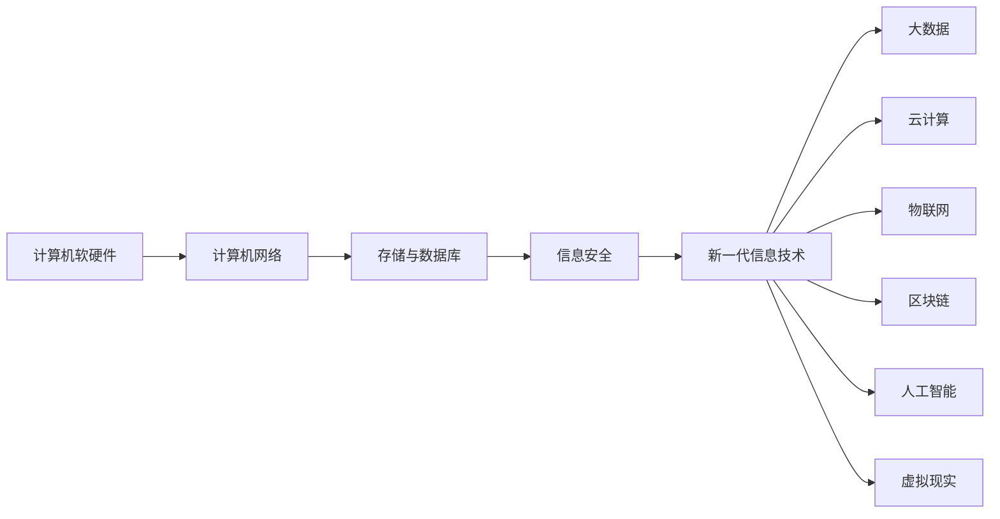

# 第二章 信息技术发展

## 0. 本章导航

- 返回：[[00-导航/备考首页|备考首页]]
- 练习：[[03-错题库/错题库#第二章 信息技术发展|本章错题]]
- 溯源：[[98-原始资料/前四章课本原稿|原始笔记]]
- 知识点入口：[[00-导航/第二章知识点索引|卡片索引与掌握程度管理]]｜[[00-导航/第二章知识点网络.canvas|打开知识点关系网]]（新增 21 张卡片，关联既有概念，保留正文）。
- 学习路径：先掌握“计算机软硬件 → 计算机网络”的技术底座，再进入存储与数据库、信息安全，最后扩展到大数据、云计算、物联网、区块链、人工智能、虚拟现实等新一代信息技术。

## 1. 章首速览

### 一句话总览

本章从计算机软硬件与计算机网络出发，经由存储与数据库、信息安全，最后展开大数据、云计算、物联网、区块链、人工智能、虚拟现实等新一代信息技术；各主题多为“定义—特点—分类/层次—关键技术”的结构。

### 全章主线



### 必背清单

| 主题 | 必背关键词 |
|---|---|
| 硬件组成 | 控制器、运算器、存储器、输入设备、输出设备 |
| 网络作用范围 | PAN（10m 左右）→ LAN（1km 左右、10Mb/s 以上）→ MAN（5~50km）→ WAN（几十~几千公里、通信子网用分组交换） |
| OSI 七层 | 物理层 → 数据链路层 → 网络层 → 传输层 → 会话层 → 表示层 → 应用层 |
| SDN | 应用平面、控制平面、数据平面（由上到下）；OpenFlow 为南向接口 |
| 网络交换 | 二层看 MAC、三层看 IP、四层看端口与连接状态 |
| 存储架构 | DAS、NAS、SAN |
| 数据仓库 | 面向主题、集成、非易失、随时间变化；ETL＝抽取、转换、加载 |
| 信息安全 | CIA：保密性、完整性、可用性；加密防被动攻击、认证防主动攻击 |
| 大数据 | 4V：容量大、种类多、速度快、价值低 |
| 云计算 | 六特点；IaaS／PaaS／SaaS；公有云、私有云、混合云 |
| 物联网 | 感知层（采集）、网络层（中枢）、应用层（接口） |
| 区块链 | 公有链、联盟链、私有链、混合链；分布式账本、加密算法、共识机制 |
| 虚拟现实 | 沉浸性、交互性、多感知性、构想性、自主性 |

### 高频易混预警

| 易混组合 | 快速辨识（通俗理解，不作教材定义） |
|---|---|
| OSI 传输层 vs 网络层 | 传输层管端到端的可靠传输（TCP、UDP）；网络层管寻址与路由（IP、ICMP 等）。 |
| 二层 vs 三层 vs 四层交换 | 二层按 MAC 地址转发帧；三层按 IP 地址路由；四层再识别端口与连接状态。 |
| DAS vs NAS vs SAN | DAS 直连服务器；NAS 走网络共享文件；SAN 是专用存储网络。 |
| 数据仓库 vs 数据集市 | 仓库面向企业级全部主题；集市面向特定主题。 |
| 对称 vs 非对称加密 | 加解密密钥相同（DES）vs 不同（RSA 公钥／私钥）。 |
| 加密 vs 认证 | 加密保保密性、阻被动攻击；认证验身份与完整性、阻主动攻击。 |
| IDS vs IPS | IDS 被动监测并报警；IPS 主动嵌入流量预先拦截。 |
| IaaS vs PaaS vs SaaS | 分别提供计算存储、平台、应用软件。 |
| 物联网感知层 vs 网络层 | 感知层负责识别与采集；网络层是中转与处理的中枢。 |
| 公有链 vs 联盟链 vs 私有链 | 任何人可访问 vs 机构共管 vs 单组织严控。 |

## 2. 计算机与网络

本节建立全章的技术底座：先明确计算机的硬件与软件组成，再进入网络的分类与分层，最后落到交换技术和软件定义网络。

### 2.1 计算机软硬件

#### 一句话理解

> [!note] 通俗理解
> 计算机由“看得见的硬件”和“看不见的软件”组成：硬件提供物理部件，软件提供运行逻辑；控制器负责把控制信息翻译成对各部件的调度。

#### 硬件组成

| 部件 | 通俗理解 |
|---|---|
| 控制器 | 解释控制信息并调度协调各部件工作（原稿“问题”考点） |
| 运算器 | 执行算术与逻辑运算 |
| 存储器 | 保存程序与数据 |
| 输入设备 | 把外部信息送入计算机 |
| 输出设备 | 把处理结果送出计算机 |

> [!warning] 原稿问题记录
> 原稿把“控制器最核心的功能”列为问题项：**解释控制信息并调度协调各部件工作**。复习时重点记忆控制器与运算器的分工。

#### 软件分类

| 类别 | 含义 |
|---|---|
| 系统软件 | 管理计算机资源、支撑应用运行的基础软件 |
| 应用软件 | 面向具体应用场景的软件 |
| 中间件 | 介于系统软件与应用软件之间，起连接和协调作用的软件层 |

#### 考试关键词

- 硬件五部件：**控制器、运算器、存储器、输入设备、输出设备**。
- 控制器核心功能：**解释控制信息并调度协调各部件**。
- 软件三类：**系统软件、应用软件、中间件**。

#### 易混点

1. **控制器不等于运算器**：控制器负责解释与调度，运算器负责计算。
2. **中间件是软件不是硬件**：原稿把中间件列入软件三类，不要与硬件部件混淆。

#### 记忆钩子

- 硬件五部件记作“**控运存输输**”（控制器、运算器、存储器、输入设备、输出设备）。

#### 主动回忆

> [!question]- 计算机硬件包括哪五大部件？控制器最核心的功能是什么？
> 控制器、运算器、存储器、输入设备、输出设备。控制器最核心的功能是解释控制信息并调度协调各部件工作。

> [!question]- 软件分为哪三类？
> 系统软件、应用软件、中间件。

#### 原教材定位

- [[98-原始资料/前四章课本原稿#计算机软硬件|原稿“计算机软硬件”]]：硬件五部件、软件三类、控制器问题记录。
- 覆盖核对：[[98-原始资料/第二章整理对照表|第二章整理对照表]]。

### 2.2 计算机网络基础

#### 一句话理解

> [!note] 通俗理解
> 网络按作用范围从小到大分层：个人、局域网、城域网、广域网；通信内容按 OSI 七层自下而上逐层封装与解析。

#### 网络作用范围

| 网络 | 大致范围 | 关键参数（原稿） |
|---|---|---|
| 个人局域网（PAN） | 10m 左右 | 个人设备互联 |
| 局域网（LAN） | 1km 左右 | 速率 10Mb/s 以上 |
| 城域网（MAN） | 5~50km | 城市范围 |
| 广域网（WAN） | 几十公里~几千公里 | 通信子网主要使用**分组交换**技术 |

#### 通信系统的三部分（原稿残片）

> [!caution] 原稿残片｜待核对
> 原稿在“区块链”与“人工智能”之间记有一句“**一个通信系统包括三个部分：源系统（发送端或发送方）、传输系统（传输网络）、目的系统（接收端或接收方）**”。它与第一章的信息传输模型同源，但原稿位置孤立、无上下文标题，本章仅作定位保留，不据此扩写。

#### OSI 七层（重点）

| 层次 | 名称 | 主要功能 | 主要设备及协议 |
|---|---|---|---|
| 7 | 应用层 | 实现具体的应用功能 | — |
| 6 | 表示层 | 数据的格式与表达、加密、压缩 | — |
| 5 | 会话层 | 建立、管理和终止会话 | — |
| 4 | 传输层 | 确保数据可靠、顺序、无错 | TCP、UDP、SPX |
| 3 | 网络层 | 网络地址 IP 翻译对应的 MAC 地址；分组传输和路由选择 | 三层交换机、路由器、ARP、RARP、IP、ICMP、IGMP |
| 2 | 数据链路层 | 控制网络层与物理层之间的通信；传送以帧为单位的信息 | 网桥、交换机、网卡、IEEE 802.3/.2（局域网协议）、HDLC、PPP、ATM |
| 1 | 物理层 | 包括物理连网媒介、二进制传输 | 中继器、集线器 |

> [!warning] 原稿错误记录
> - **应用层**负责对软件提供网络接口服务。
> - IEEE 802.3u 是**快速以太网**。
> - 路由器：实现**网络层协议转换**。

> [!tip] 记忆钩子
> 七层自下而上记作“**物链网传会表应**”（物理、数据链路、网络、传输、会话、表示、应用）。

#### 考试关键词

- 范围链：**PAN→LAN→MAN→WAN**，参数分别是 10m／1km＋10Mb/s／5~50km／几十~几千km＋分组交换。
- 七层功能：**物理传比特、链路传帧、网络寻址路由、传输可靠有序、会话管会话、表示管格式、应用管功能**。
- 关键设备：**物理层—中继器/集线器；链路层—网桥/交换机/网卡；网络层—路由器/三层交换机**。

#### 易混点

1. **传输层 vs 网络层**：传输层提供端到端的可靠传输（TCP/UDP），网络层负责 IP 寻址与路由。
2. **数据链路层 vs 网络层设备**：交换机工作在数据链路层，路由器/三层交换机在网络层。
3. **局域网协议**：IEEE 802.3 是以太网，IEEE 802.3u 是快速以太网（原稿错误记录）。

#### 主动回忆

> [!question]- 按作用范围，网络分哪几类？广域网通信子网主要使用什么技术？
> 个人局域网、局域网、城域网、广域网；广域网通信子网主要使用分组交换技术。

> [!question]- OSI 七层自下而上是什么？传输层和网络层各管什么？
> 物理层、数据链路层、网络层、传输层、会话层、表示层、应用层。传输层确保数据可靠、顺序、无错（TCP/UDP）；网络层负责 IP 寻址、分组传输和路由选择。

> [!question]- 原稿错误记录中，应用层负责什么？IEEE 802.3u 是什么？
> 应用层负责对软件提供网络接口服务；IEEE 802.3u 是快速以太网。

#### 原教材定位

- [[98-原始资料/前四章课本原稿#计算机网络|原稿“计算机网络”]]：作用范围、通信系统残片、OSI 七层表、错误记录。
- 覆盖核对：[[98-原始资料/第二章整理对照表|第二章整理对照表]]。

### 2.3 网络交换技术与软件定义网络

#### 一句话理解

> [!note] 通俗理解
> 交换技术解决“数据怎么转发”：二层认 MAC、三层认 IP、四层再认端口；软件定义网络（SDN）则把控制逻辑集中到控制器，让网络可编程。

#### SDN

| 主题 | 教材原稿关键词 |
|---|---|
| SDN 控制器 | 维护全局网络拓扑信息、通过流表规则控制交换机、支持网络编程和策略部署 |
| 三平面（从上到下，由北向南） | 应用平面、控制平面、数据平面 |
| OpenFlow | 主要用于**控制器与交换机之间的南向接口** |

> [!warning] 原稿错题
> 原稿在章首错题位置记录：“**软件定义是新一轮科技革命和产业变革的新特征新标志**”。作为原稿考点提示保留。

> [!note] 通俗理解
> “由北向南”指从靠近应用的一端（应用平面）走向靠近数据转发的一端（数据平面）。

#### 网络交换技术

| 交换层级 | 工作层次 | 转发/识别依据 | 主要功能（原稿） |
|---|---|---|---|
| 二层交换 | 数据链路层 | 根据 MAC 地址转发为以太网帧 | MAC 地址学习、帧转发与过滤、广播帧处理、VLAN 划分、环路检测与避免、链路聚合 |
| 三层交换 | 网络层 | 根据 IP 地址进行路由转发 | 不同 VLAN 之间通信、IP 路由、子网划分、静态路由、动态路由、ACL 访问控制、网关功能 |
| 四层交换 | 传输层 | 除识别 IP 地址外，还可识别 TCP 协议、UDP 协议、源端口、目的端口、连接状态 | — |

#### 考试关键词

- SDN：**三平面（应用、控制、数据）＋南向接口 OpenFlow＋控制器集中控制**。
- 交换：**二层认 MAC、三层认 IP、四层认端口与连接状态**。

#### 易混点

1. **二层 vs 三层交换**：二层按 MAC 转发以太网帧；三层按 IP 路由，可打通不同 VLAN。
2. **四层交换多识别的维度**：TCP/UDP 协议、源端口、目的端口、连接状态——都是“连接”层面的信息。
3. **SDN 三平面方向**：从上到下、由北向南是应用平面 → 控制平面 → 数据平面，不要记反。

#### 记忆钩子

- 交换层级记作“**MAC—IP—端口**”。

#### 主动回忆

> [!question]- SDN 的三个平面从上到下是什么？OpenFlow 用于什么接口？
> 应用平面、控制平面、数据平面（由北向南）；OpenFlow 主要用于控制器与交换机之间的南向接口。

> [!question]- 二层、三层、四层交换分别在哪个层次工作、依据什么转发？
> 二层在数据链路层按 MAC 地址转发以太网帧；三层在网络层按 IP 地址路由转发；四层在传输层，除 IP 地址外还识别 TCP/UDP、源/目的端口和连接状态。

#### 原教材定位

- [[98-原始资料/前四章课本原稿#SDN|原稿“SDN”]]：控制器、三平面、OpenFlow、态势感知、路由器。
- 原稿“网络交换技术”（第 292—338 行，无独立标题，紧随“SDN”之后）：二层、三层、四层交换及各自功能。
- 覆盖核对：[[98-原始资料/第二章整理对照表|第二章整理对照表]]。

## 3. 存储与数据库

本节先区分三种存储架构，再进入数据模型与数据库事务，最后落到数据仓库和中间件。

### 3.1 存储架构

#### 一句话理解

> [!note] 通俗理解
> 存储看“怎么连”：DAS 直接挂在服务器上，NAS 通过网络共享文件，SAN 用专用网络连接存储设备。

| 架构 | 教材原稿关键词 | 通俗辨识 |
|---|---|---|
| 直连式存储（DAS） | 通过电缆直接连接到服务器 | 存储直连服务器，不经过网络 |
| 网络附加存储（NAS） | 网络附加存储 | 通过网络提供文件级共享 |
| 存储区域网络（SAN） | 存储区域网络 | 存储设备组成专用网络供服务器访问 |

#### 主动回忆

> [!question]- DAS、NAS、SAN 分别如何理解？
> DAS 通过电缆直接连到服务器；NAS 通过网络附加存储提供文件共享；SAN 是独立的存储区域网络。

#### 原教材定位

- [[98-原始资料/前四章课本原稿#存储与数据库|原稿“存储与数据库”]]：DAS、NAS、SAN。
- 覆盖核对：[[98-原始资料/第二章整理对照表|第二章整理对照表]]。

### 3.2 数据模型与数据库

#### 一句话理解

> [!note] 通俗理解
> 数据模型决定数据如何组织：层次模型像一棵树，网状模型像一张网，关系模型用二维表；数据库面向事务处理（OLTP）。

#### 三种数据模型

| 模型 | 教材原稿关键词 | 通俗辨识 |
|---|---|---|
| 层次模型 | 子女节点必须通过双亲节点；只能表示一对多关系；有向树结构 | 像一棵有方向的树，一个子女只有一个双亲 |
| 网状模型 | 更能直接描述现实客观世界；性能好；存储效率较高；支持多双亲 | 像一张网，节点可有多个双亲 |
| 关系模型 | 原稿仅列名称 | 用二维表（关系）组织数据 |

#### 数据库事务（原稿残句）

> [!caution] 原稿残句｜待核对
> 原稿写作“关系型数据库支持 ACID 事务；不强制遵循ACID原则”，后半句缺主语。按通行表述，后半句通常指**非关系型数据库（NoSQL）不强制遵循 ACID 原则**；但原稿未写明主语，此补全仍需第三版教材正文核对，不能当作已核实结论。
>
> 数据库的主要技术（原稿）：**OLTP**（联机事务处理）。

#### 考试关键词

- 层次模型：**有向树、一对多、子女必须通过双亲**。
- 网状模型：**支持多双亲、性能好、存储效率高**。
- 数据库主要技术：**OLTP**。

#### 易混点

1. **层次模型 vs 网状模型**：前者是“树”、子女只能通过双亲；后者是“网”、支持多双亲。
2. **OLTP vs 数据仓库**：OLTP 面向事务处理；数据仓库面向分析决策（见 3.3）。

#### 主动回忆

> [!question]- 三种数据模型各有什么特点？
> 层次模型是有向树结构，子女节点必须通过双亲节点，只能表示一对多关系；网状模型更能直接描述现实世界、性能好、存储效率较高、支持多双亲；关系模型用二维表组织数据。

> [!question]- 为什么 ACID 残句只能作“待核对”处理？
> 原稿“不强制遵循ACID原则”缺少主语，通行补全指向非关系型数据库，但原稿没有写明，需教材正文核对。

#### 原教材定位

- [[98-原始资料/前四章课本原稿#数据结构模型|原稿“数据结构模型”]]：层次、网状、关系模型，OLTP 与 ACID 残句。
- 覆盖核对：[[98-原始资料/第二章整理对照表|第二章整理对照表]]。

### 3.3 数据仓库与中间件

#### 一句话理解

> [!note] 通俗理解
> 数据仓库把各处的数据抽取、清洗、加载进来，按主题长期存放，供分析决策使用；数据集市只是其中面向特定主题的一部分。

#### 数据仓库定义

> [!info] 教材原稿关键词
> 数据仓库是“**面向主题的、集成的、非易失的且随时间变化**的数据集合，用于支持管理决策”。

#### 处理链与 ETL

```text
数据源 → 数据存储与管理 → OLAP → 前端工具
```

| 项目 | 教材原稿内容 |
|---|---|
| 处理链 | 数据源—数据存储与管理—OLAP—前端工具 |
| ETL | 抽取、转换、加载（原稿误记为“抽取、清理、转载”，见勘误与依据） |
| 前端工具 | 各种报表、查询工具、数据分析、数据挖掘以及应用开发工具 |
| 系统核心 | 数据的存储与管理是整个数据仓库系统的核心（原稿“问题”记录） |

#### 数据仓库 vs 数据集市

| 对比 | 数据仓库 | 数据集市 |
|---|---|---|
| 主题范围 | 包含全部主题（原稿“问题”记录） | 面向特定主题 |

#### 中间件

| 类型 | 教材原稿关键词 |
|---|---|
| 数据库访问中间件 | ODBC、JDBC |
| 面向消息中间件 | MQSeries |
| 分布式对象中间件 | 建立对象之间关系的中间件 |
| 事务中间件 | 原稿仅列名称 |

#### 考试关键词

- 数据仓库定义四关键词：**面向主题、集成、非易失、随时间变化**。
- 处理链：**数据源→数据存储与管理→OLAP→前端工具**。
- ETL：**抽取、转换、加载**。
- 中间件：**ODBC/JDBC（数据库访问）、MQSeries（消息）、分布式对象、事务**。

#### 易混点

1. **数据仓库 vs 数据集市**：仓库包含全部主题，集市面向特定主题。
2. **OLTP vs 数据仓库**：OLTP 面向事务处理；数据仓库面向分析决策。
3. **ETL 的“T”**：是转换（Transform），不是“清理”（原稿误记）。

#### 记忆钩子

- 数据仓库定义记作“**主题、集成、非易失、随时间变**”。
- ETL 记作“**抽、转、载**”。

#### 主动回忆

> [!question]- 数据仓库的定义关键词是什么？处理链是什么？
> 面向主题的、集成的、非易失的且随时间变化的数据集合，用于支持管理决策；处理链为数据源 → 数据存储与管理 → OLAP → 前端工具。

> [!question]- ETL 三个字母分别代表什么？原稿的误记是什么？
> 抽取、转换、加载；原稿误记为“抽取、清理、转载”，其中“转换”和“加载”需要按标准写法记忆。

> [!question]- 数据仓库和数据集市的主题范围有什么区别？
> 数据仓库包含全部主题；数据集市面向特定主题。

#### 原教材定位

- [[98-原始资料/前四章课本原稿#存储与数据库|原稿“存储与数据库”]]：数据仓库定义、处理链、ETL、前端工具、问题记录、中间件。
- 覆盖核对：[[98-原始资料/第二章整理对照表|第二章整理对照表]]。

## 4. 信息安全

本节从信息安全基础（CIA 与层次）出发，经过加密、摘要与认证，最后落到各类网络安全技术。

### 4.1 信息安全基础

#### 一句话理解

> [!note] 通俗理解
> 信息安全的底线是“保密、完整、可用”三要素；从设备到数据、内容、行为，安全要求逐层上升。

#### 安全三要素与层次

| 主题 | 教材原稿关键词 |
|---|---|
| 保密性、完整性、可用性（CIA） | 信息安全的基本要求 |
| 信息安全层次 | 设备安全（设备的稳定性、可靠性、可用性）、数据安全（秘密性、完整性、可用性）、内容安全、行为安全 |
| 网络安全基本要素 | 机密性、完整性、可用性、可控性、可审查性 |

> [!note] 通俗理解
> 三要素（CIA）是信息安全的总抓手；“信息安全层次”按对象从低到高推进（设备→数据→内容→行为）；“网络安全基本要素”在原稿中列出五项，注意与三要素区分。

#### 考试关键词

- 三要素：**保密性、完整性、可用性**。
- 信息安全层次：**设备安全、数据安全、内容安全、行为安全**。
- 网络安全基本要素：**机密性、完整性、可用性、可控性、可审查性**。

#### 易混点

1. **三要素 vs 五项基本要素**：三要素是保密、完整、可用；原稿另列五项（多出可控性、可审查性），不要合并成同一张表。
2. **设备安全的“可用性”与 CIA 的“可用性”**：原稿在设备安全维度也写了可用性，属不同层级的用词，答题时按题干语境区分。

#### 主动回忆

> [!question]- 信息安全三要素是什么？信息安全层次从低到高是哪四层？
> 保密性、完整性、可用性；设备安全、数据安全、内容安全、行为安全。

> [!question]- 网络安全的基本要素有哪些？
> 机密性、完整性、可用性、可控性、可审查性。

#### 原教材定位

- [[98-原始资料/前四章课本原稿#信息安全|原稿“信息安全”]]：CIA、信息安全层次。
- 覆盖核对：[[98-原始资料/第二章整理对照表|第二章整理对照表]]。

### 4.2 加密、摘要与认证

#### 一句话理解

> [!note] 通俗理解
> 加密管“别人看不懂”，HASH 管“内容有没有被改”，数字签名管“是谁发的、能不能抵赖”；加密与认证防的攻击类型不同。

#### 对称与非对称加密

| 加密方式 | 密钥关系 | 代表算法 | 特点 |
|---|---|---|---|
| 对称加密 | 加密密钥和解密密钥相同 | DES | 加密速度快，适合数据量大 |
| 非对称加密 | 加密密钥与解密密钥不相同（公钥／私钥成对） | RSA | 密钥不同，用于密钥分发、数字签名等 |

> [!warning] 原稿勘误
> 原稿将非对称加密写作“机密密钥与解密密钥不相同”，“机密密钥”应为“**加密密钥**”（或表述为公钥、私钥成对）。复习时按标准术语记忆。

#### HASH 函数与数字签名

| 主题 | 教材原稿关键词 |
|---|---|
| HASH 函数 | 单向性、唯一性（只要输入不变，结果永远不变） |
| 数字签名 | 不能抵赖、不能伪造、确认真伪 |

#### 加密和认证的区别

| 对比 | 加密 | 认证 |
|---|---|---|
| 目的 | 确保数据的**保密性** | 确保发送方和接收方身份的**真实性**以及报文的**完整性** |
| 阻止的攻击 | 对手的**被动攻击** | 对手的**主动攻击** |

#### 考试关键词

- 对称：**密钥相同、DES、快**；非对称：**密钥不同、RSA、公钥私钥**。
- HASH：**单向、唯一（输入不变结果不变）**。
- 数字签名：**不能抵赖、不能伪造、确认真伪**。
- 加密 vs 认证：**加密防被动攻击，认证防主动攻击**。

#### 易混点

1. **对称 vs 非对称**：看“加解密密钥是否相同”。
2. **加密 vs 认证**：加密管保密（防被动攻击）；认证管身份真实性与报文完整性（防主动攻击）。
3. **HASH 不是加密**：HASH 是单向的、不可逆的摘要；加密通常可逆。

#### 记忆钩子

- 对称记“**同钥快 DES**”，非对称记“**异钥 RSA**”。
- 认证记“**验身份、保完整、防主动**”。

#### 主动回忆

> [!question]- 对称加密与非对称加密的密钥关系、代表算法分别是什么？
> 对称加密加解密密钥相同，代表算法 DES，加密速度快；非对称加密加密密钥与解密密钥不同（公钥/私钥），代表算法 RSA。

> [!question]- 加密和认证分别阻止什么类型的攻击？
> 加密确保数据的保密性，阻止对手的被动攻击；认证确保发送方和接收方身份的真实性以及报文的完整性，阻止对手的主动攻击。

#### 原教材定位

- [[98-原始资料/前四章课本原稿#加密解密|原稿“加密解密”]]、[[98-原始资料/前四章课本原稿#HASH函数|原稿“HASH函数”]]、[[98-原始资料/前四章课本原稿#加密和认证的区别|原稿“加密和认证的区别”]]。
- 覆盖核对：[[98-原始资料/第二章整理对照表|第二章整理对照表]]。

### 4.3 网络安全技术

#### 一句话理解

> [!note] 通俗理解
> 网络安全技术各有分工：防火墙守边界、IDS/IPS 查与拦、VPN 开专道、扫描找漏洞、蜜罐设陷阱。

#### 常用网络安全技术

| 技术 | 教材原稿关键词 |
|---|---|
| 防火墙 | 架设在内外网之间 |
| 入侵检测系统（IDS） | **被动防御**；通过监控网络或系统资源寻找攻击痕迹并报警 |
| 入侵防护系统（IPS） | **主动防御**；直接嵌入网络流量实现主动防护、预先拦截 |
| VPN | 隧道技术、专用通道 |
| 安全扫描 | 检测安全弱点和系统漏洞 |
| 网络蜜罐 | 陷阱，主动防御 |

#### 原稿错误记录（考点提示）

> [!warning] 原稿错误记录
> - **网络安全态势感知**：在**安全大数据**的基础上，进行数据整合、特征提取等，应用一系列态势评估算法，生成网络的整体态势情况。
> - **APT**：长期潜伏、多阶段渗透。
> - **UEBA**：可以解决**内部员工窃取敏感数据的高隐蔽性行为**；其层级为数据源层、数据采集与接入层、数据处理与标准化层、数据存储与计算层、用户与实体画像层、行为分析与监测层、风险评分与应用层。
> - **特征检测（IDS）**：处理自动化蠕虫攻击。

#### 考试关键词

- 防火墙：**内外网之间**。
- IDS：**被动、监控、报警**；IPS：**主动、嵌入流量、预先拦截**。
- VPN：**隧道技术、专用通道**。
- 蜜罐：**陷阱、主动防御**。
- APT：**长期潜伏、多阶段渗透**；UEBA：**内部员工窃取敏感数据的高隐蔽性行为**。

#### 易混点

1. **IDS vs IPS**：IDS 被动检测报警，不直接拦；IPS 主动嵌入流量预先拦截。
2. **防火墙 vs 蜜罐**：防火墙是边界过滤；蜜罐是故意暴露的诱饵陷阱。
3. **特征检测的适用场景**：原稿记录其处理自动化蠕虫攻击，注意与 UEBA（内部人员高隐蔽行为）场景区分。

#### 记忆钩子

- 网络安全技术记作“**墙（防火墙）、查（IDS）、拦（IPS）、道（VPN）、扫（扫描）、饵（蜜罐）**”。

#### 主动回忆

> [!question]- IDS 和 IPS 的区别是什么？
> IDS 是被动防御，通过监控网络或系统资源寻找攻击痕迹并报警；IPS 是主动防御，直接嵌入网络流量实现主动防护、预先拦截。

> [!question]- 原稿错误记录中，APT 和 UEBA 分别解决什么问题？
> APT 具有长期潜伏、多阶段渗透的特点；UEBA 可以解决内部员工窃取敏感数据的高隐蔽性行为。

#### 原教材定位

- [[98-原始资料/前四章课本原稿#网络安全技术|原稿“网络安全技术”]]：防火墙、IDS/IPS、VPN、安全扫描、蜜罐、基本要素与错误记录。
- 覆盖核对：[[98-原始资料/第二章整理对照表|第二章整理对照表]]。

## 5. 新一代信息技术

本节按“定义—特点—分类/层次—关键技术”的模式，逐个展开大数据、云计算、物联网、区块链、人工智能、虚拟现实。

### 5.1 大数据

#### 一句话理解

> [!note] 通俗理解
> 大数据是“常规工具搞不定”的海量数据集合，靠获取、处理、管理和应用服务四类技术来挖掘价值。

#### 核心定义

> [!info] 教材原稿关键词
> 大数据是“无法在一定时间范围内使用常规的软件工具进行捕捉、管理和处理的数据集合”（量级链：TB—PB—EB—ZB）。

#### 四大特点（4V）

| 特点 | 通俗理解 |
|---|---|
| 容量大（Volume） | 数据量级大 |
| 种类多（Variety） | 数据来源和类型多样 |
| 速度快（Velocity） | 产生和处理速度快 |
| 价值低（Value） | 标准表述为“价值密度低”，原稿压缩为“价值低” |

#### 四项关键技术

**大数据获取技术、分布式数据处理技术、大数据管理技术、大数据应用和服务技术**。

#### 考试关键词

- 定义抓手：**常规软件工具无法在一定时间范围内捕捉、管理和处理**。
- 4V：**容量大、种类多、速度快、价值低**。
- 技术四类：**获取、分布式处理、管理、应用和服务**。

#### 主动回忆

> [!question]- 大数据的概念关键词和 4V 特点是什么？
> 无法在一定时间范围内使用常规软件工具捕捉、管理和处理的数据集合；容量大、种类多、速度快、价值低（价值密度低）。

> [!question]- 大数据的关键技术包括哪四类？
> 大数据获取技术、分布式数据处理技术、大数据管理技术、大数据应用和服务技术。

#### 原教材定位

- [[98-原始资料/前四章课本原稿#大数据|原稿“大数据”]]：概念、4V、四项技术。
- 覆盖核对：[[98-原始资料/第二章整理对照表|第二章整理对照表]]。

### 5.2 云计算

#### 一句话理解

> [!note] 通俗理解
> 云计算把资源集中起来按需提供：按“给什么”分 IaaS/PaaS/SaaS，按“谁用、怎么部署”分公有云、私有云、混合云。

#### 核心定义与特点

> [!info] 教材原稿关键词
> 云计算是一种基于互联网的计算方式：在网络上配置为共享的软件资源、计算资源、存储资源和信息资源，可按需求提供给网上终端设备和终端用户。
>
> 特点：**超大规模、虚拟化、高可靠性、通用化、高可扩展性、按需服务**。

#### 服务类型与部署分类

| 分类 | 类型 | 教材原稿关键词 |
|---|---|---|
| 服务类型 | 基础设施即服务（IaaS） | 计算能力、存储能力（原稿“计算机能”为笔误） |
| 服务类型 | 平台即服务（PaaS） | 虚拟操作系统、数据库管理系统、Web 服务（原稿标注考点） |
| 服务类型 | 软件即服务（SaaS） | 应用软件 |
| 部署分类 | 公有云、私有云、混合云 | 按应用范围划分 |

> [!caution] 原稿残句｜待核对
> 原稿写作“容器技术属于元计算关键技术中的是 云存储技术、虚拟化技术、多租户和访问控制管理、云安全技术”，句式残缺，“元计算”疑为“云计算”的误写。四项关键词（云存储、虚拟化、多租户和访问控制、云安全）作为原稿关键词保留；完整句式待教材正文核对，不据此扩写。

#### 考试关键词

- 特点：**超大规模、虚拟化、高可靠性、通用化、高可扩展性、按需服务**。
- 服务类型：**IaaS 给计算存储，PaaS 给平台，SaaS 给应用**（PaaS 为原稿标注考点）。
- 部署分类：**公有云、私有云、混合云**。

#### 易混点

1. **IaaS vs PaaS vs SaaS**：分别提供“计算存储”、“平台（操作系统/数据库/Web 服务）”、“应用软件”。
2. **云计算的虚拟化特点 vs 虚拟现实**：前者是资源抽象技术，后者是沉浸式交互技术，不要混为一谈。

#### 记忆钩子

- 服务类型记作“**基础设施—平台—软件**”。
- 部署分类记作“**公、私、混**”。

#### 主动回忆

> [!question]- 云计算的特点有哪些？
> 超大规模、虚拟化、高可靠性、通用化、高可扩展性、按需服务。

> [!question]- IaaS、PaaS、SaaS 分别提供什么？
> IaaS 提供计算能力和存储能力；PaaS 提供虚拟操作系统、数据库管理系统、Web 服务等平台；SaaS 提供应用软件。

> [!question]- 云计算按应用范围分为哪几类？
> 公有云、私有云、混合云。

#### 原教材定位

- [[98-原始资料/前四章课本原稿#云计算|原稿“云计算”]]：定义、特点、服务类型、部署分类、关键技术残句。
- 覆盖核对：[[98-原始资料/第二章整理对照表|第二章整理对照表]]。

### 5.3 物联网

#### 一句话理解

> [!note] 通俗理解
> 物联网让物与物、人与物、人与人连起来：感知层负责“看和听”，网络层负责“传和算”，应用层负责“用”。

#### 连接对象

**物与物（T2T）、人与物（H2T）、人与人（H2H）**。

#### 三层结构

| 层次 | 教材原稿关键词 | 通俗辨识 |
|---|---|---|
| 应用层 | 物联网和用户的接口、实现物联网的应用 | 面向用户的应用入口 |
| 网络层 | 各种网络和云计算平台，是整个物联网的**中枢**；负责传递和处理信息 | 中转与处理的核心 |
| 感知层 | 识别物体、采集信息 | 最底层的“感官” |

> [!warning] 原稿勘误
> 原稿“只整个物联网的中枢”漏写“是”字，应为“**是**整个物联网的中枢”。

#### 关键技术

| 技术 | 教材原稿关键词 |
|---|---|
| 传感器技术 | 射频识别技术（RFID） |
| 传感网 | 微机电系统（MEMS） |
| 应用系统框架 | 原稿仅列名称 |

#### 考试关键词

- 连接：**T2T、H2T、H2H**。
- 三层：**感知层（识别采集）、网络层（中枢，传递处理）、应用层（用户接口与应用实现）**。
- 关键技术：**RFID（传感器）、MEMS（传感网）**。

#### 易混点

1. **感知层 vs 网络层 vs 应用层**：感知层最底层负责采集，网络层是中枢，应用层面向用户。
2. **RFID vs MEMS**：RFID 是射频识别（传感器技术方向）；MEMS 是微机电系统（传感网方向）。

#### 主动回忆

> [!question]- 物联网连接哪三类对象？三层结构分别是什么？
> 物与物（T2T）、人与物（H2T）、人与人（H2H）；感知层识别物体采集信息、网络层作为中枢传递和处理信息、应用层是物联网与用户的接口并实现应用。

> [!question]- 物联网的关键技术中，RFID 和 MEMS 分别属于什么方向？
> RFID（射频识别）属于传感器技术方向；MEMS（微机电系统）属于传感网方向。

#### 原教材定位

- [[98-原始资料/前四章课本原稿#物联网|原稿“物联网”]]：连接对象、三层结构、关键技术。
- 覆盖核对：[[98-原始资料/第二章整理对照表|第二章整理对照表]]。

### 5.4 区块链

#### 一句话理解

> [!note] 通俗理解
> 区块链是去中心化的分布式账本技术：按“谁都能进、机构共管、单方严控”分成公有链、联盟链、私有链。

#### 核心定义

> [!info] 教材原稿关键词
> 区块链是以非对称加密算法为基础，使用共识机制、点对点网络、智能合约等技术结合而成的一种**分布式的存储数据库技术**。

#### 分类

| 类型 | 教材原稿关键词 |
|---|---|
| 公有链 | 任何人都可以随时访问 |
| 联盟链 | 若干企业或机构共同管理，参与节点较少 |
| 私有链 | 某个组织或用户控制，参与节点规则严格；交易速度极快、隐私等级更高、去中心化程度被极大削弱 |
| 混合链 | 原稿仅列名称 |

#### 关键技术

**分布式账本、加密算法、共识机制**。

#### 考试关键词

- 定义抓手：**非对称加密为基础；共识机制、点对点网络、智能合约；分布式存储数据库**。
- 分类：**公有链、联盟链、私有链、混合链**。
- 关键技术：**分布式账本、加密算法、共识机制**。

#### 易混点

1. **公有链 vs 联盟链 vs 私有链**：按“谁能参与、谁在管理”区分——任何人/机构共管/单组织严控。
2. **区块链的分类 vs 关键技术**：分类是链的开放程度，关键技术是实现手段，不要混写。

#### 记忆钩子

- 分类记作“**公、盟、私、混**”；私有链关键词“**严格、快、隐私高、去中心化弱**”。

#### 主动回忆

> [!question]- 区块链的定义抓手是什么？
> 以非对称加密算法为基础，使用共识机制、点对点网络、智能合约等技术结合而成的分布式存储数据库技术。

> [!question]- 公有链、联盟链、私有链如何区分？
> 公有链任何人都可以随时访问；联盟链由若干企业或机构共同管理、参与节点较少；私有链由某个组织或用户控制，规则严格，交易速度快、隐私等级更高、去中心化程度被极大削弱。

> [!question]- 区块链的关键技术有哪些？
> 分布式账本、加密算法、共识机制。

#### 原教材定位

- [[98-原始资料/前四章课本原稿#区块链|原稿“区块链”]]：定义、分类、关键技术。
- 覆盖核对：[[98-原始资料/第二章整理对照表|第二章整理对照表]]。

### 5.5 人工智能

#### 一句话理解

> [!note] 通俗理解
> 人工智能让机器模拟人的智能，核心研究领域包括机器学习、自然语言处理与专家系统。

#### 原稿关键词

**机器学习、自然语言处理、专家系统**。

> [!note] 原稿边界
> 原稿对人工智能仅列出三个关键词，没有展开定义；本笔记保留为定位清单，不自行补写定义。

#### 主动回忆

> [!question]- 原稿中人工智能包括哪三个关键词？
> 机器学习、自然语言处理、专家系统。

#### 原教材定位

- [[98-原始资料/前四章课本原稿#人工智能|原稿“人工智能”]]：三个关键词。
- 覆盖核对：[[98-原始资料/第二章整理对照表|第二章整理对照表]]。

### 5.6 虚拟现实

#### 一句话理解

> [!note] 通俗理解
> 虚拟现实让用户“沉浸”在虚拟环境里：特征看“沉浸、交互、多感知、构想、自主”，实现靠人机交互、传感器、动态环境建模与系统集成。

#### 主要特征

**沉浸性、交互性、多感知性、构想性、自主性**。

#### 关键技术

**人机交互、传感器技术、动态环境建模、系统集成技术**。

#### 考试关键词

- 特征：**沉浸、交互、多感知、构想、自主**。
- 技术：**人机交互、传感器、动态环境建模、系统集成**。

#### 主动回忆

> [!question]- 虚拟现实的主要特征有哪些？
> 沉浸性、交互性、多感知性、构想性、自主性。

> [!question]- 虚拟现实的关键技术有哪些？
> 人机交互、传感器技术、动态环境建模、系统集成技术。

#### 原教材定位

- [[98-原始资料/前四章课本原稿#虚拟现实技术|原稿“虚拟现实技术”]]：特征与关键技术。
- 覆盖核对：[[98-原始资料/第二章整理对照表|第二章整理对照表]]。

## 6. 章末综合复习

### 6.1 高频易混点对比

> [!note] 使用说明
> 本表按“容易混淆”组织，不表示经过统计的考频排序，也不提供未经官方依据的星级押题。

| 易混组合 | 区分抓手 |
|---|---|
| OSI 传输层 vs 网络层 | 传输层管端到端可靠传输（TCP/UDP）；网络层管 IP 寻址与路由。 |
| 二层 vs 三层 vs 四层交换 | 二层看 MAC、三层看 IP、四层看端口与连接状态。 |
| DAS vs NAS vs SAN | 直连服务器 vs 网络文件共享 vs 专用存储网络。 |
| 层次 vs 网状 vs 关系模型 | 树（一对多、子女过双亲）vs 网（多双亲）vs 二维表。 |
| 数据仓库 vs 数据集市 | 全部主题 vs 特定主题。 |
| 对称 vs 非对称加密 | 加解密密钥相同（DES）vs 不同（RSA 公钥/私钥）。 |
| 加密 vs 认证 | 保保密性、防被动攻击 vs 验身份与完整性、防主动攻击。 |
| IDS vs IPS | 被动监测报警 vs 主动嵌入流量预先拦截。 |
| IaaS vs PaaS vs SaaS | 计算存储 vs 平台 vs 应用软件。 |
| 公有链 vs 联盟链 vs 私有链 | 任何人可访问 vs 机构共管 vs 单组织严控。 |
| 物联网感知层 vs 网络层 vs 应用层 | 采集识别 vs 中枢传递处理 vs 用户接口应用。 |

### 6.2 关键顺序与等级

1. **OSI 七层（自下而上）**：物理层 → 数据链路层 → 网络层 → 传输层 → 会话层 → 表示层 → 应用层。
2. **网络作用范围**：PAN → LAN → MAN → WAN。
3. **SDN 三平面（从上到下、由北向南）**：应用平面 → 控制平面 → 数据平面。
4. **物联网三层（自下而上）**：感知层 → 网络层 → 应用层。
5. **数据仓库处理链**：数据源 → 数据存储与管理 → OLAP → 前端工具。

### 6.3 分层必背清单

#### 必须准确背诵

- 计算机硬件五部件及控制器核心功能；软件三类。
- 网络四类作用范围及关键参数；OSI 七层名称、功能、设备协议。
- SDN 三平面与 OpenFlow 南向接口；二层/三层/四层交换的依据。
- 三种存储架构；三种数据模型；数据仓库定义四关键词与 ETL 含义。
- 信息安全 CIA；对称（DES）与非对称（RSA）；HASH 特性与数字签名作用；加密 vs 认证。
- 网络安全技术清单及 IDS/IPS 区别。
- 大数据 4V；云计算六特点、三服务类型、三部署分类。
- 物联网三层结构与连接对象；区块链定义、分类与关键技术；虚拟现实五特征。

#### 理解后辨识

- OSI 各层设备与协议的归属。
- 二/三/四层交换的情境判断。
- 数据仓库与数据集市的主题范围差异。
- 对称/非对称加密、加密/认证的题干线索。
- IaaS/PaaS/SaaS 的“给什么”差异。
- 公有链/联盟链/私有链的开放程度差异。
- 原稿错题与错误记录中的考点提示（软件定义、应用层网络接口、IEEE 802.3u、态势感知、APT、UEBA、特征检测）。

### 6.4 闭卷自测

#### 列举题

> [!question]- 1. 计算机硬件五大部件是什么？控制器最核心的功能是什么？
> 控制器、运算器、存储器、输入设备、输出设备；控制器最核心的功能是解释控制信息并调度协调各部件工作。

> [!question]- 2. 写出 OSI 七层名称（自下而上）。
> 物理层、数据链路层、网络层、传输层、会话层、表示层、应用层。

> [!question]- 3. 网络按作用范围分哪几类？各自大致范围和特点？
> PAN（10m 左右）；LAN（1km 左右、速率 10Mb/s 以上）；MAN（5~50km）；WAN（几十公里~几千公里，通信子网主要使用分组交换技术）。

> [!question]- 4. 二层、三层、四层交换分别在哪个层次工作、依据什么转发？
> 二层在数据链路层按 MAC 地址转发以太网帧；三层在网络层按 IP 地址路由转发；四层在传输层，除 IP 地址外还识别 TCP/UDP、源/目的端口和连接状态。

> [!question]- 5. 数据仓库的定义关键词是什么？ETL 三个字母分别代表什么？
> 面向主题的、集成的、非易失的且随时间变化的数据集合，用于支持管理决策；ETL＝抽取、转换、加载。

> [!question]- 6. 三种数据模型各自的特点是什么？
> 层次模型：有向树结构、子女节点必须通过双亲节点、只能表示一对多关系；网状模型：更能直接描述现实世界、性能好、存储效率较高、支持多双亲；关系模型：用二维表组织数据。

> [!question]- 7. 信息安全三要素和网络安全基本要素分别是什么？
> 三要素：保密性、完整性、可用性；网络安全基本要素：机密性、完整性、可用性、可控性、可审查性。

> [!question]- 8. 常见网络安全技术有哪些？IDS 与 IPS 有什么区别？
> 防火墙、入侵检测系统（IDS）、入侵防护系统（IPS）、VPN、安全扫描、网络蜜罐；IDS 是被动防御、监控并报警，IPS 是主动防御、嵌入网络流量预先拦截。

> [!question]- 9. 大数据的 4V 特点和四项关键技术是什么？
> 容量大、种类多、速度快、价值低；大数据获取技术、分布式数据处理技术、大数据管理技术、大数据应用和服务技术。

> [!question]- 10. 云计算的服务类型和部署分类分别是什么？
> 服务类型：IaaS（计算存储）、PaaS（平台）、SaaS（应用软件）；部署分类：公有云、私有云、混合云。

> [!question]- 11. 物联网的三层结构及各层功能是什么？
> 感知层识别物体、采集信息；网络层是整个物联网的中枢，负责传递和处理信息；应用层是物联网和用户的接口，实现物联网的应用。

> [!question]- 12. 区块链的分类和关键技术是什么？
> 公有链、联盟链、私有链、混合链；分布式账本、加密算法、共识机制。

> [!question]- 13. 虚拟现实的主要特征有哪些？
> 沉浸性、交互性、多感知性、构想性、自主性。

#### 对比题

> [!question]- 14. 加密和认证的区别是什么？
> 加密确保数据的保密性，阻止对手的被动攻击；认证确保发送方和接收方身份的真实性以及报文的完整性，阻止对手的主动攻击。

> [!question]- 15. 数据仓库和数据集市的区别是什么？
> 数据仓库包含全部主题；数据集市面向特定主题。

> [!question]- 16. IDS 和 IPS 的区别是什么？
> IDS 是被动防御，通过监控网络或系统资源寻找攻击痕迹并报警；IPS 是主动防御，直接嵌入网络流量实现主动防护、预先拦截。

> [!question]- 17. IaaS、PaaS、SaaS 分别提供什么？
> IaaS 提供计算能力和存储能力；PaaS 提供虚拟操作系统、数据库管理系统、Web 服务等平台；SaaS 提供应用软件。

#### 顺序题

> [!question]- 18. 写出 OSI 七层完整顺序（自下而上）。
> 物理层 → 数据链路层 → 网络层 → 传输层 → 会话层 → 表示层 → 应用层。

> [!question]- 19. 写出数据仓库处理链的完整顺序。
> 数据源 → 数据存储与管理 → OLAP → 前端工具。

> [!question]- 20. 写出 SDN 三平面从上到下的顺序。
> 应用平面 → 控制平面 → 数据平面（由北向南）。

#### 情境判断题

> [!question]- 21. 某设备能识别 TCP/UDP 协议、源/目的端口和连接状态进行转发，应优先判断为哪种交换？
> 四层交换（工作在传输层）。

> [!question]- 22. 某系统“嵌入网络流量、预先拦截攻击”和另一系统“监控网络寻找攻击痕迹并报警”，分别对应什么技术？
> 前者是入侵防护系统（IPS，主动防御）；后者是入侵检测系统（IDS，被动防御）。

> [!question]- 23. 一条区块链“任何人都可以随时访问”，另一条“由若干企业或机构共同管理、参与节点较少”，分别属于什么链？
> 前者是公有链；后者是联盟链。

> [!question]- 24. 题干出现“长期潜伏、多阶段渗透”和“内部员工窃取敏感数据的高隐蔽性行为”，分别对应原稿错误记录中的什么？
> 前者是 APT；后者是 UEBA。

#### 题号—正文模块覆盖

| 题号 | 正文模块 | 覆盖重点 |
|---|---|---|
| 1 | 2.1 计算机软硬件 | 硬件五部件、控制器功能 |
| 2、3、18 | 2.2 计算机网络基础 | OSI 七层、网络作用范围 |
| 4、20、21 | 2.3 网络交换技术与软件定义网络 | 交换层次、SDN 三平面 |
| — | 3.1 存储架构 | DAS/NAS/SAN（并入对比题情境） |
| 6 | 3.2 数据模型与数据库 | 三种数据模型 |
| 5、19 | 3.3 数据仓库与中间件 | 数据仓库定义、处理链、ETL |
| 7 | 4.1 信息安全基础 | CIA、安全层次 |
| 14 | 4.2 加密、摘要与认证 | 加密 vs 认证 |
| 8、22 | 4.3 网络安全技术 | 技术清单、IDS/IPS 情境 |
| 9 | 5.1 大数据 | 4V、四项技术 |
| 10、17 | 5.2 云计算 | 服务类型、部署分类 |
| 11 | 5.3 物联网 | 三层结构 |
| 12、23 | 5.4 区块链 | 分类、关键技术 |
| — | 5.5 人工智能 | 三个关键词（并入列举情境） |
| 13 | 5.6 虚拟现实 | 主要特征 |
| 24 | 4.3 网络安全技术 | APT、UEBA 原稿错误记录 |

### 6.5 本章错题入口

- [[03-错题库/错题库#第二章 信息技术发展|进入错题库：第二章 信息技术发展]]

### 勘误与依据

- **ETL 含义**：原稿“抽取、清理、转载”更正为“抽取、转换、加载”。ETL 对应 Extract、Transform、Load，依据覆盖表所列 ETL 技术资料。
- **非对称加密术语**：原稿“机密密钥与解密密钥不相同”中的“机密密钥”更正为“加密密钥”；非对称加密使用公钥/私钥成对，代表算法 RSA。
- **IaaS 表述**：原稿“计算机能、存储能力”更正为“计算能力、存储能力”。
- **物联网网络层**：原稿“只整个物联网的中枢”漏写“是”字，更正为“是整个物联网的中枢”。
- **SDN 接口表述**：原稿“OpenFlow 协议主要用户”更正为“主要用于”控制器与交换机之间的南向接口。
- **私有链关键词**：原稿“隐私登记更高”按上下文更正为“隐私等级更高”。
- **大数据“价值低”**：原稿压缩为“价值低”，标准表述为“价值密度低”；4V 已按覆盖表所列公开资料核对。
- **云计算关键技术残句**：原稿“容器技术属于元计算关键技术中的是……”句式残缺，“元计算”疑为“云计算”误写；只保留四项关键词，完整句式待教材正文核对。
- **ACID 残句**：原稿“不强制遵循ACID原则”缺主语，通行补全指向非关系型数据库，但原稿未写明，标为待核对。
- **服务的特性（原稿第 515 行）**：与第三章“服务的特征”重复的残片，归属第三章，本章不收录。
- **未擅自修正的残片**：通信系统三部分（原稿第 503 行）位置孤立、无上下文标题，仅作定位保留；混合链、事务中间件、应用系统框架等原稿仅列名称的项，均不自行补写。

### 本章收束

- 能准确说出硬件与软件组成、OSI 七层、交换技术、存储架构、数据仓库、信息安全、新一代信息技术各主题的核心清单后，再做情境辨识。
- 遇到“残句”“待核对”标记时，只按原稿定位回忆，不把它当作已经权威确认的结论。
- 返回：[[00-导航/备考首页|备考首页]]｜练习：[[03-错题库/错题库#第二章 信息技术发展|本章错题]]｜溯源：[[98-原始资料/前四章课本原稿|原始笔记]]。
