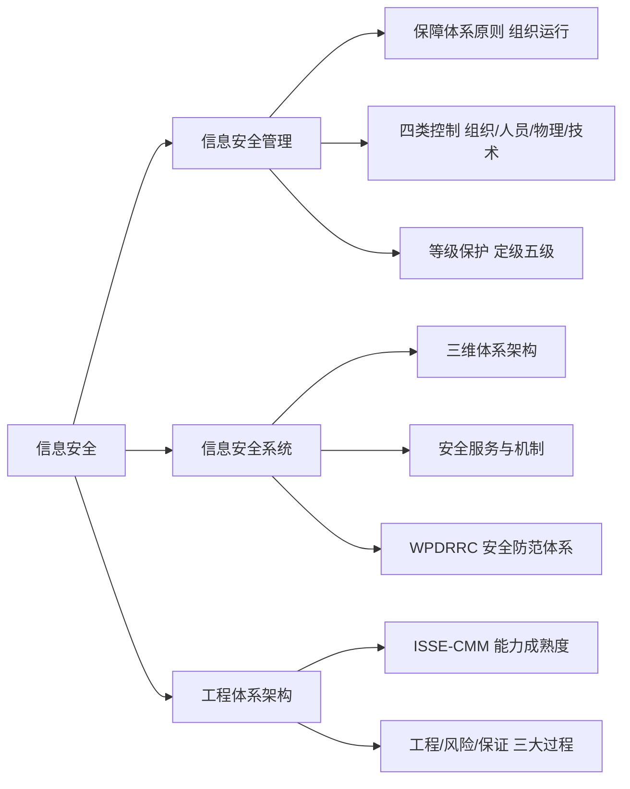

# 第八章 信息安全

## 0. 本章导航

- 返回：[[00-导航/备考首页|备考首页]]
- 知识点：[[00-导航/第八章知识点索引|管理索引]]｜[[00-导航/第八章知识点管理.base|管理表]]｜[[00-导航/第八章知识点网络.canvas|关系网]]
- 练习：[[03-错题库/错题库#第八章 信息安全|本章错题]]
- 溯源：[[98-原始资料/第八章|原始笔记]]
- 学习路径：先建立“信息安全管理”这一持续过程（保障体系原则 → 组织运行与应急响应 → 四类控制 → 等级保护五级定级），再进入“信息安全系统”（三维体系架构、安全服务与机制、WPDRRC 安全防范体系），最后落到“工程体系架构”（ISSE-CMM 能力成熟度模型与工程/风险/保证三大过程）。

## 1. 章首速览

### 一句话总览

本章围绕信息安全展开：先看信息安全管理（保障体系原则、组织运行与应急响应、四类控制、网络安全等级保护），再看信息安全系统（三维体系架构、安全服务与机制、WPDRRC 安全防范体系），最后落到信息安全系统工程（ISSE-CMM 能力成熟度模型与三大过程）。

### 全章主线

### 必背清单

| 主题 | 必背关键词 |
|---|---|
| 安全管理定位 | 贯穿信息安全全过程、贯穿信息系统全部生命周期 |
| 保障体系五原则 | 总体策划、建立组织机构、信息资产分类与控制、技术方法解决、检查与审计 |
| 组织运行三件套 | 安全运行组织、安全管理制度、应急响应机制 |
| 运行组织三角色 | 主管领导（核心）、信息中心（实体）、业务部门（使用者） |
| 四类安全控制 | 组织、人员、物理、技术 |
| 等级保护定级五级 | 一~五级：权益损害 → 社会秩序/公共利益 → 国家安全，逐级加重 |
| WPDRRC 六项能力 | 预警、保护、检测、反应、恢复、反击 |
| ISSE 三大过程 | 工程过程、风险过程、保证过程 |
| ISSE-CMM 五级（原稿名称） | 非正规实施、规划和跟踪、充分定义、量化控制、持续改进；与 SSE-CMM 名称关系待核对 |

### 高频易混预警

| 易混组合 | 快速辨识（通俗理解，不作教材定义） |
|---|---|
| 四类控制 vs 安全体系三要素 | 组织/人员/物理/技术（管理控制维度）vs 人员/技术/政策（安全体系要素维度）。 |
| 定级 vs 保护能力 | 定级看“损害对象与程度”（权益/秩序/国家安全）；保护能力看“威胁源等级与恢复程度”。 |
| 安全服务 vs 安全机制 | 服务是“要提供什么能力”；机制是“用什么手段实现”。 |
| WPDRRC（本章） vs WPDRRC（第四章） | 本章只讲“六项能力”本身；第四章展开“三要素（人员核心/策略桥梁/技术保证）与防火墙反病毒”。 |
| ISSE 工程过程 vs 风险过程 vs 保证过程 | 定方案 / 降风险 / 给信心（可信程度）。 |
| 五大属性 vs OSI 五类安全服务 | 原稿属性词为认证/权限/完整/加密/不可否认；第四章标准服务词为鉴别/访问控制/机密性/完整性/抗抵赖，不能把“加密”直接当作属性定义。 |

## 2. 信息安全管理

本节覆盖信息安全管理总览、保障体系原则、组织运行与应急响应、四类控制、安全管理职责与组织机构、网络安全等级保护。

### 2.1 信息安全管理总览与保障体系原则

#### 一句话理解

> [!note] 通俗理解
> 安全管理不是一次性动作，而是贯穿信息安全与信息系统全生命周期的持续过程，靠“策划—组织—分类—技术—检查”五步落地。

#### 核心定义

> [!info] 教材原稿关键词
> 信息安全管理贯穿信息安全的全过程，也贯穿信息系统的全部生命周期。

#### 保障体系五原则

| 原则 | 教材原稿关键词 |
|---|---|
| 总体策划 | 确保安全的总体目标和所遵循的原则 |
| 建立相关组织机构 | 明确责任部门，落实具体实施部门 |
| 信息资产分类与控制 | — |
| 使用技术方法解决 | 通信与操作的安全、访问控制、系统开发与维护，支撑安全目标、安全策略和安全内容 |
| 实施检查安全管理的措施与审计 | 主要用于检查安全措施的效果，评估安全措施执行的情况和实施效果 |

#### 考试关键词

- 安全管理定位：**贯穿全过程 + 贯穿全生命周期**。
- 保障体系五原则：**总体策划、建立组织机构、信息资产分类与控制、技术方法解决、检查与审计**。

#### 主动回忆

> [!question]- 信息安全管理贯穿哪些范围？保障体系包括哪五个原则？
> 贯穿信息安全的全过程和信息系统的全部生命周期；总体策划、建立相关组织机构、信息资产分类与控制、使用技术方法解决、实施检查安全管理的措施与审计。

#### 原教材定位

- [[98-原始资料/第八章#信息安全管理|原稿“信息安全管理”]]：管理总览、保障体系五原则。
- 覆盖核对：[[98-原始资料/第八章整理对照表|第八章整理对照表]]。

### 2.2 安全组织运行与应急响应

#### 一句话理解

> [!note] 通俗理解
> 安全要“有人管、有制度、能应急”，三者缺一不可。

#### 核心定义

> [!info] 教材原稿关键词
> 网络安全与管理至少成立一个安全运行组织，制定一套安全管理制度，建立一个应急响应机制。

#### 安全运行组织

| 组成 | 角色（原稿） |
|---|---|
| 主管领导 | 核心 |
| 信息中心 | 实体 |
| 业务应用相关部门 | 使用者 |

运行三原则：**多人负责、任期有限、职责分离**。

#### 应急响应机制

> [!info] 教材原稿关键词
> 应急响应机制主要由管理人员和技术人员共同参与；要提出应急响应的计划和程序、提供对安全事件的技术支持和指导、提供安全漏洞或隐患信息的通告、分析和安全事件处理。

#### 考试关键词

- 组织运行三件套：**安全运行组织、安全管理制度、应急响应机制**。
- 组织三角色：**领导核心、信息中心实体、业务部门使用者**。
- 运行三原则：**多人负责、任期有限、职责分离**。

#### 主动回忆

> [!question]- 网络安全与管理至少要做到哪三件事？安全运行组织由谁组成、各是什么角色？
> 至少成立一个安全运行组织、制定一套安全管理制度、建立一个应急响应机制；主管领导（核心）、信息中心（实体）、业务应用相关部门（使用者），遵循多人负责、任期有限、职责分离。

#### 原教材定位

- [[98-原始资料/第八章#信息安全管理|原稿“信息安全管理”]]：安全运行组织、应急响应机制。
- 覆盖核对：[[98-原始资料/第八章整理对照表|第八章整理对照表]]。

### 2.3 四类安全控制（组织/人员/物理/技术）

#### 一句话理解

> [!note] 通俗理解
> 控制从“组织怎么管、人员怎么约束、物理怎么防、技术怎么限”四个维度铺开。

#### 核心定义

> [!info] 教材原稿关键词
> 组织、人员、物理、技术。

| 控制类别 | 教材原稿关键词 |
|---|---|
| 组织控制 | 信息安全策略、信息安全角色与职责、职责分离、管理职责、威胁情报、身份管理、访问控制 |
| 人员控制 | 筛选、雇佣、信息安全意识与教育、保密或保密协议、远程办公、安全纪律 |
| 物理控制 | 物理安全边界、物理入口、物理安全监控、防范物理和环境威胁、设备选址和保护、存储介质、布线安全、设备维护 |
| 技术控制 | 用户终端设备、特殊访问权限、信息访问限制、访问源代码、身份验证、容量管理…… |

> [!caution] 原稿残句/待核对
> “技术控制”条目末为省略号“……”，原稿未列全技术控制子项，本章不自行补写。

#### 考试关键词

- 四类控制：**组织、人员、物理、技术**。
- 组织控制抓手：**信息安全策略、角色与职责、职责分离、访问控制**。
- 人员控制抓手：**筛选、雇佣、意识教育、保密协议、远程办公、安全纪律**。

#### 主动回忆

> [!question]- 四类安全控制是什么？人员控制包含哪些内容？
> 组织、人员、物理、技术；筛选、雇佣、信息安全意识与教育、保密或保密协议、远程办公、安全纪律。

#### 原教材定位

- [[98-原始资料/第八章#信息安全管理|原稿“信息安全管理”]]：四类安全控制。
- 覆盖核对：[[98-原始资料/第八章整理对照表|第八章整理对照表]]。

### 2.4 安全管理职责与组织机构

#### 一句话理解

> [!note] 通俗理解
> 信息系统安全管理是把“符合安全等级责任要求”贯穿系统生存周期全过程的管理。

#### 核心定义

> [!info] 教材原稿关键词
> 信息系统安全管理是信息系统的生存周期全过程实施符合安全等级责任要求的管理。

#### 安全管理职责

| 类别 | 教材原稿关键词 |
|---|---|
| 机构与规划 | 落实安全管理机构及安全管理人员、明确角色与职责、制定安全规划 |
| 策略与风险 | 开发安全策略、实施风险管理、制定业务持续性计划和灾难恢复计划、选择与实施安全措施 |
| 运行与审计 | 保证配置、变更的正确与安全、进行安全审计、保证维护支持、进行监控、检查、处理安全事件 |
| 人员 | 安全意识与安全教育、人员安全管理 |

> [!note] 勘误
> 原稿第 41 行“指定业务持续性计划和灾难恢复计划”中“指定”应为“制定”（制定计划）。

#### 安全组织机构管理体系

> [!info] 教材原稿关键词
> 配备安全管理人员、建立安全职能部门、成立安全领导小组、主要负责人出任领导、建立信息安全保密管理部门。

#### 考试关键词

- 安全管理定位：**生存周期全过程 + 符合安全等级责任要求**。
- 组织机构管理体系：**配备人员、建立职能部门、成立领导小组、主要负责人任领导、建立保密管理部门**。

#### 主动回忆

> [!question]- 信息系统安全管理的定义抓手是什么？安全组织机构管理体系包括哪些？
> 在信息系统生存周期全过程实施符合安全等级责任要求的管理；配备安全管理人员、建立安全职能部门、成立安全领导小组、主要负责人出任领导、建立信息安全保密管理部门。

#### 原教材定位

- [[98-原始资料/第八章#信息安全管理|原稿“信息安全管理”]]：安全管理职责、组织机构管理体系。
- 覆盖核对：[[98-原始资料/第八章整理对照表|第八章整理对照表]]。

### 2.5 网络安全等级保护（定级与保护能力）

#### 一句话理解

> [!note] 通俗理解
> 定级看“损害了谁、损害多严重”，从“只损权益”到“危害国家安全特别严重”逐级加重，监督力度也随之加强。

#### 定级五级

| 等级 | 教材原稿表述（已修正） | 监督管理 |
|---|---|---|
| 第一级 | 会对公民、法人和 其他组织的合法权益造成损害，但不损害国家安全、社会秩序和公共利益 | — |
| 第二级 | 对公民、法人和其他组织的合法权益造成严重损害，或者对社会秩序和公共利益造成损害（原稿“循环”），但不损害国家安全 | 指导 |
| 第三级 | 对社会秩序、公共利益严重损害，国家安全造成损害 | 监督、检查 |
| 第四级 | 对社会秩序、公共利益严重损害，国家安全造成严重损害 | 强制监督、检查 |
| 第五级 | 造成国家安全特别严重损害 | 专门监督、检查 |

> [!note] 勘误
> 原稿第 51 行“社会秩序、公共利益造成循环”中“循环”为“损害”的误写。

> [!caution] 待核对
> 原稿第三、四级对“社会秩序、公共利益”的损害程度均写作“严重损害”，未体现第四级应更重的“特别严重”递进；对照权威定级规则（第四级对社会秩序和公共利益为“特别严重”）建议核对，本章不自行改稿。

#### 安全保护能力

| 等级 | 保护能力（原稿关键词） |
|---|---|
| 第一级 | 防护来自个人的、很少资源的威胁源；在自身遭受损害后能够恢复部分功能 |
| 第二级 | 外部小型组织的、少量资源的威胁源、一般自然灾难、重要资源损害；能够发现重要的安全漏洞和处置安全事件、能在一段时间内恢复部分功能 |
| 第三级 | 外部有组织的团体、较丰富资源的威胁、严重的自然灾害；能够及时发现、监测攻击行为和处置安全事件、能够较快恢复绝大部分功能 |
| 第四级 | 在同一安全策略下防护免受来自国家级别、敌对组织的、拥有丰富资源的威胁源恶意攻击；能及时发现、能迅速恢复所有功能 |

> [!caution] 原稿残句/待核对
> 原稿未描述第五级的安全保护能力（与等级保护“第五级按国家特殊规定”的做法一致），此处不补写。

#### 考试关键词

- 定级五级线索：**一级仅损权益 → 二级损权益/秩序（不损国安）→ 三级损秩序+国安 → 四级国安严重 → 五级国安特别严重**。
- 监督管理递进：**指导 → 监督、检查 → 强制监督、检查 → 专门监督、检查**。

#### 易混点

1. **定级 vs 保护能力**：定级看“损害对象与程度”；保护能力看“威胁源等级（个人→小型组织→有组织团体→国家/敌对组织）与恢复程度（部分→一段时间部分→较快绝大部分→迅速所有）”。

#### 主动回忆

> [!question]- 网络安全等级保护五级分别损害什么、损害程度如何？
> 一级：公民、法人和其他组织合法权益造成损害（不损国家安全、社会秩序和公共利益）；二级：合法权益严重损害或社会秩序、公共利益造成损害（不损国家安全）；三级：社会秩序、公共利益严重损害、国家安全造成损害；四级：国家安全造成严重损害（社会秩序、公共利益更重）；五级：国家安全特别严重损害。

> [!question]- 安全保护能力按威胁源由低到高，一至四级分别防护什么？
> 个人少量资源威胁 → 外部小型组织/少量资源/一般自然灾难 → 外部有组织团体/较丰富资源/严重自然灾害 → 国家级别/敌对组织/丰富资源恶意攻击。

#### 原教材定位

- [[98-原始资料/第八章#信息安全管理|原稿“信息安全管理”]]：等级保护定级五级、安全保护能力。
- 覆盖核对：[[98-原始资料/第八章整理对照表|第八章整理对照表]]。

### 2.6 等级保护 2.0 变更与安全技术体系

#### 一句话理解

> [!note] 通俗理解
> 等级保护 2.0 从“技术 + 管理”两条线说明变更，再落到“一个中心 + 各层面”的安全技术体系。

#### 等级保护 2.0 技术变更内容

> [!info] 教材原稿关键词
> 物理和环境安全实质性变更；网络和通信安全实质性变更；设备和计算安全实质性变更。应用和数据安全。

> [!caution] 原稿残句/待核对
> “应用和数据安全”之后疑缺“实质性变更”字样（原稿残句），本章不自行补写。

#### 等级保护 2.0 管理变更内容

> [!info] 教材原稿关键词
> 安全策略和管理制度、安全管理机构和人员、安全建设管理、安全运维管理。

#### 安全技术体系

> [!info] 教材原稿关键词
> 物理环境安全防护、通信网络、网络边界、计算环境安全防护、安全管理中心。

#### 考试关键词

- 2.0 技术变更：原稿明确前三项为**物理和环境、网络和通信、设备和计算安全实质性变更**；末项仅记**应用和数据安全**，是否同样缺“实质性变更”待核对。
- 2.0 管理变更：**策略制度、机构与人员、建设管理、运维管理**。
- 安全技术体系：**物理环境、通信网络、网络边界、计算环境、安全管理中心**。

#### 主动回忆

> [!question]- 等级保护 2.0 的技术变更内容和管理变更内容分别有哪些？
> 技术变更：原稿明确物理和环境安全、网络和通信安全、设备和计算安全属于实质性变更；另列应用和数据安全，但其后是否缺“实质性变更”待核对。管理变更：安全策略和管理制度、安全管理机构和人员、安全建设管理、安全运维管理。

#### 原教材定位

- [[98-原始资料/第八章#信息安全管理|原稿“信息安全管理”]]：等级保护 2.0 技术/管理变更、安全技术体系。
- 覆盖核对：[[98-原始资料/第八章整理对照表|第八章整理对照表]]。

## 3. 信息安全系统

本节看信息安全系统的三维体系架构、安全服务与机制，以及 WPDRRC 安全防范体系。

### 3.1 三维体系架构与五大属性

#### 一句话理解

> [!note] 通俗理解
> 用“安全服务 × 安全机制 × OSI 层次”三个坐标把信息安全能力摆清楚；五大属性即五类安全服务的通俗叫法。

#### 核心定义

> [!info] 教材原稿关键词
> 信息安全系统的体系架构三维空间：X轴 安全机制、Y轴 OSI 网络参考模型、Z轴 安全服务。

#### 五大属性

**认证、权限、完整、加密、不可否认**。

> [!caution] 原稿术语/待核对
> 原稿使用“认证、权限、完整、加密、不可否认”；第四章 OSI 五类安全服务使用“鉴别、访问控制、数据机密性、数据完整性、抗抵赖性”。前四组可作记忆上的近似对应，但“加密”是实现机密性的机制之一，不宜直接当作“机密性”的正式属性名称。本章保留原稿词并标注边界。

#### 考试关键词

- 三维空间：**X 安全机制、Y OSI 参考模型、Z 安全服务**。
- 五大属性：**认证、权限、完整、加密、不可否认**。

#### 易混点

1. **三维空间（本章） vs OSI 安全架构（第四章）**：本章强调“三维坐标”并使用原稿属性词；第四章强调“鉴别/访问控制/机密性/完整性/抗抵赖五个框架”。两套词可辅助对应，但不直接视为同一套正式名称。

#### 主动回忆

> [!question]- 信息安全系统的体系架构三维空间是哪三个轴？五大属性是什么？
> X轴安全机制、Y轴 OSI 网络参考模型、Z轴安全服务；原稿所列五大属性为认证、权限、完整、加密、不可否认，其中“加密”作为属性名称待核对。

#### 原教材定位

- [[98-原始资料/第八章#信息安全系统|原稿“信息安全系统”]]：三维体系架构、五大属性。
- 覆盖核对：[[98-原始资料/第八章整理对照表|第八章整理对照表]]。

### 3.2 安全机制与安全防范体系（WPDRRC）

#### 一句话理解

> [!note] 通俗理解
> 安全机制是“逐层实现的防护手段”；安全防范体系把防护串成“预警→保护→检测→反应→恢复→反击”的闭环。

#### 安全机制

> [!info] 教材原稿关键词
> 基础设施安全、平台安全、数据、通信、应用、运行、管理、授权和审计安全、安全防范体系。

#### 安全防范体系六项能力（WPDRRC）

| 环节 | 英文（依据缩写） | 缩写 |
|---|---|---|
| 预警 | Warning | W |
| 保护 | Protection | P |
| 检测 | Detection | D |
| 反应 | Response | R |
| 恢复 | Recovery | R |
| 反击 | Counterattack | C |

> [!note] 章节交叉
> WPDRRC 在第四章 6.2 已展开（三要素：人员核心、策略桥梁、技术保证，以及防火墙与反病毒），本章仅呈现“六项能力”本身，不重复第四章内容。

> [!note] 术语提示
> 本原稿第二个 R 写作“反应”，第四章写作“响应”，均为 Response，所指同一环节。

#### 安全体系三要素

> [!info] 教材原稿关键词
> 人员、技术、政策（法律、法规、制度、管理）。

#### 考试关键词

- WPDRRC：**预警、保护、检测、反应、恢复、反击**。
- 安全体系三要素：**人员、技术、政策**。

#### 主动回忆

> [!question]- WPDRRC 六项能力是什么？安全体系三要素是什么？
> 预警、保护、检测、反应、恢复、反击；人员、技术、政策（法律、法规、制度、管理）。

#### 原教材定位

- [[98-原始资料/第八章#信息安全系统|原稿“信息安全系统”]]：安全机制、安全防范体系、安全体系三要素。
- 覆盖核对：[[98-原始资料/第八章整理对照表|第八章整理对照表]]。

### 3.3 安全服务

#### 一句话理解

> [!note] 通俗理解
> 安全服务回答“系统对外能提供哪些安全能力”，是一份服务清单。

#### 核心定义

> [!info] 教材原稿关键词
> 对等实体认证服务、访问控制、数据保密、数据完整性、数据源点认证、禁止否认、犯罪证据提供服务。

> [!caution] 待核对
> “犯罪证据提供服务”非常规安全服务名称（ISO 7498-2 标准安全服务为鉴别、访问控制、数据保密性、数据完整性、抗抵赖），疑为原稿转写问题，本章按原稿保留并标注待核对。

#### 考试关键词

- 安全服务清单：**对等实体认证、访问控制、数据保密、数据完整性、数据源点认证、禁止否认**。

#### 主动回忆

> [!question]- 原稿列出的安全服务有哪些？
> 对等实体认证服务、访问控制、数据保密、数据完整性、数据源点认证、禁止否认、犯罪证据提供服务。

#### 原教材定位

- [[98-原始资料/第八章#信息安全系统|原稿“信息安全系统”]]：安全服务。
- 覆盖核对：[[98-原始资料/第八章整理对照表|第八章整理对照表]]。

## 4. 工程体系架构

本节看信息安全系统工程与 ISSE-CMM 能力成熟度模型、三大过程、两维结构与能力等级。

### 4.1 信息安全系统工程与 ISSE-CMM

#### 一句话理解

> [!note] 通俗理解
> 信息安全系统工程是信息系统工程里专门“建安全系统”的那一部分，要求与业务应用同步建设。

#### 核心定义

> [!info] 教材原稿关键词
> 信息安全系统工程是信息系统工程的一部分，专注于建设信息安全系统，确保与业务应用信息系统同步进行。

> [!caution] 原稿残句/待核对
> 原稿另句“信息安全系统独立存在”（第 99 行）上下文残缺，所指为“信息安全系统自成体系、可独立建设”，语义待核对，本章不展开。

#### ISSE-CMM

> [!info] 教材原稿关键词
> 信息安全系统工程能力成熟度模型（ISSE-CMM）：清晰定义的、成熟的、可管理的、可控制的、有效的、可度量。

> [!caution] 模型名称待核对
> 原稿使用“ISSE-CMM”，现有能力等级核对材料使用“SSE-CMM”，且 ISO/IEC 21827 的正式模型名称也通常写作 SSE-CMM。两者是否为教材中的同一模型简称需核对第三版教材原文；本章不擅自统一名称。

#### 考试关键词

- 系统工程定位：**信息系统工程的一部分，与业务应用信息系统同步进行**。
- ISSE-CMM（原稿名称）六特性：**清晰定义、成熟、可管理、可控制、有效、可度量**；模型简称待核对。

#### 主动回忆

> [!question]- 信息安全系统工程与信息系统工程是什么关系？ISSE-CMM 具备哪些特性？
> 是信息系统工程的一部分，专注于建设信息安全系统、确保与业务应用信息系统同步进行；原稿所称 ISSE-CMM 具备清晰定义、成熟、可管理、可控制、有效、可度量六项特性，其与 SSE-CMM 的名称关系待核对。

#### 原教材定位

- [[98-原始资料/第八章#工程体系架构|原稿“工程体系架构”]]：信息安全系统工程、ISSE-CMM。
- 覆盖核对：[[98-原始资料/第八章整理对照表|第八章整理对照表]]。

### 4.2 ISSE 三大过程

#### 一句话理解

> [!note] 通俗理解
> 先“风险过程”排优先级，再“工程过程”定方案，最后“保证过程”给可信度——三步走。

#### 核心定义

> [!info] 教材原稿关键词
> ISSE 分解为：工程过程、风险过程、保证过程。

> [!info] 教材原稿关键词
> 先风险过程识别风险、优先级排序，工程过程与其他工程确定安全策略和方案，最后由保证过程建立解决方案的可信性。

| 过程 | 教材原稿关键词 |
|---|---|
| 工程过程 | 提供安全输入、实施安全控制，通过识别和评估选择合适的方案 |
| 风险过程 | 降低信息系统运行的风险（威胁、脆弱性、影响） |
| 保证过程 | 安全需求得到满足的可信程度 |

#### 考试关键词

- 三大过程：**工程过程、风险过程、保证过程**。
- 执行顺序：**风险过程（排序）→ 工程过程（定方案）→ 保证过程（给可信度）**。

#### 易混点

1. **工程过程 vs 风险过程 vs 保证过程**：工程过程定方案（提供输入、实施控制）；风险过程降风险（威胁/脆弱性/影响）；保证过程给信心（可信程度）。

#### 主动回忆

> [!question]- ISSE 分解为哪三个过程？执行顺序是什么？
> 工程过程、风险过程、保证过程；先风险过程识别风险、优先级排序，工程过程与其他工程确定安全策略和方案，最后保证过程建立解决方案的可信性。

#### 原教材定位

- [[98-原始资料/第八章#工程体系架构|原稿“工程体系架构”]]：ISSE 三大过程。
- 覆盖核对：[[98-原始资料/第八章整理对照表|第八章整理对照表]]。

### 4.3 两维结构与能力等级

#### 一句话理解

> [!note] 通俗理解
> 用“域维（做什么）+ 能力维（做得多好）”两个维度描述组织能力，能力好坏用五级成熟度衡量。

#### 两维结构

> [!info] 教材原稿关键词
> 域维：汇集了定义信息安全系统工程的所有实施活动（过程域）。
> 能力维：代表组织能力，由过程管理能力和制度化能力构成。

#### 能力等级

> [!info] 教材原稿关键词
> 公共特性 5 个 level：非正规实施级、规划和跟踪级、充分定义级、量化控制级、持续改进级。

> [!note] 通俗理解
> “5 个级别”为常见教学口径（与 SSE-CMM“5 个级别”课件一致）；ISO/IEC 21827 正式能力等级另含 Level 0“未执行”，本章按原稿口径呈现。

> [!caution] 口径边界
> 由于原稿称 ISSE-CMM，而等级核对材料称 SSE-CMM，五级名称虽能对应常见教学口径，仍不能据此直接证明两个简称完全等同。

#### 考试关键词

- 两维：**域维（过程域）、能力维（过程管理能力 + 制度化能力）**。
- 能力等级五级：**非正规实施 → 规划和跟踪 → 充分定义 → 量化控制 → 持续改进**。

#### 主动回忆

> [!question]- ISSE-CMM 的两个维度是什么？能力等级分哪五级？
> 域维（汇集信息安全系统工程所有实施活动，即过程域）和能力维（代表组织能力，由过程管理能力和制度化能力构成）；非正规实施级、规划和跟踪级、充分定义级、量化控制级、持续改进级。

#### 原教材定位

- [[98-原始资料/第八章#工程体系架构|原稿“工程体系架构”]]：两维结构、能力等级五级。
- 覆盖核对：[[98-原始资料/第八章整理对照表|第八章整理对照表]]。

## 5. 章末综合复习

### 5.1 高频易混点对比

> [!note] 使用说明
> 本表按“容易混淆”组织，不表示经过统计的考频排序，也不提供未经官方依据的星级押题。

| 易混组合 | 区分抓手 |
|---|---|
| 四类控制 vs 安全体系三要素 | 组织/人员/物理/技术（控制维度）vs 人员/技术/政策（要素维度）。 |
| 定级 vs 保护能力 | 损害对象与程度 vs 威胁源等级与恢复程度。 |
| 安全服务 vs 安全机制 | 要提供什么能力 vs 用什么手段实现。 |
| WPDRRC（本章） vs WPDRRC（第四章） | 六项能力本身 vs 三要素与防火墙反病毒。 |
| 工程过程 vs 风险过程 vs 保证过程 | 定方案 / 降风险 / 给信心。 |
| 五大属性 vs 安全服务清单 | 原稿属性词“认证/权限/完整/加密/不可否认”（其中“加密”名称待核对）vs 七项具体服务（含待核对项）。 |

### 5.2 关键顺序与等级

1. **ISSE 执行顺序**：风险过程（识别风险、排序）→ 工程过程（确定安全策略和方案）→ 保证过程（建立可信性）。
2. **等级保护定级（由轻到重）**：第一级（损权益）→ 第二级（损权益/秩序，不损国安）→ 第三级（秩序+国安）→ 第四级（国安严重）→ 第五级（国安特别严重）。
3. **监督管理（由弱到强）**：指导 → 监督、检查 → 强制监督、检查 → 专门监督、检查。
4. **保护能力威胁源（由低到高）**：个人 → 小型组织 → 有组织团体 → 国家/敌对组织。
5. **ISSE-CMM 能力等级（由低到高）**：非正规实施 → 规划和跟踪 → 充分定义 → 量化控制 → 持续改进。

### 5.3 分层必背清单

#### 必须准确背诵

- 信息安全管理定位（全过程 + 全生命周期）；保障体系五原则。
- 组织运行三件套与组织三角色；运行三原则（多人负责、任期有限、职责分离）。
- 四类安全控制（组织、人员、物理、技术）。
- 等级保护定级五级及监督力度递进。
- 三维空间（X 安全机制 / Y OSI / Z 安全服务）与五大属性。
- WPDRRC 六项能力；安全体系三要素（人员、技术、政策）。
- ISSE 三大过程及执行顺序；原稿 ISSE-CMM 五级能力等级（模型简称待核对）。

#### 理解后辨识

- 定级（损害对象程度）与保护能力（威胁源与恢复）的区别。
- 安全服务 vs 安全机制的归属。
- 工程/风险/保证三过程的题干线索。
- WPDRRC 在本章与第四章的分工（六项能力 vs 三要素）。
- 等级保护 2.0 技术变更与管理变更的归属。

### 5.4 闭卷自测

#### 列举题

> [!question]- 1. 信息安全管理贯穿哪些范围？保障体系五原则是什么？
> 贯穿信息安全全过程和信息系统全部生命周期；总体策划、建立相关组织机构、信息资产分类与控制、使用技术方法解决、实施检查安全管理的措施与审计。

> [!question]- 2. 网络安全与管理至少做到哪三件事？运行三原则是什么？
> 成立一个安全运行组织、制定一套安全管理制度、建立一个应急响应机制；多人负责、任期有限、职责分离。

> [!question]- 3. 四类安全控制是什么？
> 组织、人员、物理、技术。

> [!question]- 4. WPDRRC 六项能力是什么？
> 预警、保护、检测、反应、恢复、反击。

> [!question]- 5. ISSE 分解为哪三个过程？
> 工程过程、风险过程、保证过程。

> [!question]- 6. ISSE-CMM 能力等级分哪五级？
> 非正规实施级、规划和跟踪级、充分定义级、量化控制级、持续改进级。

#### 对比题

> [!question]- 7. 定级与保护能力如何区分？
> 定级看损害对象（权益/社会秩序公共利益/国家安全）与损害程度；保护能力看威胁源等级（个人→小型组织→有组织团体→国家敌对）与恢复程度（部分→一段时间部分→较快绝大部分→迅速所有）。

> [!question]- 8. 安全服务与安全机制如何区分？
> 安全服务是系统对外提供的能力（对等实体认证、访问控制、数据保密、数据完整性等）；安全机制是实现这些能力的手段（基础设施、平台、数据、通信、应用、运行、管理等）。

> [!question]- 9. 工程过程、风险过程、保证过程各做什么？
> 工程过程提供安全输入、实施安全控制、确定方案；风险过程降低运行风险（威胁、脆弱性、影响）；保证过程给出安全需求得到满足的可信程度。

#### 顺序题

> [!question]- 10. 写出 ISSE 三大过程的执行顺序。
> 风险过程（识别风险、排序）→ 工程过程（确定安全策略和方案）→ 保证过程（建立可信性）。

> [!question]- 11. 写出等级保护定级由轻到重的损害递进。
> 一级损权益 → 二级损权益/秩序（不损国安）→ 三级秩序+国安 → 四级国安严重 → 五级国安特别严重。

> [!question]- 12. 写出 ISSE-CMM 能力等级由低到高顺序。
> 非正规实施 → 规划和跟踪 → 充分定义 → 量化控制 → 持续改进。

#### 情境判断题

> [!question]- 13. 题干描述“仅对公民、法人和其他组织的合法权益造成损害，但不损害国家安全、社会秩序和公共利益”，对应哪一级？
> 第一级。

> [!question]- 14. 题干描述“对社会秩序和公共利益造成损害、但不损害国家安全”，对应哪一级？
> 第二级（指导）。

> [!question]- 15. 题干强调“降低信息系统运行风险，关注威胁、脆弱性、影响”，属于 ISSE 哪个过程？
> 风险过程。

#### 题号—正文模块覆盖

| 题号 | 正文模块 | 覆盖重点 |
|---|---|---|
| 1 | 2.1 信息安全管理总览与保障体系原则 | 定位、五原则 |
| 2 | 2.2 安全组织运行与应急响应 | 三件套、运行三原则 |
| 3 | 2.3 四类安全控制 | 组织/人员/物理/技术 |
| 4 | 3.2 安全机制与安全防范体系 | WPDRRC 六项能力 |
| 5、9、10、15 | 4.2 ISSE 三大过程 | 三过程、顺序、情境判定 |
| 6、12 | 4.3 两维结构与能力等级 | 五级能力等级 |
| 7、11、13、14 | 2.5 网络安全等级保护 | 定级与保护能力、等级递进 |
| 8 | 3.2/3.3 安全机制与安全服务 | 服务与机制区分 |

### 5.5 本章错题入口

- [[03-错题库/错题库#第八章 信息安全|进入错题库：第八章 信息安全]]

### 5.6 勘误与依据

- **“造成循环”→“造成损害”**：原稿第 51 行第二级定级“社会秩序、公共利益造成循环”为“造成损害”的误写（对照《信息安全等级保护管理办法》公通字〔2007〕43 号第七条）。
- **“指定”→“制定”**：原稿第 41 行“指定业务持续性计划和灾难恢复计划”应为“制定”（制定计划）。
- **等级保护 2.0 技术变更“应用和数据安全”残句**：原稿第 69 行“应用和数据安全”后疑缺“实质性变更”，标待核对。
- **“犯罪证据提供服务”待核对**：原稿第 93 行该服务名称非常规，标待核对。
- **“信息安全系统独立存在”残句**：原稿第 99 行上下文残缺，语义待核对。
- **技术控制省略号**：原稿第 35 行“容量管理……”原稿未列全，未补写。
- **三四级“社会秩序/公共利益”损害程度**：原稿第三、四级均写“严重损害”，未体现第四级“特别严重”递进，标待核对。
- **五大属性术语**：原稿“认证、权限、完整、加密、不可否认”与第四章 OSI 五类安全服务词不完全相同，尤其“加密”不直接等于正式属性“机密性”，标注边界。
- **ISSE-CMM / SSE-CMM**：原稿与现有核对材料使用不同简称，未直接视为同名模型；五级教学口径保留，名称关系待教材核对。

### 5.7 本章收束

- 能准确说出保障体系五原则、组织运行三件套、四类控制、等级保护定级五级、三维空间与五大属性、WPDRRC、ISSE 三大过程与 ISSE-CMM 五级后，再做情境辨识。
- 遇到“待核对”“残句”标记（等级保护 2.0 末项、五大属性词、犯罪证据服务、信息安全系统独立存在、ISSE-CMM/SSE-CMM 名称等）时，只按原稿定位回忆，不把它当作已经权威确认的结论。
- 返回：[[00-导航/备考首页|备考首页]]｜练习：[[03-错题库/错题库#第八章 信息安全|本章错题]]｜溯源：[[98-原始资料/第八章|原始笔记]]。
