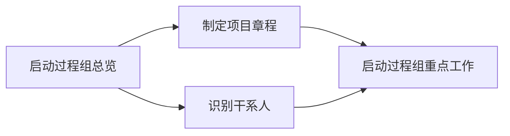

# 第十章 启动过程组

## 0. 本章导航

- 返回：[[00-导航/备考首页|备考首页]]
- 知识点：[[00-导航/第十章知识点索引|第十章知识点索引]]｜[[00-导航/第十章知识点网络.canvas|知识点关系网]]｜[[00-导航/第十章知识点管理.base|知识点管理表]]
- 练习：[[03-错题库/错题库#第十章 启动过程组|本章错题]]
- 溯源：[[98-原始资料/第十章/第十章|原始笔记]]
- 学习路径：先建立“启动过程组”的整体概念（定义、目的、作用、前期工作），再分别掌握两个启动过程——制定项目章程与识别干系人，最后落到启动过程组的重点工作（启动会议与项目目标两类）。

## 1. 章首速览

### 一句话总览

本章讲五大过程组之首的“启动过程组”：它只包含两个过程——制定项目章程（授权项目、任命项目经理）与识别干系人（记录干系人利益与影响）；先讲启动过程组的总定位，再分别展开两个过程，最后落到启动会议与项目目标等重点工作。

### 全章主线

### 必背清单

| 主题 | 必背关键词 |
|---|---|
| 启动过程组定义 | 定义新项目/现有项目的新阶段、授权开始该项目或阶段 |
| 启动两过程 | 制定项目章程（项目整合管理）、识别干系人（项目干系人管理） |
| 启动目的 | 协调期望与项目目的、告知范围和目标、商讨对项目相关阶段的参与 |
| 立项标志 | 项目章程获批 = 项目正式立项 |
| 章程作用（四句） | 联系战略目标、确立正式地位、展示组织承诺、仅一次/预定义时开展 |
| 制定章程核心输出 | 项目章程、假设日志 |
| 干系人五类别 | 客户和用户、团队及成员、发起人、资源/职能部门、供应商 |
| 识别干系人核心输出 | 干系人登记册、变更请求、计划更新、文件更新 |
| 干系人分析五类利害关系 | 兴趣、权利、所有权、知识、贡献 |
| 映射/表现模型 | 权力利益方格、干系人立方体、凸显模型、影响方向、优先级排序 |
| 启动会议五步骤 | 确定会议目标、会议准备、识别参会人员、明确议题、会议记录 |
| 项目目标两类 | 成果性目标、约束性目标 |

### 高频易混预警

| 易混组合 | 快速辨识（通俗理解，不作教材定义） |
|---|---|
| 启动过程组 vs 规划过程组 | 启动=授权立项、任命项目经理；规划=制定“如何执行”的管理计划。 |
| 制定项目章程 vs 识别干系人 | 章程=正式批准项目+授权项目经理的授权文件；识别干系人=记录利益与影响力的持续性过程。 |
| 项目章程 vs 项目管理计划 | 章程是批准项目的授权文件（“为什么做、授权谁做”）；管理计划是规划过程组产出（“怎么做”）。 |
| 发起人 vs 项目经理 | 发起人启动/批准项目、通常编制章程；项目经理被授权后负责规划、执行、控制。 |
| 成果性目标 vs 约束性目标 | 成果性=交付什么；约束性=受什么约束（成本/时间/质量等）。 |
| 章程输出 vs 识别干系人输出 | 章程过程输出“项目章程、假设日志”；识别干系人输出“干系人登记册、变更请求及相关更新”。 |

## 2. 启动过程组总览

本节覆盖原稿“制定项目章程”标题下对启动过程组的总体论述（第 5—19 行）：定义、包含的两个过程、目的、需定义内容、作用与前期工作承担者。

### 2.1 启动过程组的定义、目的与作用

#### 一句话理解

> [!note]
> 启动过程组回答“项目凭什么开始”——通过章程授权立项、通过识别干系人圈定相关方，确保只让符合组织目标的项目启动。

#### 核心定义

> [!info] 教材原稿关键词
> 启动过程组：定义一个新项目或现有项目的一个新阶段，授权开始该项目或阶段的一组过程。

| 维度 | 教材原稿关键词 |
|---|---|
| 包含的两个过程 | 项目整合管理中的**制定项目章程**、项目干系人管理中的**识别干系人** |
| 目的 | 协调期望与项目目的，告知范围和目标，商讨对项目相关阶段的参与 |
| 启动过程中需定义/落实 | 定义初步项目范围、落实初步财务资源、识别干系人、指派项目经理 |
| 上述内容的载体 | 反映在**项目章程**和**干系人登记册**中 |
| 立项标志 | 项目章程获批，项目正式立项 |
| 作用 | 确保只有符合组织目标的项目才被立项；开始时就认真考虑商业论证、项目效益和干系人 |
| 前期工作承担者 | 项目发起人、项目管理办公室（PMO）、项目组合指导委员会或其他干系人 |

#### 考试关键词

- 定义抓词：**定义新项目/新阶段、授权开始**。
- 两个过程：**制定项目章程**（整合管理）、**识别干系人**（干系人管理）。
- 目的三句：**协调期望与项目目的、告知范围和目标、商讨参与**。
- 立项标志：**项目章程获批 = 项目正式立项**。

#### 易混点

1. **启动过程组 vs 规划过程组**：启动回答“授权立项”；规划回答“怎么做”。启动只含两个过程（章程、识别干系人），远少于规划过程组。

#### 主动回忆

> [!question]- 启动过程组的定义是什么？包含哪两个过程？
> 定义一个新项目或现有项目的一个新阶段、授权开始该项目或阶段的一组过程；包含制定项目章程（项目整合管理）和识别干系人（项目干系人管理）。

> [!question]- 启动过程组的目的是什么？项目正式立项的标志是什么？
> 协调期望与项目目的、告知范围和目标、商讨对项目相关阶段的参与；项目章程获批即项目正式立项。

#### 原教材定位

- [[98-原始资料/第十章/第十章#制定项目章程|原稿“制定项目章程”]]：启动过程组定义、目的、作用、前期工作（第 5—19 行）。
- 覆盖核对：[[98-原始资料/第十章整理对照表|第十章整理对照表]]。

## 3. 制定项目章程

本节覆盖原稿“制定项目章程”标题下关于该过程本身的论述（第 21—41 行）：定义、作用、授权内容与项目经理任命。

### 3.1 制定项目章程的定义与作用

#### 一句话理解

> [!note]
> 项目章程是“项目出生证”——一份正式批准项目、授权项目经理动用组织资源的文件。

#### 核心定义

> [!info] 教材原稿关键词
> 制定项目章程是编写一份**正式批准项目**并**授权项目经理**在项目活动中**使用组织资源**的文件的过程。

| 作用 | 教材原稿关键词 |
|---|---|
| 作用一 | 明确项目与组织战略目标之间的直接联系 |
| 作用二 | 确立项目的正式地位 |
| 作用三 | 展示组织对项目的承诺 |
| 作用四 | 本过程仅开展一次，或仅在项目的预定义时开展（原稿“预定义是”疑为笔误，见勘误） |

#### 考试关键词

- 定义抓词：**正式批准项目、授权项目经理、使用组织资源**。
- 作用四句：**联系战略目标、确立正式地位、展示组织承诺、仅一次/预定义时**。

#### 易混点

1. **项目章程 vs 项目管理计划**：章程是发起人批准项目的授权文件（“为什么做、授权谁做”）；管理计划是规划过程组产出（“怎么做”）。

#### 主动回忆

> [!question]- 制定项目章程的定义是什么？
> 编写一份正式批准项目、并授权项目经理在项目活动中使用组织资源的文件的过程。

> [!question]- 项目章程的作用有哪些？
> 明确项目与组织战略目标之间的直接联系；确立项目的正式地位；展示组织对项目的承诺；本过程仅开展一次或仅在项目的预定义时开展。

#### 原教材定位

- [[98-原始资料/第十章/第十章#制定项目章程|原稿“制定项目章程”]]：制定项目章程定义与作用（第 21—31 行）。
- 覆盖核对：[[98-原始资料/第十章整理对照表|第十章整理对照表]]。

### 3.2 章程的授权内容与项目经理任命

#### 一句话理解

> [!note]
> 章程“授权”的落点是项目经理——授权其在规划、执行、控制环节动用组织资源；项目经理应在规划开始前任命。

#### 内容表格

| 主题 | 教材原稿关键词 |
|---|---|
| 授权内容 | 项目章程授权项目经理进行**规划、执行和控制**，使用组织资源 |
| 任命时机 | 应在**规划开始之前**任命项目经理 |
| 编制主体 | 项目章程可由**发起人**编制，也可由**项目经理与发起机构合作**编制 |
| 启动主体 | 项目由**项目以外的机构**来启动（发起人、PMO、项目组合治理委员会主席或其授权代表） |

#### 考试关键词

- 授权三环节：**规划、执行、控制**。
- 任命时机：**规划开始之前**。
- 编制主体：**发起人**（或项目经理与发起机构合作）。

#### 易混点

1. **发起人 vs 项目经理**：发起人启动项目、通常编制章程；项目经理经章程授权后负责规划/执行/控制。发起机构、PMO 属“项目以外的机构”。

#### 记忆钩子

> [!tip]
> “授权”记“**规、执、控**”三字；任命“**规划前**”，编制“**发起人**”。

#### 主动回忆

> [!question]- 项目章程授权项目经理做什么？项目经理应在何时任命？
> 授权项目经理进行规划、执行和控制并使用组织资源；应在规划开始之前任命项目经理。

> [!question]- 项目章程可以由谁编制？项目由谁启动？
> 可由发起人编制，也可由项目经理与发起机构合作编制；项目由项目以外的机构启动（发起人、PMO、项目组合治理委员会主席或其授权代表）。

#### 原教材定位

- [[98-原始资料/第十章/第十章#制定项目章程|原稿“制定项目章程”]]：授权内容、任命时机、编制与启动主体（第 37—41 行）。
- 覆盖核对：[[98-原始资料/第十章整理对照表|第十章整理对照表]]。

### 3.3 制定项目章程的输入、工具与技术、输出

#### ITTO 表

| 输入 | 工具与技术 | 输出 |
|---|---|---|
| 立项管理文件 | 专家判断 | 项目章程 |
| 协议 | 数据收集：头脑风暴、焦点小组、访谈 | 假设日志 |
| 事业环境因素 | 人际关系与团队技能：冲突管理、引导、会议管理 | — |
| 组织过程资产 | 会议 | — |

#### 数据流抓手

- **上游输入**：立项管理提供项目建议书、可行性研究报告、项目评估报告和协议；事业环境因素、组织过程资产也进入本过程。
- **项目章程的下游去向**：制定项目管理计划、其他知识领域规划过程、收集需求、定义范围、识别干系人、结束项目或阶段。
- **假设日志的归属**：作为项目文件的一部分输出。

#### 考试关键词

- 两个核心输出：**项目章程、假设日志**。
- 数据收集三项：**头脑风暴、焦点小组、访谈**。
- 人际关系与团队技能三项：**冲突管理、引导、会议管理**。

#### 主动回忆

> [!question]- 制定项目章程的两个输出是什么？
> 项目章程、假设日志。

> [!question]- 制定项目章程的数据收集技术与人际关系/团队技能各有哪些？
> 数据收集包括头脑风暴、焦点小组、访谈；人际关系与团队技能包括冲突管理、引导、会议管理。

#### 原教材定位

- [[98-原始资料/第十章/第十章#制定项目章程|原稿“制定项目章程”]]：制定项目章程数据流图与 ITTO 图（第 33—35、43—45 行）。
- 覆盖核对：[[98-原始资料/第十章整理对照表|第十章整理对照表]]。

## 4. 识别干系人

本节覆盖原稿“识别干系人”标题下的全部内容（第 49—77 行），包括文字定义、干系人类别，以及图片中的数据流、ITTO、数据收集/分析和干系人映射分析/表现模型。

### 4.1 识别干系人的定义、作用与开展时机

#### 一句话理解

> [!note]
> 识别干系人是“圈定相关方”的过程——定期找出所有影响项目或被项目影响的人，记录其利益与影响力。

#### 核心定义

> [!info] 教材原稿关键词
> 识别干系人是定期识别项目干系人，分析和记录他们的**利益、参与度、相互依赖性、影响力**和对项目成功的**潜在影响**的过程。

| 维度 | 教材原稿关键词 |
|---|---|
| 作用 | 建立对每个干系人的适度关注；根据需要在整个项目期间定期开展 |
| 首次开展时机 | 通常在**编制和批准项目章程之前或同时**首次开展 |
| 重复开展时机 | 至少在每个阶段开始时、以及项目或组织出现重大变化时 |

#### 考试关键词

- 定义抓词：**利益、参与度、相互依赖性、影响力、潜在影响**。
- 首次时机：**编制和批准项目章程之前或同时**。
- 重复时机：**每阶段开始 + 重大变化时**。

#### 易混点

1. **识别干系人 vs 规划干系人参与**：识别干系人（启动过程组）回答“谁会影响项目”，定期识别并记录利益；规划干系人参与（规划过程组）回答“如何让这些干系人参与”。

#### 主动回忆

> [!question]- 识别干系人的定义是什么？
> 定期识别项目干系人，分析和记录他们的利益、参与度、相互依赖性、影响力和对项目成功的潜在影响的过程。

> [!question]- 识别干系人通常在何时首次开展、何时重复开展？
> 通常在编制和批准项目章程之前或同时首次开展；至少在每个阶段开始时以及项目或组织出现重大变化时重复开展。

#### 原教材定位

- [[98-原始资料/第十章/第十章#识别干系人|原稿“识别干系人”]]：定义、作用、开展时机（第 49—53 行）。
- 覆盖核对：[[98-原始资料/第十章整理对照表|第十章整理对照表]]。

### 4.2 项目干系人的主要类别

#### 内容表格

| 类别 | 教材原稿关键词 |
|---|---|
| 项目客户和用户 | 客户和用户 |
| 项目团队及成员 | 团队及成员 |
| 项目发起人 | 发起人 |
| 资源或职能部门 | 资源/职能部门 |
| 供应商 | 供应商 |

#### 考试关键词

- 五类别：**客户和用户、团队及成员、发起人、资源/职能部门、供应商**。

#### 主动回忆

> [!question]- 项目干系人的主要类别有哪些？
> 项目客户和用户、项目团队及成员、项目发起人、资源或职能部门、供应商。

#### 原教材定位

- [[98-原始资料/第十章/第十章#识别干系人|原稿“识别干系人”]]：干系人主要类别（第 55 行）。
- 覆盖核对：[[98-原始资料/第十章整理对照表|第十章整理对照表]]。

### 4.3 识别干系人的输入、工具与技术、输出

#### ITTO 表

| 输入 | 工具与技术 | 输出 |
|---|---|---|
| 项目章程 | 专家判断 | 干系人登记册 |
| 立项管理文件 | 数据收集：问卷和调查、头脑风暴 | 变更请求 |
| 项目管理计划：沟通管理计划、干系人参与计划 | 数据分析：干系人分析、文件分析 | 项目管理计划更新：需求管理、沟通管理、风险管理、干系人参与计划 |
| 项目文件：变更日志、问题日志、需求文件 | 数据表现：干系人映射分析/表现 | 项目文件更新：假设日志、问题日志、风险登记册 |
| 协议 | 会议 | — |
| 事业环境因素、组织过程资产 | — | — |

#### 数据流抓手

- **来自立项与整合管理**：项目建议书、可行性研究报告、项目评估报告、项目章程，以及变更日志、问题日志等。
- **来自计划、需求和采购**：沟通管理计划、干系人参与计划、需求文件、协议。
- **输出的去向**：干系人登记册进入项目文件；变更请求进入实施整体变更控制；同时更新相关管理计划和项目文件。

> [!warning] 时机与输入不要机械矛盾化
> 原稿一方面说明识别干系人可在编制和批准章程之前或同时首次开展，另一方面在正式 ITTO 图中列“项目章程”为输入。可理解为项目启动具有迭代性：首次识别可与章程工作并行，正式过程资料又会使用已形成的章程信息。这里仅用于协调原稿两处表述，不替代教材原文。

#### 主动回忆

> [!question]- 识别干系人的四类输出是什么？
> 干系人登记册、变更请求、项目管理计划更新、项目文件更新。

> [!question]- 识别干系人的数据收集、数据分析和数据表现技术分别是什么？
> 数据收集：问卷和调查、头脑风暴；数据分析：干系人分析、文件分析；数据表现：干系人映射分析/表现。

#### 原教材定位

- [[98-原始资料/第十章/第十章#识别干系人|原稿“识别干系人”]]：识别干系人数据流图与 ITTO 图（第 57—63 行）。
- 覆盖核对：[[98-原始资料/第十章整理对照表|第十章整理对照表]]。

### 4.4 数据收集与数据分析工具

#### 数据收集

| 工具 | 原图要点 |
|---|---|
| 问卷和调查 | 可包括一对一调查、焦点小组讨论或其他大规模信息收集技术。 |
| 头脑风暴 | 用于识别干系人，包括头脑风暴和头脑写作。 |
| 头脑风暴（狭义） | 通用的数据收集和创意技术，通常由小组开展，参与者可为团队成员或主题专家。 |
| 头脑写作 | 头脑风暴的改良形式；在小组讨论前让参与者单独思考，信息收集可面对面或在线进行。 |

#### 数据分析

| 工具 | 原图要点 |
|---|---|
| 干系人分析 | 形成干系人清单及其组织职位、项目角色、利害关系、期望、态度和对项目信息的兴趣等信息。 |
| 文件分析 | 评估现有项目文件及以往项目经验教训，以识别干系人及其他支持性信息。 |

干系人的利害关系组合主要包括：

| 类型 | 关键词 |
|---|---|
| 兴趣 | 对项目决策或结果的关注 |
| 权利 | 合法权利或道德权利 |
| 所有权 | 对资产或财产的法定所有权 |
| 知识 | 为项目提供的专业知识 |
| 贡献 | 以资金、资源等形式提供支持 |

> [!note]
> 上表的解释依据原图语义作了简明转述；考试记忆核心是五个名称：**兴趣、权利、所有权、知识、贡献**。

#### 主动回忆

> [!question]- 干系人的五类利害关系组合是什么？
> 兴趣、权利、所有权、知识、贡献。

> [!question]- 头脑写作与一般头脑风暴的区别是什么？
> 头脑写作会先给参与者单独思考的时间，再进入小组讨论，并可面对面或在线收集信息。

#### 原教材定位

- [[98-原始资料/第十章/第十章#识别干系人|原稿“识别干系人”]]：数据收集与数据分析图（第 65—71 行）。
- 覆盖核对：[[98-原始资料/第十章整理对照表|第十章整理对照表]]。

### 4.5 干系人映射分析/表现

| 模型/方法 | 分类依据或用途 |
|---|---|
| 权力利益方格 | 按权力、利益、影响、作用等维度或其组合对干系人分类。 |
| 干系人立方体 | 对二维方格的改良，以三维模型组合多种要素；有助于分析干系人群体并制定沟通和参与策略。 |
| 凸显模型 | 按**权力、紧迫性、合法性**评估干系人；适合大型、复杂干系人群体或复杂关系，用于确定相对重要性。 |
| 影响方向 | 按向上、向下、向外、横向四个方向分类。 |
| 优先级排序 | 当干系人很多、群体成员频繁变化，或关系复杂时，为干系人排序。 |

#### 影响方向四分法

| 方向 | 典型对象 |
|---|---|
| 向上 | 执行组织或发起组织的高级管理层、发起人、指导委员会 |
| 向下 | 临时贡献知识或技能的团队成员、专家 |
| 向外 | 项目团队之外的供应商、政府、公众、最终用户、监管部门等 |
| 横向 | 项目经理的同级人员，如其他项目经理或中层管理人员，可能竞争或合作获取稀缺资源与信息 |

#### 记忆钩子

> [!tip]
> 凸显模型记“**权、急、法**”（权力、紧迫性、合法性）；影响方向记“**上、下、外、横**”。

#### 主动回忆

> [!question]- 凸显模型用哪三个维度评估干系人？
> 权力、紧迫性、合法性。

> [!question]- 干系人的影响方向分为哪四类？
> 向上、向下、向外、横向。

> [!question]- 什么情况下适合进行优先级排序？
> 干系人很多、干系人群体成员频繁变化，或项目团队与干系人之间关系复杂时。

#### 原教材定位

- [[98-原始资料/第十章/第十章#识别干系人|原稿“识别干系人”]]：干系人映射分析/表现图（第 73—77 行）。
- 覆盖核对：[[98-原始资料/第十章整理对照表|第十章整理对照表]]。

## 5. 启动过程组织的重点工作

本节覆盖原稿“启动过程组织的重点工作”标题下全部内容（第 81—87 行）：重点工作、启动会议、项目目标两类。

### 5.1 项目启动会议

#### 一句话理解

> [!note]
> 启动会议是“正式吹哨”的仪式——把章程当众公布，让各方干系人明确目标、范围、需求、背景、职责与权限。

#### 内容表格

| 主题 | 教材原稿关键词 |
|---|---|
| 重点工作 | 项目启动会议、关注价值与目标 |
| 启动会议目的 | 使项目各方干系人明确项目的目标、范围、需求、背景、各自的职责和权限，正式公布项目章程 |
| 五个工作步骤 | 确定会议目标、会议准备、识别参会人员、明确议题、进行会议记录 |

#### 考试关键词

- 重点工作两项：**启动会议、关注价值与目标**。
- 启动会议五步骤：**确定会议目标 → 会议准备 → 识别参会人员 → 明确议题 → 会议记录**。

#### 易混点

1. **启动会议 vs 启动过程组**：启动会议是启动过程组中的一项重点工作/仪式；启动过程组是包含章程、识别干系人的一组过程。

#### 记忆钩子

> [!tip]
> 五步骤记“**标、备、人、题、记**”（目标→准备→人员→议题→记录）。

#### 主动回忆

> [!question]- 项目启动会议的目的是什么？有哪些工作步骤？
> 使项目各方干系人明确项目的目标、范围、需求、背景、各自的职责和权限，正式公布项目章程；五步骤为确定会议目标、会议准备、识别参会人员、明确议题、进行会议记录。

#### 原教材定位

- [[98-原始资料/第十章/第十章#启动过程组织的重点工作|原稿“启动过程组织的重点工作”]]：重点工作、启动会议目的与步骤（第 81—85 行）。
- 覆盖核对：[[98-原始资料/第十章整理对照表|第十章整理对照表]]。

### 5.2 项目目标的两类划分

#### 内容表格

| 类别 | 教材原稿关键词 |
|---|---|
| 成果性目标 | 项目成果性目标 |
| 约束性目标 | 约束性目标 |

> [!note] 通俗理解（原稿仅列两类名称，未展开定义）
> 成果性目标指向“项目最终交付的成果”；约束性目标指向“完成成果所受的成本、时间、质量等约束”。

#### 考试关键词

- 两类目标：**成果性目标、约束性目标**。

#### 主动回忆

> [!question]- 项目目标分为哪两类？
> 成果性目标、约束性目标。

#### 原教材定位

- [[98-原始资料/第十章/第十章#启动过程组织的重点工作|原稿“启动过程组织的重点工作”]]：项目目标两类（第 87 行）。
- 覆盖核对：[[98-原始资料/第十章整理对照表|第十章整理对照表]]。

## 6. 章末综合复习

### 6.1 高频易混点对比

> [!note] 使用说明
> 本表按“容易混淆”组织，不表示经过统计的考频排序，也不提供未经官方依据的星级押题。

| 易混组合 | 区分抓手 |
|---|---|
| 启动过程组 vs 规划过程组 | 启动=授权立项、任命项目经理；规划=制定“如何执行”的管理计划。 |
| 制定项目章程 vs 识别干系人 | 章程=正式批准项目+授权项目经理的授权文件；识别干系人=记录利益与影响力的持续性过程。 |
| 项目章程 vs 项目管理计划 | 章程是批准项目的授权文件；管理计划是规划过程组的“怎么做”。 |
| 发起人 vs 项目经理 | 发起人启动/批准、通常编制章程；项目经理被授权后负责规划、执行、控制。 |
| 成果性目标 vs 约束性目标 | 成果性=交付什么；约束性=受什么约束（成本/时间/质量等）。 |
| 启动会议 vs 启动过程组 | 启动会议是启动过程组的一项重点工作/仪式；启动过程组是含章程、识别干系人的一组过程。 |
| 头脑风暴 vs 头脑写作 | 头脑写作是头脑风暴的改良形式，先单独思考再小组讨论。 |
| 权力利益方格 vs 干系人立方体 vs 凸显模型 | 方格按二维维度组合分类；立方体把要素扩展为三维；凸显模型抓权力、紧迫性、合法性。 |

### 6.2 关键顺序与等级

1. **启动会议五步骤顺序**：确定会议目标 → 会议准备 → 识别参会人员 → 明确议题 → 进行会议记录。
2. **项目经理任命时机**：在规划开始之前（先任命，后规划）。
3. **识别干系人首次开展时机**：在编制和批准项目章程之前或同时。

### 6.3 分层必背清单

#### 必须准确背诵

- 启动过程组定义与两个过程（制定项目章程、识别干系人）。
- 启动过程组目的三句（协调期望、告知范围目标、商讨参与）。
- 制定项目章程定义与作用四句。
- 识别干系人定义、作用与开展时机。
- 两个过程的 ITTO，尤其是章程/假设日志、干系人登记册及相关更新。
- 干系人五类利害关系与映射分析/表现模型。
- 干系人五类别。
- 启动会议目的与五步骤。
- 项目目标两类（成果性、约束性）。

#### 理解后辨识

- 启动过程组与规划过程组的分界。
- 发起人与项目经理的角色分工。
- 项目章程与项目管理计划的区别。
- 成果性目标与约束性目标的题干线索。
- 识别干系人的数据收集、数据分析和数据表现工具。

### 6.4 闭卷自测

#### 列举题

> [!question]- 1. 启动过程组包含哪两个过程？分别属于哪个知识领域？
> 制定项目章程（项目整合管理）、识别干系人（项目干系人管理）。

> [!question]- 2. 启动过程组的目的是什么？
> 协调期望与项目目的，告知范围和目标，商讨对项目相关阶段的参与。

> [!question]- 3. 制定项目章程的定义是什么？其作用有哪些？
> 编写一份正式批准项目、授权项目经理在项目活动中使用组织资源的文件的过程；作用：明确项目与组织战略目标的直接联系、确立项目的正式地位、展示组织对项目的承诺、仅开展一次或仅在预定义时开展。

> [!question]- 4. 识别干系人的定义是什么？
> 定期识别项目干系人，分析和记录他们的利益、参与度、相互依赖性、影响力和对项目成功的潜在影响的过程。

> [!question]- 5. 项目干系人的主要类别有哪些？
> 项目客户和用户、项目团队及成员、项目发起人、资源或职能部门、供应商。

> [!question]- 6. 项目启动会议的五个工作步骤是什么？
> 确定会议目标、会议准备、识别参会人员、明确议题、进行会议记录。

> [!question]- 7. 项目目标分为哪两类？
> 成果性目标、约束性目标。

#### 对比题

> [!question]- 8. 制定项目章程与识别干系人有什么区别？
> 章程是正式批准项目并授权项目经理使用组织资源的授权文件（“授权立项”）；识别干系人是定期识别并记录干系人利益与影响力的过程（“圈定相关方”）。

> [!question]- 9. 发起人和项目经理的角色如何区分？
> 发起人通常负责启动项目、编制章程（属项目以外的机构）；项目经理经章程授权后负责规划、执行与控制。

> [!question]- 10. 成果性目标与约束性目标有何不同？
> 成果性目标指向项目交付的成果；约束性目标指向完成成果所受的成本、时间、质量等约束。

#### 顺序题

> [!question]- 11. 写出项目启动会议的五个工作步骤顺序。
> 确定会议目标 → 会议准备 → 识别参会人员 → 明确议题 → 进行会议记录。

> [!question]- 12. 项目经理应在何时任命？识别干系人应在何时首次开展？
> 项目经理应在规划开始之前任命；识别干系人通常在编制和批准项目章程之前或同时首次开展。

#### 情境判断题

> [!question]- 13. 题干描述“正式批准项目、授权项目经理在项目活动中使用组织资源”，对应哪个过程？
> 制定项目章程。

> [!question]- 14. 题干描述“分析和记录干系人的利益、参与度、相互依赖性、影响力和潜在影响”，对应哪个过程？
> 识别干系人。

> [!question]- 15. 题干描述“使各方干系人明确目标、范围、需求、背景、职责和权限，并正式公布项目章程”，对应什么工作？
> 项目启动会议。

> [!question]- 16. 制定项目章程的两个输出是什么？
> 项目章程、假设日志。

> [!question]- 17. 识别干系人的四类输出是什么？
> 干系人登记册、变更请求、项目管理计划更新、项目文件更新。

> [!question]- 18. 干系人的五类利害关系组合是什么？
> 兴趣、权利、所有权、知识、贡献。

> [!question]- 19. 凸显模型的三个评估维度是什么？影响方向有哪四类？
> 凸显模型：权力、紧迫性、合法性；影响方向：向上、向下、向外、横向。

#### 题号—正文模块覆盖

| 题号 | 正文模块 | 覆盖重点 |
|---|---|---|
| 1、2 | 2.1 启动过程组的定义、目的与作用 | 定义、两过程、目的 |
| 3、13 | 3.1 制定项目章程的定义与作用 | 章程定义与作用 |
| 16 | 3.3 制定项目章程的输入、工具与技术、输出 | 章程过程输出 |
| 4、5、12、14 | 4.1/4.2 识别干系人 | 定义、类别、开展时机 |
| 17 | 4.3 识别干系人的输入、工具与技术、输出 | 识别干系人输出 |
| 18 | 4.4 数据收集与数据分析工具 | 五类利害关系 |
| 19 | 4.5 干系人映射分析/表现 | 凸显模型、影响方向 |
| 6、11、15 | 5.1 项目启动会议 | 会议目的与步骤 |
| 7、10 | 5.2 项目目标的两类划分 | 成果性/约束性 |
| 8、9 | 3.2 章程的授权内容与项目经理任命 | 章程 vs 识别干系人、发起人 vs 项目经理 |

### 6.5 本章错题入口

- [[03-错题库/错题库#第十章 启动过程组|进入错题库：第十章 启动过程组]]

### 勘误与依据

- **“预定义是”**：原稿第 31 行“本过程仅开展一次 或 仅在 项目的预定义是 开展”，“预定义是”为“预定义时”的误写（教材标准表述为“本过程仅开展一次，或仅在项目的预定义时开展”），已在正文作用四中给出修正写法，并在对照表“事实核对”标注。
- **“项目组合指导委员会”与“项目组合治理委员会主席”**：原稿第 19 行与第 41 行并存两个不同名称，所指机构是否同一无法仅凭原稿确定，已在对照表标注“待核对”，正文按原稿分别保留。
- **图片转写范围**：原稿 8 张图片已按逻辑转写：制定项目章程的数据流与 ITTO（2 张），识别干系人的数据流与 ITTO（2 张）、数据收集（1 张）、数据分析（1 张）、干系人映射分析/表现（2 张）。图中重复箭头关系做了合并，但过程名、工具分类、输出项和模型维度均予保留。

### 本章收束

- 能准确说出启动过程组的定义、两个过程、目的与作用，再记住两个过程的核心 ITTO、识别干系人的分析/表现模型、启动会议目的与五步骤，即形成了本章完整复习框架。
- 遇到“待核对”标记（如“指导委员会/治理委员会”）时，只按原稿定位回忆，不把它当作已权威确认的结论。
- 返回：[[00-导航/备考首页|备考首页]]｜练习：[[03-错题库/错题库#第十章 启动过程组|本章错题]]｜溯源：[[98-原始资料/第十章/第十章|原始笔记]]。
