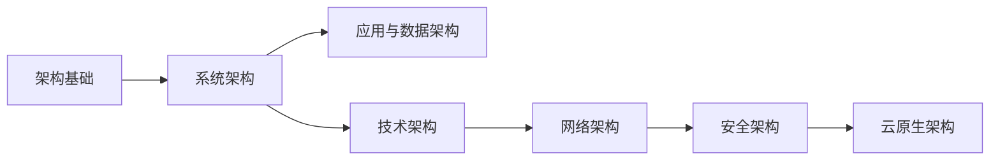

# 第四章 信息系统架构

## 0. 本章导航

- 返回：[[00-导航/备考首页|备考首页]]
- 知识点：[[00-导航/第四章知识点索引|管理索引]]｜[[00-导航/第四章知识点管理.base|管理表]]｜[[00-导航/第四章知识点网络.canvas|关系网]]
- 练习：[[03-错题库/错题库#第四章 信息系统架构|本章错题]]
- 溯源：[[98-原始资料/前四章课本原稿|原始笔记]]
- 学习路径：先建立架构与框架、总体参考框架，再进入系统架构的定义、分类与模型，然后依次展开应用、数据、技术、网络架构，最后到安全架构与云原生架构。

## 1. 章首速览

### 一句话总览

本章围绕信息系统架构展开：先界定架构本质与总体参考框架，再进入系统架构的定义、分类与常用模型，然后依次展开应用、数据、技术、网络四类架构，最后落到安全架构与云原生架构。

### 全章主线

### 必背清单

| 主题 | 必背关键词 |
|---|---|
| 体系架构四层 | 战略系统(第一层)、业务系统＋应用系统(第二层/战术管理)、信息基础设施(第三层/运行管理) |
| 应用系统按功能 | TPS、MIS、DSS、ES、OAS、CAD/CAPP/CAM、MES |
| 架构分类 | 物理架构(集中式/分布式)、逻辑架构 |
| 系统融合方式 | 横向融合、纵向融合、纵横融合 |
| 集成架构演进 | 应用功能主线 → 平台能力主线 → 互联网主线 |
| 局域网架构 | 单核心、双核心、环形、层次 |
| 广域网架构 | 单核心、多核心、环形、半冗余、对等子域、层次子域 |
| WPDRRC | 预警、保护、检测、响应、恢复、反击 |
| OSI 五安全服务 | 鉴别、访问控制、数据机密性、数据完整性、抗抵赖性 |
| 云原生七原则 | 服务化、弹性、可观测、韧性、全自动化、零信任、持续演进 |

### 高频易混预警

| 易混组合 | 快速辨识（通俗理解，不作教材定义） |
|---|---|
| 单核心 vs 双核心 | 单核心有单点故障；双核心多路径、可热切换（但投资高）。 |
| 局域网 vs 广域网架构 | 局域网核心用交换机；广域网核心用路由设备。 |
| 横向 vs 纵向 vs 纵横融合 | 同层职能 vs 跨层业务组合 vs 信息集中共享＋程序模块化。 |
| 鉴别 vs 访问控制 | 鉴别=确认身份；访问控制=决定能否访问资源。 |
| 完整性 vs 机密性 | 完整=不被未授权改变；机密=仅授权者可用。 |
| ACI vs ADI vs ADF vs AEF | 访问控制信息 / 判决信息 / 判决功能 / 实施功能。 |

## 2. 架构基础

本节界定“架构是什么”并给出体系架构总体参考框架。

### 2.1 架构与框架

#### 架构本质与框架

> [!info] 教材原稿关键词
> - 架构的本质是**决策**，是权衡方向、结构、关系以及原则各方面因素后进行的决策。
> - 框架是一个用于规划、开发、实施、管理和维持架构的**概念性结构**。

#### 集成项目涉及的架构

**系统架构、数据架构、技术架构、应用架构、网络架构、安全架构**等。

#### 考试关键词

- 架构本质：**决策**；框架：**概念性结构**。
- 六类架构：**系统、数据、技术、应用、网络、安全**。

#### 主动回忆

> [!question]- 架构的本质是什么？框架是什么？
> 架构的本质是决策，是权衡方向、结构、关系及原则后的决策；框架是用于规划、开发、实施、管理和维持架构的概念性结构。

#### 原教材定位

- [[98-原始资料/前四章课本原稿#4.1 架构基础|原稿“4.1 架构基础”]]：架构本质、框架、六类架构。
- 覆盖核对：[[98-原始资料/第四章整理对照表|第四章整理对照表]]。

### 2.2 体系架构总体参考框架

#### 四层组成部分

| 层级 | 组成部分 | 说明 |
|---|---|---|
| 第一层 | 战略系统 | 由高层决策支持系统（以信息基础设施为基础）和组织战略规划体系两部分组成 |
| 第二层（战术管理层） | 业务系统、应用系统 | 业务系统用 BPR 原理方法对业务过程优化重组，确定相对稳定数据 |
| 第三层（运行管理层） | 信息基础设施 | 组织实现信息化、数字化的基础部分 |

> [!note] 通俗理解
> 战略系统回答“决策层要什么”，业务/应用系统回答“业务怎么跑、系统怎么建”，信息基础设施是底层底座。

#### 应用系统按功能分类

**事务处理系统（TPS）、管理信息系统（MIS）、决策支持系统（DSS）、专家系统（ES）、办公自动化系统（OAS）、计算机辅助设计/计算机辅助工艺设计/计算机辅助制造（CAD/CAPP/CAM）、制造执行系统（MES）**。

#### 信息基础设施三部分

**技术基础设施、信息资源设施、管理基础设施**。

#### 关键原则（考点）

| 主题 | 教材原稿关键词 |
|---|---|
| 技术架构设计原则（不包括） | **技术驱动原则** |
| 数据库系统安全重点 | **完整性**设计 |
| 机密性服务目的 | 确保信息仅仅对**授权者**可用 |
| 审计架构 | 独立的部门或其所能提供的**风险发现能力** |

#### 考试关键词

- 四层：**战略系统 → 业务系统＋应用系统 → 信息基础设施**。
- 应用系统七类：**TPS、MIS、DSS、ES、OAS、CAD/CAPP/CAM、MES**。
- 技术架构设计原则**不包括**技术驱动原则；数据库安全重点**完整性**；机密性**仅对授权者可用**。

#### 易混点

1. **战略系统 vs 业务/应用系统**：战略系统在第一层（决策支持＋战略规划），业务系统与应用系统同在第二层（战术管理层）。
2. **信息基础设施 vs 应用系统**：基础设施在第三层（技术/信息/管理），应用系统在第二层按功能分类。

#### 记忆钩子

- 应用系统记作“**事、管、决、专、办、设计制造、执行**”。

#### 主动回忆

> [!question]- 体系架构总体参考框架的四个组成部分及所在层级是什么？
> 战略系统（第一层）；业务系统和应用系统（第二层，战术管理层）；信息基础设施（第三层，运行管理层）。

> [!question]- 应用系统按功能分为哪几类？
> 事务处理系统（TPS）、管理信息系统（MIS）、决策支持系统（DSS）、专家系统（ES）、办公自动化系统（OAS）、CAD/CAPP/CAM、制造执行系统（MES）。

> [!question]- 技术架构设计原则不包括哪个？数据库系统安全重点关注什么？
> 不包括技术驱动原则；数据库系统安全重点关注完整性设计。

#### 原教材定位

- [[98-原始资料/前四章课本原稿#4.1 架构基础|原稿“4.1 架构基础”]]：四层参考框架、应用系统分类、关键原则。
- 覆盖核对：[[98-原始资料/第四章整理对照表|第四章整理对照表]]。

## 3. 系统架构

本节进入系统架构的定义、分类、常用模型与演进。

### 3.1 架构定义与分类

#### 架构定义要点

> [!info] 教材原稿关键词
> 信息系统架构是一种体系结构，反映信息系统各组成部分之间的关系，以及与相关业务系统、信息系统与相关技术之间的关系。

| 要点 | 教材原稿关键词 |
|---|---|
| 抽象与可见性 | 架构是系统的抽象，强调原始的**外部可见**性 |
| 多结构组成 | 架构由多个结构组成，个别结构一般不能代表大型信息系统架构 |
| 独立存在 | 架构可以独立于架构的描述而存在 |
| 内容 | 元素及其行为的集合构成架构的内容 |
| 基础性 | 架构具有基础性，是一个通用方案（复用性） |
| 隐含决策 | 架构隐含有“决策”，重大决策应经过评审 |

#### 架构分类与系统融合方式

| 主题 | 教材原稿关键词 |
|---|---|
| 架构分类 | 物理架构、逻辑架构 |
| 物理架构 | 集中式架构、分布式架构（分布式和客户端/服务器模式） |
| 系统融合方式 | 横向融合、纵向融合、纵横融合 |
| 横向融合 | 将同一层次的各种职能与需求融合在一起 |
| 纵向融合 | 把某种职能和需求的各个层次的业务组合在一起 |
| 纵横融合 | 信息模型和处理模型两个方面，强调信息集中共享和程序模块化 |

#### 考试关键词

- 架构分类：**物理（集中式/分布式）、逻辑**。
- 融合：**横向（同层）、纵向（跨层）、纵横（信息共享＋模块化）**。

#### 易混点

1. **横向 vs 纵向 vs 纵横融合**：横向同层职能、纵向跨层业务、纵横强调信息集中共享＋程序模块化。
2. **物理架构 vs 逻辑架构**：物理架构落到集中式/分布式等部署形态；逻辑架构是逻辑层面的划分。

#### 主动回忆

> [!question]- 架构的分类和物理架构的两种形态是什么？
> 物理架构和逻辑架构；物理架构分为集中式架构、分布式架构（分布式和客户端/服务器模式）。

> [!question]- 系统融合的三种方式各是什么含义？
> 横向融合把同一层次的各种职能与需求融合；纵向融合把某种职能和需求的各个层次业务组合；纵横融合强调信息集中共享和程序模块化。

#### 原教材定位

- [[98-原始资料/前四章课本原稿#4.2 系统架构|原稿“4.2 系统架构”]]：架构定义、分类、融合方式。
- 覆盖核对：[[98-原始资料/第四章整理对照表|第四章整理对照表]]。

### 3.2 常用架构模型

#### 常用架构模型

**单机应用模式、客户端/服务器模式（C/S）、面向服务架构（SOA）模式、组织级数据交换总线**。

| 模型 | 教材原稿关键词 |
|---|---|
| 单机应用系统 | 最简的软件结构 |
| 客户端/服务器（C/S） | 基于 TCP/IP 协议的进程间通信 IPC 编程的“发送”与“反射”程序结构（“反射”待核对，疑为“响应”） |

#### 四种常见架构

| 架构 | 说明 |
|---|---|
| 两层 C/S | 胖客户端模式：前台界面＋后台数据库服务 |
| 三层 C/S 与 B/S | 浏览器/服务器模式 |
| 多层 C/S | 四层：前台界面、Web 服务器、中间件、数据库服务器（J2EE） |
| 模型-视图-控制器（MVC） | 多层 C/S 结构 |

#### SOA 模式

**面向服务架构、Web service、面向服务架构的本质**。

#### 考试关键词

- 常用模型：**单机、C/S、SOA、组织级数据交换总线**。
- 四种常见：**两层 C/S（胖客户端）、三层 C/S 与 B/S、多层 C/S（J2EE）、MVC**。

#### 易混点

1. **两层 C/S vs 三层/B/S**：两层是“前台＋后台数据库”（胖客户端）；三层/B/S 引入浏览器/服务器。
2. **多层 C/S vs MVC**：多层 C/S 是四层物理/逻辑分层（J2EE）；MVC 是控制逻辑的划分模式。

#### 主动回忆

> [!question]- 常用架构模型有哪些？四种常见架构是什么？
> 单机应用、客户端/服务器（C/S）、面向服务架构（SOA）、组织级数据交换总线；四种常见架构为两层 C/S、三层 C/S 与 B/S、多层 C/S、MVC。

#### 原教材定位

- [[98-原始资料/前四章课本原稿#4.2 系统架构|原稿“4.2 系统架构”]]：常用架构模型、四种常见架构、SOA。
- 覆盖核对：[[98-原始资料/第四章整理对照表|第四章整理对照表]]。

### 3.3 集成架构演进与 TOGAF

#### 集成架构演进

| 阶段 | 主线 | 教材原稿关键词 |
|---|---|---|
| 第一阶段 | 应用功能 | 拿来主义，可直接采购成套且成熟的应用软件 |
| 第二阶段 | 平台能力 | 将竖井式信息系统转化为平层化（数据采集、网络传输、应用中间件、应用开发） |
| 第三阶段 | 互联网 | 最大限度 App 化（微服务） |

#### TOGAF

> [!info] 教材原稿关键词
> TOGAF 是一种开放式企业架构框架标准，为标准、方法论和企业架构专业人员之间的沟通提供一致性保障。

| 要点 | 教材原稿关键词 |
|---|---|
| 最核心内容 | 架构开发方法（ADM），被迭代式应用在架构开发的整个过程、阶段之间和每个阶段内部 |
| 核心思想 | 模块化架构、内容框架、扩展指南、架构风格 |
| 提供内容 | 架构工件的结构化元模型、可重用架构构建块（ABB）、典型架构可交付成果 |

#### 价值驱动体系结构与分层模式

| 主题 | 教材原稿关键词 |
|---|---|
| 价值模型核心特征 | 价值期望值、反作用力、变革催化剂 |
| 相关关键词 | 重要性、程度、后果、隔离 |
| 分层模式 | 每层为上层服务、使用下层功能、最多影响两层、只给相邻层相同接口、允许每层用不同方法实现 |

#### 考试关键词

- 演进：**应用功能 → 平台能力 → 互联网（App 化/微服务）**。
- TOGAF：**ADM 最核心、迭代式应用**；ABB 可重用构建块。
- 价值模型三特征：**价值期望值、反作用力、变革催化剂**。

#### 易混点

1. **平台能力 vs 互联网主线**：平台能力是“竖井→平层化”；互联网是“最大化 App 化（微服务）”。
2. **ADM vs TOGAF**：ADM 是 TOGAF 规范中最核心的架构开发方法。

#### 主动回忆

> [!question]- 集成架构演进三个阶段及各自主线是什么？
> 应用功能为主线（采购成熟软件）→ 平台能力为主线（竖井转平层化）→ 互联网为主线（App 化、微服务）。

> [!question]- TOGAF 最核心的内容是什么？其核心思想有哪些？
> 架构开发方法（ADM）最核心，被迭代式应用；核心思想为模块化架构、内容框架、扩展指南、架构风格。

#### 原教材定位

- [[98-原始资料/前四章课本原稿#4.2 系统架构|原稿“4.2 系统架构”]]：集成架构演进、TOGAF、价值驱动体系结构、分层模式。
- 覆盖核对：[[98-原始资料/第四章整理对照表|第四章整理对照表]]。

## 4. 应用架构与数据架构

本节合并应用架构与数据架构，前者关注应用如何分层分组，后者关注数据全周期与演进。

### 4.1 应用架构

#### 规划与设计基本原则

**业务适配原则、应用聚合化、功能专业化、风险最小化、资产复用化原则**。

> [!note] 通俗理解
> 功能专业化＝按照业务功能聚合性进行应用规划，满足不同业务条线需求。

#### 分层与分组的目的

| 主题 | 教材原稿关键词 |
|---|---|
| 分层目的 | 实现业务与技术的分离、降低各层耦合性、提高各层灵活性、有利于故障隔离、实现架构松耦合 |
| 分层视角 | 体现以客户为中心的系统服务和交互模式 |
| 分组目的 | 体现业务功能的分类和聚合，把紧密关联的应用或功能内聚为一个组；实现高内聚、低耦合、减少重复建设 |

#### 考试关键词

- 五原则：**业务适配、应用聚合化、功能专业化、风险最小化、资产复用化**。
- 分层目的：**业务技术分离、降耦合、故障隔离、松耦合**。
- 分组目的：**高内聚、低耦合、减少重复建设**。

#### 易混点

1. **应用分层 vs 应用分组**：分层为业务与技术分离；分组为功能分类聚合、高内聚低耦合。

#### 主动回忆

> [!question]- 应用架构规划设计的基本原则有哪些？
> 业务适配原则、应用聚合化、功能专业化、风险最小化、资产复用化原则。

> [!question]- 应用架构分层和应用分组的目的分别是什么？
> 分层目的是实现业务与技术分离、降低耦合、提高灵活性、故障隔离、松耦合；分组目的是体现业务功能分类聚合、高内聚低耦合、减少重复建设。

#### 原教材定位

- [[98-原始资料/前四章课本原稿#4.3 应用架构|原稿“4.3 应用架构”]]：五原则、分层与分组目的。
- 覆盖核对：[[98-原始资料/第四章整理对照表|第四章整理对照表]]。

### 4.2 数据架构

#### 数据全周期与基本原则

> [!info] 教材原稿关键词
> 数据架构设计数据全周期之下的架构规划，包括：产生、流转、整合、应用、归档、消亡。
>
> 基本原则：数据分层、数据处理效率、数据一致性、数据架构可扩展性、服务于业务（最终目标）。

#### 数据架构发展演进

| 阶段 | 教材原稿关键词 |
|---|---|
| 单应用架构时代 | 主要是数据模型、数据库设计，满足业务即可 |
| 数据仓库时代 | 面向主题的、集成的、用于数据分析的全新架构，主要应用 OLAP，侧重决策支持 |
| 大数据时代 | 从批处理到流处理、从大集中到分布式、从批流一体到全量实时 |

#### 整合库与主题库

| 库 | 教材原稿关键词 |
|---|---|
| 整合库 | 主要为各主题库提供增量和全量数据源 |
| 主题库 | 直接面向治理应用提供专题数据服务，可根据不同治理需求建立多个专题库 |

#### 考试关键词

- 全周期：**产生、流转、整合、应用、归档、消亡**。
- 五原则：**数据分层、效率、一致性、可扩展性、服务于业务（最终目标）**。
- 演进：**单应用 → 数据仓库（OLAP/决策支持）→ 大数据（流处理/分布式/全量实时）**。

#### 主动回忆

> [!question]- 数据架构的基本原则是什么？最终目标是什么？
> 数据分层、数据处理效率、数据一致性、数据架构可扩展性、服务于业务（最终目标）。

> [!question]- 数据架构发展演进的三个阶段各有什么特点？
> 单应用架构时代以数据模型和数据库设计为主；数据仓库时代面向主题、集成、应用 OLAP、侧重决策支持；大数据时代从批处理到流处理、从大集中到分布式、从批流一体到全量实时。

> [!question]- 整合库和主题库有什么区别？
> 整合库主要为各主题库提供增量和全量数据源；主题库直接面向治理应用提供专题数据服务，可建立多个专题库。

#### 原教材定位

- [[98-原始资料/前四章课本原稿#4.4 数据架构|原稿“4.4 数据架构”]]：全周期、基本原则、演进、整合库/主题库。
- 覆盖核对：[[98-原始资料/第四章整理对照表|第四章整理对照表]]。

## 5. 技术架构与网络架构

本节先看技术架构的基本原则，再重点展开局域网、广域网架构与 5G 业务方式。

### 5.1 技术架构

#### 基本原则

**成熟度控制原则、技术一致性、局部可置换、人才技术覆盖、创新驱动**。

> [!info] 教材原稿关键词
> MPP 数据库的主要目的：支持大规模结构化数据的快速分析查询。

#### 主动回忆

> [!question]- 技术架构的基本原则有哪些？MPP 数据库的主要目的是什么？
> 成熟度控制原则、技术一致性、局部可置换、人才技术覆盖、创新驱动；MPP 数据库主要支持大规模结构化数据的快速分析查询。

#### 原教材定位

- [[98-原始资料/前四章课本原稿#4.5 技术架构|原稿“4.5 技术架构”]]：五原则、MPP 数据库。
- 覆盖核对：[[98-原始资料/第四章整理对照表|第四章整理对照表]]。

### 5.2 局域网架构

#### 局域网特点与组成

> [!info] 教材原稿关键词
> 局域网特点：覆盖地理范围小、数据传输率高、低误码率、可靠性高、支持多种传输介质、支持实时应用；通常由计算机、交换机、路由器等组成。
>
> 网络架构基本原则：高可靠性、高安全性、高性能、可管理性、平台化和架构化。

#### 四种局域网架构

| 架构 | 核心设备 | 优点 | 缺点 |
|---|---|---|---|
| 单核心 | 核心二层或三层交换机，接入二层交换机 | 网络结构简单 | 单点故障 |
| 双核心 | 核心三层及以上交换机 | 核心有保护能力、拓扑可靠、可热切换、多路径 | 设备投资高、端口密度要求较高 |
| 环形 | 多台核心交换机连成双 RPR 动态弹性分组环（三层或以上） | 自愈保护、MAC 层 50ms 自愈、多等级 QoS、带宽公平、拥塞控制 | 大规模多环之间只能业务接口互通 |
| 层次 | 核心层、汇聚层、接入层、用户设备 | 拓扑易扩展、故障可分级排查 | — |

> [!note] 通俗理解
> 层次局域网中：核心层提供高速转发；汇聚层实现用户接入并分担核心层转发压力；接入层实现用户设备接入；通过边界路由设备接入广域网。

#### 考试关键词

- 局域网架构：**单核心、双核心、环形、层次**。
- 单核心缺点：**单点故障**；双核心优点：**热切换、多路径**；环形：**50ms 自愈**。

#### 主动回忆

> [!question]- 局域网有哪四种架构？单核心和双核心的关键区别是什么？
> 单核心、双核心、环形、层次；单核心结构简单但有单点故障，双核心有保护能力、可热切换、多路径，但投资高、端口密度要求高。

> [!question]- 层次局域网中核心层、汇聚层、接入层各负责什么？
> 核心层提供高速数据转发；汇聚层提供充足接口实现与接入层之间的互访控制、减轻核心转发压力；接入层实现用户设备的接入。

#### 原教材定位

- [[98-原始资料/前四章课本原稿#4.6网络架构|原稿“4.6 网络架构”]]：局域网特点、四架构。
- 覆盖核对：[[98-原始资料/第四章整理对照表|第四章整理对照表]]。

### 5.3 广域网架构

#### 广域网组成

> [!info] 教材原稿关键词
> 广域网由**通信子网**和**资源子网**组成；通信子网由公用分组交换网、卫星通信网、无线分组交换网构成；广域网属于多级网络，由骨干网、分布网、接入网组成。

#### 六种广域网架构

| 架构 | 核心设备 | 关键特点 |
|---|---|---|
| 单核心 | 一台核心路由设备（三层及以上） | 结构简单；单点故障易致整网失效 |
| 多核心（双核心） | 两台核心路由设备 | 多路径选择、路由层热切换；投资高、易形成路由环路 |
| 环形 | 三台以上核心路由设备 | 多路径、无缝热切换；投资比双核心高、易环路 |
| 半冗余 | 多台核心路由设备，任意核心至少两条以上链路 | 结构灵活、扩展方便；结构零散、不便管理排障 |
| 对等子域 | 路由设备划分成两个独立子域、半冗余互联 | 路由汇总/明细匹配、路由控制灵活；难度较高、易环路 |
| 层次子域 | 多个较独立子域、半冗余互联、存在层次关系 | 扩展性好；冗余设计实施难度高、易环路 |

> [!note] 通俗理解
> 全冗余广域网是半冗余广域网的特例：任意两个核心路由设备之间均存在连接。

#### 考试关键词

- 广域网组成：**通信子网＋资源子网**；通信子网＝**公用分组交换网、卫星通信网、无线分组交换网**。
- 架构：**单核心、多核心、环形、半冗余、对等子域、层次子域**。

#### 易混点

1. **局域网 vs 广域网架构**：局域网核心用交换机（二层/三层），广域网核心用路由设备（三层及以上）。
2. **多核心 vs 环形广域网**：多核心两台核心路由；环形三台以上核心路由成环、可无缝热切换。

#### 主动回忆

> [!question]- 广域网由哪两部分组成？通信子网由哪些网络构成？
> 通信子网和资源子网；通信子网由公用分组交换网、卫星通信网、无线分组交换网构成。

> [!question]- 广域网有哪六种架构？半冗余和全冗余是什么关系？
> 单核心、多核心、环形、半冗余、对等子域、层次子域；全冗余是半冗余的特例（任意两个核心路由设备之间均存在连接）。

#### 原教材定位

- [[98-原始资料/前四章课本原稿#4.6网络架构|原稿“4.6 网络架构”]]：广域网组成、六架构。
- 覆盖核对：[[98-原始资料/第四章整理对照表|第四章整理对照表]]。

### 5.4 5G 业务方式

#### 5GS 与 DN 互联

| 主题 | 教材原稿关键词 |
|---|---|
| 业务方式 | 5GS（5G System）与 DN（Data Network）互联、5G 网络边缘计算 |
| 接口 | 5GS 为移动用户（UE）提供服务时需要 SDN 网络，5GS 和 DN 之间通过 N6 接口互连 |
| 路由关系 | 5GS 和 SDN 之间是路由关系，UE 访问 DN 的业务流通过双向路由配置实现转发 |
| 上下行 | UE 流向 DN 为上行（UL）业务流；DN 流向 UE 为下行（DL）业务流 |

#### UE 接入 DN 的两种方式

| 模式 | 教材原稿关键词 |
|---|---|
| 透明模式 | UE 直接使用运营商规划的 IP 地址 |
| 非透明模式 | SMF 需通过 DN-AAA 服务器完成 UE 认证 |

#### 5G 边缘计算

| 主题 | 教材原稿关键词 |
|---|---|
| 部署 | 在靠近终端用户 UE 的移动网络边缘部署 5G UPF 网元 |
| SSC 模式 1 | 用户移动过程中会话 IP 接入点始终不变 |
| SSC 模式 2 | 移动过程中网络触发现有会话释放并立即触发新会话建立 |
| SSC 模式 3 | 释放现有会话前先建立新会话（对中断敏感的业务） |
| 分流配置 | SMF（会话管理功能）网元负责动态配置 UPF 的分流规则 |
| 触发链路 | 运营商自有应用 AF 通过 NEF 触发 5G 网络生成分流策略；PCF 将动态生成的本地分流策略配置给 SMF |
| 关键组件 | 5G UPF 网元与边缘计算平台（MEF）是垂直行业提供时间敏感、高带宽业务就近分流服务的关键组件组合 |

#### 考试关键词

- 5GS 与 DN 通过 **N6 接口**互连；UE→DN 上行（UL）、DN→UE 下行（DL）。
- 接入方式：**透明模式（运营商 IP）／非透明模式（SMF 经 DN-AAA 认证）**。
- SSC：**模式 1 接入点不变、模式 2 释放并重建、模式 3 先建后释（中断敏感）**。

#### 易混点

1. **SSC 模式 2 vs 模式 3**：模式 2 先释放后新建；模式 3 先建新会话再释放旧会话（对中断敏感业务）。

#### 主动回忆

> [!question]- 5GS 和 DN 通过什么接口互连？上下行业务流如何定义？
> 通过 N6 接口互连；UE 流向 DN 为上行（UL），DN 流向 UE 为下行（DL）。

> [!question]- UE 接入 DN 的两种方式是什么？
> 透明模式（UE 直接使用运营商规划的 IP 地址）；非透明模式（SMF 需通过 DN-AAA 服务器完成 UE 认证）。

> [!question]- SSC 三种模式分别是什么？
> 模式 1 会话 IP 接入点始终不变；模式 2 网络触发现有会话释放并立即触发新会话建立；模式 3 释放现有会话前先建立新会话（对中断敏感的业务）。

#### 原教材定位

- [[98-原始资料/前四章课本原稿#4.6网络架构|原稿“4.6 网络架构”]]：5G 业务方式、边缘计算。
- 覆盖核对：[[98-原始资料/第四章整理对照表|第四章整理对照表]]。

## 6. 安全架构

本节从安全威胁与三道防线入手，到 WPDRRC 与安全保障体系，再到 OSI 安全架构及各框架，最后是数据库完整性设计。

### 6.1 安全威胁与三道防线

#### 安全保障基础与三要素

> [!info] 教材原稿关键词
> 安全保障以**风险和策略**为基础，应包含技术、管理、人员和工程过程。
>
> 信息安全架构设计三要素：**人、管理、技术手段**。

#### 三道防线与安全技术体系

| 主题 | 教材原稿关键词 |
|---|---|
| 三道防线 | 系统安全架构、安全技术体系架构、审计架构 |
| 安全技术体系架构 | 安全基础设施、安全组件与支持系统、安全工具和技术 |
| 系统安全设计重点 | 系统安全保障体系和信息安全体系架构 |
| 信息安全保障体系框架 | 技术体系、组织机构体系、管理体系 |

#### 常见安全威胁（原稿列表）

**信息泄露、破坏信息的完整性、拒绝服务、非法访问、窃听、业务流分析、假冒、旁路控制、授权侵犯、特洛伊木马、陷阱门、抵赖、重放、计算机病毒、人员渎职、媒体废弃、物理侵入、窃取、业务欺骗**。

#### 考试关键词

- 三道防线：**系统安全架构、安全技术体系架构、审计架构**。
- 三要素：**人、管理、技术手段**。

#### 主动回忆

> [!question]- 安全架构的三道防线是什么？信息安全架构设计的三要素是什么？
> 系统安全架构、安全技术体系架构、审计架构；人、管理、技术手段。

#### 原教材定位

- [[98-原始资料/前四章课本原稿#4.7 安全架构|原稿“4.7 安全架构”]]：安全保障基础、三道防线、安全威胁。
- 覆盖核对：[[98-原始资料/第四章整理对照表|第四章整理对照表]]。

### 6.2 WPDRRC 与安全保障体系

#### WPDRRC 六环节

| 环节 | 简称 |
|---|---|
| 预警 | W |
| 保护 | P |
| 检测 | D |
| 响应 | R |
| 恢复 | R |
| 反击 | C |

> [!info] 教材原稿关键词
> WPDRRC 有较强的时序性、动态性；三大要素为**人员（核心）、策略（桥梁）、技术（保证）**。

#### 信息安全体系架构五方面

| 方面 | 地位 | 内容 |
|---|---|---|
| 物理安全 | 前提 | 环境安全、设备、媒体 |
| 系统安全 | 基础 | 网络结构安全、操作系统安全、应用系统安全 |
| 网络安全 | 关键 | 访问控制、通信保密、入侵监测、网络安全扫描、防病毒 |
| 应用安全 | — | 资源共享、信息存储 |
| 安全管理 | — | 健全安全管理体制、构建安全管理平台、增强人员安全防范意识 |

> [!info] 教材原稿关键词
> 系统保障体系由安全服务、协议层次、系统单元三层组成；配置防火墙是实现网络安全最基本、最经济、最有效的安全措施；反病毒技术包括预防病毒、检测病毒、杀毒。

#### 考试关键词

- WPDRRC：**预警、保护、检测、响应、恢复、反击**；三要素**人员（核心）、策略（桥梁）、技术（保证）**。
- 五方面：**物理安全（前提）、系统安全（基础）、网络安全（关键）、应用安全、安全管理**。

#### 易混点

1. **三道防线 vs 系统保障体系三层**：三道防线是系统安全/安全技术体系/审计架构；系统保障体系三层是安全服务/协议层次/系统单元。
2. **物理安全 vs 系统安全 vs 网络安全**：前提、基础、关键，不要搞反。

#### 主动回忆

> [!question]- WPDRRC 六个环节是什么？三大要素各扮演什么角色？
> 预警、保护、检测、响应、恢复、反击；人员是核心、策略是桥梁、技术是保证。

> [!question]- 信息安全体系架构可以从哪五个方面分析和设计？各自地位如何？
> 物理安全（前提）、系统安全（基础）、网络安全（关键）、应用安全、安全管理。

#### 原教材定位

- [[98-原始资料/前四章课本原稿#4.7 安全架构|原稿“4.7 安全架构”]]：WPDRRC、五方面、防火墙与反病毒。
- 覆盖核对：[[98-原始资料/第四章整理对照表|第四章整理对照表]]。

### 6.3 OSI 安全架构与各框架

#### OSI 安全架构

> [!info] 教材原稿关键词
> 网络安全架构设计包括：OSI 安全架构、认证框架、访问控制框架、机密性框架、完整性框架、抗抵赖性框架。
>
> OSI 标准开放式通信系统互联模型，除第五层（会话层）外每一层都有安全措施。
>
> OSI 五类安全服务：鉴别、访问控制、数据机密性、数据完整性、抗抵赖性。
>
> OSI 三种防御方式：多点技术防御、分层技术防御、支撑性基础设施（公钥基础设施、检测和响应基础设施）。

#### 认证框架与鉴别

| 主题 | 教材原稿关键词 |
|---|---|
| 认证依据 | 已知的、拥有的、不改变的特性、相信可靠的第三方建立的鉴别、环境 |
| 鉴别信息类型 | 交换鉴别信息、申请鉴别信息、验证鉴别信息 |
| 鉴别服务阶段 | 安装、修改鉴别信息、分发、获取、传送、验证、停活、重新激活、取消安装 |

#### 访问控制框架（四概念）

| 概念 | 全称 | 含义 |
|---|---|---|
| ACI | 访问控制信息 | 访问控制目的的任何信息 |
| ADI | 访问控制判决信息 | 做出特定访问控制判决时可供 ADF 使用的部分或全部 ACI |
| ADF | 访问控制判决功能 | 根据访问请求、ADI、请求上下文使用访问控制策略规则做出判决 |
| AEF | 访问控制实施功能 | 实施访问控制的功能 |

#### 机密性、完整性、抗抵赖性框架

| 框架 | 教材原稿关键词 |
|---|---|
| 机密性框架 | 确保信息仅仅是对被授权者可用；数据在传输中可通过禁止访问、加密提供机密性 |
| 完整性框架 | 通过阻止威胁或探测威胁，确保数据不以未经授权方式改变或损毁 |
| 抗抵赖性框架 | 证据的生成、验证、记录，以及在解决纠纷时随即进行证据恢复和再次验证；证据生成、证据传输、存储及恢复、证据验证、解决纠纷 |

> [!note] 完整性服务分类（原稿）
> - 按防范的违规分类：未授权的数据修改、创建、删除、插入、重放。
> - 按提供的保护方法：阻止完整性损坏、监测完整性损坏。
> - 按是否支持恢复机制：具有恢复机制的、不具恢复机制的。

#### 考试关键词

- OSI 五安全服务：**鉴别、访问控制、数据机密性、数据完整性、抗抵赖性**。
- 访问控制四概念：**ACI、ADI、ADF、AEF**。
- 机密性：**仅对授权者可用**；完整性：**不以未授权方式改变或损毁**。

#### 易混点

1. **鉴别 vs 访问控制**：鉴别确认身份；访问控制决定能否访问资源。
2. **ACI vs ADI vs ADF vs AEF**：信息 → 判决信息 → 判决功能 → 实施功能，按“信息—判决—实施”链区分。
3. **机密性 vs 完整性**：机密性看“谁能用”，完整性看“是否被改”。

#### 主动回忆

> [!question]- OSI 五类安全服务是什么？三种防御方式是什么？
> 鉴别、访问控制、数据机密性、数据完整性、抗抵赖性；多点技术防御、分层技术防御、支撑性基础设施（公钥基础设施、检测和响应基础设施）。

> [!question]- 访问控制框架中 ACI、ADI、ADF、AEF 分别指什么？
> ACI 访问控制信息、ADI 访问控制判决信息、ADF 访问控制判决功能、AEF 访问控制实施功能。

> [!question]- 完整性服务按什么方式分类？
> 按防范的违规（未授权修改/创建/删除/插入/重放）、按保护方法（阻止/监测）、按是否支持恢复机制分类。

#### 原教材定位

- [[98-原始资料/前四章课本原稿#4.7 安全架构|原稿“4.7 安全架构”]]：OSI 安全架构、认证框架、访问控制框架、机密性/完整性/抗抵赖性框架。
- 覆盖核对：[[98-原始资料/第四章整理对照表|第四章整理对照表]]。

### 6.4 数据库完整性设计

#### 设计原则

| 原则 | 教材原稿关键词 |
|---|---|
| 静态约束 | 尽量包含在数据库模式中 |
| 最重要的完整性约束 | 实体完整性约束和引用完整性约束 |
| 慎用 | 慎用 DBMS（原稿误记为“慎用 DNMS”） |
| 命名规范 | 需求分析阶段必须制定完整性约束的命名规范 |

> [!info] 教材原稿关键词
> DBMS 数据库完整性设计分为：需求分析阶段、概念结构设计、逻辑结构设计。

#### 原稿错题（考点提示）

> [!warning] 原稿错题
> - OSI 开放系统安全体系的安全服务：鉴别、访问控制、数据机密性、数据完整性和抗抵赖性。
> - 信息安全管理：制定健全安全管理体系、构建安全管理平台、增强人员安全防范意识。
> - 系统安全架构：从源头提升信息系统自身安全性。

#### 主动回忆

> [!question]- 数据库完整性设计最重要的两类约束是什么？
> 实体完整性约束和引用完整性约束。

> [!question]- DBMS 数据库完整性设计分为哪几个阶段？
> 需求分析阶段、概念结构设计、逻辑结构设计。

#### 原教材定位

- [[98-原始资料/前四章课本原稿#4.7 安全架构|原稿“4.7 安全架构”]]：数据库完整性设计原则与阶段、错题。
- 覆盖核对：[[98-原始资料/第四章整理对照表|第四章整理对照表]]。

## 7. 云原生架构

本节看云原生代码构成、基本原则与常用架构模式。

### 7.1 云原生代码与基本原则

#### 云原生代码三部分

| 部分 | 地位 | 教材原稿关键词 |
|---|---|---|
| 业务代码 | 核心 | 实现业务逻辑的代码 |
| 三方软件 | 附属物 | 业务库和基础库 |
| 处理非功能特性的代码 | 附属物 | 高可用、安全、可观测性 |

> [!info] 教材原稿关键词
> 传统云计算三层概念：基础设施即服务（IaaS）、PaaS、SaaS。

#### 云原生架构基本原则

**服务化原则、弹性原则、可观测原则、韧性原则、所有过程自动化原则、零信任原则、架构持续演进原则**。

#### 主动回忆

> [!question]- 云原生代码由哪三部分组成？各部分地位如何？
> 业务代码（核心）、三方软件（附属物）、处理非功能特性的代码（附属物，负责高可用、安全、可观测性）。

> [!question]- 云原生架构的基本原则有哪些？
> 服务化原则、弹性原则、可观测原则、韧性原则、所有过程自动化原则、零信任原则、架构持续演进原则。

#### 原教材定位

- [[98-原始资料/前四章课本原稿#4.8 云原生架构|原稿“4.8 云原生架构”]]：代码三部分、七原则。
- 覆盖核对：[[98-原始资料/第四章整理对照表|第四章整理对照表]]。

### 7.2 常用架构模式

#### 常用架构模式

**服务化架构模式、Mesh 化架构模式、Serverless 架构服务、存储计算分离模式、分布式事务模式、可观测架构、事件驱动架构**。

| 模式 | 教材原稿关键词 |
|---|---|
| 服务化架构模式 | 云原生应用的标准架构模式，典型模式为微服务、小服务模式 |
| 可观测架构 | Logging、Tracing（追踪）、Metrics（度量） |
| 事件驱动架构（EDA） | 应用/组件间的集成架构模式 |
| Mesh 化架构 | 把中间件框架（RPC、缓存）从业务进程中分离，让中间件 SDK 与业务代码进一步解耦 |
| 分布式事务模式 | SEATA 的 AT 模式性能高且无代码开发工作 |

#### 分布式事务模式对比

| 模式 | 教材原稿关键词 |
|---|---|
| XA（2PC） | 性能差，不适合高并发场景 |
| TCC | 入侵性强 |
| SAGA | 通过正向事务＋补偿事务实现最终一致性 |
| AT 模式 | 有场景限制 |

#### 考试关键词

- 七模式：**服务化、Mesh、Serverless、存储计算分离、分布式事务、可观测、事件驱动**。
- 可观测三件套：**Logging、Tracing、Metrics**。
- 分布式事务：**XA 2PC 性能差、TCC 入侵性强、SAGA 最终一致、AT 有场景限制**。

#### 易混点

1. **事件驱动架构（EDA）vs 服务化架构**：EDA 是应用/组件间的集成架构模式；服务化是云原生应用的标准架构模式。
2. **分布式事务各模式**：XA 性能差、TCC 入侵强、SAGA 靠补偿事务、AT 有场景限制。

#### 主动回忆

> [!question]- 云原生常用的架构模式有哪些？可观测架构包含哪三方面？
> 服务化、Mesh 化、Serverless、存储计算分离、分布式事务、可观测架构、事件驱动架构；Logging、Tracing、Metrics。

> [!question]- 分布式事务的 XA、TCC、SAGA、AT 模式各有什么特点？
> XA（2PC）性能差、不适合高并发；TCC 入侵性强；SAGA 通过正向事务＋补偿事务实现最终一致性；AT 模式有场景限制。

#### 原教材定位

- [[98-原始资料/前四章课本原稿#4.8 云原生架构|原稿“4.8 云原生架构”]]：常用架构模式、分布式事务对比。
- 覆盖核对：[[98-原始资料/第四章整理对照表|第四章整理对照表]]。

## 8. 章末综合复习

### 8.1 高频易混点对比

> [!note] 使用说明
> 本表按“容易混淆”组织，不表示经过统计的考频排序，也不提供未经官方依据的星级押题。

| 易混组合 | 区分抓手 |
|---|---|
| 单核心 vs 双核心（局域网/广域网） | 单核心有单点故障；双核心多路径、可热切换、投资高。 |
| 局域网 vs 广域网架构 | 局域网核心用交换机；广域网核心用路由设备。 |
| 横向 vs 纵向 vs 纵横融合 | 同层职能 / 跨层业务 / 信息集中共享＋程序模块化。 |
| 鉴别 vs 访问控制 | 确认身份 / 决定能否访问资源。 |
| 机密性 vs 完整性 | 仅授权者可用 / 不被未授权改变。 |
| ACI vs ADI vs ADF vs AEF | 访问控制信息 / 判决信息 / 判决功能 / 实施功能。 |
| 物理安全 vs 系统安全 vs 网络安全 | 前提 / 基础 / 关键。 |
| SSC 模式 2 vs 模式 3 | 先释放后新建 / 先建新会话再释放旧会话。 |
| 服务化架构 vs 事件驱动架构 | 云原生标准架构 / 组件间集成架构。 |

### 8.2 关键顺序与等级

1. **体系架构参考框架**：战略系统（第一层）→ 业务系统＋应用系统（第二层）→ 信息基础设施（第三层）。
2. **集成架构演进**：应用功能主线 → 平台能力主线 → 互联网主线。
3. **数据架构演进**：单应用架构 → 数据仓库 → 大数据。
4. **局域网架构**：单核心、双核心、环形、层次。
5. **广域网架构**：单核心、多核心、环形、半冗余、对等子域、层次子域。
6. **WPDRRC**：预警 → 保护 → 检测 → 响应 → 恢复 → 反击。

### 8.3 分层必背清单

#### 必须准确背诵

- 体系架构四层及层级归属；应用系统七类。
- 架构分类（物理/逻辑）与物理架构两形态；系统融合三方式。
- 集成架构演进三阶段；TOGAF 的 ADM 为核心、ABB 可重用构建块。
- 应用架构五原则；数据架构五原则与演进三阶段。
- 技术架构五原则；局域网四架构、广域网六架构。
- 5G 的 N6 接口、透明/非透明模式、SSC 三模式。
- 三道防线、WPDRRC 六环节与三要素、信息安全体系架构五方面。
- OSI 五安全服务、访问控制四概念；数据库完整性最重要两类约束。
- 云原生代码三部分、七原则、七模式、可观测三件套。

#### 理解后辨识

- 横向/纵向/纵横融合的情境判断。
- 单核心/双核心/环形/层次的优缺点情境。
- 机密性/完整性/鉴别的题干线索。
- ACI/ADI/ADF/AEF 的职责链。
- SSC 三模式与分布式事务各模式的差异。

### 8.4 闭卷自测

#### 列举题

> [!question]- 1. 体系架构总体参考框架的四个组成部分及层级是什么？
> 战略系统（第一层）、业务系统和应用系统（第二层/战术管理层）、信息基础设施（第三层/运行管理层）。

> [!question]- 2. 应用系统按功能分为哪几类？
> TPS、MIS、DSS、ES、OAS、CAD/CAPP/CAM、MES。

> [!question]- 3. 架构的分类和物理架构的两种形态是什么？
> 物理架构和逻辑架构；物理架构分为集中式架构、分布式架构。

> [!question]- 4. 系统融合的三种方式是什么？
> 横向融合、纵向融合、纵横融合。

> [!question]- 5. 集成架构演进三个阶段是什么？
> 应用功能为主线 → 平台能力为主线 → 互联网为主线。

> [!question]- 6. 局域网和广域网各有哪几种架构？
> 局域网：单核心、双核心、环形、层次；广域网：单核心、多核心、环形、半冗余、对等子域、层次子域。

> [!question]- 7. WPDRRC 六个环节和三大要素是什么？
> 预警、保护、检测、响应、恢复、反击；人员（核心）、策略（桥梁）、技术（保证）。

> [!question]- 8. OSI 五类安全服务是什么？
> 鉴别、访问控制、数据机密性、数据完整性、抗抵赖性。

> [!question]- 9. 云原生架构七原则是什么？
> 服务化、弹性、可观测、韧性、所有过程自动化、零信任、架构持续演进。

> [!question]- 10. 云原生常用架构模式和可观测三件套是什么？
> 服务化、Mesh 化、Serverless、存储计算分离、分布式事务、可观测架构、事件驱动架构；Logging、Tracing、Metrics。

#### 对比题

> [!question]- 11. 机密性和完整性有什么区别？
> 机密性确保信息仅对被授权者可用；完整性确保数据不以未经授权方式改变或损毁。

> [!question]- 12. 鉴别和访问控制有什么区别？
> 鉴别是确认身份；访问控制是决定开放系统环境中允许哪些资源。

> [!question]- 13. 单核心和双核心架构的关键区别是什么？
> 单核心结构简单但有单点故障；双核心有多路径、可热切换、可靠性更高，但投资高、端口密度要求较高。

> [!question]- 14. SSC 模式 2 和模式 3 有什么区别？
> 模式 2 是网络触发现有会话释放并立即触发新会话建立；模式 3 是释放现有会话前先建立新会话（对中断敏感的业务）。

#### 顺序题

> [!question]- 15. 写出集成架构演进的完整顺序。
> 应用功能为主线 → 平台能力为主线 → 互联网为主线。

> [!question]- 16. 写出数据架构发展演进的三个阶段。
> 单应用架构时代 → 数据仓库时代 → 大数据时代。

> [!question]- 17. 写出 WPDRRC 的完整顺序。
> 预警 → 保护 → 检测 → 响应 → 恢复 → 反击。

#### 情境判断题

> [!question]- 18. 某局域网核心交换设备出现故障会导致整网失效，这属于哪种架构？
> 单核心局域网架构（缺点：单点故障）。

> [!question]- 19. 题干描述“把同一层次的各种职能与需求融合在一起”，属于哪种融合方式？
> 横向融合。

> [!question]- 20. 某分布式事务方案“性能差、不适合高并发”，对应哪种模式？
> XA（2PC）模式。

#### 题号—正文模块覆盖

| 题号 | 正文模块 | 覆盖重点 |
|---|---|---|
| 1、2 | 2.2 体系架构总体参考框架 | 四层、应用系统分类 |
| 3、4 | 3.1 架构定义与分类 | 分类、融合方式 |
| 5、15 | 3.3 集成架构演进与 TOGAF | 演进三阶段 |
| — | 4.1 应用架构 | 五原则 |
| 16 | 4.2 数据架构 | 演进三阶段 |
| — | 5.1 技术架构 | 五原则、MPP |
| 6、13、18 | 5.2/5.3 局域网/广域网架构 | 架构类型与情境 |
| 14 | 5.4 5G 业务方式 | SSC 模式 |
| 7、17 | 6.2 WPDRRC 与安全保障体系 | 六环节、三要素 |
| 8、11、12 | 6.3 OSI 安全架构与各框架 | 五安全服务、机密性/完整性/鉴别 |
| 9、10 | 7.1/7.2 云原生架构 | 七原则、七模式、可观测 |
| 20 | 7.2 常用架构模式 | 分布式事务模式对比 |

### 8.5 本章错题入口

- [[03-错题库/错题库#第四章 信息系统架构|进入错题库：第四章 信息系统架构]]

### 勘误与依据

- **完整性框架**：原稿第 1213 行“完成性框架”为“完整性框架”的误写。
- **慎用 DBMS**：原稿第 1237 行“慎用 DNMS”为“慎用 DBMS”的误写（数据库管理系统）。
- **各 VLAN 之间**：原稿第 971 行“个VLAN之间”为“各VLAN之间”的漏字。
- **两根反向光纤**：原稿第 995 行“两根反向光线”为“两根反向光纤”的误写。
- **正向事务**：原稿第 1275 行“正向事物＋补偿事务”中的“事物”为“事务”的误写。
- **C/S 模式“发送”与“反射”**：原稿第 833 行“反射”疑为“响应”的误记，本章保留原稿用词并标注待核对。
- **技术架构设计原则“不包括技术驱动原则”、数据库安全重点“完整性”、机密性“仅对授权者可用”**：均为原稿明确的考点提示，已在正文保留。

### 本章收束

- 能准确说出总体参考框架、架构分类与演进、应用/数据/技术/网络/安全/云原生各架构的核心清单后，再做情境辨识。
- 遇到“待核对”标记时，只按原稿定位回忆，不把它当作已经权威确认的结论。
- 返回：[[00-导航/备考首页|备考首页]]｜练习：[[03-错题库/错题库#第四章 信息系统架构|本章错题]]｜溯源：[[98-原始资料/前四章课本原稿|原始笔记]]。
