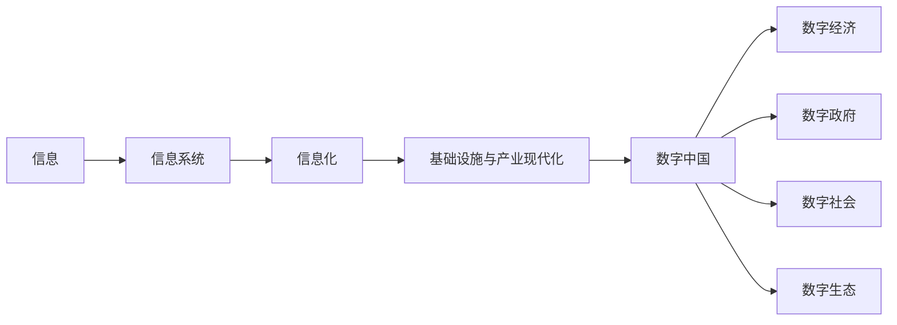
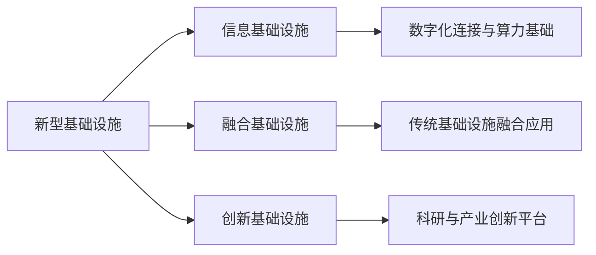
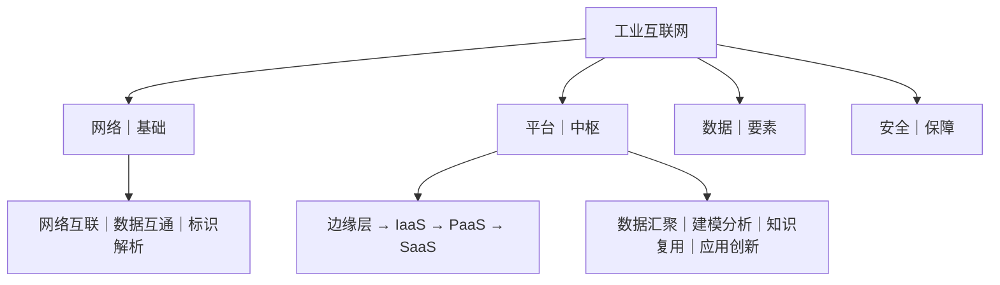
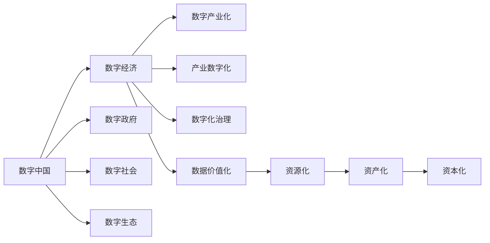

# 第一章 信息化发展

## 0. 本章导航

- 返回：[[20-领域/学习/软考/00-导航/备考首页|备考首页]]
- 练习：[[20-领域/学习/软考/03-错题库/错题库#第一章 信息化发展|本章错题]]
- 溯源：[[20-领域/学习/软考/98-原始资料/前四章课本原稿|原始笔记]]
- 知识点入口：[[20-领域/学习/软考/00-导航/第一章知识点索引|卡片索引与掌握程度管理]]｜[[20-领域/学习/软考/00-导航/第一章知识点网络.canvas|打开知识点关系网]]（21 张组合卡片，保留正文）。
- 学习路径：先掌握“信息 → 信息系统 → 信息化”的基础链，再进入基础设施与产业现代化，最后理解数字中国各组成部分。

## 1. 章首速览

### 一句话总览

本章从信息与系统基础出发，经由信息化的要素与支撑，过渡到基础设施、产业现代化，最终落到数字中国及其数字经济、数字政府、数字社会、数字生态四个组成部分。

### 全章主线



### 必背清单

| 主题 | 必背关键词 |
|---|---|
| 信息质量属性 | 精确性、完整性、可靠性、及时性、经济性、可验证性、安全性 |
| 信息系统生命周期 | 系统规划 → 系统分析 → 系统设计 → 系统实施 → 系统运行和维护 |
| 国家信息化体系六要素 | 信息技术应用、信息资源、信息网络、信息技术和产业、信息化人才、信息化政策法规和标准 |
| 新型基础设施三类 | 信息基础设施、融合基础设施、创新基础设施 |
| 工业互联网四要素 | 网络、平台、数据、安全 |
| 智能制造五级 | 规划级、规范级、集成级、优化级、引领级 |
| 数字中国四部分 | 数字经济、数字政府、数字社会、数字生态 |

### 高频易混预警

| 易混组合 | 快速辨识（通俗理解，不作教材定义） |
|---|---|
| 信息特征 vs 信息质量属性 | “信息是什么样、如何存在和运动”偏特征；“这条信息好不好、能不能用”偏质量属性。 |
| 系统分析 vs 系统设计 | 系统分析回答“做什么”，形成逻辑模型；系统设计回答“怎么做”，形成物理模型。 |
| 数字产业化 vs 产业数字化 | 前者关注数字技术及其产品、服务形成产业；后者关注传统产业应用数字技术转型。此辨识仅用于区分词义，具体教材表述在后续小节核对。 |
| 智能制造五级 vs 智慧城市五级 | 智能制造五级名称已有国家标准依据；智慧城市五级的原稿候选名称及逐级含义仍待教材正文复核，不能相互套用。 |

## 2. 信息、信息系统与信息化

这一节建立全章的基础链：信息是对象，信息系统组织信息的输入与加工，信息化则把信息技术及其应用扩展到社会各领域的长期发展过程。

### 2.1 信息基础

#### 一句话理解

> [!note] 通俗理解
> 信息帮助人们减少“不知道”；理解信息时，既要看它自身如何存在和传播，也要判断它的质量是否满足使用需要。

#### 核心定义

> [!info] 教材原稿关键词
> - 信息“不是物质，也不是能量”。
> - 原稿引用香农的表述：“信息是用来消除随机不定性的东西。”

“减少不确定性”是理解信息定义的抓手；“不是物质，也不是能量”用于提醒不要把信息与承载它的物质、传递它的能量混为一谈。

#### 信息特征

| 原稿关键词 | 原稿要点 | 辨识提示（通俗理解） |
|---|---|---|
| 客观性 | 不以人的意志为转移 | 事实不会因为个人好恶而改变。 |
| 普遍性 | 无处不在 | 只要事物存在和变化，就会呈现相应信息。 |
| 无限性 | 无止境 | 信息可不断产生、积累和发现。 |
| 动态性 | 随时间变化 | 同一对象在不同时点的信息可能不同。 |
| 相对性 | 不同认识主体从同一事物获取的信息及信息量可能不同 | 强调“对谁而言”会影响认识结果。 |
| 依附性 | 必须依附媒体介质 | 信息需要载体，不能脱离介质独立传递。 |
| 变换性 | 信息通过处理可以实现变换或转换 | 强调表示形式或处理结果可以变化。 |
| 传递性 | 可以实现时间和空间上的传递 | 强调信息能跨时空到达接收方。 |
| 层次性 | 分等级 | 信息可按层级组织和认识。 |
| 系统性 | 不同信息可以形成不同整体 | 信息可以相互联系并组成集合。 |
| 转换性 | 信息的产生不能没有物质，信息的传递不能没有能量 | 原稿将其用于说明信息与物质、能量之间的联系；与“变换性”的边界仍应以教材正文为准。 |

#### 信息质量属性

| 质量属性 | 教材原稿关键词 | 辨识提示（通俗理解） |
|---|---|---|
| 精确性 | 对事物状态描述的精准程度 | 看描述“准不准”。 |
| 完整性 | 对事物状态描述的全面程度；包含所有重要信息 | 看关键内容“全不全”。 |
| 可靠性 | 来源、采集方法、传输过程可靠 | 看信息“信不信得过”。 |
| 及时性 | 信息获取与事件发生的间隔长短 | 看信息“来得是否及时”。 |
| 经济性 | 获取、传输信息的成本可以接受 | 看取得和传递信息“是否划算”。 |
| 可验证性 | 可以被证实或证伪 | 看结论“能否核验”。 |
| 安全性 | 被非授权访问的可能性越低，安全性越高 | 看信息“是否免受未授权访问”。 |

> [!tip] 快速判断
> 若题干描述信息本身的存在、变化、载体或传播规律，优先考虑“信息特征”；若题干在评价信息是否准确、完整、及时或可用，优先考虑“信息质量属性”。

#### 信息传输模型


- **有效性**：在给定资源下传输信息的效率，常体现为传输速度。
- **可靠性**：信息传输的准确、可信程度。

> [!warning] 原稿勘误
> 原稿将有效性记作“发送的内容”、可靠性记作“接受的内容”，会改变概念含义。应按“传输效率”和“传输质量/准确可信程度”理解。

#### 考试关键词

- 定义抓手：**消除随机不定性**。
- 特征抓手：**客观、普遍、无限、动态、相对、依附、变换、传递、层次、系统、转换**。
- 质量属性抓手：**精确、完整、可靠、及时、经济、可验证、安全**。
- 传输链：**信源 → 编码 → 信道 → 译码 → 信宿**。
- 传输指标：**有效性看效率，可靠性看准确可信程度**。

#### 易混点

1. **依附性不等于传递性**：前者强调信息必须有载体，后者强调信息能够跨时间和空间传播。
2. **可靠性不等于安全性**：前者关注来源、采集和传输是否可信，后者关注未授权访问的可能性。
3. **及时性不等于精确性**：信息来得快，不代表描述一定准。
4. **变换性与转换性**：原稿同时列出两项；“变换性”明确指信息经处理可变换，而“转换性”的原稿解释强调信息与物质、能量的联系。二者精确边界仍待教材正文核对。

#### 记忆钩子

- 质量属性可按“**准、全、信、快、省、可验、要安全**”记忆。
- 传输模型可按“**源编道译宿**”记忆：从信源出发，编码后走信道，译码后到信宿。

#### 主动回忆

> [!question]- 信息的核心定义抓手是什么？
> 原稿引用香农的表述：信息是用来消除随机不定性的东西；同时强调信息不是物质，也不是能量。

> [!question]- 如何区分信息特征和信息质量属性？各举两个关键词。
> 信息特征描述信息如何存在、变化和传播，例如依附性、传递性；信息质量属性评价信息好不好、能不能用，例如精确性、完整性。

> [!question]- 信息传输模型的顺序是什么？有效性和可靠性分别看什么？
> 信源 → 编码 → 信道 → 译码 → 信宿。有效性看传输效率，可靠性看传输的准确、可信程度。

#### 原教材定位

- [[20-领域/学习/软考/98-原始资料/前四章课本原稿#信息基础|原稿“信息基础”]]：信息定义、特征、质量属性与传输模型。
- 覆盖核对：[[20-领域/学习/软考/98-原始资料/第一章整理对照表|第一章整理对照表]]。

### 2.2 信息系统基础

#### 一句话理解

> [!note] 通俗理解
> 系统强调一组相互作用的要素如何形成整体；信息系统则进一步强调数据或信息经过输入、加工处理后产生信息。

#### 系统与信息系统

| 概念 | 教材原稿关键词 | 辨识提示（通俗理解） |
|---|---|---|
| 系统 | 由相互联系、相互依赖、相互作用的事物或过程组成，具有整体功能和综合行为的统一体 | 关注“要素之间有关系，并形成整体功能”。原稿第 61 行虽写成“信息系统”，但其内容实际是系统定义。 |
| 信息系统 | 输入数据/信息，通过加工处理产生信息的系统 | 关注“输入—处理—输出信息”的信息处理过程。 |

#### 系统特征

| 分组 | 系统特征 | 教材原稿关键词与辨识提示 |
|---|---|---|
| 目标与整体 | 目的性 | 有明确的目标或目的；看到“为何存在、要达到什么”时优先识别。 |
| 目标与整体 | 整体性 | 系统是一个整体；整体功能不能简单等同于孤立要素。 |
| 目标与整体 | 层次性 | 由多个元素组成，系统和元素是相对的；一个系统也可能是更大系统的要素。 |
| 结构与关系 | 相似性 | 同构、同态；强调不同系统之间可能具有相似结构或对应关系。 |
| 结构与关系 | 相关性 | 元素可分又相互联系；强调要素不是彼此孤立。 |
| 结构与关系 | 开放性 | 可访问性；强调系统与外部并非完全隔绝。 |
| 变化与适应 | 稳定性 | 受到外部作用时，内部“结果和秩序”仍能保持稳定（“结果”为原稿用词，是否应为“结构”待教材正文核对）。 |
| 变化与适应 | 突变性 | 失稳后从一种状态进入另一种状态。 |
| 变化与适应 | 自组织性 | 在内外因素作用下自发组织起来。 |
| 变化与适应 | 环境适应性 | 与环境相互作用；强调系统会响应环境变化。 |
| 风险与韧性 | 脆弱性 | 可能丧失结构、功能或秩序。 |
| 风险与韧性 | 健壮性 | 能抵御非预期状态，也称鲁棒性。 |

#### 信息系统生命周期

> [!warning] 核对边界
> 五个阶段名称可以暂按“系统规划、系统分析、系统设计、系统实施、系统运行和维护”学习；原稿没有完整写出各阶段的主要工作和成果，且现有权威目录不足以证明“某成果必然由某阶段形成”。表中成果只保留原稿候选说法，并明确标注待教材正文复核。

| 阶段 | 核心问题 | 主要工作 | 主要成果 |
|---|---|---|---|
| 系统规划 | 是否立项、是否可行 | 原稿明确提到立项与可行性研究 | 原稿候选：可行性研究报告、系统设计任务书；**待教材正文核对** |
| 系统分析 | 做什么 | 建立逻辑模型；原稿未进一步展开工作内容 | 原稿候选：系统说明书；**待教材正文核对** |
| 系统设计 | 怎么做 | 建立物理模型；原稿未进一步展开主要工作 | 原稿候选：系统设计说明书；**待教材正文核对** |
| 系统实施 | 原稿未写明 | 原稿未写明；**待教材正文核对** | 原稿未写明；**待教材正文核对** |
| 系统运行和维护 | 原稿未写明 | 原稿未写明；**待教材正文核对** | 原稿未写明；**待教材正文核对** |

#### 生命周期原图参考

![[99-附件/第一章/信息系统生命周期对照图.png]]

#### 系统分析与系统设计对比

| 对比维度 | 系统分析 | 系统设计 |
|---|---|---|
| 回答的问题 | **做什么** | **怎么做** |
| 模型类型 | **逻辑模型** | **物理模型** |
| 原稿候选成果 | 系统说明书（待教材正文核对） | 系统设计说明书（待教材正文核对） |

#### 考试关键词

- 系统定义：**相互联系、相互依赖、相互作用、整体功能、统一体**。
- 信息系统：**输入数据/信息 → 加工处理 → 产生信息**。
- 生命周期：**规划 → 分析 → 设计 → 实施 → 运行和维护**。
- 分析与设计：**分析做什么/逻辑模型；设计怎么做/物理模型**。

#### 易混点

1. **系统定义不能直接当作信息系统的完整定义**：原稿第 61 行标签有误，应结合第 87 行的信息处理过程区分。
2. **稳定性不等于健壮性**：稳定性强调受外部作用时内部“结果和秩序”仍能保持稳定（“结构/结果”用词待第三版教材正文核对）；健壮性强调抵御非预期状态。
3. **系统分析不等于系统设计**：分析先明确逻辑上的“做什么”，设计再确定物理上的“怎么做”。
4. **阶段名称已可暂用，不代表阶段成果已经核实**：成果对应关系仍待第三版教材正文或等效一手正文支持。

#### 记忆钩子

- 生命周期记作“**规分设实运**”。
- 分析与设计记作“**先问做什么，再问怎么做；先逻辑，后物理**”。

#### 主动回忆

> [!question]- 信息系统生命周期的五个阶段按什么顺序排列？
> 系统规划 → 系统分析 → 系统设计 → 系统实施 → 系统运行和维护。

> [!question]- 系统分析和系统设计分别回答什么问题、建立什么模型？
> 系统分析回答“做什么”，建立逻辑模型；系统设计回答“怎么做”，建立物理模型。

> [!question]- 为什么当前不能把生命周期表中的阶段成果当作已核实结论？
> 原稿只给出不完整的成果对应，现有权威目录只能支持阶段名称及相关章节存在，不能直接证明某成果必然由某阶段形成，仍需第三版教材正文或等效一手正文核对。

#### 原教材定位

- [[20-领域/学习/软考/98-原始资料/前四章课本原稿#信息系统基础|原稿“信息系统基础”]]：系统特征、信息系统定义和生命周期。
- 覆盖核对：[[20-领域/学习/软考/98-原始资料/第一章整理对照表|第一章整理对照表]]。

### 2.3 信息化基础

#### 一句话理解

> [!note] 通俗理解
> 信息化不是一次性建设某个系统，而是以现代信息技术工具推动社会各领域长期发展、提升整体能力的过程。

#### 核心定义

> [!info] 教材原稿关键词
> 信息化是“培养、发展以计算机为主的智能化工具为代表的新生产力，并使之造福社会的历史过程”。

上面的引文是教材原稿说法；“长期、覆盖各领域、依靠现代信息技术工具”是理解其过程性的抓手。

#### 信息化的核心与内涵

| 维度 | 教材原稿表述 | 整理提示 |
|---|---|---|
| 主体 | 原稿留空 | **待教材正文核对，不自行补写。** |
| 时域 | 长期过程 | 强调信息化不是一次性任务。 |
| 空域 | 一切领域 | 强调覆盖范围广。 |
| 手段 | 基于现代信息技术的先进社会生产工具 | 关注所使用的现代生产工具。 |
| 途径 | 原稿留空 | **待教材正文核对，不自行补写。** |
| 目标 | 综合实力 | 原稿表述高度压缩，暂保留关键词，具体完整表述待教材正文核对。 |

原稿另记“信息化的核心：通过全体社会成员的共同努力”。该句缺少完整上下文，现作为原稿关键词保留，不扩写为确定定义。

国家信息化体系六要素属于信息化的支撑体系，详见 [[#3.1 信息化体系六要素]]。

#### 时效性内容

> [!caution] 时效性内容｜待教材正文复核
> 原稿把信息化发展趋势高度压缩为：“第一步 2020 国际先进水平；第二步 国际领先的移动通信网络；第三步 全面支撑”，但没有保留各步的完整主语、目标和时间边界，不能据此扩写为确定考试结论。
>
> 原稿列出的信息化发展重点为：**数据治理、密码区块链技术、信息互联互通、智能网联、网络安全**。这些内容可能随教材版本和政策时间变化，本笔记仅作原稿定位，复习时应回到第三版教材正文核对。

#### 考试关键词

- 信息化定义：**智能化工具、新生产力、造福社会、历史过程**。
- 内涵维度：**主体、时域、空域、手段、途径、目标**。
- 六要素角色：**应用是龙头、资源是核心任务、网络是基础设施、技术和产业是物质基础、人才是成功之本、政策法规和标准是根本保障**。
- 核对边界：主体和途径原稿为空；趋势时间目标残缺，均不能自行补全。

#### 易混点

1. **信息化不等于信息系统**：信息系统强调信息的输入、加工和输出；信息化强调社会各领域长期发展的历史过程。
2. **信息网络不等于信息技术和产业**：前者在六要素中是基础设施，后者是物质基础。
3. **信息技术应用不等于信息资源**：前者是龙头，后者是核心任务。
4. **“国家”不等于“国际”**：六要素的规范名称采用“国家信息化体系六要素”。

#### 主动回忆

> [!question]- 信息化的主体、时域、空域、手段、途径、目标中，原稿明确写出了哪些内容？
> 原稿明确写出：时域是长期过程，空域是一切领域，手段是基于现代信息技术的先进社会生产工具，目标简记为综合实力；主体和途径留空，不能自行补写。

> [!question]- 为什么信息化发展趋势和重点要单列为“时效性内容”？
> 原稿中的时间目标高度压缩且缺少完整上下文，发展重点也可能随教材版本和政策时间变化，因此只能作原稿定位，需回教材正文复核，不能与稳定定义混写。

#### 原教材定位

- [[20-领域/学习/软考/98-原始资料/前四章课本原稿#信息化基础|原稿“信息化基础”]]：定义、核心与内涵、六要素、趋势和发展重点。
- 覆盖核对：[[20-领域/学习/软考/98-原始资料/第一章整理对照表|第一章整理对照表]]。

## 3. 信息化的支撑体系

本节从“基础设施提供底座”出发，梳理新型基础设施、工业互联网，以及物联网和智慧城市之间的概念边界。

### 3.1 信息化体系六要素

| 角色 | 要素 | 辨识提示（通俗理解） |
|---|---|---|
| 龙头 | 信息技术应用 | 应用牵引信息化发展。 |
| 核心任务 | 信息资源 | 关注信息资源的开发与利用。 |
| 基础设施 | 信息网络 | 为信息流动和应用提供网络基础。 |
| 物质基础 | 信息技术和产业 | 提供技术与产业支撑。 |
| 成功之本 | 信息化人才 | 人才决定建设与应用能力。 |
| 根本保障 | 信息化政策法规和标准 | 以政策、法规和标准提供制度保障。 |

> [!warning] 名称勘误
> 原稿标题写作“国际信息化体系六要素”，覆盖核对所列权威资料支持的名称是“**国家信息化体系六要素**”。复习与答题时使用“国家”，不要沿用原稿误写。

#### 记忆钩子

- 六要素按角色记：“**应用领头、资源主攻、网络铺路、技产筑基、人才成事、规标保障**”。

#### 主动回忆

> [!question]- 国家信息化体系六要素及其角色如何对应？
> 信息技术应用—龙头；信息资源—核心任务；信息网络—基础设施；信息技术和产业—物质基础；信息化人才—成功之本；信息化政策法规和标准—根本保障。

### 3.2 现代化基础设施

#### 支撑关系概览



> [!note] 通俗理解
> 三类基础设施可用“技术底座—融合应用—创新平台”辨识。这个短语是记忆钩子，不替代教材原稿中的具体类别和例子。

#### 新型基础设施三类对比

| 类别 | 教材原稿关键词 | 辨识线索（通俗理解） | 原稿例子 |
|---|---|---|---|
| 信息基础设施 | 技术新 | 直接提供通信、新技术或算力等数字技术底座 | 通信、新技术、算力基础设施 |
| 融合基础设施 | 应用新 | 传统基础设施与新技术融合后形成的新应用形态 | 智能交通、智慧能源基础设施 |
| 创新基础设施 | 平台新；公益属性 | 面向科研、教育或产业技术创新提供平台支撑 | 重大科技、科教、产业技术创新基础设施 |

> [!tip] 记忆钩子
> **信息看技术，融合看应用，创新看平台。**

#### 主动回忆

> [!question]- 新型基础设施分为哪三类？各自用什么线索快速辨识？
> 信息基础设施—技术新；融合基础设施—应用新；创新基础设施—平台新。例子分别可联想通信/新技术/算力、智能交通/智慧能源、重大科技/科教/产业技术创新。

### 3.3 工业互联网

> [!info] 教材原稿关键词与核对结论
> 原稿称工业互联网是“第四次工业革命的重要基石”。覆盖表所列政府页面直接支持其四个组成及角色：**网络是基础、平台是中枢、数据是要素、安全是保障**。

#### 四要素结构图



#### 平台、网络与作用

| 主题 | 教材原稿内容 | 核对后的准确写法 |
|---|---|---|
| 平台层级 | 边缘层、`laas`、`paas`、`saas` | **边缘层 → IaaS → PaaS → SaaS** |
| 网络体系 | 网络互联、数据互通、标识解析 | **网络互联、数据互通、标识解析** |
| 平台四项作用 | 数据汇聚、建模分析、知识复用、应用创新 | **数据汇聚、建模分析、知识复用、应用创新** |

> [!warning] 拼写勘误
> 原稿中的 `laas` 是把大写字母 `I` 误作小写字母 `l`；答题和复习统一写作 **IaaS**。`PaaS`、`SaaS` 也保留标准大小写。

#### 工业互联网、物联网与智慧城市的关系提示

| 概念 | 当前可安全保留的原稿关键词 | 边界提示 |
|---|---|---|
| 工业互联网 | 网络、平台、数据、安全 | 面向工业领域的体系；四要素及其角色已经权威页面核对。 |
| 物联网 | 通信与识别、智能化、互联性 | 原稿仅保留关键词，没有完整定义；不能据此把物联网等同于工业互联网。 |
| 智慧城市 | 系统感知、传递可靠、高度智能 | 原稿仅保留关键词，没有完整定义；不能据此把智慧城市等同于某一种网络。 |

> [!note] 通俗关系提示｜不是教材定义
> 可把物联网理解为智慧城市获取感知与连接能力的一类基础支撑；工业互联网则聚焦工业场景。三者可能使用相近的连接、感知和数据技术，但对象、范围和体系层次不同，不能作为同义概念互换。原稿没有展开物联网与智慧城市的完整基础关系，精确定义仍需回教材正文核对。

> [!caution] 原稿残片｜待核对
> 原稿在工业互联网后只有“城市互联网：”这一空标题。现有依据不足以判断它是独立主题还是输入错误，本笔记不把它擅自改写成“车联网”。

#### 主动回忆

> [!question]- 工业互联网四要素及其角色如何对应？
> 网络—基础；平台—中枢；数据—要素；安全—保障。

> [!question]- 工业互联网平台的四个层级、网络体系三部分和平台四项作用分别是什么？
> 平台层级：边缘层、IaaS、PaaS、SaaS；网络体系：网络互联、数据互通、标识解析；平台作用：数据汇聚、建模分析、知识复用、应用创新。

> [!question]- 为什么不能把工业互联网、物联网和智慧城市写成同义概念？
> 工业互联网有明确的工业场景及网络、平台、数据、安全体系；物联网和智慧城市在原稿中只留下连接、感知、智能等关键词。三者可能存在技术支撑关系，但对象、范围和体系层次不同。

#### 原教材定位

- [[20-领域/学习/软考/98-原始资料/前四章课本原稿#现代化基础设施|原稿“现代化基础设施”]]：三类基础设施、工业互联网、物联网与智慧城市残片。
- 覆盖核对：[[20-领域/学习/软考/98-原始资料/第一章整理对照表|第一章整理对照表]]。

## 4. 产业现代化

产业现代化部分按农业农村、工业和服务三个方向整理；其中智能制造五级已有国家标准依据，其余原稿压缩项按“教材原稿关键词”和“通俗辨识”分层呈现。

### 4.1 农业农村现代化

| 方面 | 教材原稿关键词 | 辨识提示（通俗理解） |
|---|---|---|
| 基础设施建设 | 基础设施建设 | 先补齐农业农村发展的基础条件。 |
| 发展智慧农业 | 智慧农业 | 将数字技术用于农业生产与经营场景。 |
| 建设数字乡村 | 数字乡村 | 关注乡村整体数字化建设。 |

> [!question]- 农业农村现代化包括哪三个方面？
> 基础设施建设、发展智慧农业、建设数字乡村。

### 4.2 两化融合与智能制造

#### 智能制造四个能力域

| 能力域 | 教材原稿关键词 | 辨识线索 |
|---|---|---|
| 人员 | 组织战略、人员技能 | 看组织方向和人的能力。 |
| 技术 | 数据、集成、信息安全 | 看数据与系统技术能力。 |
| 资源 | 装备、网络 | 看生产资源与连接基础。 |
| 制造 | 设计、生产、物流等 | 看制造业务活动本身。 |

> [!tip] 记忆钩子
> **人定方向并掌握技能，技术管数据与集成，资源看装备和网络，制造落到设计生产物流。**

#### 两化融合

> [!info] 教材原稿关键词
> 两化融合指信息化与工业化融合；核心是“**以信息化支撑、追求可持续发展模式**”，融合的四个方面是**技术、产品、业务、产业**。

| 融合方面 | 辨识提示（通俗理解） |
|---|---|
| 技术融合 | 信息技术与工业技术相互融合。 |
| 产品融合 | 数字能力进入产品或改变产品形态。 |
| 业务融合 | 信息化进入研发、生产、经营等业务过程。 |
| 产业融合 | 融合进一步影响产业边界和产业形态。 |

#### 智能制造五级成熟度

> [!warning] 版本提示
> 已有修订计划，当前正在审查（核对日期：2026-08-30）；新标准发布前仍以现行 GB/T 39116—2020 为准。
>
> 官方链接：[GB/T 39116—2020 标准信息页](https://openstd.samr.gov.cn/bzgk/std/newGbInfo?hcno=809991917D73FE52B65C1ECC8B51B418)｜[修订计划 20251254-T-339](https://std.samr.gov.cn/gb/search/gbDetailed?id=3496070250043C1DE06397BE0A0AA1D6)

| 级别 | 等级名称 | 核心关键词 | 情境辨识线索 |
|---|---|---|---|
| 一级 | 规划级 | 开始规划、业务流程化 | 看到“开始规划”“核心业务活动流程化管理”。 |
| 二级 | 规范级 | 自动化/信息技术改造、规范、单一业务共享 | 看到“单一业务活动的数据共享”。 |
| 三级 | 集成级 | 装备与系统集成、跨业务共享 | 看到“跨业务活动的数据共享”。 |
| 四级 | 优化级 | 数据挖掘、知识和模型、预测优化 | 看到“精准预测与优化”。 |
| 五级 | 引领级 | 模型持续驱动、协同创新、新模式 | 看到“产业链协同”“衍生新业务模式”。 |

> [!caution] 原稿残句
> 原稿对智能制造的定义写作“基于先一代信息通信技术与先进制造技术深度融合”，其中“先一代”明显残缺，但当前对照表没有足够依据恢复完整原句，因此不把推测改写成教材定义。

#### 主动回忆

> [!question]- 两化融合的核心是什么？融合包括哪四个方面？
> 核心是以信息化支撑、追求可持续发展模式；四个方面是技术、产品、业务、产业。

> [!question]- 智能制造四个能力域及其关键词如何对应？
> 人员—组织战略、人员技能；技术—数据、集成、信息安全；资源—装备、网络；制造—设计、生产、物流等。

> [!question]- 智能制造五级按顺序是什么？二级和三级如何区分？
> 规划级 → 规范级 → 集成级 → 优化级 → 引领级。二级强调单一业务活动数据共享，三级强调装备与系统集成以及跨业务活动数据共享。

### 4.3 服务现代化

#### 服务类别

| 类别 | 教材原稿关键词 |
|---|---|
| 基础服务 | 基础服务 |
| 生产和市场服务 | 生产和市场服务 |
| 个人消费服务 | 个人消费服务 |
| 公共服务 | 公共服务 |

#### 先进制造业与现代服务业的三种融合形态

> [!warning] 核对边界
> 原稿只完整写出结合型融合的一条解释，没有展开绑定型和延伸型。下表对后两者的区分用于情境辨识，仍需第三版教材正文直接核对，不能当作已经权威核实的逐字定义。

| 形态 | 当前可保留内容 | 情境辨识线索 |
|---|---|---|
| 结合型融合 | 制造业产品生产过程中，中间投入品中服务投入占比越来越大 | 关注服务或制造要素作为生产过程的**中间投入**。 |
| 绑定型融合 | 原稿未展开；待教材正文核对 | 通俗辨识：产品与相应服务绑定才能提供完整功能，服务需求也可能推动产品功能升级。 |
| 延伸型融合 | 原稿未展开；待教材正文核对 | 通俗辨识：服务活动向周边衍生产品延伸并带动相关制造需求。 |

> [!caution] 原稿残片｜待核对
> 原稿只留下“消费互联网”短语，没有定义和上下文。本章不自行补写其概念。

#### 主动回忆

> [!question]- 服务现代化中的四类服务和三种融合形态分别是什么？
> 四类服务：基础服务、生产和市场服务、个人消费服务、公共服务。三种融合形态：结合型、绑定型、延伸型。

> [!question]- 如何用情境区分结合型、绑定型和延伸型融合？
> 结合型看生产过程中的中间投入；绑定型看产品与服务共同提供完整功能；延伸型看服务活动带动周边衍生产品。后两项是当前辨识提示，精确定义仍待教材正文核对。

#### 原教材定位

- [[20-领域/学习/软考/98-原始资料/前四章课本原稿#产业现代化|原稿“产业现代化”]]：四能力域、农业农村、两化融合、智能制造与服务现代化。
- 覆盖核对：[[20-领域/学习/软考/98-原始资料/第一章整理对照表|第一章整理对照表]]。

## 5. 数字中国

### 5.1 数字中国总体框架



> [!info] 教材原稿关键词
> 数字中国包括**数字经济、数字政府、数字社会、数字生态**四部分。原稿没有展开“数字生态”，本章只保留其在总体框架中的位置，不自行补定义。

#### 主动回忆

> [!question]- 数字中国四部分是什么？
> 数字经济、数字政府、数字社会、数字生态。原稿未展开数字生态定义，不自行补写。

#### 原教材定位

- [[20-领域/学习/软考/98-原始资料/前四章课本原稿#数字中国|原稿“数字中国”]]：数字中国四部分及数字生态的框架位置。
- 覆盖核对：[[20-领域/学习/软考/98-原始资料/第一章整理对照表|第一章整理对照表]]。

### 5.2 数字经济

#### 数字经济四部分

数字经济包括：**数字产业化、产业数字化、数字化治理、数据价值化**。

| 对比项 | 数字产业化 | 产业数字化 |
|---|---|---|
| 关注方向 | 数字技术及其产品、服务形成和发展产业 | 传统产业应用数字技术实现转型升级 |
| 通俗提问 | “数字技术怎样成为产业？” | “产业怎样被数字技术改造？” |
| 辨识提醒 | 重点在数字技术供给侧 | 重点在既有产业应用侧 |

> [!note] 通俗理解
> 上表用于辨识词义，不替代教材原文定义。记作：**数字变产业，产业被数字化**。

#### 数据价值化“三化”价值链

```text
数据资源化 → 数据资产化 → 数据资本化
```

- **资源化**：先让数据成为可组织、可利用的资源。
- **资产化**：进一步体现可管理、可计量的资产属性。
- **资本化**：再进一步进入资本运作和价值实现环节。

> [!warning] 名称边界
> “资源化 → 资产化 → 资本化”是**数据价值化的三个阶段**，不是整个数字经济四部分的替代名称。

#### 主动回忆

> [!question]- 数字经济四部分是什么？
> 数字产业化、产业数字化、数字化治理、数据价值化。

> [!question]- 数据价值化“三化”的有向顺序是什么？
> 数据资源化 → 数据资产化 → 数据资本化。

> [!question]- 如何区分数字产业化与产业数字化？
> 数字产业化关注数字技术及其产品、服务形成产业；产业数字化关注既有产业应用数字技术转型。可记“数字变产业，产业被数字化”。

#### 原教材定位

- [[20-领域/学习/软考/98-原始资料/前四章课本原稿#数字中国|原稿“数字中国”]]：数字经济四部分、数据价值化三阶段、数字产业化与产业数字化。
- 覆盖核对：[[20-领域/学习/软考/98-原始资料/第一章整理对照表|第一章整理对照表]]。

### 5.3 数字政府与数字社会

| 组成 | 教材原稿关键词 | 整理边界 |
|---|---|---|
| 数字政府 | 协同化、云端化、智能化、数据化、动态化；共享、互通、便利 | 保留政府运行与服务相关关键词，不与数字社会合并。 |
| 数字社会 | 普惠、赋能、利民 | 保留社会生活与公共受益相关关键词，不扩写政策口号。 |

> [!tip] 快速辨识
> 题干强调政府协同、云端运行、数据互通或办事便利，优先联想数字政府；强调社会普惠、赋能和利民，优先联想数字社会。

#### 主动回忆

> [!question]- 数字政府和数字社会的关键词分别是什么？
> 数字政府：协同化、云端化、智能化、数据化、动态化，以及共享、互通、便利；数字社会：普惠、赋能、利民。

#### 原教材定位

- [[20-领域/学习/软考/98-原始资料/前四章课本原稿#数字中国|原稿“数字中国”]]：数字政府与数字社会的原稿关键词。
- 覆盖核对：[[20-领域/学习/软考/98-原始资料/第一章整理对照表|第一章整理对照表]]。

### 5.4 智慧城市

#### 原稿能力关键词

**数据治理、数字孪生、边际决策、多元融合、态势感知**。

原稿只列出这五个词，未解释彼此关系；本笔记将其作为定位清单，不自行补成成熟度阶段或因果链。

#### 智慧城市五级成熟度｜原稿候选，待核对

> [!caution] 待教材正文核对
> 现有官方资料只能确认智慧城市存在评价与成熟度模型，尚不能直接支持原稿下列五个中文等级名称及逐级含义。表格为保留原稿候选的可比格式，**不是已核对结论**。

| 级别 | 原稿候选等级 | 原稿候选关键词 | 当前辨识边界 |
|---|---|---|---|
| 一级 | 规划级 | 策划 | 仅记录原稿候选；待教材正文核对。 |
| 二级 | 管理级 | 管理 | 仅记录原稿候选；不能套用智能制造“规范级”。 |
| 三级 | 协同级 | 多业务、多层次、跨领域应用系统 | 仅记录原稿候选；不能套用智能制造“集成级”。 |
| 四级 | 优化级 | 深度融合 | 名称与智能制造第四级相同，但含义不能直接互换。 |
| 五级 | 引领级 | 高质量发展 | 名称与智能制造第五级相同，但逐级要求仍待核对。 |

> [!warning] 两套五级不要混淆
> 智能制造采用**规划级、规范级、集成级、优化级、引领级**，已有 GB/T 39116—2020 依据；智慧城市原稿候选采用**规划级、管理级、协同级、优化级、引领级**，仍待教材正文核对。第二、三级名称尤其不能互换。

#### 主动回忆

> [!question]- 智能制造五级与智慧城市五级最需要区分哪两级？为什么？
> 第二、三级：智能制造是规范级、集成级；智慧城市原稿候选是管理级、协同级。并且前者已有现行国家标准依据，后者整套等级仍待教材正文核对。

#### 原教材定位

- [[20-领域/学习/软考/98-原始资料/前四章课本原稿#数字中国|原稿“数字中国”]]：智慧城市能力关键词与五级原稿候选。
- 覆盖核对：[[20-领域/学习/软考/98-原始资料/第一章整理对照表|第一章整理对照表]]。

## 6. 章末综合复习

### 6.1 高频易混点对比

> [!note] 使用说明
> 本表按“容易混淆”组织，不表示经过统计的考频排序，也不提供未经官方依据的星级押题。

| 易混组合 | 区分抓手 |
|---|---|
| 信息特征 vs 信息质量属性 | 前者描述信息如何存在、变化和传播；后者评价信息是否准确、完整、可靠、及时等。 |
| 系统分析 vs 系统设计 | 分析回答“做什么”、建立逻辑模型；设计回答“怎么做”、建立物理模型。 |
| 信息基础设施 vs 融合基础设施 vs 创新基础设施 | 依次抓“技术底座、融合应用、创新平台”。 |
| 工业互联网 vs 物联网 vs 智慧城市 | 工业互联网有工业场景与四要素体系；物联网偏对象连接与感知识别；智慧城市偏城市综合应用。后二者在原稿中只有关键词，精确定义仍待核对。 |
| 数字产业化 vs 产业数字化 | 前者是数字技术形成产业，后者是既有产业被数字技术改造。 |
| 数字经济四部分 vs 数据价值化三阶段 | 四部分含数字产业化、产业数字化、数字化治理、数据价值化；三阶段只属于数据价值化。 |
| 智能制造五级 vs 智慧城市五级 | 智能制造第二、三级是规范级、集成级；智慧城市原稿候选是管理级、协同级，且整套仍待核对。 |
| 结合型 vs 绑定型 vs 延伸型融合 | 结合型看中间投入；绑定型看产品与服务共同提供完整功能；延伸型看服务带动衍生产品。后两项精确定义仍待核对。 |

### 6.2 关键顺序与等级

1. **信息系统生命周期**：系统规划 → 系统分析 → 系统设计 → 系统实施 → 系统运行和维护。
2. **数据价值化三阶段**：数据资源化 → 数据资产化 → 数据资本化。
3. **智能制造五级**：规划级 → 规范级 → 集成级 → 优化级 → 引领级。
4. **智慧城市五级（原稿候选，待核对）**：规划级 → 管理级 → 协同级 → 优化级 → 引领级。

### 6.3 分层必背清单

#### 必须准确背诵

- 信息质量七属性：精确性、完整性、可靠性、及时性、经济性、可验证性、安全性。
- 信息系统生命周期五阶段及“分析做什么/逻辑模型，设计怎么做/物理模型”。
- 国家信息化体系六要素及各自角色。
- 新型基础设施三类：信息基础设施、融合基础设施、创新基础设施。
- 工业互联网四要素及角色、平台四层、网络三部分、平台四项作用。
- 两化融合的核心和技术、产品、业务、产业四个方面。
- 智能制造四能力域及五级顺序。
- 数字中国四部分、数字经济四部分、数据价值化三阶段。

#### 理解后辨识

- 信息特征与信息质量属性的题干差异。
- 三类新型基础设施的例子归类。
- 工业互联网、物联网、智慧城市的对象和范围边界。
- 智能制造规范级、集成级、优化级的情境线索。
- 数字产业化与产业数字化的方向差异。
- 数字政府与数字社会的关键词差异。
- 三种服务融合形态的情境线索；绑定型、延伸型精确定义仍待教材正文核对。
- 智慧城市五级只作为待核对候选辨识，不按已核实结论背诵。

### 6.4 闭卷自测

#### 列举题

> [!question]- 1. 信息的核心定义抓手是什么？信息与物质、能量是什么关系？
> 原稿引用香农的表述：信息是用来消除随机不定性的东西；同时强调信息不是物质，也不是能量，但其产生和传递需要物质和能量条件。

> [!question]- 2. 写出信息传输模型的五个环节，并说明有效性与可靠性各看什么。
> 信源 → 编码 → 信道 → 译码 → 信宿。有效性看给定资源下的传输效率，可靠性看传输的准确、可信程度。

> [!question]- 3. 系统和信息系统的定义抓手分别是什么？
> 系统是由相互联系、相互依赖、相互作用的事物或过程组成、具有整体功能的统一体；信息系统的抓手是输入数据或信息，经加工处理产生信息。

> [!question]- 4. 信息化内涵的六个维度是什么？当前原稿明确了哪些边界？
> 六个维度是主体、时域、空域、手段、途径、目标。原稿明确时域为长期过程、空域为一切领域、手段为基于现代信息技术的先进社会生产工具，目标简记为综合实力；主体和途径留空，不自行补写。

> [!question]- 5. 列举国家信息化体系六要素及各自角色。
> 信息技术应用—龙头；信息资源—核心任务；信息网络—基础设施；信息技术和产业—物质基础；信息化人才—成功之本；信息化政策法规和标准—根本保障。

> [!question]- 6. 列举新型基础设施三类，并分别写出一个原稿例子。
> 信息基础设施（通信、新技术或算力基础设施）；融合基础设施（智能交通或智慧能源）；创新基础设施（重大科技、科教或产业技术创新基础设施）。

> [!question]- 7. 列举工业互联网四要素及角色，再写出平台四层和网络体系三部分。
> 网络是基础、平台是中枢、数据是要素、安全是保障；平台四层是边缘层、IaaS、PaaS、SaaS；网络三部分是网络互联、数据互通、标识解析。

> [!question]- 8. 列举农业农村现代化三个方面。
> 基础设施建设、发展智慧农业、建设数字乡村。

> [!question]- 9. 两化融合的核心和四个融合方面是什么？智能制造四个能力域是什么？
> 两化融合的核心是以信息化支撑、追求可持续发展模式，四个方面是技术、产品、业务、产业；智能制造四个能力域是人员、技术、资源、制造。

> [!question]- 10. 服务现代化的四类服务和三种融合形态是什么？哪些定义边界仍待核对？
> 四类服务是基础服务、生产和市场服务、个人消费服务、公共服务；三种融合形态是结合型、绑定型、延伸型。绑定型和延伸型的精确定义仍待第三版教材正文核对。

> [!question]- 11. 列举数字中国四部分和数字经济四部分。
> 数字中国：数字经济、数字政府、数字社会、数字生态；数字经济：数字产业化、产业数字化、数字化治理、数据价值化。

#### 对比题

> [!question]- 12. 如何区分信息特征与信息质量属性？各举两个关键词。
> 信息特征描述信息如何存在、变化和传播，例如依附性、传递性；信息质量属性评价信息是否满足使用需要，例如精确性、完整性。

> [!question]- 13. 系统分析与系统设计分别回答什么问题、建立什么模型？
> 系统分析回答“做什么”、建立逻辑模型；系统设计回答“怎么做”、建立物理模型。阶段成果候选仍待教材正文核对。

> [!question]- 14. 如何区分数字产业化和产业数字化？
> 数字产业化关注数字技术及其产品、服务形成产业；产业数字化关注既有产业应用数字技术转型。

> [!question]- 15. 如何区分数字政府和数字社会的原稿关键词？
> 数字政府侧重协同化、云端化、智能化、数据化、动态化，以及共享、互通、便利；数字社会侧重普惠、赋能、利民。

#### 顺序题

> [!question]- 16. 写出信息系统生命周期五阶段的完整顺序。
> 系统规划 → 系统分析 → 系统设计 → 系统实施 → 系统运行和维护。

> [!question]- 17. 写出数据价值化“三化”的有向顺序，并说明它属于哪个部分。
> 数据资源化 → 数据资产化 → 数据资本化；它属于数字经济四部分中的数据价值化。

> [!question]- 18. 写出智能制造五级完整顺序。
> 规划级 → 规范级 → 集成级 → 优化级 → 引领级。

#### 情境判断题

> [!question]- 19. 某企业只实现单一业务活动数据共享；另一企业已实现跨业务活动数据共享。两者分别应优先判断为智能制造哪一级？
> 前者为二级规范级，后者为三级集成级。

> [!question]- 20. 题干一处强调工业场景中的“网络、平台、数据、安全”，另一处强调城市综合应用；应分别联想什么？哪一处仍需保留定义核对边界？
> 前者联想工业互联网；后者联想智慧城市。工业互联网四要素已有官方页面支持；智慧城市在原稿中仅有能力关键词和待核对的五级候选，不应扩写为已核实的精确定义。

#### 题号—正文模块覆盖

| 题号 | 正文模块 | 覆盖重点 |
|---|---|---|
| 1、2、12 | 2.1 信息基础 | 信息定义、特征与质量属性、传输模型 |
| 3、13、16 | 2.2 信息系统基础 | 系统与信息系统、分析/设计、生命周期 |
| 4 | 2.3 信息化基础 | 信息化内涵六维 |
| 5 | 3.1 信息化体系六要素 | 六要素与角色 |
| 6 | 3.2 现代化基础设施 | 新型基础设施三类 |
| 7、20 | 3.3 工业互联网 | 四要素、平台层级、场景辨识 |
| 8 | 4.1 农业农村现代化 | 三个方面 |
| 9、18、19 | 4.2 两化融合与智能制造 | 两化融合、四能力域、五级与情境 |
| 10 | 4.3 服务现代化 | 服务类别与融合形态的核对边界 |
| 11 | 5.1 数字中国总体框架 | 数字中国四部分 |
| 11、14、17 | 5.2 数字经济 | 数字经济四部分、方向对比、数据价值化 |
| 15 | 5.3 数字政府与数字社会 | 关键词对比 |
| 20 | 5.4 智慧城市 | 场景辨识与待核对边界 |

### 6.5 本章错题入口

- [[20-领域/学习/软考/03-错题库/错题库#第一章 信息化发展|进入错题库：第一章 信息化发展]]

### 勘误与依据

- **信息传输指标**：原稿“有效性（发送的内容）和可靠性（接受的内容）”会改变概念含义。覆盖表依据中国地质大学（武汉）通信原理课程材料，将有效性整理为传输效率、可靠性整理为传输的准确可信程度。
- **信息化体系名称**：原稿“国际信息化体系六要素”更正为“国家信息化体系六要素”。覆盖表依据全国哲学社会科学工作办公室成果页和国家发展改革委专项规划。
- **生命周期成果与主要工作边界**：清华大学出版社目录可以支持五阶段名称和相关章节存在，但不能证明某成果必然由某阶段形成。因此“详细设计说明书/系统设计说明书”只作为原稿候选成果，不改写成系统设计活动；系统设计的主要工作仅写“建立物理模型，原稿未进一步展开”。
- **工业互联网平台层级**：原稿 `laas` 更正为 **IaaS**；工业互联网四要素、网络体系、平台层级和四项作用依据覆盖表所列江门市工业和信息化局页面。
- **数字经济“三化”范围**：原稿把资源化、资产化、资本化简记为“三化框架”；中国信通院材料支持将其准确限定为**数据价值化三个阶段**，不与数字经济四部分并列。
- **智能制造五级与版本状态**：已有修订计划，当前正在审查（核对日期：2026-08-30）；新标准发布前仍以现行 GB/T 39116—2020 为准。
- **智慧城市五级待核对**：现有官方资料不足以直接支持原稿五个中文等级名称及逐级含义，本章只保留“原稿候选”表格并明确待第三版教材正文核对。
- **未擅自修正的残片**：原稿“城市互联网：”“消费互联网”均缺少正文；智能制造定义中的“先一代”也属残缺表达。三者均不靠推测补写。

### 本章收束

- 能准确说出基础设施、工业互联网、两化融合、智能制造和数字中国的核心清单后，再做情境辨识。
- 遇到“候选”“待核对”标记时，只按原稿定位回忆，不把它当作已经权威确认的结论。
- 返回：[[20-领域/学习/软考/00-导航/备考首页|备考首页]]｜练习：[[20-领域/学习/软考/03-错题库/错题库#第一章 信息化发展|本章错题]]｜溯源：[[20-领域/学习/软考/98-原始资料/前四章课本原稿|原始笔记]]。
