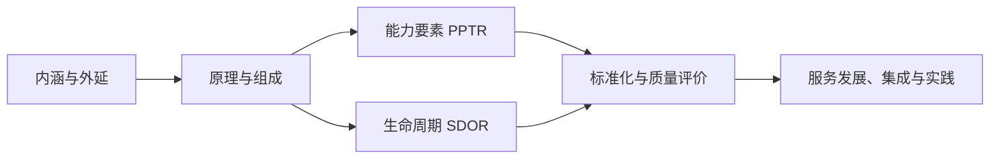

# 第三章 信息技术服务

## 0. 本章导航

- 返回：[[20-领域/学习/软考/00-导航/备考首页|备考首页]]
- 知识点：[[20-领域/学习/软考/00-导航/第三章知识点索引|管理索引]]｜[[20-领域/学习/软考/00-导航/第三章知识点管理.base|管理表]]｜[[20-领域/学习/软考/00-导航/第三章知识点网络.canvas|关系网]]
- 练习：[[20-领域/学习/软考/03-错题库/错题库#第三章 信息技术服务|本章错题]]
- 溯源：[[20-领域/学习/软考/98-原始资料/前四章课本原稿|原始笔记]]
- 学习路径：先建立“IT 服务是什么”（内涵与外延），再进入 ITSS 的原理、组成与生命周期，接着到标准化与质量评价，最后落到服务发展、集成与实践。

## 1. 章首速览

### 一句话总览

本章围绕 IT 服务这一对象展开：先界定服务的内涵、外延与行业特征，再以 ITSS 为纲说明能力要素（PPTR）与生命周期（SDOR），进而到标准化与质量评价，最后落到新一代信息技术背景下的服务发展与服务集成实践。

### 全章主线

### 必背清单

| 主题 | 必背关键词 |
|---|---|
| 服务四特征 | 无形性、不可分离性、可变性、不可存储性 |
| 能力要素 PPTR | 人员(P)正确选人、过程(P)正确做事、技术(T)高效做事、资源(R)保障做事 |
| 生命周期 SDOR | 战略规划 → 设计实现 → 运营提升 → 退役终止 |
| 产业化三阶段 | 产品服务化(前提) → 服务标准化(保障) → 服务产品化(趋势) |
| 服务质量五特性 | 安全性、可靠性、响应性、有形性、友好性 |
| ITSS 5.0 框架 | 基础服务(底座)＋通用/保障(支柱)＋技术创新/数字化转型(引领) |
| 服务集成四要素 | 需方、供方、环境、过程 |

### 高频易混预警

| 易混组合 | 快速辨识（通俗理解，不作教材定义） |
|---|---|
| 能力要素 vs 生命周期要素 | PPTR（人员/过程/技术/资源）vs SDOR（战略规划/设计实现/运营提升/退役终止）。 |
| 人员 vs 过程 | 人员=正确选人；过程=正确做事；技术=高效做事；资源=保障做事。 |
| 服务标准化 vs 服务产品化 | 标准化看“规范、可追溯、可审计”；产品化看“目录、级别、全生命周期”。 |
| 服务四特征 vs 质量五特性 | 前者描述服务本身（无形/不可分/可变/不可存储）；后者是质量评价维度（安全/可靠/响应/有形/友好）。 |
| 需方价值收益 vs 四核心要素 | 收益是“提升质量、优化成本、强化效能、降低风险”；要素是“人员、过程、技术、资源”。 |

## 2. 内涵与外延

本节界定“IT 服务是什么”：先看服务的通用特征与 IT 服务的内涵，再展开外延与行业特征。

### 2.1 服务特征与 IT 服务内涵

#### 服务的四个特征

**无形性、不可分离性、可变性、不可存储性**。

#### IT 服务的内涵

> [!info] 教材原稿关键词
> 服务是基本特性；IT 服务的内涵包括：**本质、形态、过程、阶段、效益、内部关联、外部关联**。

| 内涵维度 | 教材原稿关键词 |
|---|---|
| 本质特征 | IT 服务的组成要素包括：人员、过程、技术、资源 |
| 过程特征 | 项目级、组织级、量化管理级、数字化运营 |
| 效益特征 | 服务系统进行深度开发与广泛使用，从整体上提高组织核心竞争力和管理水平 |
| 内部关联特征 | 依赖技术创新与业务模式创新的相互促进 |
| 阶段性特征 | 分层次、分阶段的推进 IT 服务 |

#### 考试关键词

- 服务四特征：**无形、不可分离、可变、不可存储**。
- 内涵七维度：**本质、形态、过程、阶段、效益、内部关联、外部关联**。
- 本质要素：**人员、过程、技术、资源**。

#### 易混点

1. **服务四特征 vs 质量五特性**：四特征描述服务“天生如何”，质量五特性描述服务“做得好不好”，见 4.3。

#### 主动回忆

> [!question]- 服务的四个特征是什么？
> 无形性、不可分离性、可变性、不可存储性。

> [!question]- IT 服务的内涵包括哪几个维度？本质特征指什么？
> 本质、形态、过程、阶段、效益、内部关联、外部关联；本质特征是 IT 服务的组成要素，包括人员、过程、技术、资源。

#### 原教材定位

- [[20-领域/学习/软考/98-原始资料/前四章课本原稿#3.1 内涵与外延|原稿“3.1 内涵与外延”]]：服务特征、IT 服务内涵。
- 覆盖核对：[[20-领域/学习/软考/98-原始资料/第三章整理对照表|第三章整理对照表]]。

### 2.2 IT 服务外延

#### 外延四类服务

| 类别 | 教材原稿关键词 |
|---|---|
| 基础服务 | 咨询设计、开发服务、集成实施、运行维护、云服务和数据中心 |
| 技术创新服务 | 智能化服务、数字服务、数字内容处理服务、区块链服务 |
| 数字化转型服务 | 数字化转型成熟度推荐服务、评估评价服务、数字化监测预警服务 |
| 业务融合服务 | 信息技术及其服务与各行业融合的服务 |

#### 主动回忆

> [!question]- IT 服务外延包括哪四类？基础服务有哪些？
> 基础服务、技术创新服务、数字化转型服务、业务融合服务；基础服务含咨询设计、开发服务、集成实施、运行维护、云服务和数据中心。

#### 原教材定位

- [[20-领域/学习/软考/98-原始资料/前四章课本原稿#3.1 内涵与外延|原稿“3.1 内涵与外延”]]：IT 服务外延四类。
- 覆盖核对：[[20-领域/学习/软考/98-原始资料/第三章整理对照表|第三章整理对照表]]。

### 2.3 IT 服务业特征

**高知识和高技术含量、高集群性、服务过程的交互性、服务的非独立性、知识密集性、产业内部成金字塔分布、法律和契约的强依赖性、声誉机制**。

#### 主动回忆

> [!question]- IT 服务业有哪些特征？
> 高知识和高技术含量、高集群性、服务过程的交互性、服务的非独立性、知识密集性、产业内部成金字塔分布、法律和契约的强依赖性、声誉机制。

#### 原教材定位

- [[20-领域/学习/软考/98-原始资料/前四章课本原稿#3.1 内涵与外延|原稿“3.1 内涵与外延”]]：IT 服务业特征。
- 覆盖核对：[[20-领域/学习/软考/98-原始资料/第三章整理对照表|第三章整理对照表]]。

## 3. 原理、组成与生命周期

本节以 ITSS 为纲，先看 IT 服务的基本原理与能力要素（PPTR），再展开生命周期（SDOR）。

### 3.1 ITSS 与基本原理

#### ITSS

> [!info] 教材原稿关键词
> ITSS 即 **IT 服务标准库**（信息技术服务标准）。

#### IT 服务的基本原理

**能力要素、生存周期要素、管理要素**。

> [!note] 通俗理解
> 基本原理回答“服务靠什么能力、沿什么生命周期、靠什么管理来落地”。

#### 考试关键词

- ITSS：**IT 服务标准库**。
- 基本原理三要素：**能力要素、生存周期要素、管理要素**。

#### 主动回忆

> [!question]- ITSS 是什么？IT 服务的基本原理包括哪三个要素？
> ITSS 是 IT 服务标准库；基本原理包括能力要素、生存周期要素、管理要素。

#### 原教材定位

- [[20-领域/学习/软考/98-原始资料/前四章课本原稿#3.2 原理与组成：|原稿“3.2 原理与组成”]]：ITSS、基本原理。
- 覆盖核对：[[20-领域/学习/软考/98-原始资料/第三章整理对照表|第三章整理对照表]]。

### 3.2 能力要素（PPTR）

#### PPTR 四要素

| 要素 | 简称 | 角色（原稿） |
|---|---|---|
| 人员 | P | 正确选人 |
| 过程 | P | 正确做事 |
| 技术 | T | 高效做事 |
| 资源 | R | 保障做事 |

> [!info] 教材原稿关键词
> 过程是通过合理利用资源，提高管理水平和确保服务质量的关键要素。

#### 考试关键词

- 四核心要素：**人员、过程、技术、资源（PPTR）**。
- 角色：**人员正确选人、过程正确做事、技术高效做事、资源保障做事**。
- 关键要素：**过程**（通过合理利用资源，提高管理水平、确保服务质量）。

#### 易混点

1. **人员 vs 过程 vs 技术 vs 资源**：分别对应“选人、做事、高效、保障”。
2. **PPTR vs 服务集成四要素**：前者是能力要素（人员/过程/技术/资源），后者是集成视角的四要素（需方/供方/环境/过程），见 5.2。

#### 记忆钩子

- PPTR 角色记作“**选、做、效、保**”。

#### 主动回忆

> [!question]- 能力要素 PPTR 分别指什么？各自扮演什么角色？
> 人员(P)、过程(P)、技术(T)、资源(R)；人员正确选人、过程正确做事、技术高效做事、资源保障做事。过程是通过合理利用资源提高管理水平和确保服务质量的关键要素。

#### 原教材定位

- [[20-领域/学习/软考/98-原始资料/前四章课本原稿#3.2 原理与组成：|原稿“3.2 原理与组成”]]：能力要素 PPTR。
- 覆盖核对：[[20-领域/学习/软考/98-原始资料/第三章整理对照表|第三章整理对照表]]。

### 3.3 服务生命周期（SDOR）

#### 生命周期四阶段

**战略规划 → 设计实现 → 运营提升 → 退役终止**（简称 SDOR）。

> [!note] 通俗理解
> 监督提供保障、管理提供支撑（原稿关键词）。

| 阶段 | 教材原稿关键词 |
|---|---|
| 战略规划 | 从业务战略出发、以需求为中心、对 IT 服务进行全面系统的战略规划；是组织整个 IT 服务发展和能力体系建设的**首要之事** |
| 设计实现 | 主要输出：IT 服务的体系结构定义、服务解决方案的部署、专用工具和管理体系的建立 |
| 运营提升 | 根据业务需求和市场变化，优化服务流程、提升服务能力；运营阶段通常占服务整体生命周期的 **80%** |
| 退役终止 | 终止服务需要**书面的服务终止计划** |

#### 战略规划报告与设计风险

| 主题 | 教材原稿关键词 |
|---|---|
| 战略规划报告 | 战略规划阶段的核心成果之一（原稿误记为“战列策划报告”） |
| 基本原则 | 合规性（遵从政策法规）、业务保障原则（关键业务优先）、资源优化配置（成本合理）、管理方法论（面向体系化管理） |
| 服务设计风险 | 技术风险、管理风险、成本风险、不可预测风险 |
| 服务部署 | 衔接服务设计与服务运营的中间活动 |
| 服务运营内容 | 业务运营、IT 运营；对服务支持系统进行监控、识别、分类并报告异常、缺陷和故障 |

#### 考试关键词

- SDOR：**战略规划、设计实现、运营提升、退役终止**。
- 战略规划是**首要之事**；运营占 **80%**；终止需**书面计划**。
- 设计风险：**技术、管理、成本、不可预测**。

#### 易混点

1. **战略规划 vs 运营提升**：前者以需求为中心做全面规划（首要之事）；后者优化流程、提升能力（占 80%）。
2. **设计实现 vs 服务部署**：设计实现产出体系结构定义与解决方案；服务部署是衔接设计与运营的中间活动。

#### 记忆钩子

- SDOR 记作“**规、设、运、退**”。
- 设计风险记作“**技、管、成、不可测**”。

#### 主动回忆

> [!question]- IT 服务生命周期四个阶段是什么？运营阶段通常占多大比例？
> 战略规划、设计实现、运营提升、退役终止（SDOR）；运营阶段通常占服务整体生命周期的 80%。

> [!question]- 战略规划报告的基本原则有哪些？服务设计的风险有哪些？
> 合规性、业务保障原则（关键业务优先）、资源优化配置（成本合理）、管理方法论（面向体系化管理）；风险有技术风险、管理风险、成本风险、不可预测风险。

#### 原教材定位

- [[20-领域/学习/软考/98-原始资料/前四章课本原稿#3.3服务生命周期：|原稿“3.3 服务生命周期”]]：SDOR、战略规划报告、设计风险、运营内容。
- 覆盖核对：[[20-领域/学习/软考/98-原始资料/第三章整理对照表|第三章整理对照表]]。

## 4. 服务标准化与质量评价

本节从产业化三阶段入手，看 ITSS 标准体系，最后到服务质量评价模型。

### 4.1 产业化三阶段

| 阶段 | 地位 | 关键特征（原稿） |
|---|---|---|
| 产品服务化 | 前提 | 以产品为主线、服务依附于产品；服务常无明确考核；产品和服务不可分割 |
| 服务标准化 | 保障 | 建立标准的过程、实施规范及相关制度；有明确的有形化产出物描述及模板；服务过程有记录、可追溯且可审计；建立完善的服务质量考核指标体系 |
| 服务产品化 | 趋势 | 有清晰的服务目录；具有独立价值、明确的功能和性能指标；有服务级别要求；有明确考核指标；对服务产品实施全生命周期管理 |

> [!tip] 记忆钩子
> **产品服务化看“依附”，服务标准化看“规范可审计”，服务产品化看“目录与级别”。**

#### 主动回忆

> [!question]- IT 服务产业化三阶段是什么？各自在产业进程中的地位？
> 产品服务化（前提）、服务标准化（保障）、服务产品化（趋势）。

> [!question]- 服务标准化和服务产品化各有哪些关键特征？
> 服务标准化：标准过程与制度、有形化产出物描述及模板、过程记录可追溯可审计、完善的质量考核指标体系；服务产品化：清晰服务目录、独立价值与明确功能性能指标、服务级别要求、明确考核指标、全生命周期管理。

#### 原教材定位

- [[20-领域/学习/软考/98-原始资料/前四章课本原稿#3.4服务标准化|原稿“3.4 服务标准化”]]：产业化三阶段。
- 覆盖核对：[[20-领域/学习/软考/98-原始资料/第三章整理对照表|第三章整理对照表]]。

### 4.2 ITSS 标准体系

#### 建设目标与建立原则

| 主题 | 教材原稿关键词 |
|---|---|
| 建设目标 | 支撑国家战略、引导产业高质量发展、促进新技术应用创新、指导 IT 服务业务升级、确保标准化工作有序开展 |
| 建立原则 | 目标性、整体性、有序性、开放性、动态性 |

#### ITSS 5.0 框架

> [!info] 教材原稿关键词
> ITSS 5.0 在数字中国建设、产业高质量发展、新发展格局构建以及自主创新的国家战略和市场需求双轮驱动下，以**基础服务标准**为底座、以**通用标准和保障标准**为支柱，以**技术创新服务标准和数字化转型服务标准**为引领，共同支撑业务融合的实现。

| 层级 | 内容 |
|---|---|
| 底座 | 基础服务标准 |
| 支柱 | 通用标准、保障标准 |
| 引领 | 技术创新服务标准、数字化转型服务标准 |

> ITSS 5.0 主要内容：通用标准、保障标准、基础服务、技术创新服务、数字化转型服务、业务融合。

#### 考试关键词

- 建立原则：**目标、整体、有序、开放、动态**。
- 5.0 框架：**基础服务(底座)＋通用/保障(支柱)＋技术创新/数字化转型(引领) → 支撑业务融合**。

#### 主动回忆

> [!question]- ITSS 标准体系建立的原则有哪些？
> 目标性、整体性、有序性、开放性、动态性。

> [!question]- ITSS 5.0 框架中底座、支柱、引领分别是什么？
> 底座是基础服务标准；支柱是通用标准和保障标准；引领是技术创新服务标准和数字化转型服务标准，共同支撑业务融合。

#### 原教材定位

- [[20-领域/学习/软考/98-原始资料/前四章课本原稿#3.4服务标准化|原稿“3.4 服务标准化”]]：建设目标、建立原则、ITSS 5.0 框架。
- 覆盖核对：[[20-领域/学习/软考/98-原始资料/第三章整理对照表|第三章整理对照表]]。

### 4.3 服务质量评价

#### 质量定义

> [!info] 教材原稿关键词
> IT 服务质量是信息技术服务的**固有特性**满足要求的程度；服务的需方和供方之间通过**服务质量特性**进行互动。

#### 服务质量模型五特性

| 特性 | 关键子项（原稿） |
|---|---|
| 安全性 | 可用、完整、保密 |
| 可靠性 | 完备、连续、稳定、有效、可追溯 |
| 响应性 | 及时、互动 |
| 有形性 | 可视、专业、合规 |
| 友好性 | 主动、灵活、礼貌 |

> [!note] 连续性（原稿）
> 连续性：确保服务协议在任何情况下都能得到满足的程度，致力于将风险降低至合理水平以及在业务中断后能进行业务恢复。

#### 考试关键词

- 质量定义抓手：**固有特性满足要求的程度**。
- 五特性：**安全(可用完整保密)、可靠(完备连续稳定有效可追溯)、响应(及时互动)、有形(可视专业合规)、友好(主动灵活礼貌)**。

#### 易混点

1. **服务四特征 vs 质量五特性**：四特征描述服务本身属性；五特性是质量评价维度，两者不是同一张清单。
2. **可靠性 vs 连续性**：可靠性是质量特性之一（完备、连续、稳定、有效、可追溯）；连续性是服务协议持续满足的程度、强调风险与业务恢复。

#### 主动回忆

> [!question]- IT 服务质量模型包括哪五个特性？各有哪些关键子项？
> 安全性（可用、完整、保密）、可靠性（完备、连续、稳定、有效、可追溯）、响应性（及时、互动）、有形性（可视、专业、合规）、友好性（主动、灵活、礼貌）。

> [!question]- IT 服务质量的定义抓手是什么？
> 信息技术服务的固有特性满足要求的程度；需方和供方通过服务质量特性互动。

#### 原教材定位

- [[20-领域/学习/软考/98-原始资料/前四章课本原稿#3.5服务质量评价|原稿“3.5 服务质量评价”]]：质量定义、五特性、连续性。
- 覆盖核对：[[20-领域/学习/软考/98-原始资料/第三章整理对照表|第三章整理对照表]]。

## 5. 服务发展、集成与实践

本节看新一代信息技术如何推动服务发展，以及服务集成的对象、抓手与关注焦点。

### 5.1 服务发展

#### 新一代信息技术应用

**5G、云计算、区块链、人工智能、数字孪生、北斗通信**。

> [!info] 教材原稿关键词
> 数字化转型为 IT 服务提供了新的实现手段、赋予了更多内涵，促使数据服务、区块链服务、数字内容处理服务、数字化转型服务的发展。

#### 主动回忆

> [!question]- 推动服务发展的新一代信息技术有哪些？
> 5G、云计算、区块链、人工智能、数字孪生、北斗通信。

#### 原教材定位

- [[20-领域/学习/软考/98-原始资料/前四章课本原稿#3.6 服务发展|原稿“3.6 服务发展”]]：新一代信息技术、数字化转型。
- 覆盖核对：[[20-领域/学习/软考/98-原始资料/第三章整理对照表|第三章整理对照表]]。

### 5.2 服务集成与实践

#### 服务集成定义

> [!info] 教材原稿关键词
> 服务集成在传统信息系统集成关注技术融合的基础上，更加强调数据融合共享条件下的**敏态集成能力建设**，是信息系统软硬件面向“稳态”集成后、面向各行业领域数字化转型和服务化发展的新型实践。

#### 服务集成的五个“以”

| 维度 | 教材原稿关键词 |
|---|---|
| 集成对象 | 以包含信息系统软件在内的**服务产品**为集成对象 |
| 抓手 | 以**量化的服务水平管理**为抓手 |
| 关注焦点 | 以跨组织、跨团队的服务动态融合为关注焦点 |
| 项目管理主要内容 | 以**服务交付管理**为项目管理主要内容 |
| 成果评价关键点 | 以**服务绩效和服务价值**为集成成果评价关键点 |

#### 服务集成四要素与关注点

| 主题 | 教材原稿关键词 |
|---|---|
| 服务核心四要素 | 需方、供方、环境、过程 |
| 重要关注点 | 服务数据、知识资产的管理 |

#### 考试关键词

- 服务集成：**敏态集成能力建设**。
- 五个“以”：**服务产品、量化服务水平管理、动态融合、服务交付管理、服务绩效和价值**。
- 核心四要素：**需方、供方、环境、过程**。

#### 易混点

1. **服务集成四要素 vs 能力要素 PPTR**：集成四要素是需方/供方/环境/过程；能力四要素是人员/过程/技术/资源。
2. **稳态 vs 敏态**：传统集成偏“稳态”（技术融合），服务集成强调数据融合共享下的“敏态集成能力”。

#### 主动回忆

> [!question]- 服务集成的集成对象、抓手、关注焦点分别是什么？
> 以包含信息系统软件在内的服务产品为集成对象；以量化的服务水平管理为抓手；以跨组织、跨团队的服务动态融合为关注焦点。

> [!question]- 服务集成的核心四要素和重要关注点是什么？
> 核心四要素是需方、供方、环境、过程；重要关注点是服务数据、知识资产的管理。

#### 原教材定位

- [[20-领域/学习/软考/98-原始资料/前四章课本原稿#3.7 服务集成与实践|原稿“3.7 服务集成与实践”]]：服务集成定义、五个“以”、四要素与关注点。
- 覆盖核对：[[20-领域/学习/软考/98-原始资料/第三章整理对照表|第三章整理对照表]]。

## 6. 章末综合复习

### 6.1 高频易混点对比

> [!note] 使用说明
> 本表按“容易混淆”组织，不表示经过统计的考频排序，也不提供未经官方依据的星级押题。

| 易混组合 | 区分抓手 |
|---|---|
| 能力要素 vs 生命周期要素 | PPTR（人员/过程/技术/资源）vs SDOR（战略规划/设计实现/运营提升/退役终止）。 |
| 人员 vs 过程 vs 技术 vs 资源 | 选人、做事、高效、保障。 |
| 服务标准化 vs 服务产品化 | 规范可审计 vs 目录与级别、全生命周期。 |
| 服务四特征 vs 质量五特性 | 服务本身属性 vs 质量评价维度。 |
| 需方价值收益 vs 四核心要素 | 提升质量/优化成本/强化效能/降低风险 vs 人员/过程/技术/资源。 |
| 服务集成四要素 vs 能力要素 | 需方/供方/环境/过程 vs 人员/过程/技术/资源。 |
| 可靠性 vs 连续性 | 质量特性子项（完备连续稳定…）vs 服务协议持续满足、风险与恢复。 |

### 6.2 关键顺序与等级

1. **生命周期（SDOR）**：战略规划 → 设计实现 → 运营提升 → 退役终止。
2. **产业化三阶段**：产品服务化（前提）→ 服务标准化（保障）→ 服务产品化（趋势）。
3. **过程特征四级**：项目级 → 组织级 → 量化管理级 → 数字化运营。

### 6.3 分层必背清单

#### 必须准确背诵

- 服务四特征；IT 服务内涵七维度与本质要素。
- 能力要素 PPTR 及角色；生命周期 SDOR 及运营 80%、终止需书面计划。
- 产业化三阶段及各自地位与特征。
- 服务质量五特性及各自子项。
- ITSS 5.0 框架（底座/支柱/引领）。
- 服务集成五个“以”与核心四要素。

#### 理解后辨识

- PPTR 各要素角色的题干线索。
- 服务标准化 vs 服务产品化的特征差异。
- 服务四特征与质量五特性的归属。
- 服务集成四要素与能力要素的差异。
- 战略规划 vs 运营提升的阶段判定。

### 6.4 闭卷自测

#### 列举题

> [!question]- 1. 服务的四个特征是什么？
> 无形性、不可分离性、可变性、不可存储性。

> [!question]- 2. 能力要素 PPTR 分别指什么？各自扮演什么角色？
> 人员(P)正确选人、过程(P)正确做事、技术(T)高效做事、资源(R)保障做事；过程是提高管理水平和确保服务质量的关键要素。

> [!question]- 3. IT 服务生命周期四阶段是什么？运营阶段占比多少？
> 战略规划、设计实现、运营提升、退役终止；运营阶段通常占 80%。

> [!question]- 4. IT 服务产业化三阶段是什么？各自的地位？
> 产品服务化（前提）、服务标准化（保障）、服务产品化（趋势）。

> [!question]- 5. 服务质量模型五特性及各自子项是什么？
> 安全性（可用、完整、保密）、可靠性（完备、连续、稳定、有效、可追溯）、响应性（及时、互动）、有形性（可视、专业、合规）、友好性（主动、灵活、礼貌）。

> [!question]- 6. ITSS 5.0 框架的底座、支柱、引领分别是什么？
> 底座是基础服务标准；支柱是通用标准和保障标准；引领是技术创新服务标准和数字化转型服务标准，共同支撑业务融合。

> [!question]- 7. 服务集成的五个“以”是什么？核心四要素是什么？
> 以服务产品为集成对象、以量化的服务水平管理为抓手、以跨组织跨团队的服务动态融合为关注焦点、以服务交付管理为项目管理主要内容、以服务绩效和服务价值为集成成果评价关键点；核心四要素是需方、供方、环境、过程。

#### 对比题

> [!question]- 8. 服务标准化和服务产品化的关键区别是什么？
> 服务标准化看“标准过程、有形化产出物描述、可追溯可审计、质量考核体系”；服务产品化看“清晰服务目录、独立价值、明确功能性能指标、服务级别、明确考核指标、全生命周期管理”。

> [!question]- 9. 服务四特征与质量五特性如何区分？
> 四特征描述服务本身属性（无形、不可分离、可变、不可存储）；五特性是质量评价维度（安全、可靠、响应、有形、友好）。

> [!question]- 10. 服务集成四要素与能力要素 PPTR 有何不同？
> 服务集成四要素是需方、供方、环境、过程；能力要素是人员、过程、技术、资源。

#### 顺序题

> [!question]- 11. 写出 IT 服务生命周期的完整顺序。
> 战略规划 → 设计实现 → 运营提升 → 退役终止。

> [!question]- 12. 写出产业化三阶段的顺序及地位。
> 产品服务化（前提）→ 服务标准化（保障）→ 服务产品化（趋势）。

#### 情境判断题

> [!question]- 13. 题干强调“以需求为中心、从业务战略出发做全面系统规划”，对应生命周期哪个阶段？
> 战略规划（是组织整个 IT 服务发展和能力体系建设的首要之事）。

> [!question]- 14. 题干描述“优化服务流程、提升服务能力”，对应哪个阶段？
> 运营提升。

> [!question]- 15. 某服务“有清晰的服务目录、明确的功能性能指标和考核指标，并实施全生命周期管理”，处于产业化哪个阶段？
> 服务产品化。

#### 题号—正文模块覆盖

| 题号 | 正文模块 | 覆盖重点 |
|---|---|---|
| 1 | 2.1 服务特征与 IT 服务内涵 | 服务四特征 |
| 2 | 3.2 能力要素（PPTR） | PPTR 及角色 |
| 3、11、13、14 | 3.3 服务生命周期（SDOR） | 四阶段与情境判定 |
| 4、8、12、15 | 4.1 产业化三阶段 | 三阶段地位与特征 |
| 5、9 | 4.3 服务质量评价 | 五特性及子项 |
| 6 | 4.2 ITSS 标准体系 | ITSS 5.0 框架 |
| 7、10 | 5.2 服务集成与实践 | 五个“以”、四要素 |

### 6.5 本章错题入口

- [[20-领域/学习/软考/03-错题库/错题库#第三章 信息技术服务|进入错题库：第三章 信息技术服务]]

### 勘误与依据

- **战略规划报告**：原稿第 595 行“战列策划报告”为“战略规划报告”的误写（第 599 行即正确写法）。
- **服务集成对象**：原稿第 713 行“包含信息系统软件软件在内”出现“软件”二字重复，已按上下文去重。
- **生命周期术语**：原稿“生命周期”（第 573 行）与“生存周期要素”（第 587 行）混用，本章统一按“生命周期（SDOR）”表述，并在对照表标注原稿混用。
- **服务质量五特性与 ITSS 5.0 框架**：已按覆盖表所列 ITSS 权威来源核对。

### 本章收束

- 能准确说出服务四特征、PPTR、SDOR、产业化三阶段、质量五特性、ITSS 5.0 框架、服务集成五个“以”与四要素后，再做情境辨识。
- 遇到“候选”“待核对”标记时，只按原稿定位回忆，不把它当作已经权威确认的结论。
- 返回：[[20-领域/学习/软考/00-导航/备考首页|备考首页]]｜练习：[[20-领域/学习/软考/03-错题库/错题库#第三章 信息技术服务|本章错题]]｜溯源：[[20-领域/学习/软考/98-原始资料/前四章课本原稿|原始笔记]]。
