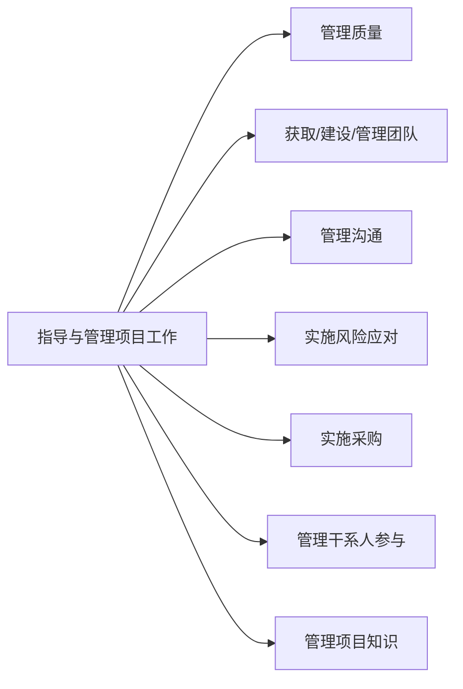

# 第十二章 执行过程组

## 1. 本章导航

- **本章目标**：掌握执行过程组各过程的定义、作用与关键输出，重点是整合、质量、资源、沟通、风险、采购和干系人管理中的执行类过程。
- **重点小节**：指导与管理项目工作、管理质量、建设团队与管理团队、实施采购。
- **关联章节**：[[20-领域/学习/软考/01-章节笔记/第九章 项目管理基础|第九章 项目管理基础]]、[[20-领域/学习/软考/01-章节笔记/第十章 启动过程组|第十章 启动过程组]]、[[20-领域/学习/软考/01-章节笔记/第十一章 规划过程组|第十一章 规划过程组]]。
- **材料边界**：本笔记覆盖 [[20-领域/学习/软考/98-原始资料/第十二章|第十二章原稿]] 全部 10 个执行过程，为精简笔记整理，不是全章教材复刻；其中 ITTO 与关系图是按原稿图片转写，尚未逐项核验第三版教材。

## 2. 章首速览

执行过程组回答的是“把计划变成成果”：按照项目管理计划执行各项工作、实施已批准变更，并管理质量、团队、沟通、风险应对、采购与干系人参与，最终形成项目可交付成果。

主线可记为：

> 执行已批准计划 → 落实整合与知识 → 保证质量 → 组建并带领团队 → 管理沟通与风险应对 → 完成采购 → 引导干系人参与。

## 3. 整合管理

### 3.1 指导与管理项目工作

**指导与管理项目工作**是为实现项目目标而领导和执行项目管理计划中所确定的工作，并实施已批准变更的过程。其作用是对项目工作和可交付成果开展综合管理，以提高项目成功的可能性。

该过程在**整个项目期间**开展。原稿还写到，项目执行阶段通常由项目经理组织会议、项目发起人召集主要项目干系人参加；其中“项目发起人召集”尚待教材原文核对。

- **项目管理计划**：说明项目执行、监控和收尾方式的一份文件。本过程可使用其中任何组件；原稿举例包括范围、需求、成本、进度、质量管理计划，以及范围、进度、成本基准。
- **会议**：项目执行阶段通常由项目经理组织会议，讨论和解决执行中的问题。会议类型包括开工会议、技术会议、敏捷或迭代规划会议、每日站会、指导小组会议、问题解决会议、进展跟进会议、回顾会议。

> [!info] 数据流向
> ![[65f8e2dc03054903572488c4e3fb5ce7.png]]

> [!note] 原稿 ITTO（图片转写，待教材核对）
> - **输入**：项目管理计划（任何组件）；项目文件（变更日志、经验教训登记册、里程碑清单、项目沟通记录、项目进度计划、需求跟踪矩阵、风险登记册、风险报告）；批准的变更请求；事业环境因素；组织过程资产。
> - **工具与技术**：专家判断、项目管理信息系统、会议。
> - **输出**：可交付成果、工作绩效数据、问题日志、变更请求；项目管理计划更新（任何组件）；项目文件更新（活动清单、假设日志、经验教训登记册、需求文件、风险登记册、干系人登记册）；组织过程资产更新。

工作绩效信息流：指导与管理项目工作产生**工作绩效数据**；各控制过程据此形成**工作绩效信息**，由监控项目工作汇总为**工作绩效报告**，再供实施整体变更控制、管理团队、管理沟通和监督风险等过程使用。

> [!info] 工作绩效数据、信息与报告
> ![[6976556723d55f8a4a5ea8a4dd362658 2.png]]

**问题日志**：记录和跟进所有问题的项目文件。需记录跟进的内容包括问题类型、问题提出者和提出时间、问题描述、问题优先级、由谁负责解决、目标解决日期、问题状态、最终解决情况。

**变更请求**：关于修改文件、可交付成果或基准的正式提议，通过实施整体变更控制过程进行审查和处理。变更请求包括**纠正措施、预防措施、缺陷补救、更新**四类。

可交付成果的典型流转是：**指导与管理项目工作产生可交付成果 → 控制质量形成核实的可交付成果 → 确认范围形成验收的可交付成果 → 结束项目或阶段形成最终的可交付成果**。

> [!info] 可交付成果流转
> ![[bc4eb002e81301388db22b32acb7aae8.png]]

### 3.2 管理项目知识

**管理项目知识**是使用现有知识并生成新知识，以实现项目目标，并帮助组织学习的过程。其作用是利用已有的组织知识创造或改进项目成果，使当前项目创造的知识可用于支持组织运营和未来的项目或阶段。

- 知识通常分为**显性知识**和**隐性知识**两类。
- 关键活动是**知识分享**和**知识集成**。

> [!info] 数据流向
> ![[016fcbd8a0fed92e2487a282e13870b5.png]]

> [!note] 原稿 ITTO（图片转写，待教材核对）
> - **输入**：项目管理计划（所有组件）；项目文件（经验教训登记册、项目团队派工单、资源分解结构、供方选择标准、干系人登记册）；可交付成果；事业环境因素；组织过程资产。
> - **工具与技术**：专家判断、知识管理、信息管理、人际关系与团队技能（积极倾听、引导、领导力、人际交往、政治意识）。
> - **输出**：经验教训登记册；项目管理计划更新（任何组件）；组织过程资产更新。

知识管理过程通常包括：**知识获取与集成、知识组织与存储、知识分享、知识转移与应用、知识管理审计**。

- **知识获取与收集的途径**：图示资料、内外部数据挖掘、网络搜索、营销与销售信息。
- **隐性知识获取方法**：结构式访谈、行动学习、标杆学习、分析学习、经验学习、综合学习、交互学习。
- **知识成功转移**必须完成**知识传递**和**知识吸收**。
- **审计对象**包括知识资源、安全和能力：知识安全审计是对组织知识资源合理和安全使用的审计；知识能力审计是对知识管理人员素质和知识管理绩效的审计。

原稿另列出可用于本过程的项目管理计划组件：范围、需求、成本、进度、质量管理计划，以及范围、进度、成本基准。

## 4. 质量管理

### 4.1 管理质量

**管理质量**是把组织的质量政策用于项目，并将质量管理计划转化为可执行的质量活动的过程。其作用是提高实现质量目标的可能性，识别无效过程和导致质量低劣的原因，促进质量过程改进。

- **共同职责**：管理质量是所有人的共同职责，包括项目经理、项目团队、项目发起人、执行组织的管理层、客户。
- **敏捷型项目**：质量管理由所有团队成员执行；**传统项目**：由特定团队成员负责。

> [!info] 数据流向
> ![[01754d85acb65797e6c670a6ec5dccba.png]]

> [!note] 原稿 ITTO（图片转写，待教材核对）
> - **输入**：项目管理计划（质量管理计划）；项目文件（经验教训登记册、质量控制测量结果、质量测量指标、风险报告）；组织过程资产。
> - **工具与技术**：数据收集（核对单）；数据分析（备选方案分析、文件分析、过程分析、根本原因分析）；决策（多标准决策分析）；数据表现（亲和图、因果图、流程图、直方图、矩阵图、散点图）；审计；面向 X 的设计；问题解决；质量改进方法。
> - **输出**：质量报告、测试与评估文件、变更请求；项目管理计划更新（质量管理计划、范围基准、进度基准、成本基准）；项目文件更新（问题日志、经验教训登记册、风险登记册）。

管理质量过程的主要工作：

1. 执行质量管理活动，确保项目工作过程和工作成果达到质量测量指标及质量标准。
2. 把质量标准和测量指标转换成测试与评估文件。
3. 根据风险评估报告识别与处置项目质量目标的机会和威胁，以便提出必要的变更请求。
4. 根据质量控制测量结果评价质量管理绩效及质量管理体系的合理性，提出必要的变更请求，实现过程改进。
5. 质量管理持续优化改进。
6. 编制质量报告，并向项目干系人报告项目质量绩效。

与变更有关的质量检查可区分为：指导与管理项目工作负责**完成批准的变更**；管理质量（QA）关注**变更是否已经实施**；控制质量（QC）关注**变更实施得是否正确**。此为原稿关系图的辨识性概括，待教材核对。

> [!info] 变更控制与 QA、QC
> ![[287cc18bc1a9a46b3874b6781ac3df47.png]]

### 4.2 管理质量的工具与技术

- **核对单**：一种结构化工具，在管理质量过程中收集数据，反映该做的事项是否已做、是否已做到符合要求。
- **数据分析**：包括备选方案分析、文件分析、过程分析、根本原因分析。

> [!info] 数据分析
> ![[bad11ec6f6f13ea10b6be2663cbf6462.png]]

- **数据表现**：包括亲和图、因果图、流程图、直方图、矩阵图、散点图。

> [!info] 数据表现
> ![[6427c79449addce7fb75937a7e2a86d7.png]]

### 4.3 质量审计与过程改进

**质量审计**的目标一般包括：

- 识别全部正在实施的良好及最佳实践；
- 识别所有违规做法、差距及不足；
- 分享所在组织和行业中类似项目的良好实践；
- 积极、主动地提供协助，改进过程执行，从而帮助团队提高生产效率；
- 强调每次审计都应对组织经验教训知识库作出积极贡献。

**面向 X 的设计（DfX）**：X 既可以是“卓越”的意思，也可以是产品的某种特性，如可靠性、可用性、安全性、经济性；使用面向 X 的设计可以降低成本、改进质量、提高绩效和客户满意度。

**问题解决**：用结构化的方法从根本上解决在控制质量过程或质量审计中发现的质量管理问题——从定义问题、识别根本原因，到形成备选解决方案、选择最好的方案，再到实施选定的方案、核实解决效果。

在管理质量过程中，基于**过程分析**的结果，用**质量改进方法**做过程改进，常用方法包括：**戴明环、六西格玛、精益生产、精益六西格玛**。

## 5. 资源管理

### 5.1 获取资源

**获取资源**是获取项目所需的团队资源、设施、设备、材料、用品和其他资源的过程。其作用是概述和指导资源的选择，并将其分配给相应的活动。

> [!info] 数据流向
> ![[10346606965571a8ae5e162d87df8d6a.png]]

> [!note] 原稿 ITTO（图片转写，待教材核对）
> - **输入**：项目管理计划（资源管理计划、采购管理计划、成本基准）；项目文件（项目进度计划、资源日历、资源需求、干系人登记册）；事业环境因素；组织过程资产。
> - **工具与技术**：决策（多标准决策分析）、人际关系与团队技能（谈判）、预分派、虚拟团队。
> - **输出**：物质资源分配单、项目团队派工单、资源日历、变更请求；项目管理计划更新（资源管理计划、成本基准）；项目文件更新（经验教训登记册、项目进度计划、资源分解结构、资源需求、风险登记册、干系人登记册）；事业环境因素更新；组织过程资产更新。

- **多标准决策分析**：可用于获取资源过程的决策，制定标准对资源进行评级或打分，并根据所选标准的相对重要性进行加权。所选标准包括可用性、成本、能力、经验、知识、技能、态度、其他客观因素。
- **预分配**：事先确定项目的物质或团队资源。下列情况需要预分配：在竞标过程中承诺分派特定人员进行项目工作；项目取决于特定人员的专有技能；在完成资源管理计划的前期工作之前，制定项目章程过程或其他过程已经指定了某些团队成员工作。

### 5.2 建设团队

**建设团队**是提高工作能力、促进团队成员互动、改善团队整体氛围，以提高项目绩效的过程。其作用是改进团队协作、增强人际关系技能、激励员工、减小摩擦以及提升整体项目绩效。

该过程在**整个项目期间**开展。

可实现团队高效运行的行为主要包括：使用开放与有效的**沟通**；创造团队建设**机遇**；建立团队成员间的**信任**；以建设性方式**管理冲突**；鼓励合作型的**问题解决方法**；鼓励合作型的**决策方法**等。

建设项目团队的目标包括：提高团队成员的知识和技能；提高团队成员之间的信任和认同感；创造富有生气、凝聚力和协作性的团队文化；提高团队参与决策的能力。

> [!info] 数据流向
> ![[161f82836f80acf8a4e94e29983ae98a.png]]

> [!note] 原稿 ITTO（图片转写，待教材核对）
> - **输入**：项目管理计划（资源管理计划）；项目文件（经验教训登记册、项目进度计划、项目团队派工单、资源日历、团队章程）；事业环境因素；组织过程资产。
> - **工具与技术**：集中办公、虚拟团队、沟通技术；人际关系与团队技能（冲突管理、影响力、激励、谈判、团队建设）；认可与奖励、培训、个人和团队评估、会议。
> - **输出**：团队绩效评价、变更请求；项目管理计划更新（资源管理计划）；项目文件更新（经验教训登记册、项目进度计划、项目团队派工单、资源日历、团队章程）；事业环境因素更新；组织过程资产更新。

**塔克曼阶梯理论**：团队建设通常经过**形成、震荡、规范、成熟、解散**五个阶段。

> [!info] 塔克曼阶梯
> ![[da689c5f507125dfd1d8f988b45b5902.png]]

评价团队有效性的指标：个人技能的改进；团队能力的改进；团队成员离职率的降低；团队凝聚力的加强。

### 5.3 管理团队

**管理团队**是跟踪团队成员工作表现、提供反馈、解决问题并管理团队变更，以优化项目绩效的过程。其作用是影响团队行为、管理冲突以及解决问题。

该过程在**整个项目期间**开展。

> [!info] 数据流向
> ![[ccfdad51349528e4e5866b4da1d53e8d.png]]

> [!note] 原稿 ITTO（图片转写，待教材核对）
> - **输入**：项目管理计划（资源管理计划）；项目文件（问题日志、经验教训登记册、项目团队派工单、团队章程）；工作绩效报告；团队绩效评价；事业环境因素；组织过程资产。
> - **工具与技术**：人际关系与团队技能（冲突管理、制定决策、情商、影响力、领导力）；项目管理信息系统。
> - **输出**：变更请求；项目管理计划更新（资源管理计划、进度基准、成本基准）；项目文件更新（问题日志、经验教训登记册、项目团队派工单）；事业环境因素更新。

冲突发展的五个阶段：**潜伏阶段、感知阶段、感受阶段、呈现阶段、结束阶段**。

冲突解决方法：

| 方法 | 效果 |
|---|---|
| 撤退/回避 | 暂缓或回避冲突 |
| 缓和/包容 | 强调共识、淡化分歧 |
| 妥协/调解 | 各方让步达成部分满足 |
| 强迫/命令 | 以权力强行解决，导致输赢局面 |
| 合作/解决问题 | 综合各方观点达成共识，导致双赢局面 |

## 6. 沟通管理

### 6.1 管理沟通

**管理沟通**是确保项目信息及时且恰当地收集、生成、发布、存储、检索、管理、监督和最终处置的过程。其作用是促成项目团队与干系人之间的有效且有效果的沟通。

> [!info] 数据流向
> ![[812a3d99414fe0793d8c0f9a81da54da.png]]

> [!note] 原稿 ITTO（图片转写，待教材核对）
> - **输入**：项目管理计划（资源管理计划、沟通管理计划、干系人参与计划）；项目文件（变更日志、问题日志、经验教训登记册、质量报告、风险报告、干系人登记册）；工作绩效报告；事业环境因素；组织过程资产。
> - **工具与技术**：沟通技术、沟通方法、沟通技能（沟通胜任力、反馈、非言语、演示）、项目管理信息系统、项目报告、人际关系与团队技能（积极倾听、冲突管理、文化意识、会议管理、人际交往、政治意识）、会议。
> - **输出**：项目沟通记录；项目管理计划更新（沟通管理计划、干系人参与计划）；项目文件更新（问题日志、经验教训登记册、项目进度计划、风险登记册、干系人登记册）；组织过程资产更新。

## 7. 风险管理

### 7.1 实施风险应对

**实施风险应对**是执行商定的风险应对计划的过程。其作用是确保按计划执行商定的风险应对措施，来管理整体项目风险、最小化单个项目威胁，以及最大化单个项目机会。

该过程在**整个项目期间**开展。

> [!info] 数据流向
> ![[d0072e43b0e461fa145f9fcd5ecf9938.png]]

> [!note] 原稿 ITTO（图片转写，待教材核对）
> - **输入**：项目管理计划（风险管理计划）；项目文件（经验教训登记册、风险登记册、风险报告）；组织过程资产。
> - **工具与技术**：专家判断、人际关系与团队技能（影响力）、项目管理信息系统。
> - **输出**：变更请求；项目文件更新（问题日志、经验教训登记册、项目团队派工单、风险登记册、风险报告）。

## 8. 采购管理

### 8.1 实施采购

**实施采购**是获取卖方应答、选择卖方并授予合同的过程。其作用是选定合格卖方并签署关于货物或服务交付的法律协议；最后成果是签订的协议，包括正式合同。

该过程在**整个项目期间定期开展**。

- **采购形式**：直接采购、邀请招标、竞争招标。
- **招标方式采购过程**：招标、投标、评标、授标。
- **评标方法**：加权打分法、筛选系统、独立估算。

> [!info] 数据流向
> ![[bb86e048e5685e7a6a5b22fbdad19eef.png]]

> [!note] 原稿 ITTO（图片转写，待教材核对）
> - **输入**：项目管理计划（范围、需求、沟通、风险、采购、配置管理计划及成本基准）；项目文件（经验教训登记册、项目进度计划、需求文件、风险登记册、干系人登记册）；采购文档；卖方建议书；事业环境因素；组织过程资产。
> - **工具与技术**：专家判断、广告、投标人会议、数据分析（建议书评价）、人际关系与团队技能（谈判）。
> - **输出**：选定的卖方、协议、变更请求；项目管理计划更新（需求、质量、沟通、风险、采购管理计划及范围、进度、成本基准）；项目文件更新（经验教训登记册、需求文件、需求跟踪矩阵、资源日历、风险登记册、干系人登记册）；组织过程资产更新。

采购文档包括：

- **招标文件**：包括给卖方的信息邀请书、建议邀请书、报价邀请书。
- **采购工程说明书**：向卖方清晰说明目标、需求及成果，卖方据此做出量化应答。
- **独立成本估算**：可由内外部人员编制，用于评价投标人提交的建议书的合理性。
- **供方选择标准**：描述如何评估投标人的建议书，包括评估标准和权重。

**选定的卖方**是在建议书评估或投标评估中被判断为最具竞争力的投标人。

## 9. 干系人管理

### 9.1 管理干系人参与

**管理干系人参与**是与干系人进行沟通和协作，以满足其需求与期望、处理问题，并促进干系人合理参与的过程。其作用是让项目经理能够提高干系人的支持，并尽可能降低干系人的抵制。

> [!info] 数据流向
> ![[518739e9a420a476327c88b29ff6c4a4.png]]

> [!note] 原稿 ITTO（图片转写，待教材核对）
> - **输入**：项目管理计划（沟通、风险、干系人参与、变更管理计划）；项目文件（变更日志、问题日志、经验教训登记册、干系人登记册）；事业环境因素；组织过程资产。
> - **工具与技术**：专家判断、沟通技能（反馈）、人际关系与团队技能（冲突管理、文化意识、谈判、观察/交谈、政治意识）、基本规则、会议。
> - **输出**：变更请求；项目管理计划更新（沟通管理计划、干系人参与计划）；项目文件更新（变更日志、问题日志、经验教训登记册、干系人登记册）。

在管理干系人参与过程中需要开展的活动：

- 在适当的项目阶段引导干系人参与，以便获取、确认或维持他们对项目成功的持续承诺；
- 通过谈判和沟通的方式管理干系人期望；
- 处理与干系人管理有关的任何风险或潜在关注点，预测干系人可能在未来引发的问题；
- 澄清和解决已识别的问题。

## 10. 章末综合复习

### 10.1 核心对比

| 易混项 | 区分 |
|---|---|
| 规划过程组 / 执行过程组 | 规划回答“准备怎么做”，产出计划与基准；执行回答“把计划变成成果”，产出可交付成果 |
| 指导与管理项目工作 / 管理项目知识 | 前者执行计划、实施变更；后者沉淀与复用知识 |
| 管理质量 / 控制质量 | 管理质量重过程改进与质量绩效；问题解决针对控制质量过程或质量审计发现的问题 |
| 获取资源 / 建设团队 / 管理团队 | 获取=得到资源；建设=提升能力与协作；管理=跟踪表现与处理冲突 |
| 建设团队 / 管理团队中的冲突处理 | 建设团队以建设性方式管理冲突；管理团队提供五种具体解决方法 |
| 工作绩效数据 / 信息 / 报告 | 执行产生数据；控制过程分析成信息；监控项目工作汇总成报告 |
| 管理质量（QA）/ 控制质量（QC） | QA 关注批准的变更是否实施；QC 关注变更是否实施正确（按原稿关系图，待教材核对） |
| 风险规划 / 实施风险应对 | 规划定义如何管理风险；实施按计划执行商定应对 |
| 实施采购 / 规划采购 | 实施=选定卖方并签约；规划=确定采购策略与文档（本章未覆盖规划采购） |

### 10.2 必须准确记忆

- 变更请求的四类：纠正措施、预防措施、缺陷补救、更新。
- 知识管理五过程、成功转移=知识传递 + 知识吸收、审计三类对象。
- 管理质量的六项主要工作与所有人共同职责。
- 管理质量数据分析四种、数据表现六种。
- 塔克曼阶梯五阶段：形成、震荡、规范、成熟、解散。
- 冲突发展五阶段与五种冲突解决方法（双赢/输赢）。
- 招标采购四步：招标、投标、评标、授标。
- 采购文档四类与评标三法。
- 工作绩效数据→信息→报告的形成与使用关系。
- 可交付成果→核实的可交付成果→验收的可交付成果→最终的可交付成果。

### 10.3 闭卷自测

> [!question]- 1. 变更请求包括哪四类？
> 纠正措施、预防措施、缺陷补救、更新。

> [!question]- 2. 知识管理通常包括哪五个过程？知识成功转移必须完成哪两件事？
> 知识获取与集成、知识组织与存储、知识分享、知识转移与应用、知识管理审计；成功转移必须完成知识传递和知识吸收。

> [!question]- 3. 管理质量是哪些人的共同职责？敏捷型与传统项目有何区别？
> 项目经理、项目团队、项目发起人、执行组织的管理层、客户；敏捷型由所有团队成员执行，传统项目由特定团队成员负责。

> [!question]- 4. 塔克曼阶梯理论的五个阶段是什么？
> 形成、震荡、规范、成熟、解散。

> [!question]- 5. 冲突发展的五个阶段是什么？
> 潜伏、感知、感受、呈现、结束。

> [!question]- 6. 哪种冲突解决方法导致双赢、哪种导致输赢？
> 合作/解决问题导致双赢；强迫/命令导致输赢。

> [!question]- 7. 以招标方式进行的采购包括哪四步？常用评标方法有哪些？
> 招标、投标、评标、授标；加权打分法、筛选系统、独立估算。

> [!question]- 8. 实施风险应对的作用是什么？
> 确保按计划执行商定的风险应对措施，管理整体项目风险、最小化单个威胁、最大化单个机会。

> [!question]- 9. 工作绩效数据、工作绩效信息和工作绩效报告分别在哪里形成？
> 指导与管理项目工作产生数据；各控制过程分析形成信息；监控项目工作汇总形成报告。

> [!question]- 10. 可交付成果从产生到最终交付通常经过什么链路？
> 可交付成果→控制质量→核实的可交付成果→确认范围→验收的可交付成果→结束项目或阶段→最终的可交付成果。

## 11. 勘误与依据

- 原稿“预分配至实现确定项目的物质或团队资源”中“至”“实现确定”为误写，正文按“事先确定”整理。
- 原稿“团队成员的离职了的降低”按“离职率的降低”整理。
- 原稿“最优竞争力的投保人”按“投标人”整理。
- 原稿核对单“反应该做的历史是否已做”按“反映该做的事项是否已做”整理。
- 原稿“已招标方式进行的采购”按“以招标方式进行的采购”整理。
- 原稿“行动学习标杆学习”疑漏顿号，正文按“行动学习、标杆学习”并列整理（待核对）。
- 原稿“图示资料”待核对（疑为“图文资料”）。
- 原稿“实现工程改进”待核对（疑为“实现过程改进”）。
- 原稿问题日志“问题提出者的提出时间”疑漏顿号，正文按“问题提出者和提出时间”整理（待核对）。
- 原稿 10 张 ITTO 图片和 3 张过程关系图片已转写或重新嵌入；其内容仅完成原稿对齐，尚未逐项核验第三版教材。
- 本次只做原稿内重组与辨识辅助，未逐项核验教材版次和页码。

## 12. 本章入口

- 卡片索引：[[20-领域/学习/软考/00-导航/第十二章知识点索引|第十二章知识点索引]]
- 错题入口：[[20-领域/学习/软考/03-错题库/错题库#第十二章 执行过程组|第十二章错题]]
- 原始资料：[[20-领域/学习/软考/98-原始资料/第十二章|第十二章原稿]]
- 总导航：[[20-领域/学习/软考/00-导航/知识地图|知识地图]]｜[[20-领域/学习/软考/00-导航/备考首页|备考首页]]
