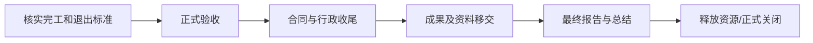

# 第十四章 收尾过程组

## 1. 本章导航

- **本章目标**：掌握结束项目或阶段过程，以及系统集成项目的验收、试运行、文档验收、终验、移交和总结工作。
- **重点小节**：行政收尾必要活动、项目正式验收、验收测试、项目终验、项目移交、项目总结。
- **关联章节**：[[20-领域/学习/软考/01-章节笔记/第十二章 执行过程组|第十二章 执行过程组]]、[[20-领域/学习/软考/01-章节笔记/第十三章 监控过程组|第十三章 监控过程组]]。
- **材料边界**：本笔记覆盖 [[20-领域/学习/软考/98-原始资料/十四章|第十四章原稿]] 的“结束项目或阶段”过程和收尾重点工作；ITTO 按原稿图片转写，尚未逐项核验第三版教材。

## 2. 章首速览

收尾过程组用于正式完成或关闭项目、阶段或合同：核实各过程均已完成，取得正式验收，完成行政与合同收尾，移交成果和过程资产，总结经验并释放组织资源。

主线可记为：

> 核实完成条件 → 正式验收 → 合同与行政收尾 → 成果/运维/过程资产移交 → 最终报告与项目总结 → 释放资源并正式关闭。

## 3. 结束项目或阶段

### 3.1 收尾过程组与结束项目或阶段

**收尾过程组**包括为正式完成或关闭项目、阶段或合同而开展的过程，旨在核实完成项目或阶段所需的全部过程均已完成，并正式宣告项目或阶段关闭。其作用是确保阶段、项目和合同得到恰当关闭。

**结束项目或阶段**是终结项目、阶段或合同所有活动的过程。其作用是存放项目或阶段信息、完成计划的工作，并释放组织资源以开展新的工作。该过程仅开展一次，或仅在项目预定义点开展。

> [!info] 数据流向
> ![[1b65a1a4b014a8e308c645f7d4f1e83d.png]]

> [!note] 原稿 ITTO（图片转写，待教材核对）
> - **输入**：项目章程；项目管理计划（所有组件）；项目文件（假设日志、估算依据、变更日志、问题日志、经验教训登记册、里程碑清单、项目沟通记录、质量控制测量结果、质量报告、需求文件、风险登记册、风险报告）；验收的可交付成果；立项管理文件；协议；采购文档。
> - **工具与技术**：专家判断；数据分析（文件分析、回归分析、趋势分析、偏差分析）；会议。
> - **输出**：项目文件更新（经验教训登记册）；最终产品、服务或成果；项目最终报告；组织过程资产更新。

### 3.2 行政收尾必要活动

项目或阶段行政收尾包括六类活动：

1. **达到完工或退出标准**：确保文件和可交付成果为最新版本且问题均已解决；确认成果已交付给客户并正式验收；确保全部成本计入项目成本账；关闭项目账户；重新分配人员；处理多余材料；重新分配设施、设备和其他资源；按组织政策编制详尽的最终项目报告。
2. **关闭合同协议**：确认卖方工作已正式验收；最终处置未决索赔；更新记录反映最终结果；存档相关信息供未来使用。
3. **沉淀记录与知识**：收集项目或阶段记录；审计项目成败；管理知识分享与传递；总结经验教训；存档项目信息供组织未来使用。
4. **移交成果**：向下一阶段，或者生产和（或）运营部门移交产品、服务或成果。
5. **改进组织政策和程序**：收集改进或更新建议，并发送给相应组织部门。
6. **测量干系人满意度**。

### 3.3 项目最终报告

项目最终报告用于总结项目绩效，内容包括：

- 项目或阶段概述；
- 范围目标、范围评估标准，以及达到完工标准的证据；
- 质量目标、项目和产品质量的评估标准；
- 成本目标；
- 最终产品、服务或成果确认信息的总结；
- 进度计划目标，包括成果是否实现项目预期效益；
- 最终产品、服务或成果如何满足业务需求的概述。

## 4. 收尾过程的重点工作

### 4.1 项目正式验收

项目验收是项目收尾的重要环节，完成后才能进入项目总结等后续阶段。正式验收包括验收项目产品、文档和已经完成的交付成果。

系统集成项目应根据项目前期签署的合同及对应技术工作内容进行验收；若发生合同变更，应把变更内容作为验收评价依据。软件类系统集成项目还需以甲乙双方签署或认可的软件需求规格说明书作为验收依据。验收测试用例应覆盖其中所有功能性需求和非功能性需求。

验收测试可由业主和承担单位共同进行，也可由第三方公司进行。系统集成项目验收阶段主要包括：**验收测试、系统试运行、系统文档验收、项目终验**。

### 4.2 验收测试

**验收测试**是依照双方合同约定的系统环境，对信息系统进行全面测试，以确保系统满足建设方的功能性需求和非功能性需求。原稿写作“功能需求和功能需求”，结合紧随其后的测试用例要求作上述辨识，仍待教材核对。

验收测试阶段包括：编写验收测试用例；建立验收测试环境；全面执行验收测试；出具验收测试报告；签署验收测试报告。

### 4.3 系统试运行

系统试运行期间主要包括：**数据迁移、日常维护、缺陷跟踪和修复**。

系统缺陷应及时修复以更正系统功能；额外提出的信息系统新需求应遵循项目变更流程，也可以暂时搁置。原稿“额外信息系统新需求”语序不完整，正文仅作最小辨识，待教材核对。

### 4.4 系统文档验收

系统集成项目的验收文档包括：系统集成项目介绍；系统集成项目最终报告；信息系统说明手册；信息系统维护手册；软硬件产品说明书和质量保证书。

### 4.5 项目终验

一般项目可将系统测试和最终验收合并进行。最终验收报告是业主方认可承建方项目工作的主要文件之一；最终验收标志着项目结束和售后服务开始。

项目终验包括双方对以下事项的认可和接受：验收测试文件；系统试运行期间的工作状况及其结束；系统文档；结束项目工作。

项目最终验收合格后，由双方项目组撰写验收报告并提请双方工作主管认可，标志着项目组开发工作结束、项目后续活动开始。“双方工作主管”的具体称谓待教材核对。

## 5. 项目移交

### 5.1 三类项目移交

系统集成项目移交通常包括：**项目用户移交、向运维和支持团队移交、过程资产向组织移交**。

- **向用户移交**：需求说明书、设计说明书、项目研发成果、测试报告、可执行程序、用户使用手册。
- **向运维和支持团队移交**：在用户移交内容基础上，增加安装部署手册或运维手册。
- **向组织移交过程资产**：项目档案、项目或阶段收尾文件、技术和管理资产。

### 5.2 过程资产移交

向组织移交的过程资产包括：

- **项目档案**：项目管理计划、范围计划、成本计划、进度计划、项目日历、风险登记册、其他登记册、变更管理文件、风险应对计划、风险影响评价。
- **项目或阶段收尾文件**：标志项目或阶段完工的正式文件，以及可交付成果移交给他人的正式文件。
- **技术和管理资产**。

## 6. 项目总结

### 6.1 项目总结及准备工作

项目总结属于项目收尾的管理收尾（行政收尾）。实施行政收尾包括收集项目记录、分析项目成败、收集应吸取的教训。原稿末段出现“行政结尾”，正文按上下文整理为“行政收尾”。

项目总结的意义：了解全过程工作情况和绩效；了解出现的问题并总结改进措施；总结值得吸取的经验；对总结文档进行讨论，通过后存入公司知识库。

准备工作包括：收集整理项目过程文档和经验教训；汇总经验教训，形成项目总结会议讨论稿。

### 6.2 项目总结会

项目总结会讨论：项目目标、技术绩效、成本绩效、进度计划绩效、项目沟通、问题识别与解决、意见和改进建议。

## 7. 章末综合复习

### 7.1 核心对比

| 易混项 | 区分 |
|---|---|
| 收尾过程组 / 结束项目或阶段 | 前者是正式关闭的过程组概念；后者是终结项目、阶段或合同所有活动的具体过程 |
| 验收测试 / 系统试运行 / 文档验收 / 项目终验 | 分别验证系统、观察运行、核验文档、完成最终认可 |
| 向用户移交 / 向运维团队移交 | 运维移交在用户移交内容之外，还包括安装部署手册或运维手册 |
| 项目最终报告 / 项目总结 | 最终报告概括范围、质量、成本、进度、成果和业务需求；项目总结侧重全过程绩效、问题、经验与改进 |
| 行政收尾 / 合同收尾 | 行政收尾覆盖记录、资源、知识、报告与满意度；合同收尾聚焦卖方验收、索赔、记录和存档 |

### 7.2 必须准确记忆

- 行政收尾六类必要活动。
- 项目最终报告的七类内容。
- 验收阶段四方面：验收测试、系统试运行、系统文档验收、项目终验。
- 验收测试五步骤与测试用例覆盖范围。
- 项目移交三类及用户、运维移交内容差异。
- 项目总结意义、准备工作和总结会七类议题。

### 7.3 闭卷自测

> [!question]- 1. 结束项目或阶段过程的作用是什么？
> 存放项目或阶段信息，完成计划的工作，释放组织资源以开展新的工作。

> [!question]- 2. 行政收尾包括哪六类活动？
> 达到完工/退出标准、关闭合同协议、沉淀记录与知识、移交成果、改进组织政策程序、测量干系人满意度。

> [!question]- 3. 系统集成项目验收阶段主要包括哪四方面？
> 验收测试、系统试运行、系统文档验收、项目终验。

> [!question]- 4. 验收测试用例应覆盖什么？
> 软件需求规格说明书中的全部功能性需求和非功能性需求。

> [!question]- 5. 项目移交通常包括哪三类？
> 项目用户移交、向运维和支持团队移交、过程资产向组织移交。

> [!question]- 6. 项目总结会讨论哪些内容？
> 项目目标、技术绩效、成本绩效、进度计划绩效、项目沟通、问题识别与解决、意见和改进建议。

## 8. 勘误与依据

- 原稿“可交付成果已交付为客户”按上下文辨识为“交付给客户”。
- 原稿“卖方的工作已过正式验收”语句不完整，正文最小整理为“卖方工作已正式验收”；准确措辞仍待教材核对。
- 原稿“项目验收 的项目收尾中的重要环节”结合上下文补足为“项目验收是项目收尾的重要环节”。
- 原稿“甲乙双方签署或认可的入软件需求规格说明书”中的“入”按上下文视为误入字符。
- 原稿“功能需求和功能需求”结合下一句“功能性需求和非功能性需求”，正文按后者整理，待教材核对。
- 原稿“系统缺陷及时更正系统功能”语句成分残缺，正文按“系统缺陷应及时修复以更正系统功能”作最小辨识，待教材核对。
- 原稿“额外信息系统新需求”语序不完整，正文按“额外提出的信息系统新需求”作最小辨识，待教材核对。
- 原稿“行政结尾”按上下文辨识为“行政收尾”。
- 原稿“双方工作主管”的正式称谓待教材核对。
- 本次只做原稿内重组、图片转写与辨识辅助，未逐项核验教材版次和页码。

## 9. 本章入口

- 卡片索引：[[20-领域/学习/软考/00-导航/第十四章知识点索引|第十四章知识点索引]]
- 错题入口：[[20-领域/学习/软考/03-错题库/错题库#第十四章 收尾过程组|第十四章错题]]
- 原始资料：[[20-领域/学习/软考/98-原始资料/十四章|第十四章原稿]]
- 总导航：[[20-领域/学习/软考/00-导航/知识地图|知识地图]]｜[[20-领域/学习/软考/00-导航/备考首页|备考首页]]
