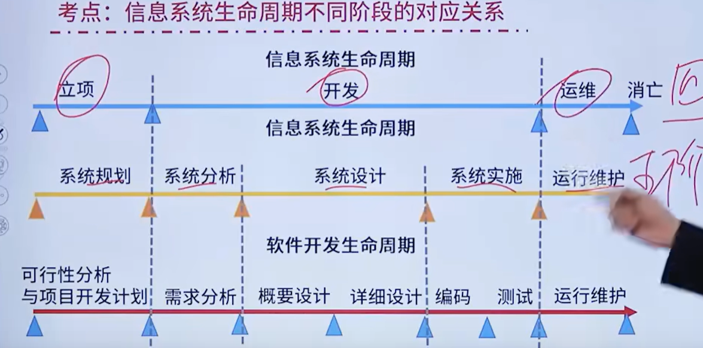
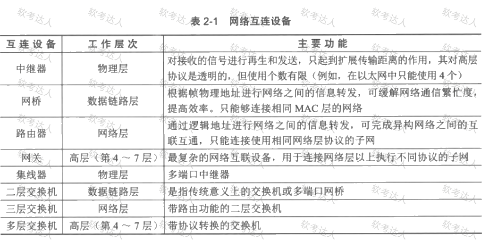
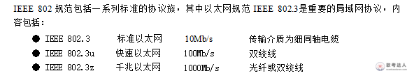
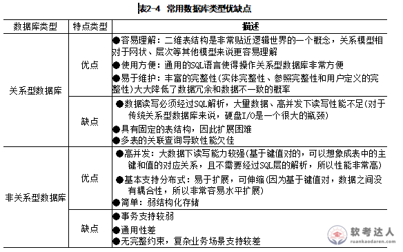

# 课本

## 第一章，

### 信息与信息化

#### 信息基础

信息：不是物质，也不是能量，

数学家香农：信息是用来消除随机不定性 的东西

##### 信息特征：

- 客观性：不以人的意志为转移

- 普遍性：无处不在

- 无限性： 无止境

- 动态性： 跟随时间\-变化的

- 相对性： 不同的认识主体  对同一事物中获取的信息以及信息量 可能不同

- 依附性： 必须依附媒体介质

- 变换性： 信息通过处理可以实现变换或转换。

- 传递性： 可以实现时间和空间上的传递

- 层次性：分等级

- 系统性： 信息可以表现为一种集合，不同信息可以形成不同整体

- 转换性：信息的产生不能没有物质，信息的传递不能没有能量

##### 信息的质量属性：

- 精确性： 对事物状态描述的精准程度

- 完整性： 对事物状态描述的全面程度 完整信息包含所有重要信息

- 可靠性:  对来源、采集方法、传输过程都是可靠的

- 及时性： 信息获取与事件发生的间隔长短

- 经济性： 信息获取、传输带来的成本可以接受

- 可验证性： 可以被证实或证伪

- 安全性： 被非授权访问的可能，可能性越低，安全性越高

##### 信息的传输模型：

信息系统的重要指标 有效性\(发送的内容）和可靠性（接受的内容）

#### 信息系统基础

信息系统是由 相互联系、相互依赖、相互作用 的事物或过程组成的具有整体功能和综合行为的统一体。

- 目的性：具有明确的目标或者目的

- 整体性：一个整体

- 层次性：由多个元素组成，系统和元素是相对的。

- 稳定性：受到外部作用的同时，内部结果和秩序仍然能保持稳定

- 突变性：失稳后从一种状态进入另一种状态

- 自组织性：在内外因素的作用下 自发组织起来。

- 相似性： 同构同态

- 相关性： 元素可分可联系

- 环境适应性：与环境相互作用

- 开放性：可访问性

- 脆弱性：可能存在着丧失结构、功能、秩序的特征。

- 健壮性：系统能抵御非预期状态的特性。鲁棒性。

信息系统就是输入数据/信息，通过加工处理产生信息的系统

##### 信息系统的生命周期：

系统规划（立项方面，可行性研究）\-系统分析（逻辑模型，要做什么）\- 系统设计 （详细设计说明书，怎么做）\- 系统实施\-系统运维。

|阶段名称|确定|成果|
|---|---|---|
|系统规划||可行性研究报告 系统设计任务书|
|系统分析阶段|逻辑模型|系统说明书|
|系统设计阶段|物理模型|系统设计说明书|

#### 信息化基础

信息化：培养、发展以计算机为主的智能化工具为代表的新生产力，并使之造福社会的历史过程

##### 核心与内涵

- 主体

- 时域   长期过程

- 空域  一切领域

- 手段  基于现代的生产工具

- 途径  

- 目标  综合实力

##### 国际信息化体系六要素

信息技术应用 （龙头）、信息资源  （核心任务）、 信息网络（基础设施）、信息技术产业（物质基础）、信息化人才（成功之本）、信息化政策法规和标准规范（根本保障）

信息化趋势：第一步 2020 国际先进水平、第二步：国际领先的移动通信网络 ，第三步：全面支撑

信息化发展重点：数据治理、密码区块链技术、信息互联互通、智能网联、网络安全

**信息化建设****是我国现代化建设的重要组成部分：**

信息化的手段是：基于现代信息技术的先进社会生产工具。

信息化的核心：通过全体社会成员的共同努力

#### 现代化基础设施

新型基础设施：信息（技术新）、融合（应用新）、创新（平台新）基础设施

1、信息基础设施：通信、新技术、算力   ”技术新“

2、融合基础设施：智能交通、智慧能源   “应用新”

3、创新基础设施： 重大科技、科教、产业技术创新   ”公益属性“

工业互联网：第四次工业革命的重要基石

四要素：平台（中枢）、网络（基础）、数据（要素）、安全（保障）。

平台：边缘层、laas、paas、saas

网络体系分为三部分：网络互联、数据互通、标识解析

四个作用：数据汇聚、建模分析、知识复用、应用创新

城市互联网：

物联网：通信与识别、智能化、互联性

智慧城市：系统感知、传递可靠、高度智能。

#### 产业现代化

人员能力域：组织战略、人员技能

技术能力域：数据、集成、信息安全

资源能力域：装备、网络

制造能力域：设计、生产、物流等。

##### **农业农村现代化** 

三个方面：基础设施建设、发展智慧农业、**建设数字乡村**。

##### **工业现代化\-两化融合（信息化\+工业化）**
 两化融合的核心：**以信息化支撑、追求可持续发展模式**
 融合的四个方面：**技术、产品、业务、产业**。

**工业现代化\-智能制造**：基于先一代信息通信技术与先进制造技术深度融合。
等级：

- 一级 规划级：业务流程化

- 二级 规范级：建立数据库、单一业务活动的数据共享

- 三级 集成级：企业内部信息共享

- 四级 优化级：精准预测与优化

- 五级 引领级：创造新的业务

##### **服务现代化**

基础服务、生产和市场服务、个人消费服务、公共服务

**融合形态**：结合型融合、绑定型融合、延伸型融合

结合型：中间投入的服务投入占比越来越大

消费互联网

#### 数字中国

**数字中国：数字经济、政府、社会、生态**

数字经济：**数字产业化、产业数字化、数字化治理、数据价值化**

三化框架：**资源化、资产化、资本化**

数字政府：协同化、云端化、智能化、数据化、动态化； 共享、互通、便利

数字社会： 普惠、赋能、利民

智慧城市：数据治理、数字孪生、边际决策、多元融合、态势感知

智慧城市的发展成熟度等级

- 一级 规划级  策划

- 二级 管理级  管理

- 三级 协同级  多业务、多层次、跨领域应用系统

- 四级 优化级  深度融合

- 五级 引领级  高质量发展

## 第二章：

###### 错题：

软件定义 是新一轮科技革命和产业变革的新特征新标志

#### 计算机软硬件

硬件：控制器、运算器、存储器、输入设备、输出设备。

软件：系统软件、应用软件、中间件

**问题：**

控制器最核心的功能：解释控制信息并调度协调各部件工作。

#### 计算机网络

作用范围：

- 个人局域网（PAN）范围10m左右

- 局域网 （LAN）速率10Mb/s以上，范围1km左右

- 城域网 （MAN）5\~50km

- 广域网 （WAN）几十公里\-几千公里  它的通信子网主要使用 分组交换 技术

##### OSI网络层次主要功能和设备  重点

|层次|名称|主要功能|主要设备及协议|备注|
|---|---|---|---|---|
|7|应用层|实现具体的应用功能|||
|6|表示层|数据的格式与表达、加密、压缩|||
|5|会话层|建立、管理和终止会话|||
|4|传输层|确保数据可靠、顺序、无错|TCP、UDP、SPX||
|3|网络层|网络地址IP翻译对应的MAC地址 分组传输和路由选择|三层交换机、路由器、ARP、RARP、IP、ICMP、IGMP||
|2|数据链路层|控制网络层与物理层之间的通信 传送以帧为单位的信息|网桥、交换机、网卡、IEEE802\.3/\.2（局域网协议）、HDLC、PPP、ATM||
|1|物理层|包括物理连网媒介、二进制传输|中继器、集线器||

##### 错误记录：

**应用层** 负责对软件提供网络接口服务

IEEE 802\.3u 是快速以太网

##### SDN

SDN控制器：维护全局网络拓扑信息、通过流表规则控制交换机、支持网络编程和策略部署。

应用平面、控制平面、数据平面。从上到下（由北向南）

OpenFlow 协议主要用户 控制器与交换机之间的南向接口

网络安全态势感知：海量多元异构数据的汇聚融合技术、面向多类型的网络安全威胁评估技术、网络安全态势评估与决策支撑技术、网络安全态势可视化、

路由器：实现网络层协议转换

**网络交换技术： **

二层交换：数据链路层，根据MAC地址转发为以太网帧

主要功能

- MAC 地址学习 

- 帧转发与过滤 

- 广播帧处理 

- VLAN 划分 

- 环路检测与避免 

- 链路聚合

三层交换：网络层，根据IP地址进行路由转发

主要功能

- 不同 VLAN 之间通信 

- IP 路由 

- 子网划分 

- 静态路由 

- 动态路由 

- ACL 访问控制 

- 网关功能

四层交换：传输层  除识别 IP 地址外，还可以识别：

- TCP 协议 

- UDP 协议 

- 源端口 

- 目的端口 

- 连接状态

#### 存储与数据库

直连式存储（DAS）：通过电缆直接到服务器的

网络附加存储（NAS）

存储区域网络（SAN）

##### 数据结构模型 

层次模型：子女节点必须通过双亲节点，只能表示一对多关系、有向树结构。

网状模型： 能够更直接的描述现实客观世界 具有良好的性能 存储效率较高  支持多双亲

关系模型

数据库：主要技术 OLTP

**数据仓库：是一个****面向主题的、集成的、非易失的且随时间变化****的数据集合，用于支持管理决策。**

数据源\-数据存储与管理\-OLAP\-前端工具

ETL三个字母的含义：抽取、清理、转载

数据仓库的前端工具主要包括各种报表、查询工具、数据分析、数据挖掘以及应用开发工具

**问题：**

数据仓库 包含全部主体，数据集市面向特定主题

数据的存储与管理是整个数据仓库系统的核心。

关系型数据库支持 ACID 事务；不强制遵循ACID原则；

数据库访问中间件：ODBC、JDBC

面向消息中间件：MQSeries

分布式对象中间件：是建立对象之间关系的中间件

事务中间件：

#### 信息安全

**保密性、完整性、可用性** 

信息安全层次：设备安全（设备的稳定性、可靠性、可用性）、数据安全（秘密性、完整性、可用性）、内容安全、行为安全

##### 加密解密

对称加密：加密密钥和解密密钥相同 DES算法  加密速度快，数量大

非对称加密：机密密钥与解密密钥不相同。RSA算法

##### HASH函数

单向性、唯一性（只要输入不变，结果永远不变）

数字签名：不能抵赖、不能伪造、确认真伪  

##### 加密和认证的区别

加密：确保数据的保密性、阻止对手的被动攻击。

认证：确保发放方和接收方身份的真实性以及报文的完整性，阻止对手的主动攻击。

##### 网络安全技术

防火墙：架设在内外网之间

入侵检测系统（IDS）: 被动防御  通过监控网络或系统资源寻找攻击痕迹并报警

入侵防护系统（IPS）：主动防御 直接嵌入网络流量实现主动防护 预先拦截

VPN： 隧道技术、专用通道

安全扫描：检测安全弱点和系统漏洞

网络蜜罐： 陷阱，主动防御

网络安全的基本要素：机密性、完整性、可用性、可控性、可审查性。

##### **错误记录**

网络安全态势感知在 安全大数据 的基础上，进行数据整合、特征提取等，应用一系列态势评估算法，生成网络的整体态势情况。

APT: 长期潜伏、多阶段渗透

UEBA: 数据源层、数据采集与接入层、数据处理与标准化层、数据存储与计算层、用户与实体画像层、行为分析与监测层、风险评分与应用层

UEBA：可以解决 内部员工窃取敏感数据的高隐蔽性行为

特征检测（IDS）: 处理自动化蠕虫攻击

#### 大数据

概念：无法在一定时间范围内使用常规的软件工具进行捕捉、管理和处理的数据集合  TB\-PB\-EB\-ZB

海量数据、数据分析和挖掘

特点：容量大、种类多、速度快、价值低

大数据获取技术、分布式数据处理技术、大数据管理技术、大数据应用和服务技术

#### 云计算

是一种基于互联网的计算方式，通过这种方式在网络上配置为共享的软件资源、计算资源、存储资源和信息资源可以按需求 提供给网上终端设备和终端用户。

**超大规模、虚拟化、高可靠性、通用化、高可扩展性、按需服务**

##### 云计算的服务类型、云计算分类

基础设施即服务（IaaS）: 计算机能、存储能力

平台即服务（PaaS）: 虚拟操作系统、数据库管理系统、web服务  **考点**

软件即服务（SaaS）: 应用软件

容器技术属于元计算关键技术中的是 云存储技术、虚拟化技术、多租户和访问控制管理、云安全技术

云计算从应用范围来看可以分为公有云、私有云、混合云。

#### 物联网

物与物（T2T）人与物（H2T）、人与人（H2H）

应用层：物联网和用户的接口、实现物联网的应用。

网络层：各种网络和云计算平台，只整个物联网的中枢。负责传递和处理信息

感知层：识别物体、采集信息

##### 物联网的关键技术

传感器技术：射频识别技术（RFID）

传感网：微机电系统（MEMS）

应用系统框架

#### 区块链

以非对称加密算法为基础，使用共识机制、点对点网、智能合约等技术结合而成的一种分布式的存储数据库技术
**分类：****公有链、联盟链、私有链和混合链**

公有链：任何人都可以随时访问。

联盟链： 若干企业或机构共同管理的，参与节点较少

私有链：某个组织或者用户，控制参与节点个数的规则很严格，交易速度极快，隐私登记更高，去中心化程度被极大削弱

关键技术：分布式账本、加密算法、共识机制。

**一个通信系统包括三个部分：源系统（发送端或发送方）、传输系统（传输网络）、目的系统（接收端或接收方）**

#### 人工智能

机器学习、自然语言处理、专家系统

#### 虚拟现实技术

主要特征包括：沉浸性、交互性、多感知性、构想性、自主性

人机交互、传感器技术、动态环境建模、系统集成技术

服务的特性：无形性、不可分离性、可变性和不可存储性。

## 第三章：信息技术服务

#### 3\.1 内涵与外延 

**服务的特征**：

无形性、不可分离性、可变性、不可存储性。

**IT服务的内涵**：

服务是基本特性，内涵：本质、形态、过程、阶段、效益、内部关联、外部关联

本质特征，IT服务的组成要素包括：人员、过程、技术、资源。

过程特征：项目级、组织级、量化管理级、数字化运营。

效益特征：服务系统进行深度开发与广泛使用，从整体上提高组织核心竞争力和管理水平。

内部关联特征：依赖技术创新与业务模式创新的相互促进。

阶段性特征：分层次、分阶段的推进IT服务。

**IT服务外延：**

基础服务、技术创新服务、数字化转型服务、业务融合服务。

**基础服务**：咨询设计、开发服务、集成实施、运行维护、云服务和数据中心

**技术创新服务**：新技术加持下的新业态新模式的服务，智能化服务、数字服务、数字内容处理服务、区块链服务

**数字化转型服务**：支撑和服务组织数字化服务开展和创新融合业务发展的服务，数字化转型成熟度推荐服务，评估评价服务，数字化监测预警服务

业务融合服务：信息技术及其服务与各行业融合的服务。

**IT服务业的特征：**

高知识和高技术含量、高集群性、服务过程的交互性、服务的非独立性、知识密集性、产业内部成金字塔分布、法律和契约的强依赖性、声誉机制。

#### 3\.2 原理与组成：

**ITSS：** 

IT服务标准库

**IT服务的基本原理：**

能力要素、生存周期要素、管理要素

**能力要素：**

人员（P）、过程（P）、技术（T）、资源（R） PPTR

人员：正确选人；过程：正确做事；技术：高效做事；资源：保障做事

过程是通过合理利用资源，提高管理水平和确保服务质量的关键要素

**IT服务的生命周期**：

战略规划、设计实现、运营提升、退役终止。 （简称：SDOR）

监督提供保障 管理提供支撑

**ITSS定义的IT服务四个核心要素：**

人员、过程、技术、资源

对IT服务需方的价值收益：提升服务质量、优化服务成本、强化服务效能、降低服务风险。

#### 3\.3服务生命周期：

**IT服务生存周期要素：**

战略规划、设计实现、运营提升、退役终止

**战略规划**：从业务战略出发、以需求为中心、对IT服务进行全面系统的战略规划。

**服务战略规划**：是组织整个IT服务发展和能力体系建设的首要之事。

**战列策划报告** 是战略规划阶段的核心成果之一。

根据业务需求和市场变化 ，优化服务流程、提升服务能力属于 运营提升

战略规划报告的几个基本原则：

合规性：必须遵从政策法规的要求

业务保障原则：关键业务优先

资源优化配置：成本合理原则

管理方法论：面向体系化的管理原则。

**服务设计中的风险：**

**技术风险、管理风险、成本风险、不可预测风险**

服务部署：是衔接服务设计与服务运营的中间活动。

服务运营阶段内容包括：

业务运营、IT运营，

对服务支持系统进行监控、识别、分类并报告服务支持系统的异常、缺陷和故障。

服务运营阶段通常占服务整体生命周期的 **80%**

组织如果要终止服务，需要 书面的服务终止计划。

**设计实现的主要输出**：IT服务的体系结构定义、服务解决方案的部署、专用工具和管理体系的建立

#### 3\.4服务标准化

IT服务的产业化进程分为三个阶段：产品服务化（前提）、服务标准化（保障）、服务产品化（趋势）。

产品服务化的特征：

1. 以产品为主线、服务依附于产品

2. 在服务过程中，常对服务没有明确考核

3. 产品和服务是不可分割的。

服务标准化：

1. 建立了标准的过程、实施规范以及相关制度；

2. 具有明确的有形化产出物描述及相关模版；

3. 实施服务的过程有记录，此记录可以追溯且可审计。

4. 建立完善的服务质量考核指标体系。

服务产品化的特征：

1. 具有清晰的服务目录；

2. 具有独立的价值、明确的功能和性能指标；

3. 对具体的服务有相应的服务级别的要求；

4. 对服务有明确的考核指标；

5. 对服务产品实施全生命周期管理。

ITSS的建设目标主要聚集在：支撑国家战略、引导产业高质量发展、促进新技术应用创新、指导IT服务业务升级、确保标准化工作有序开展。

对IT服务需方和供方的价值收益主要包括： 提升服务质量、优化服务成本、强化服务效能、降低服务风险。

**ITSS标准体系建立原则：**

**目标性、整体性、有序性、开放性、动态性**

ITSS5\.0标准体系框架：

数字中国建设、产业高质量发展、新发展格局构建以及自主创新的国家战略和市场需求的双轮驱动下

以 **基础服务标准** 为底座、以 **通用标准和保障标准 **为支柱，以 **技术创新服务标准和数字化转型服务标准** 为引领，共同支撑业务融合的实现。

ITSS5\.0的主要内容：

通用标准、保障标准、基础服务、技术创新服务、数字化转型服务、业务融合。

#### 3\.5服务质量评价

定义IT服务质量为：信息技术服务的 **固有特性** 满足要求的程度

服务的需方和供方之间是通过 **服务质量特性** 来进行互动的。

IT服务质量模型用于定义服务质量 的各项特性：安全性、可靠性、响应性、有形性、友好性。

1. 安全性：可用、完整、保密

2. 可靠性：完备、连续、稳定、有效、可追溯

3. 响应性：及时、互动

4. 有形性：可视、专业、合规

5. 友好性：主动、灵活、礼貌

连续性：确保服务协议在任何情况下都能得到满足的程度，致力于将风险降低至合理水平以及在业务中断后能进行业务恢复

#### 3\.6 服务发展

新一代信息技术应用：

5G、云计算、区块链、人工智能、数字孪生、北斗通信

数字化转型为IT服务提供了新的实现手段，赋予了其更多的内涵，促使 数据服务、区块链服务、数字内容处理服务、数字化转型服务的发展。

#### 3\.7 服务集成与实践

服务集成：在传统意义上的信息系统集成关注技术融合的基础上，更加强调数据融合共享条件下的 敏态集成能力建设 ，是信息系统软硬件面向 “稳态”集成后，面向各行业领域数字化转型和服务化发展的新型实践。

服务集成：

以 包含信息系统软件软件 在内的** 服务产品 **为集成对象，

以 **量化的服务水平管理** 为抓手， 

以 跨组织、跨团队的服务动态融合为 **关注焦点**

以 服务交付管理 为项目管理主要内容

以 服务绩效和服务价值 为集成成果评价关键点。

服务核心四要素：**需方、供方、环境 、过程**

服务集成的重要关注点：**服务数据、知识资产的管理**

### 第四章：信息系统架构

#### 4\.1 架构基础

信息系统集成项目涉及的架构通常有：系统架构、数据架构、技术架构、应用架构、网络架构、安全架构等

架构的本质是 决策 ，是权衡 方向、结构、关系、以及 原则 各方面因素后进行的决策。

框架是一个用于 规划、开发、实施、管理 和 维持架构的概念性结构。

信息系统体系架构总体参考框架的四个组成部分：

战略系统（第一层）、业务系统、应用系统、信息基础设施。

业务系统与应用系统 同在第二层，属于战术管理层

信息基础设施 在第三层，组织实现信息化、数字化的基础部分，相当于运行管理层。

**战略系统**有两部分组成：高层决策支持系统（信息基础为基础）、组织的战略规划体系。

设立战略系统的含义：

- 表示信息系统对组织高层管理者的决策支持能力

- 表示组织战略规划对信息系统建设的影响和要求。

**业务系统**对组织现有业务系统、业务过程和业务活动进行建模，采用**业务流程重组（BPR\)**的原理和方法进行业务过程优化重组，并对重组后的业务领域、业务过程和业务活动进行建模，从而确定出相对稳定的数据，以此相对稳定的数据为基础，进行组织应用系统的开发和信息基础设施的建设。

**应用系统 **按照完成功能包含：

事务处理系统（TPS）、

管理信息系统（MIS）、

决策支持系统（DSS）、

专家系统（ES）、

办公自动化系统（OAS）、

计算机辅助设计/计算机辅助工艺设计/计算机辅助制造、制造执行系统（MES）

信息基础设施分为三部分：技术基础设施、信息资源设施、管理基础设施。

技术架构的设计遵从的原则**不包括** ： 技术驱动原则。

针对数据库系统安全，重点关注 完整性 设计

机密性服务的目的是确保信息仅仅对授权者可用

审计架构 指独立的部门或其所能提供的风险发现能力。

#### 4\.2 系统架构

信息系统架构是一种 体系结构，反映信息系统各组成部分之间的关系，以及与 相关业务系统、信息系统与相关技术之间的关系。

**架构的定义：**

架构是系统的抽象、强调原始的  **外部可见** 性

架构由 多个结构 组成，个别结构一般不能代表大型信息系统架构

架构可以独立于架构的描述 而存在

元素 及其行为的集合 构成架构的内容。

架构具有基础性：他是一个通用方案（复用性）。

架构隐含有 “决策”，重大决策应经过评审。

架构分类：

物理架构 和 逻辑架构

物理架构：集中式架构、分布式架构（分布式和客户端/服务器模式）

系统融合方式：横向融合、纵向融合、纵横融合。

横向融合：将同一层次的各种职能与需求融合在一起。

纵向融合：把某种职能和需求的各个层次的业务组合在一起

纵横融合：信息模型和处理模型两个方面，强调信息集中共享和程序模块化。

信息系统架构 

是在 全面考虑组织的战略、业务、组织、管理和技术的**基础**上

着重研究组织信息系统的组成成分及成分之间的关系

建立起 **多维度分层次的、集成的开放式** 体系架构

并为组织提供 具有一定 柔性的信息系统及 灵活有效的实现方式。

**常用架构模型**：

单机应用模式、客户端/服务器模式、面向服务架构（SOA）模式、组织级数据交换总线

单机应用系统：是最简的软件结构。

客户端/服务端模式（c/s）: 基于TCP/IP 协议的进程间通信 IPC编程的 “发送”与“反射” 程序结构

四种常见的架构：

- 两层C/S  胖客户端 模式，前台界面\+后台数据库服务

- 三层C/S与B/S结构，浏览器服务器模式

- 多层C/S结构：四层 前台界面、web服务器、中间件、数据库服务器，J2EE

- 模型\-视图\-控制器模式：多层C/S结构

面向服务架构（SOA）模式包括：面向服务架构、Web service、面向服务架构的本质。

规范与设计：

集成架构的演进 以应用功能 为主线架构\-\>以 平台能力 为主线架构\-\> 互联网为主线架构

应用功能为主线架构：拿来主义，可以直接采购成套 且成熟的应用软件。

平台能力为主线架构：将竖井式 信息系统 组成部分转化为  平层化 ，包括 数据采集平层化、网络传输、应用中间件、应用开发

互联网为主线架构：最大限度 App化（微服务），

**TOGAF** 使用一种开放式企业架构框架标准 ，为标准、方法论 和 企业架构专业人员之间的沟通 提供一致性的保障

架构开发方法（ADM）是TOGAF 规范中**最核心的内容**。被 迭代式 应用 在架构开发的整个过程中、阶段之间和每个阶段内部。

TOGAF的核心思想：模块化架构、内容框架、扩展指南、架构风格。

TOGAF：提供架构工件的机构化元模型、包含可重用架构构建块（ABB）、概述典型架构可交付成果。

价值驱动的体系结构：

价值模型核心特征：价值期望值、反作用力、变革催化剂。

重要性、程度、后果、隔离。

当制定了 应对 高优先级的方法之后，体系结构策略 就可以表达出来。

架构会分析这组方法，并给出 组织、操作、可变性、演变 等领域的指导原则。

分层模式：每一层都为上层提供服务，并使用下一层提供的功能，每一层最多只影响两层，只给相邻层提供相同的接口；允许每层用不同的方法实现。

确保数据完整性的技术： CA认证、数字签名、防火墙、传输安全、入侵检测。

#### 4\.3 应用架构

常用的应用架构规划与设计的基本原则：

业务适配原则、应用聚合化、功能专业化、风险最小化、资产复用化原则。

功能专业化：按照业务功能聚合性进行应用规划，满足不同业务条线需求。

对应用架构进行分层的目的：

实现 业务 与 技术 的分离，降低各层耦合性，提高各层的灵活性、有利于 故障隔离、实现架构 松耦合

应用分层体现以 客户 为中心的系统服务和交互模式，提供面向客户服务的应用架构视图。

应用分组的目的：

体现业务功能的分类和聚合，把紧密关联的应用或功能内聚为一个组

可以指导应用建设、实现系统内 高内聚 、低耦合， 减少重复建设

#### 4\.4 数据架构

数据架构 设计数据全周期之下的架构规划，包括：产生、流转、整合、应用、归档、消亡。

数据架构的**发展演进**：

1. 单应用架构时代

    1. 主要是数据模型、数据库设计，满足业务即可

2. 数据仓库时代

    1. 面向主题的、集成的、用于数据分析的全新架构，主要应用 **OLAP ，**侧重 **决策支持**

3. 大数据时代：

    1. 从批处理到 流处理，从大集中到 分布式。从批流一体 到 全量实时。

数据架构的**基本原则**：

数据分层、数据处理效率、数据一致性、数据架构可扩展性、服务于业务（最终目标）。

整合库：主要为各主题库提供增量和全量数据源。

主题库：直接面向治理应用提供专题数据服务、可以根据不同治理需求建立多个专题库。

#### 4\.5 技术架构

技术架构的**基本原则**：

成熟度控制原则 、技术一致性、局部可置换、人才技术覆盖、创新驱动。

MPP数据库的主要目的：支持大规模结构化数据的快速分析查询。

#### 4\.6网络架构

网络架构**基本原则**：

高可靠性、高安全性、高性能、可管理性、平台化和架构化。

局域网特点：

覆盖地理范围小、数据传输率高、低误码率，可靠性高、支持多种传输介质，支持实时应用。

通常由：计算机、交换机、路由器 等组成。

**局域网架构**： 单核心架构、双核心架构、环形架构、层次局域网架构。

单核心局域网 ：核心二层或三层交换设备 （核心设备），通过连接核心网交换设备与广域网之间的互联路由设备接入广域网

**单核心特点**：

核心 采用二层、三层及以上交换机

接入交换设备：采用二层交换机

核心与交换设备之间 采用 100M/GE/10GE 等以太网连接。

优点：网络结构简单

缺点：单点故障

**双核心架构**： 

核心：三层及以上交换机

特点：

网络内划分 VLAN 时，个VLAN之间访问 需通过 两台核心交换设备 来完成。接入设备仅提供 二层转发功能

核心交换设备之间互联，实现 网关保护或负载均衡

所有业务服务器同时连接至两台核心交换设备，通过 网关保护协议 进行保护

优点：

核心交换设备 有 保护能力、网络拓扑结构 可靠，可实现 热切换

各部门互相访问 有一条以上路径可选择，可靠性更高。

缺点：

设备投资高，对核心交换设备的端口密度要求 较高

**环形局域网：**

核心：多台核心交换 设备连接成  双 RPR动态 弹性分组环; 核心交换设备 通常 采用 三层或以上交换机 提供业务转发功能。

特点：

通过 RPR环 实现互访。

网络通过 两根反向光线 组成环形拓扑结构，节点在环上可以从两个方向到达另一个节点。

每根光线可同时传输 数据和控制信号。

优点：

具备自愈保护

具备 MAC 层 50ms 自愈时间

提供多等级、可靠的QoS服务、带宽 公平机制 、拥塞控制机制。

缺点：

组建大规模局域网时，多环之间只能通过 业务接口互通， 不能实现网络直接互通。

**层次局域网 **

由 核心层交换设备、汇聚层交换设备（负责实现用户设备接入，并分担核心层转发压力）、接入层交换设备、用户设备组成。

通过 广域网 的边界路由设备接入广域网。

特点：

核心层：提供高速数据转发功能;

汇聚层：提供充足接口实现与接入层之间 的互访控制。减轻核心交换设备的转发压力

接入层： 实现用户设备的接入

优点：网络拓扑易于扩展，网络故障可分级排查，便于维护

**广域网**： 通信子网和 资源子网 组成

通信子网的构成：**公用分组交换网、卫星通信网、无线分组交换网。**

广域网 属于多级网络，由 骨干网、分布网、接入网 组成。

广域网架构：

单核心广域网、多核心～、环形～、半冗余～、对等子域～、层次子域～

单核心广域网：一台核心路由设备和 各局域网 组成。核心路由设备采用 三层及以上交换机。各局域网之间访问 需要经过 核心路由设备

特点：局域网之间不设立 其他路由设备；局域网至核心路由 之间采用广播线路；路由设备与局域网互联接口属于对应 局域网子网。

核心路由设备 与 各局域网可采用  10M/100M/GE 以太网接口连接。

优点：网络结构简单

缺点：单点故障容易导致整网失效的风险。

双核心广域网：两台核心路由设备 和 各局域网 组成。

特点：

核心路由设备 通常采用 三层及以上交换机

网络内个局域网之间互相访问 需经过 两台核心路由设备

优点：可有多条路径选择，可靠性高，路由层面可实现热切换。

缺点：设备投资高、核心路由冗余设计实施难度高，容易形成 路由环路。

环形广域网：

采用 三台以上核心路由器设备。。

特点：三层或以上交换机， 网络内各局域网之间访问 **需要经过 核心路由设备构成的环**

优点：有多条路径选择，可实现 无缝热切换，保证业务访问连续性。

缺点：投资比双核心高，容易形成 路由环路。

半冗余广域网：由多台核心路由设备 连接各局域网形成 

特点：任意核心路由设备 至少存在 两条以上连接 至其他路由设备的链路

如果任意两个核心路由设备 之间均存在连接，则属于半冗余广域网特例。即 全冗余广域网。

优点：结构灵活、扩展方便。

缺点：网络结构零散，不便于管理和排障。

对等子域网

通过将广域网的路由设备划分成 两个独立子域。每个子域采用 半冗余方式互联，对等子域中任何路由设备 都可接入 局域网

特点：对等子域之间的互访 以互联链路为主，内部访问较为独立

优点：对等子域之间 可做 路由汇总或明细路由条目匹配， 路由控制灵活。

缺点：难度较高，容易形成 路由环路，非法路由 对性能要求高。

层次子域广域网：

多个较为独立的子域 构成，子域采用 半冗余 方式 互联，子域存在层次关系。

特点：层次子域结构具有较好的扩展性 ，低层子域互访 需要通过 高层子域完成。

优点：层次子域结构具有较好扩展性。

缺点：冗余设计实施难度高，容易形成 路由环路。非法路由。

**5G常用业务方式：**

5GS\( 5G System\) 与 DN \(Data Network\) 互联，5G 网络边缘计算。

5GS 为移动段用户 （ UE \) 提供服务时，需要 SDN网络， 5GS 和 DN 之间通过 N6 接口互连

5GS 和 SDN 之间是一种 路由关系，UE 访问 DN的业务流在他们之间通过 **双向路由配置** 实现转发。

UE 流向 DN : 上行（UL\) 业务流

DN 流向 UE : 下行 （DL）业务流。

UE 通过 5GS 接入 DN 两种方式：透明模式（UE直接使用运营商规划的IP地址）、非透明模式（SMF需通过DN\-AAA服务器完成UE认证）。

5G 网络边缘计算

支持在靠近 终端用户 UE 的移动网络 边缘部署 5G UPF 网元

从业务连续性来说，5G 网络 可提供 SSC 模式1（用户移动过程中会话IP接入点始终不变）  SSC模式2（移动过程中网络触发现有会话释放并立即触发新会话建立） SSC模式3（释放现有会话前会先建立一个新的会话。对中断敏感的业务）

SMF（会话管理功能）网元负责动态配置UPF的分流规则

运营商自有应用AF 通过 NEF 触发 5G网络生成分流策略

NEF主要实现5G网络能力开发，接收AF的请求并出发策略生成。

PCF负责将动态生成的本地分流策略配置给相关 SMF，SMF再根据策略进行后续操作。

ASP作为业务提供者，可选择连续性模式。

5G UPF网元 与边缘计算平台（MEF）是 垂直行业提供时间敏感、高带宽业务就近分流服务的关键组件组合。

#### 4\.7 安全架构

**安全保障** 以  风险和策略 为基础，安全保障 应包含 技术、管理、人员和工程过程。

常见安全威胁：  信息泄露、破坏信息的完整性、拒绝服务、非法访问、窃听、业务流分析、假冒、旁路控制、授权侵犯、特洛伊木马、陷阱门、抵赖、重放、计算机病毒、人员渎职、媒体废弃、物理侵入、窃取、业务欺骗

安全架构 体现在 信息系统上 

三道防线：系统安全架构、安全技术体系架构、审计架构。

构建安全技术体系架构：安全基础设施、安全组件与支持系统、安全工具和技术

信息安全架构设计 三要素： 人、管理、技术手段。

系统安全设计重点考虑：系统安全保障体系和信息安全体系架构

构建信息安全保障体系框架应包括 技术体系、组织机构体系、管理体系

WPDRRC 六个环节：预警（W）、保护\(P\)、检测\(D\)、响应\(R\)、恢复\(R\)、反击（C）

有较强的 时序性、动态性

能够较好的反应出：预警能力、保护、检测、响应、恢复、反击

WPDRRC 三大要素 人员（核心）、策略（桥梁）、技术（保证）

信息系统安全设计考虑两方面重点：系统安全保障体系、信息安全体系架构。

系统保障体系：安全服务、协议层次、系统单元 三层组成。

安全保障体系由： 安全服务、协议层次、系统单元 组成。

信息安全体系架构可以从5个方面开展分析和设计：

1. 物理安全  是前提，（环境安全、设备、媒体）

2. 系统安全  是基础，（网络结构安全、操作系统安全、应用系统安全）

3. 网络安全  是关键， （访问控制、通信保密、入侵监测、网络安全扫描、防病毒）

4. 应用安全  对共享资源和信息操作带来的安全问题， （资源共享、信息存储）

5. 安全管理 （制定健全的安全管理体制、构建安全管理平台、增强人员的安全防范意识）。

配置防火墙 是实现网络安全 最基本、最经济、最有效的安全措施

反病毒技术： 预防病毒、检测病毒、杀毒

网络安全架构设计包括：OSI 安全架构、认证框架、访问控制框架、机密性框架、完整性框架、抗抵赖性框架

OSI 标准 开放式通信系统互联模型，除了第五层（会话层）每一次都有安全措施

OSI 五类安全服务：鉴别、访问控制、数据机密性、数据完整性、抗抵赖性。

OSI 三种防御方式：多点技术防御、分层技术防御、支撑性基础设施（公钥基础设施、检测和响应基础设施）

认证框架：已知的、拥有的、不改变的 特性、相信可靠的第三方建立的鉴别、环境

鉴别信息的类型：交换鉴别信息、申请鉴别信息、验证鉴别信息。

鉴别服务的阶段：安装、修改鉴别信息、分发、获取（将验证鉴别信息分发到各个实体）、传送、验证、停活、重新激活、取消安装（把实体从实体集合中拆除）

访问控制框架：

决定开放系统环境中允许哪些资源

ACI（访问控制信息）访问控制目的的任何信息

ADI （访问控制判决信息）做出一个特定的访问控制判决时可供 ADF 使用的部分或全部 ACI

ADF （访问控制判决功能）根据 访问请求、ADI 请求上下文 使用访问控制策略规则 做出 访问控制判决

AEF （访问控制实施功能）

机密性框架

目的 确保信息 仅仅是对被授权者可用。

数据在传输中可通过 禁止访问 加密 提供机密性。

完成性框架

目的 通过 阻止威胁或探测威胁，完整性：数据不以 未经授权 方式进行改变 或损毁。

完整性服务的分类方式：

根据防范的违规分类：未授权的数据修改、未授权的数据创建、未授权的数据删除、未授权的数据插入、未授权的数据重放。

根据提供的保护方法：阻止完整性损坏、监测完整性损坏

是否支持恢复机制：具有恢复机制的、不具恢复机制的

抗抵赖性框架

证据的生成、验证、记录，以及在解决纠纷时 随即进行 证据恢复 和 再次验证

证据生成、证据传输、存储及恢复、证据验证、解决纠纷。

数据库完整性的设计原则：

静态约束尽量包含在 数据库模式 中

实体完整性约束 和 引用完整性约束 最重要的完整性约束

慎用 DNMS 

需求分析阶段必须制定完整性约束的命名规范

DBMS数据库完整性设计分为 ： 需求分析阶段、概念结构设计、逻辑结构设计

错题：

OSI 开放系统安全体系的安全服务：鉴别、访问控制、数据机密性、数据完整性和抗抵赖性

信息安全管理：制定健全安全管理体系、构建安全管理平台、增强人员安全防范意识。

系统安全架构：从源头提升信息系统自身安全性。

#### 4\.8 云原生架构

传统云计算的3层概念：基础设施即服务（IaaS\)，PaaS, SaaS

云原生的代码包括三部分：业务代码（核心）、三方软件（附属物）、处理非功能特性的代码（附属物）

业务代码：实现业务逻辑的代码；三方软件：业务库和基础库；处理：高可用、安全、可观测性。

云原生架构的基本原则：服务化原则、弹性原则、可观测原则、韧性原则、所有过程自动化原则、零信任原则、架构持续演进原则。

常用架构模式：服务化架构模式、Mesh化架构模式、Serverless架构服务、存储计算分离模式、分布式事务模式、可观测架构、事件驱动架构

服务化架构模式 云原生应用 的标准架构模式，典型模式（微服务、小服务模式）

可观测架构：Logging 、Tracing（追踪）、Metrics （度量）

事件驱动架构（EDA） 本质 ：应用/组件间的集成架构 模式。

Mesh化架构是把中间件框架（RPC、缓存）从业务进程中分离，让中间件的软件开发工具包与业务代码进一步解耦

分布式事务模式中，SEATA的AT模式，性能高且无代码开发工作。

XA的2PC协议性能差，不适合高并发场景；TCC入侵性强；SAGA通过正向事物\+补偿事务实现最终一致性；AT模式有场景限制。

