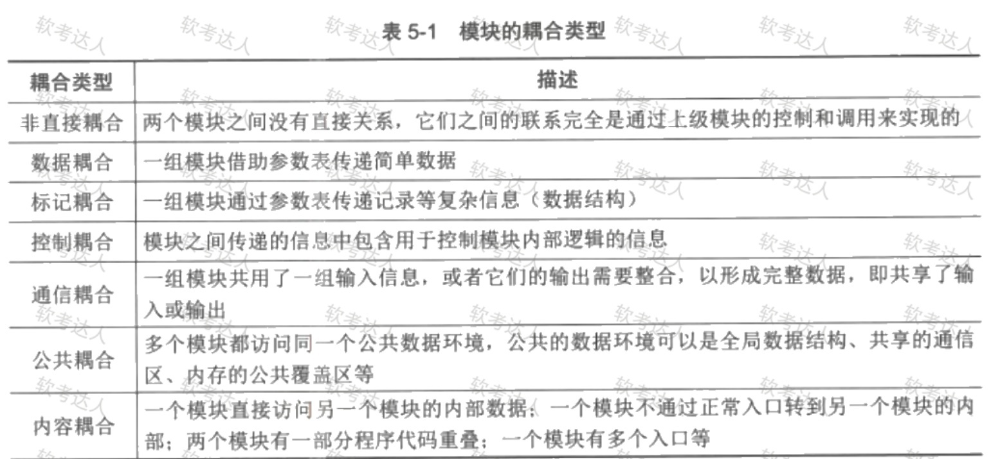
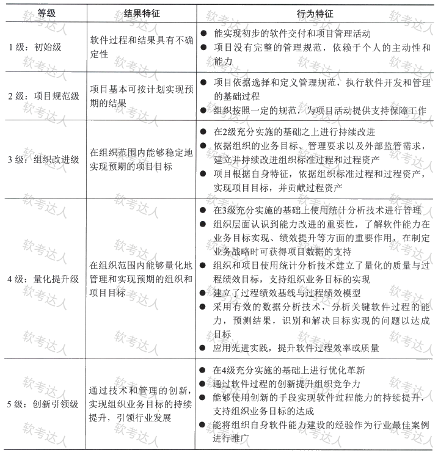

# 第五章

## 软件工程定义 

1、软件工程是指 应用计算机科学、数学及管理科学等原理，以 工程化 的原则和方法来解决软件问题的工程，其目的是：提高软件生产率、提高软件质量、降低软件成本。

2、电气与电子工程师协会（IEEE）对软件工程的定义是：将系统的、规范的、可度量的 工程化方法应用于 软件开发 、运行和 维护 的全过程及 上述方法的研究。

3、软件工程由 方法、工具 和 过程 3 个部分组成。

4、软件工程使用的方法是：完成软件项目的技术手段，它支持整个软件生命周期；软件工程使用的工具是 人们在开发软件的活动中智力和体力的扩展与延伸，它自动或半自动的支持软件的开发和管理，支持各种软件文档的 生成；软件工程中的过程贯穿于 软件开发的各个环节。

## 软件需求

1、需求是多层次的，包括 业务需求、用户需求和 系统需求，这个三个不同层次的需求从目标到具体、从整体到局部、从概念到细节。

2、质量功能部署（QFD）：通过多种角度对产品的特点进行描述，是一种将用户要求转化成软件需求的技术，最大限度的提升软件工程过程中用户的满意度。

软件需求：1、常规需求（系统应该有的功能或性能，越多用户越满意）；2 、期望需求（用户的想当然，但并不能正确描述这些功能或性能续期）；3、意外需求（兴奋需求，用户要求范围之外的）

3、常见的需求获取方式 ：用户访谈、问卷调查、采样、情节串联板、联合需求计划。

4、需求分析

需求的特性：无二义性、完整性、一致性、可测试性、确定性、可追踪性、正确性、必要性。

需求分析包括：结构化分析 \(SA\)、面向对象分析（OOA）

结构化分析：方法给出一组帮助系统分析人员产生功能规约的原理与技术，其建立模型的核心是 数据字典，围绕这个核心有 3 个层次模型：数据模型（实体关系图 E\-R图）、功能模型（数据流图 DFD）、行为模型（状态转换图 STD）

DFD 四种基本元素：数据流、处理/加工、数据存储、外部项。

数据字典的组成：数据项、数据结构、数据流、数据存储、处理过程。

OOA 模型的 5 个层次：主题层、对象类层、结构层、属性层、服务层。

OOA 的 5 个活动：标识对象类、标识结构、定义主题、定义属性、定义服务。

OOA 的基本原则：抽象、封装、继承、分类、聚合、关联、消息通信、粒度控制、行为分析。

数据抽象 是 OOA 的核心原则，强调把 数据 和 操作结合成一个不可分的系统单位 \(对象）。

5、需求规格说明书（SRS）包括：范围、引用文件、需求、合规性规定、需求可追溯性、尚未解决的问题、注解、附录。

6、需求变更：

变更控制过程：问题分析和变更描述、变更分析和成本计算、变更实现。

需求变更策略：1、必须遵循变更控制过程；2、未批准的变更不做设计和实现工作；3、由项目变更委员会决定实现哪些变更；4、风险承担者应了解变更内容；5、不能删除或修改变更请求的原始文档；6、需求变更能追踪到一个经核准的变更请求。

7、变更控制委员会（CCB）是项目所有者权益代表；组成：用户设实施方的决策人员。是决策机构不是作业机构。是决定是否能变更，不是提出变更。

8、需求追踪

目的：建立与维护 需求\-设计\-编程\-测试之间的一致性，确保符合用户需求。

正向追踪：检查 SRS 中每个需求是否 都能在后续工作成果中找到对应点；

逆向追踪：检查 设计文档、代码、测试用例 等都能在 SRS 中找到出处。

## 软件设计

1、 **结构化设计** 与 **面向对象设计**

2、结构化设计（SD）是一种面向数据流的方法，目的在于 确定软件结构，它是一个 自顶向下、逐层分解、逐步求精、模块化的过程。基础：数据流图、数据字典

3、从管理角度讲，结构化设计分为：概要设计和详细设计两个阶段。

4、模块结构

模块是组成系统的基本单位，特点：自由组合、分解、变换

模块的基本属性：功能、逻辑、状态。

耦合、紧密耦合、松散耦合、非直接耦合。

内聚：内聚越高、耦合越低

5、系统结构图（SC）

概要设计阶段的工具，反映系统的功能实现和模块之间的联系与通信，包括模型之间的层次结构，反映系统额总体结构。

详细设计必须遵循 概要设计；方案的更改，不得影响到概要设计方案；如果需要更改概要设计，必须经过 项目经理 的同意。

详细设计的表示工具： 图形工具、表格工具、语言工具

图形工具：业务流程图（关系、顺序、信息流向）、程序流程图（结构清晰，只能描述执行过程而不能描述有关数据）、问题分析图（PAD 更直观、结构更清晰能够反映和描述 自顶向下的历史过程。）、NS 流程图（功能域明确、不可能任意转移控制、容易表示嵌套关系及模版）。

6、面向对象设计 （OOD）

是 OOA 方法的延续，基本思想包括 抽象、封装、可扩展性（通过继承、多态来实现）。

原则：单职原则、开闭原则、里氏替换原则、依赖倒置原则、接口隔离原则、组合重用原则、迪米特原则。

单职：一个类有且仅有一个引起它变化的原因

开闭：对扩展开放、对修改封闭

里氏替换：子类替换父类，拓展父类

依赖倒置：依赖于抽象、接口编程

接口隔离：多个专门的接口

组合重用：尽量使用组合

迪米特：一个对象尽可能对其他对象少了解

7、实体类、控制类、边界类

边界类：用于封装在用例内、外流动的信息或数据流。位于系统与外界的交界处，接口。

8、UML 是一种定义良好、易于表达、功能强大且普遍适用的建模语言，它的作用域不仅支持 OOA（面向对象分析法）和 OOD （面向对象设计）、支持从 需求分析 开始的软件开发工程。

适合与各种软件开发方法、软件生命周期的各个阶段、各种领域、各种工具、编程语言。

9、UML 的结构包括 构造块、规则和 公共机制

基本的构造块：事物（重要组成部分）、关系（把事物紧密联系在一起）、图（多个相互关联事物的集合）。

10、UML 中的事物也称为 建模元素：结构事物、行为事务、分组事物、注释事物

11、UML 四种关系：依赖（一个会影响另一个）、关联（一个对象对另一个有联系）、泛化（特殊元素对象可替换一般元素对象）、实现（将不同的模型元素连接起来）

泛化：一般元素与特殊元素之间的分类关系。

UML的分组事务：包；类：结构事务；状态机：行为事务；注解：注释事物

12、类图、对象图、构件图、组合结构图、用例图、顺序图、通信图、定时图、状态图、活动图、部署图、制品图、包图、交互概览图。

包图：描述由模型本身分解而成的组织单元，以及它们直接点的依赖关系。

PAD 图：反应自顶向下、逐步细化

业务流程图：业务流程分析 易产生非机构化设计

NS流程图： 侧重于结构化、明确功能、控制转移范围、嵌套关系、模块层次

13、 UML 中的 5个标准视图： 逻辑视图、进程视图、实现视图、部署视图、用例视图。

进程视图：并发与同步结构

实现视图：物理代码文件

逻辑视图：侧重如何得到功能

用例视图：从外部角色展示功能

部署视图：硬件映射。

14、设计模式可分为 类模式、对象模式；根据目的和用途不同，分为 创建型模式、结构型模式、行为型模式。

## 软件实现

1、软件配置管理（SCM）是一种标识、组织和控制修改的技术。目标：标识变更、控制变更、确保变更正确实现，报告变更。  

软件配置管理 是一种标识、组织和控制修改的技术  

2、核心：版本控制（主要功能 追踪文件的变更、并发开发）、变更控制

3、软件配置管理活动：软件配置管理计划、软件配置标识、软件配置控制、软件配置状态记录、软件配置审计、软件发布管理与交付。

4、软件编码 程序设计语言：最基本工具；程序设计风格：源程序文档化、数据说明、语句结构、输入/输出方法。

编码效率：程序效率、算法效率、存储效率、I/O 效率。

5、测试方法：静态测试、动态测试（黑盒测试、白盒测试）。

6、白盒测试：也叫结构测试 用于软件单元测试，包括控制流测试、数据流测试、程序变异测试。

7、黑盒测试：等价类划分、边界值分析、判定表、因果图、状态图、随机测试、猜错法、正交试验 法。

8、软件测试分为：单元测试、集成测试、确认测试、系统测试、配置项测试、回归测试。

9、OO 系统的特征：封装性、继承性、多态性。

10、软件调试策略：蛮力法、回溯法、原因排除法。

## 部署交付

1、软件部署过程特征：过程覆盖度、过程可变更性、过程间协调、模型抽象。

部署模式：面向单机软件的部署模式、集中式服务器应用部署、基于微服务的分布式部署。

2、提交、集成、构建、部署、测试

3、容器技术：Kubemetes\+ Docker，优点：上手简单、轻量级架构，体积小；集合性很好，能更容易 打包复制和发布。

4、持续部署管理原则：同意的存储库、相同的部署方式、相同的部署脚本、阶梯式晋级、有运维人员执行、防止配置漂移、不可变服务器、蓝绿部署或金丝雀部署。

5、完整镜像部署三个环节：Build、Ship、Run

6、蓝绿部署：准备新旧两个版本，通过域名解析切换的方式将使用环境切换到新版本中，出现问题可快速回到旧版。而给

金丝雀部署：少量用户使用新版本，出现问题及时处理，正常适配所有用户。

## 软件质量管理

1、软件质量是 软件符合明确的叙述的功能和性能需求、文档中明确描述的开发标准及所有专业开发的软件都有具有的隐含特征的程度。

影响软件质量的三组因素：产品运行、产品修改、产品转移。

2、软件质量保证（SQA）建立一套 有计划、有系统的方法，向管理层保证拟定出标准、步骤、实践和方法能够正确的被所有项目所采用，通过对软件产品和活动进行  评审和审计 来验证软件的合乎标准。

3、质量保证的主要目标：事前预防工作、尽量在刚引入缺陷时将其捕获，不扩散到下一个阶段；作用于过程；贯穿所有活动中。

4、软件质量保证的主要 任务：

1、SQA 审计与评审：软件工作产品、软件工具、设备

2、SQA 报告：SQA 和高级管理者之间应有 直接沟通的渠道，报告必须发布给软件工程组

3、处理不合格问题。

## 软化过程能力成程度

1、CSMM 软件过程能力成熟度模型：4 个能力域、20 个能力子域、161 个能力要求。

治理

开发与交付

管理与支持

组织管理。

2、软件过程能力成熟度：初始级、项目规范级、组织改进级、量化提升级、创新引领级

3、

