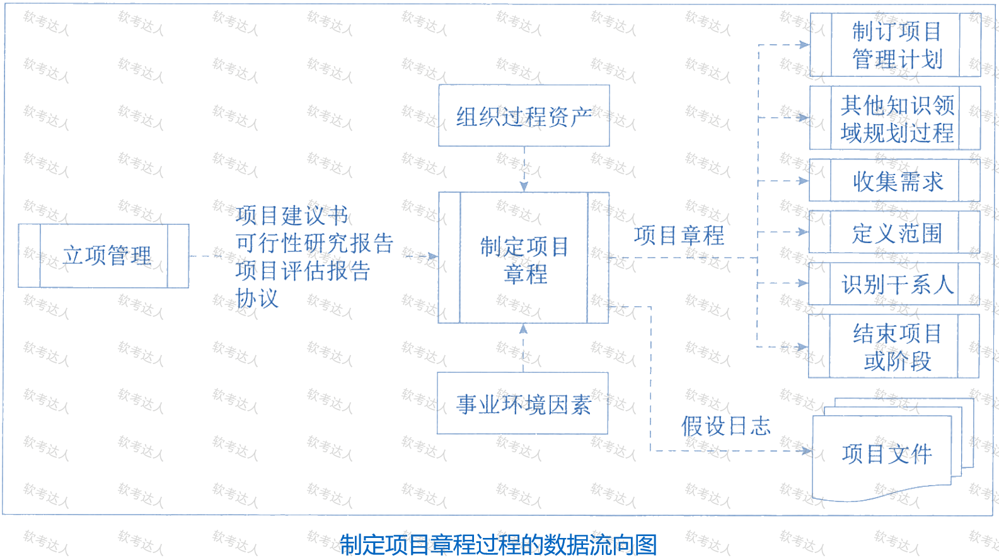
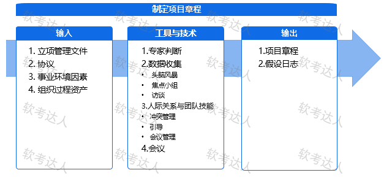
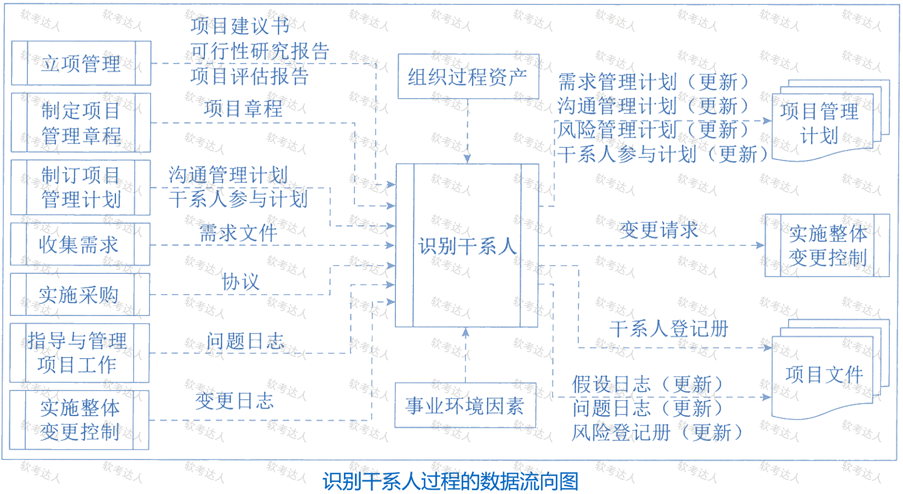
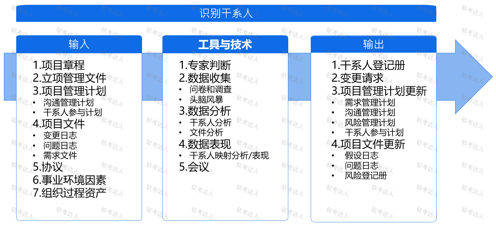
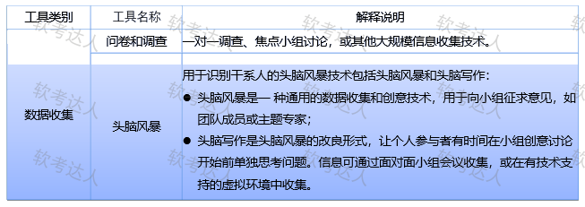
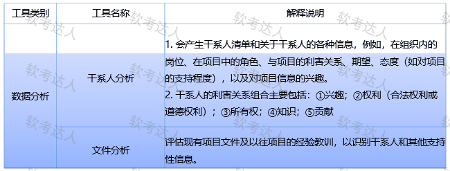
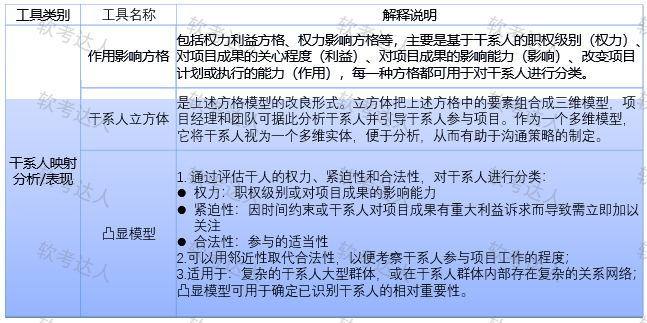
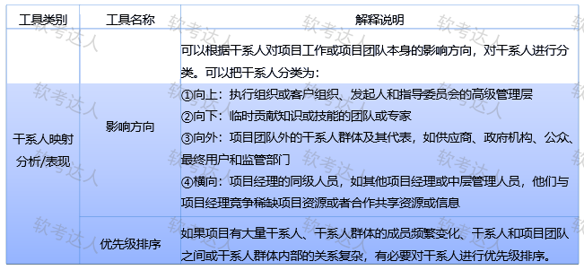

# 第十章

## 制定项目章程

1、启动过程组：定义一个新项目或现有项目的一个新阶段；授权开始该项目或阶段的一组过程

项目整合管理中 **制定项目章程**、项目干系人管理中的 **识别干系人**

2、启动过程组目的：**协调期望与项目目的，告知范围和目标，商讨对项目相关阶段的参与**

启动过程中**需要定义** 初步项目范围 和落实初步财务资源，识别干系人，指派项目经理，

以上应反映在** 项目章程和干系人登记册**中

项目章程获批，项目正式立项

3、启动过程组的作用：确保只有符合组织目标的项目才被立项、开始时就认真考虑商业论证、项目效益和干系人；

项目前期工作由 项目发起人、项目管理办公室（PMO）、项目组合指导委员会或其他干系人完成。

4、制定项目章程是：编写一份**正式批准项目**并**授权项目经理**在项目活动中使**用组织资源的文件** 的过程。

作用：

- 明确项目与组织战略目标之间的直接联系

- 确立项目的正式地位

- 展示组织对项目的承诺

- 本过程仅开展一次 或 仅在 项目的预定义是 开展 

5、

6、项目章程授权 项目经理进行 规划、执行 和控制，使用组织资源

应在 规划开始之前任命项目经理，项目章程可以由 **发起人** 编制，也可由 项目经理与发起机构合作编制

7、项目由 项目以外的机构 来启动，（发起人、PMO、项目组合治理委员会主席或其授权代表）

8、

## 识别干系人

1、识别干系人是 定期识别项目干系人，分析和记录他们的利益、参与度、相互依赖性、影响力和对项目成功的潜在影响的 过程

过程的作用：建立对每个干系人的适度关注，根据需要在 整个项目期间定期 开展，

2、识别干系人管理过程通常在 编制和批准项目章程 之前或同时首次开展，至少在每个阶段开始时以及项目或组织出现重大变化时重复开展。

3、项目干系人的主要类别：项目客户和用户、项目团队及成员、项目发起人、资源或职能部门、供应商

4、

5、

6、

7、

8、 

## 启动过程组织的重点工作

1、重点工作：项目启动会议、关注价值与目标

2、项目启动会议的目的：使项目各方干系人 明确项目的目标、范围、需求、背景、各自的职责和权限，正式公布项目章程

3、项目启动会议的五个工作步骤：确定会议目标、会议准备、识别参会人员、明确议题、进行会议记录

4、项目目标：项目成果性目标、约束性目标。

