# 重点章节

## 11章

### 制定项目管理计划

1、规划过程组包括 明确项目全部范围、定义和优化目标，并为实现目标 制定行动方案 的一组过程

规划过程组中的过程负责：制定项目管理计划的各组成部分以及用于执行项目的项目文件。

2、制定项目管理计划 是  定义、准备和协调项目计划的所有组成部分，并把他们整合为一份综合项目管理计划的过程

这一过程目的：生成一份综合文件、用于确定所有项目工作的基础与执行方式。

3、制定项目管理计划过程的数据流向

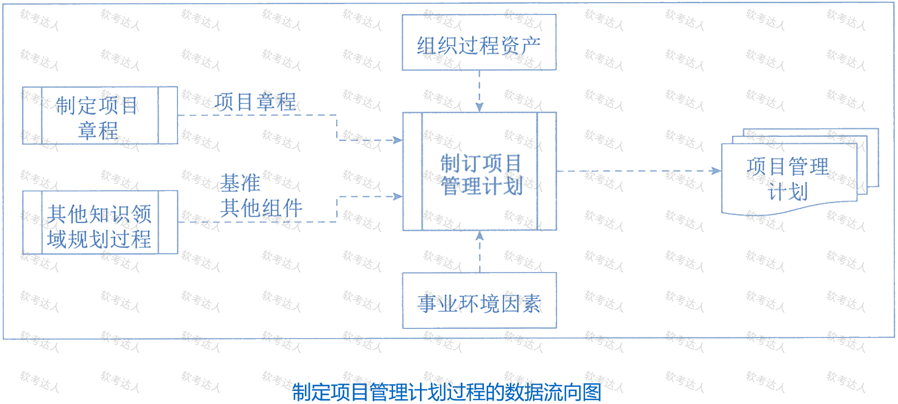

4、事业环境因素：政府或行业标准、法律法规要求和相关制约因素、组织的结构、文化、管理实践和可持续性、组织治理框架、基础设施

5、能够影响制定项目管理计划过程的 组织过程资产：

- 组织的标准政策、流程和程序，项目管理计划模板、变更控制程序

- 监督和报告方法、风险控制程序、沟通要求

- 以往 类似项目的相关信息

- 历史信息和经验教训知识库

6、项目管理计划：是说明项目执行、监控和收尾方式的一份文件

它整合并综合所有知识领域的子管理计划和基准，以及管理项目所需的其他组件信息。

项目管理计划组件主要包括：

1、子管理计划：范围、需求、进度、成本、质量、资源、沟通、风险、采购、干系人

2、基准： 范围、进度、成本

3、其他组件：变更管理计划、配置管理、绩效测量、项目生命周期、开发方法、管理审查。

### 规划范围管理

1、规划范围管理是：为记录如何定义、确认和控制项目范围及 产品范围而创建 范围管理计划的过程

作用：对如何管理范围提供指南和方向

规划范围管理过程的数据流向

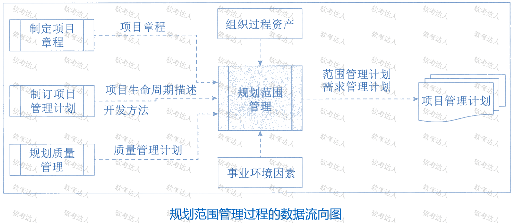

2、规划范围管理过程使用的项目管理计划组件：

质量管理计划：在项目中实施组织的 质量政策、方法和标准的方式会影响管理项目产品范围的方式。

项目生命周期描述：

开发方法：定义项目是采用 预测型、适应型还是混合型

3、范围管理计划用于指导如下工作：

制定 项目范围说明书；

根据详细范围说明书 创建 WBS

确定如何审批和维护范围基准

正式验收 已完成的项目可交付成果

根据项目需求：范围管理计划可以是 正式或非正式的、非常详细或高度概括

### 收集需求

1、收集需求的目的：为了实现目标而确定、记录并管理干系人的需要和需求的 过程

本过程的作用：为了定义产品范围和项目范围准定基础

2、收集需求过程的数据流向

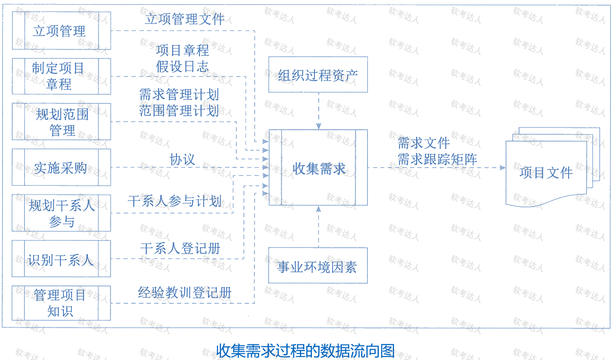

3、收集技术：头脑风暴、访谈、焦点小组、问卷调查、标杆对照

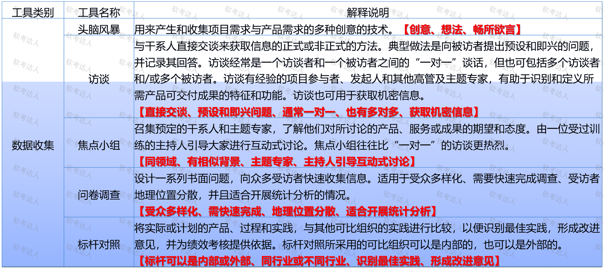

4、文件分析：可用于收集需求过程的数据分析技术

5、适用于收集需求过程的决策技术：投票、独裁型决策制定、多标准决策分析

6、数据表现技术：亲和图、思维导图

7、人际关系与团队技能：名义小组技术、观察与交谈、引导

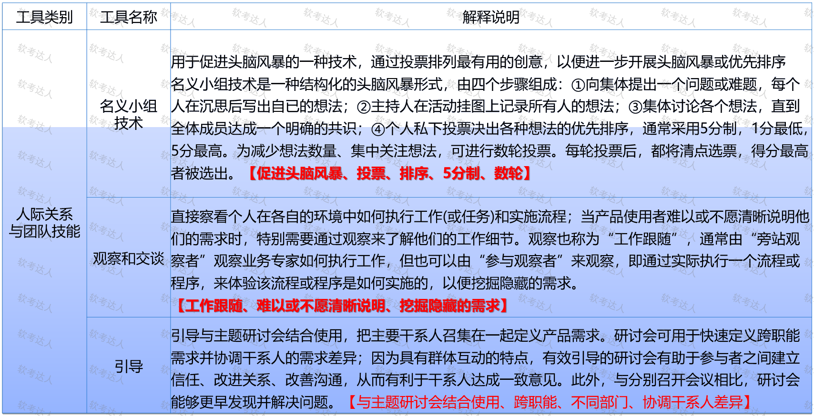

8、系统交互图：是对产品范围的 可视化描绘，业务系统与其他系统的交互方式

9、需求的类别：业务需求、干系人需求、解决方案需求、过渡和就绪需求、项目需求、质量需求

10、需求跟踪矩阵：把产品需求从来源连接到能满足需求的可交付成果的一种表格，

跟踪需求的内容包括：业务需求、机会、目的和目标；项目目标；项目范围和WBS可交付成果；产品设计；产品开发；测试策略和测试场景；高层级需求到详细需求。

### 定义范围

1、定义范围是：制定项目和产品详细描述的过程

本过程的主要作用：描述产品、服务或成果 的边界和验收标准

2、定义范围过程的数据流向

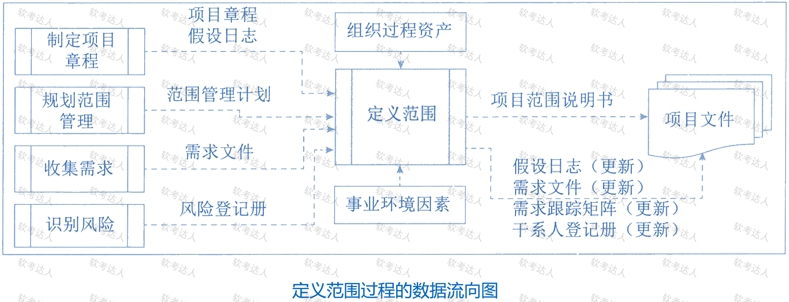

3、项目范围说明书是对 项目范围、主要可交付成果、假设条件 和 制约因素 的描述

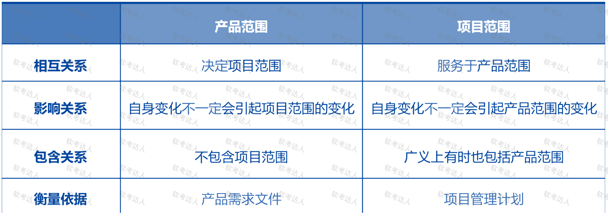

4、详细的项目范围说明书内容包括：产品范围描述、可交付成果、验收标准、项目的除外责任

### 创建WBS

1、创建WBS 是 把项目可交付成果和项目工作分解成较小的、更易于管理的组件的过程

过程的作用：为所要交付的内容提供架构

2、**WBS 是**对 团队为实现项目目标、创建所需可交付成果而**需要实施的全部工作范围的 层级分解**

WBS 组织并定义了 **项目的总范围**，最底层的组成部分为 **工作包**

在“工作分解结构”这里 ，“工作”是指 作为活动结果的工作产品或可交付成果

3、WBS 数据流向

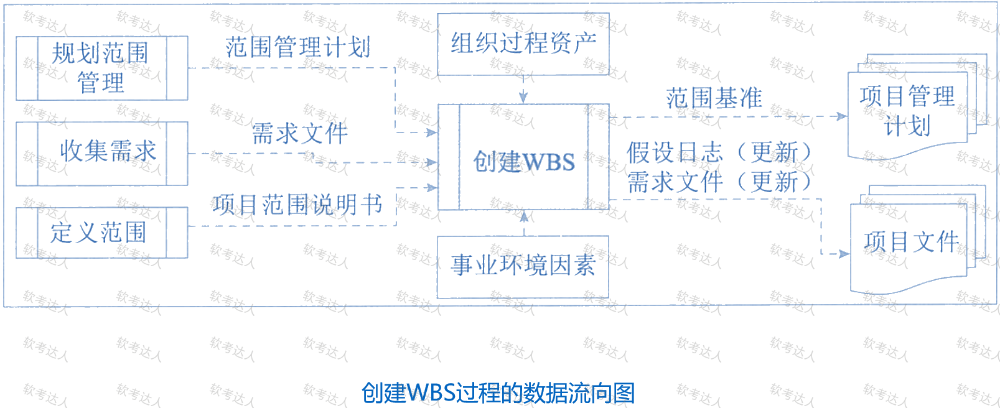

4、

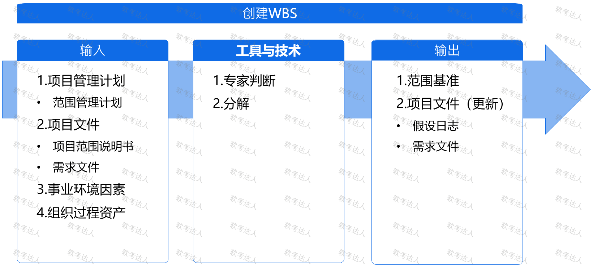

5、创建WBS 的方法：自上而下，使用组织特定的指南和使用WBS模板

要把整个项目工作分解为工作包的步骤：

- 识别和分析 **可交付成果及相关工作**；

- 确定 W**BS的结构和编排方法**；

- **自上而下 逐层细化分解**

- 为WBS组成部分 **制定和分配标识编**码；

- **核实 **可交付成果分解的程度** 是否恰当**

6、WBS 分解过程中，应该注意的以下 8 个方面：

- WBS **必须是面向可交付成果的**

- 必须 **符合项目范围**

- WBS **的底层应该支持计划和控制**

- WBS 中的元素 **必须有人负责**，而且**只有一个人负责**

- WBS 应控制 4\-6 层。

- WBS 应该**包括 项目管理工作**，也要包括 **分包出去的工作**

- WBS 的编制需要 所有（主要）项目干系人的参与

- WBS 并非是一成不变的

WBS 中，所有下一级的元素只和必须 100% 代表上一级的元素。

一个工作单元 只能从属于某个上层单元。

7、范围基准是经过批准的**范围说明书**、**WBS 和相应的 WBS 字典，**只有通过正式的变更控制程序才能进行变更，他被用作比较的基础。

范围基准是 项目管理计划的组成部分，包括：**项目范围说明书、WBS、工作包、规划包、WBS 字典**

8、控制账户、规划包、工作包的区分：

- 控制账户：是一个管理控制点，在该控制点上，把范围、预算和进度加以整合。控制账户拥有 2 个或以上的工作包，但每个工作包只与一个控制账户关联。

- 规划包：低于控制账户，高于工作包的**工作分解结构组件，一个控制账户可以包含 一个或多个规划包。**

- WBS 的**最底层级**是 带有特殊标识号的 **工作包**

### 规划进度管理

1、规划进度管理是：为了规划、编制、管理、执行和控制项目进度而制定政策、程序和文档 的过程。

规划进度管理的作用：为如何在整个项目期间管理项目进度提供指南和方向。

2、规划进度管理的数据流量

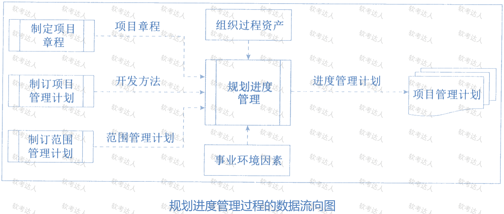

3、进度管理计划的目的：为了编制、监督和控制项目进度建立准则和明确活动要求。

根据项目要求，进度管理计划可以是 正式或非正式的，非常详细或高度概括的

进度管理计划的内容：项目进度模型、进度计划的发布和迭代长度、精准度、计量单位、WBS、项目进度模型维护、控制临界值、绩效测量规则、报告格式。

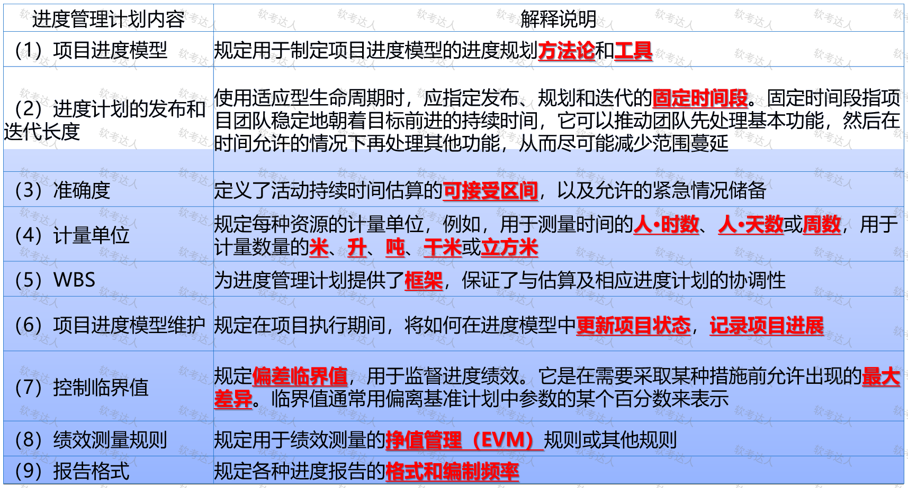

### 定义活动

1、定义活动是：**识别和记录**为**完成项目**可交付成果而**必须采取的具体行动** 的过程

作用：将工作包分解为 进度活动，作为对项目工作进行进度估算、规划、执行、监督和控制的基础。

需要在整个项目期间 开展

2、定义活动过程的数据流向

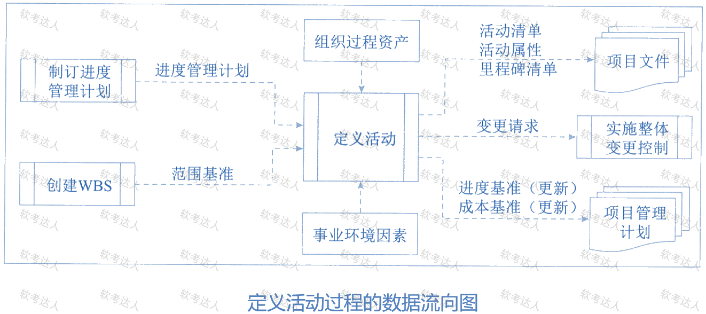

3、滚动式规划是一种 迭代式 的规划技术，即**详细**规划**近期**要完成的工作，同时在较高层级上**粗略规划远期工作。**它是一种 渐进明细 的规划方式，适用于 工作包、规划包。

4、里程碑是项目中的 重要时点或事件，里程碑清单指明每个里程碑是强制性的还是选择性的。

里程碑的持续时间为 零，因为它们代表的只是 一个重要时间点或事件。

### 排列活动顺序

1、排列活动顺序是 **识别和记录项目活动之间的关系** 的过程。

作用：定义工作之间的逻辑顺序，以便在既定的所有项目制约因素下获得最高的效率。

2、排列活动顺序过程旨在 将项目活动列表转化为 图表，作为发布进度基准的第一步。

除了收尾两项，每项活动都至少有一项紧前活动和一下紧后活动。

3、通过**设计逻辑关系**可以**支持创建**一个切实的**项目进度计划**，可能有必要在活动之间使用 **提前量或滞后量**，事件项目进度计划更为**切实可行**。可使用 项目管理软件、手动技术或自动技术来排列活动顺序。

4、排列活动顺序过程的数据流向

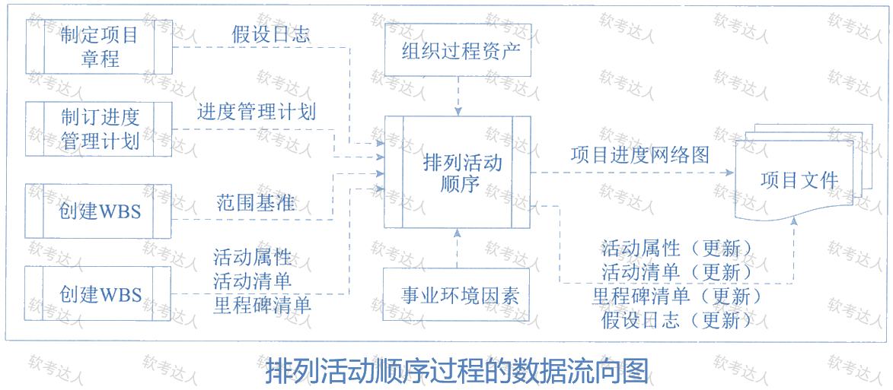

5、

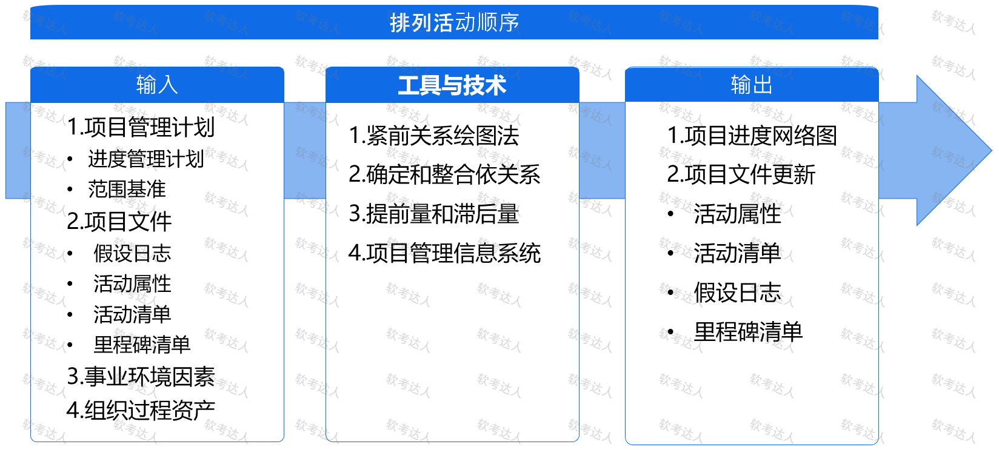

6、紧前关系绘图法（PDM）：又称 前导图法，使用 方形或长方形 代表活动，节点间使用箭头连接。

这种网络图也被称作 单代号网络图 或 活动节点图。

PDM 包括四种依赖关系：

- 完成到开始（FS）: 只有紧前完成，紧后才能开始

- 完成到完成（FF）：只有紧前完成，紧后活动才能完成

- 开始到开始（SS）：只有紧前开始，紧后才能开始。

- 开始到完成（SF）：只有紧前开始，紧后才能完成。

每项活动有唯一的活动号，每一项活动都注明了预计工期。

每项活动的几个时间：

- 最早开始时间（ES）

- 最早完成时间（EF）：EF =ES \+ 工期；

- 最迟开始时间（LS）

- 最迟完成时间（LF）：LS = LF \- 工期

7、箭线图法（ADM）：箭线表示关系，节点表示事件，这种也被称作 双代号网络图或活动箭线图

三个基本原则：

- 每一活动和事件必须有唯一的一个代号

- 任两项活动的紧前事件和紧后事件代号 至少有一个不同

- 流入（流出）同一节点的活动，均有共同的紧后活动（或紧前活动）

8、**提前量是**相对于紧前活动，紧后活动**可提前的时间量**，一般用** 负值 **表示。

**滞后量** 是相对紧前活动，紧后活动**可提前的时间量**，一般用 **正值**表示。

### 估算活动持续时间

1、估算活动持续时间是： 根据资源估算的结果，估算完成单项活动所需工作时段数的过程。

作用：确定完成每个活动所需花费的时间量

2、估算活动持续时间需要考虑的 其他因素：收益递减规律、资源数量、技术进步、员工激励

3、估算活动持续时间过程的数量流向：

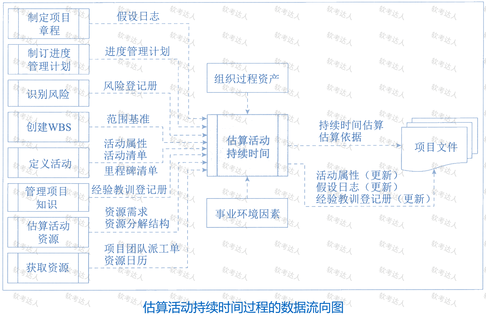

4、

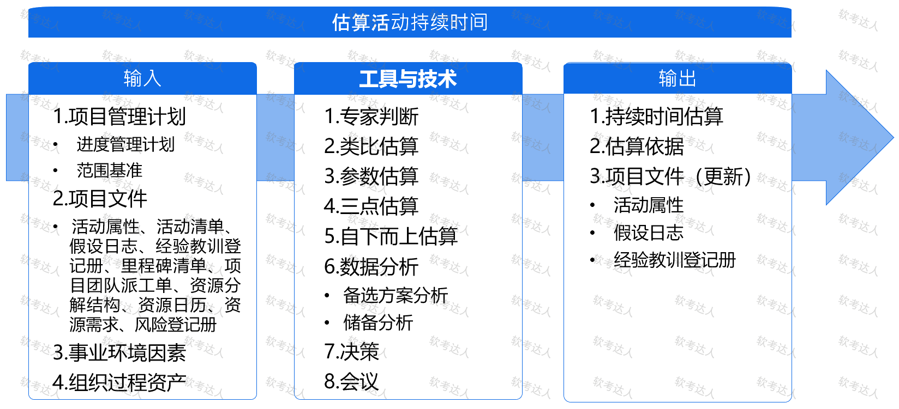

5、类比估算：使用相似活动或项目的历史数据。

类比估算以过去类似项目的参数值（持续时间、预算、规模、重量）为基础，来估算当前和未来的同类参数或指标。类比估算是粗略的，项目详细信息不足时，经常使用。

类比估算通常成本较低、耗时较少，但准确性较低。

6、参数估算：基于历史数据和项目参数，使用某种算法来计算成本或持续时间的估算技术。

是指利用历史数据之间的统计关系和其他变量，把需求实施的工作量乘以 完成单位工作量所需的工时，即可计算持续时间。

参数估算可以针对整个项目或项目中的某个部分，并可以 与其他估算方法联合使用。

7、三点估算：当历史数据不充分时，通过考虑估算中的不确定性和风险，可以提高活动持续时间估算的准确性。

乐观时间：在任何事情都顺利的情况下，完成某项工作的时间

最可能的时间：正常情况下，完成某项工作的时间

悲观时间：最不利的情况下，完成某项工作的时间

8、自下而上估算：是一种估算 项目持续时间或成本的方法，通过 从下到上逐层汇总 WBS 组成部分的估算 而得到项目估算。如果无法以合理的可信度对活动持续时间进行估算，应将活动进一步细化，然后估算细化后的具体工作的持续时间，接着再汇总得到每个活动的持续时间。

9、持续时间估算是对 完成某项活动、阶段或项目所需的工作时段的定量评估，其中并不包括 任何滞后量，但可指出一定的变动区间。

### 制定进度计划
1、***制定进度计划***是 **分析活动顺序、持续时间、资源需求和进度制约因素、创建进度模型、从而落实项目执行和监控** 的过程。
	作用：**为完成项目活动而制定具有计划日期的进度模型**。

2、制定进度计划的四个关键步骤：
	- **定义 项目里程碑**，识别 活动 并排列 活动顺序，以及估算活动持续时间，并确定 活动的开始和完成日期。
	- 由分配至各个活动的项目人员 **审查其被分配的活动**。
	- 项目人员确认 **开始和完成日期与资历日历和其他项目或任务没有冲突，从而确认计划日期的有效性；**
	- **分析进度计划**，确定 是否存在逻辑关系冲突，是否需要资源平衡。
3、制定进度计划过程的数据流向![[d222d65fef59f9a33b8252994a0fe92a.png]]
4、![[00d18e5090fc507b107dadc27979aa22.png]]
5、关键路径法：用于在进度模型中估算项目的 **最短工期**，确定逻辑网格路径的进度灵活性。
	关键路径是项目中 时间最长的活动顺序。
	关键路径法在不考虑任何资源限制的情况下，使用 正向和反向推算，计算出所有活动的最早开始、最早完成、最晚开始和最晚完成的时间。
	正向和反向计算的推算步骤：
		- 从前往后 正推，见数就加，如果有汇聚节点，取大的值。
		- 从后往前 逆推，见数就减，如果有汇聚节点，取小的值。
	总浮动时间：在任一网络路径上，进度活动可以从最早开始时间推迟或拖延的时间，而不至于延误项目完成日期或违反进度制约因素。
	总浮动时间 = 本活动的最迟完成时间 - 本活动的最早完成时间（最迟完成-最早完成）或 本活动的最迟开始时间 - 本活动的最早开始时间（最迟开始-最早开始）或 关键路径时长 - 该活动所在的最长路径。
	自由浮动时间：指在不延误任何 紧后活动 最开始时间或不违反进度制约因素的前提下，某活动可以推迟的时间量。
	自由浮动时间 = 紧后活动最早开始时间的最小值 -  本活动的最早完成时间
6、资源优化 包括 资源平衡和资源平滑。
	资源平衡：为了在资源需求与资源供给之间取得平衡，根据资源制约因素对开始日期和完成日期进行调整的一种技术。
	资源平滑：对进度模型中的活动进行 调整，从而使项目资源需求不超过预定的资源限制的一种技术。
	资源平衡 会导致 关键路径改变。资源平滑则不会。
7、进度压缩：包括 赶工 与 快速跟进。
	赶工：导致风险和/或成本的增加
	快速跟进：并行开展，可能造成返工和风险增加。
8、计划评审技术：（PERT）又称 三点估算技术。
	理论基础：假设项目持续时间、以及整个项目完成时间是随机的，且服从某种概率分布。
	PERT对各项目活动的完成时间按照3种不同的情况进行估计：
		- 乐观时间：任何事情都顺利，完成某项工作的时间；
		- 最可能时间：正常情况下，完成时间；
		- 悲观时间：最不利的情况下，完成时间。
9、项目进度计划：可以采用的图形方式包括：横道图、里程碑图、项目进度网络图。
	横道图：也称甘特图，纵向列-活动、横向列-日期
### 规划成本管理
1、规划成本管理是 **确定如何估算、预算、管理、监督和控制项目成本**的过程
	作用：在整个项目期间为如何管理项目成本提供指南和方向。
2、规划成本管理过程的数据流向![[6e7f9d68a310fb396b13a3d5e59a9925.png]]
3、
	![[6118de5b3fcf3e7f9f956bffb36ded49.png]]
### 估算成本
1、估算成本：**是对完成项目工作 所需资金进行近似估算** 的过程
	作用：确定项目所需的资金。
2、估算成本过程的数据流向![[2249fc896eaa78cb61d6e4132a02fa2d.png]]
3、![[f496fc30d9f2ca473cf94f044d8e7ed7.png]]
4、范围基准包括 项目范围说明书、WBS、WBS字典。
### 制定预算
1、制定预算：是汇总所有单个活动或工作包的估算成本，建立一个经批准的成本基准的过程
	作用：确定可据以监督和控制项目绩效的成本基准
2、制定预算过程的数据流向
![[6d954e9d107840ff05c297212413756f.png]]3、![[577aa3fc06676aaed341082d51f7f747.png]]
4、成本基准：是**经过批准的、按时间端分配的项目预算**，不包括：**任何管理储备**，只有通过 **正式的变更控制程序** 才能变更，用作于实际结果进行比较的依据，成本基准是 **不同进度活动经批准的预算的总和。**
	![[245dacb6350b10f85071341fdf0940cb.png]]
当必须动用管理储备的变更时，应该在 ***获取变更控制过程的批准*** 之后，把适量的管理储备移入成本基准中。
### 规划质量管理
1、规划质量管理 是**识别**项目及其可交付成果的**质量要求和（或）标准**，并书面描述项目将**如何证明**符合质量**要求和（或）标准** 的过程。
	作用：在整个项目期间为如何**管理和核实质量**提供指南和方向。
2、质量规划应与其他知识领域规划过程 并行开展。
3、规划质量管理过程的数据流向![[6b441a51d76f1b10a5dc5853b6d65fb7.png]]
3、![[c7bd029cb82f1d5a3e09455e757972f8.png]]
4、适用于规划质量管理过程的数据***收集***技术包括：标杆对照、头脑风暴、访谈。
5、适用于规划质量管理过程的数据***分析***技术包括：成本效益分析、质量成本。
	成本效益分析：是用来估算备选方案优势和劣势的财务分析工具，以确定最佳效益的备选方案。
	质量成本：预防成本、评估成本、失败成本
6、多标准决策分析：是适用于规划质量管理过程的一种决策技术。
	先对标准 排序加权，再应用于所有备选方案，计算出各个备选方案的教学得分，然后根据得分 对备选方案排序。在规划质量管理过程中，有助于排定质量测量指标的优先顺序。
7、适用于规划质量管理的数据表现技术：流程图、逻辑数据模型、矩阵图、思维导图。
### 规划资源管理
1、规划资源管理是 ***定义如何估算、获取、建设、管理和控制实物以及团队资源*** 的过程。
	作用：根据项目类型和复杂程度确定适用于项目资源的管理方法和管理程度。
2、项目资源：团队成员、用品、材料、设备、服务和设施、稀缺资源的可用性和竞争。
3、规划资源管理过程的数据流向![[7260596d73b8a5b20e6b57a7ec4f2cd9.png]]
4、![[e13d2402f25f95822ada818c0f824007.png]]
5、数据表现格式：层次型、矩阵型、文本型
	数据表现用来记录和阐明团队成员的角色与职责，记录的目的都是确保 每个工作包都有明确的责任人、确保全体团队成员都清楚地理解其角色和职责。
	层次型用来表示 高层级角色；文本型 用于记录详细职责。
6、层次型：采用传统的组织结构图，自上而下的显示相互关系
	工作分解结构（WBS）、组织分解结构（OBS）、资源分解结构
7、矩阵型：展示项目资源在各个工作包中的任务分配
	职责分配矩阵（RAM）：显示分配给每个工作包的资源，用于说明工作包或活动与项目成员之间的关系。
	矩阵图可以确保 任何一项任务都只有一个人负责。
8、文本型：详细描述团队成员的职责
9、***资源管理计划***提供关于 如何分类、分配、管理和释放项目资源的指南。资源管理计划可分为：团推管理计划和实物资源管理计划。
	资源管理计划包括：识别资源、获取资源、角色与职责、项目组织图、项目团队资源管理、培训、团队建设、资源控制和认可计划。
10、团队章程：团队价值观、沟通指南、决策标准和过程、冲突处理过程、会议指南和团队共识。
### 估算活动资源
1、估算活动资源：估算执行项目所需的 团队资源、设施、设备、材料、用品和其他资源的类型与数量 的过程。
	作用：明确完成项目所需的资源种类、数量和特性。
2、估算活动资源过程的数据流向![[5ac01f5cd59ecc195812e8f9f9e0d170.png]]
3、![[a28a81d0a416ee013a2df448263465c6.png]]
4、资源日历：识别每种具体资源可用时的日期，规定了项目团队和实物资源何时可用、可用多久。
5、资源需求：识别工作包或工作包中每个活动所需的资源类型和数量
6、资源分解结构：是资源依照类别和类型的层级展现。
### 规划沟通管理
1、***规划沟通管理*** 是 **基于**每个干系人或干系人群体的**信息需求、可用组织资产**，以及具体项目的需求，为项目**沟通活动制定恰当的方法和计划**的过程。
	作用：及时向干系人提供相关信息、引导干系人有效参与项目而编制书面沟通计划。
2、规划沟通管理要求 项目经理在项目早期针对项目干系人多样性的信息需求，制定有效的沟通管理计划，要在整个项目期间，定期审查本过程的成果并做 必要修改。
3、规划沟通管理过程的数据流向![[e24fb79e598a81f56cb0c63f2613d4e3.png]]
4、![[e9ac1e04716960935adbd59cc05bf7f9.png]]
5、沟通模型：可以是最基本的线性沟通过程，也可以是 反馈元素、更具互动性的沟通形式，甚至可以是 融合了发送方或接收方的人性因素、试图考虑沟通复杂性的更加复杂的沟通模型。
6、沟通方法：互动沟通、推式沟通、拉式沟通。
	实现沟通管理计划所规定的主要沟通需求：
		人际沟通、小组沟通、公众沟通、大众传播、网络和社交工具沟通。
7、沟通管理计划主要包括：干系人的沟通需求、需沟通的信息、上报步骤、发布信息的原因、发布所需信息后做出回应的时效与频率、负责沟通相关信息的人员、负责授权保密信息发布的人员、接收信息的人员群体的需求和期望。
### 规划风险管理
1、规划风险管理是 ***定义如何实施项目风险管理活动*** 的过程
	作用：确保风险管理的水平、方法和可见度与项目风险程度，以及项目对组织和其他干系人的重要程度相匹配。
2、规划风险管理过程的数据流向![[a270707e2acb050caf5884e2a0cd91a9.png]]
3、![[5a102cced9d68a7b676697ef9f2614af.png]]
4、每个项目都有两个层面上存在风险：
	- 每个项目都有会影响项目达成目标的**单个风险**；
	- **由单个风险**和不确定性的**其他来源**联合导致的 **整体项目风险**。
	项目风险会对项目产生负面或正面的影响，也就是 威胁与机会。
	强化正面风险（机会），规避负面风险（威胁）
5、风险的属性：
	- 随机性
	- 相对性：风险越大收益越大，收益越大愿意承担的风险也越大；投入越大成功的概率越大，冒险越小
	- 高管比低管承担的风险 相对要大，拥有资源越多，风险承受能力也越大。
6、风险的可变性含义包括：风险性质的变化、风险后果的变化、出现新风险。
7、风险分类：
	- 按照风险后果划分：纯粹风险、投机风险。
	- 按照风险来源划分：自然风险、人为风险。
	- 按照是否可管理划分：可管理风险、不可管理的风险
	- 按照风险影响范围划分：局部风险、总体风险
	- 按照风险后果的承担者划分：项目业主风险、政府风险、承包商风险、投资方风险、设计单位风险、监理单位风险、供应商风险、担保方风险、保险公司风险
	- 按照风险的可预测性划分：已知风险、可预测风险、不可预测风险。
8、风险管理计划的内容：风险管理策略、方法论、角色与职责、资金、时间安排、风险类别、干系人风险偏好、风险概率和影响、概率和影响矩阵、报告格式、跟踪。
### 识别风险
1、识别风险是 识别单个项目风险及整体项目风险的来源，并记录风险特征的过程。
	作用：记录现有的单个项目风险及整体项目风险的来源。
2、识别风险过程的数据流向![[54c37f778b1984eec45dd0165f12e91d.png]]
3、![[cb1ed847083665376680103ec41dec3c.png]]
4、![[30e9ffb7fd1eae3aff8fc63562fea39e.png]]
5、风险登记册的内容：已识别风险清单、潜在风险责任人、潜在风险应对措施清单。
![[939a9915ebd28236263a8254f9291247.png]]
6、风险报告的编制是一项 渐进式的工作，风险报告的内容主要包括：整体项目风险的来源、关于已识别的单个项目风险的概述信息
### 实施定性风险分析
1、实施定性风险分析是 通过评估单个项目风险发生的概率和影响以及其他特征，对风险进行优先级排序，从而为后续分析或行动提供基础
	作用：重点关注高优先级的风险。
2、实施定性风险分析为规划风险应对过程确定 单个项目风险的 相对优先级
	为每个风险识别出责任人。
3、实施定性风险分析过程的数据流向![[3990eebcf0f429be3230854d24871d6c.png]]
4、![[dc702309da3896ed170ebd93bd1f0752.png|593]]
5、![[622e8329c3f8198e4db2ee7b14a6160a.png|352]]![[5541c973fa067691deb842bf7a2b391f.png|565]]
6、![[d03ee00517dea3843dc943d579054e98.png]]
7、风险登记册的更新内容可能包括:每项单个项目风险的概率和影响评估、优先级别或风险分值指定风险责任人、风险紧迫性信息或风险类别，以及低优先级风险的观察清单或需要进一步分析的风险。
8、更新后的风险报告记录最重要的单个项目风险(通常为概率和影响最高的风险) 所有已识别风险的优先级列表以及简要的结论软考达人
### 实施定量风险分析
1、实施定量风险分析是 就已识别的单个项目风险和不确定性的其他来源对整体项目目标的影响进行定量分析 的过程。
	作用：量化整体项目风险，并提供额外的定量风险信息，以支持风险应对规划。
2、并非所有项目都需要实施定量风险分析，项目风险管理计划会规定是否需要使用定量风险分析
	定量分析适用于：
		- 大型或复杂的项目
		- 具有战略重要性的项目
		- 合同要求进行定量分析的项目
		- 主要干系人要求进行定量分析的项目
3、在实施定量风险分析过程中，要使用被定性风险分析过程评估为项目目标存在 ***重大潜在影响***的单个项目风险的信息。
4、实施定量风险分析过程的数据流向![[6aef6b49887b8ca5988ad015fbba764c.png]]
5、![[f197fccc01cee2bf657b5726ac2840d5.png]]
6、概率分布的形式：三角分布、正态分布、对数正态分布、贝塔分布、均与分布或离散分布。
7、适用于实施定量风险分析过程的数据分析技术![[071bf02922664a07c0d39305de2852f8.png]]
8、风险报告的内容：
	- 对整体项目风险最大可能性的评估结果
	- 项目详细概率分析的结果
	- 单个项目风险优先级清单
	- 定量风险分析结果的趋势
	- 风险应对建议
### 规划风险应对  （项目整个期间开展）
1、规划风险应对是 为处理整体项目风险敞口，以及应对单个项目风险而制定可选方案、选择应对策略并商定应对行动的过程。
	作用：制定应对整体项目风险和单个项目风险的适当方法。本过程还将分配资源，并根据需要 将相关活动添加进项目文件和项目管理计划。
2、风险应对方案应与 风险的重要性 相匹配，并且能够经济有效的应对，获得 全体干系人同意，并由一名责任人具体负责。
3、应急计划的制定是因为：选定的策略并不完全有效，或者发生了已接收的风险。
制定应急计划的同时也要是被 次生风险。
4、规划风险应对过程的数据流向![[ce901f8e9e9127b1b7fa9d77b5e490b7.png]]
5、![[58f263c4e0cf97aec9a7694db1350134.png]]
6、风险登记册：包含 已识别并排序的、需要应对的单个项目风险的详细信息。
针对高优先级的威胁或机会，需要 **采取优先措施和积极主动的应对策略**
对于低优先级的威胁或机会，可能需要把它们列入风险登记册的观察清单部分。
7、威胁应对策略：上报、规避、转移、减轻、接受
	- 上报：超出项目经理的权限，采取上报策略，被上报的风险将在其他部门加以管理，而非 项目层面。 对上报的威胁，相关人员必须愿意承担对应责任。
	- 规避：用于消除威胁，适用于发生概率较高，具有严重负面影响的高优先级威胁。规避措施包括：消除威胁的原因、延长进度计划、改变项目策略。
	- 转移：用于降低 威胁发生的概率和影响。减轻措施包括：采用比较简单的流程，进行更多次测试，或者选用更可靠的卖方。
	- 接受：承认威胁的存在，也用于低优先级的威胁。常见的主动接受策略：建立应急储备，包括预留时间、资金或资源。
8、机会应对策略：上报、开拓、分享、提高、接受。
9、整体项目风险应对策略：规避、开拓、转移或分享、减轻或提高、接受。
### 规划采购管理
1、规划采购管理是 记录项目采购决策、明确采购方法，识别潜在卖方的过程。
	作用：确定是否从项目外部获取货物和服务。（什么时间、什么方式获取什么货物和服务）
2、采购步骤：
	- 准备采购工作说明书（SOW）或 工作大纲（TOR）
	- 准备高层级的成本估算，制定预算；
	- 发布招标广告；
	- 确定合格卖方的名单；
	- 准备发布招标文件；
	- 由卖方准备提交建议书；
	- 对建议书开展技术评估；
	- 对建议开展 成本评估；
	-  准备最终的综合评估报告，选出中标建议书；
	- 结束谈判，买方和卖方签署合同。
3、规划采购管理过程的数据流向![[9e87b1667979efafb11457892f863027.png]]
4、![[8d09448d76f8f441b353ad93b59d5a69.png]]
5、采购管理计划的内容：
	- 如何协调采购与项目的其他工作
	- 开始重要采购活动的时间表；
	- 用于管理合同的采购测量指标；
	- 与采购有关的干系人角色与职责
	- 可能影响采购工作的制约因素和假设条件；
	- 司法管辖权和付款货币；
	- 是否需要编制独立估算；
	- 风向管理事项；
	- 拟使用的预审合格的卖方。
6、采购策略：
	- 交付方法：专业服务项目、工业或商业施工项目
	- 合同支付类型：总价合同、成本补偿合同、激励和奖励费用。
7、采购工作说明书：会充分、详细地描述 拟采购的产品、服务或成果。
	包括：规格、所需数量、质量水平、绩效数据、履约期间、工作地点和其他要求。
8、招标文件：招标文件用于 向潜在卖方征求建议书。
	招标文件可以是：信息邀请书、报价邀请书、建议邀请书。
		- 信息邀请书（RFI）：提供关于拟采购货物和服务的更多信息
		- 报价邀请书（RFQ）：提供关于将如何满足需求和将需要多少成本的更多信息。
		- 建议邀请书（RFP）：如果项目中出现问题且解决办法难以确定。
9、合同类型
![[22616b040eb623377f9a118017bd9cd6.png|281]]![[22616b040eb623377f9a118017bd9cd6 1.png|288]]![[3d3ca241bd7ac569b25d8b34f5841f09.png|590]]
10、工料合同：买方承担工作量变动的风险，卖方承担单价风险，适用于 金额小、工期短、不复杂的项目。![[942186814ce8e5d0bf34cc78565650e8.png]]
11、合同类型的选择：
	- 总计合同：工作范围很明确、且项目的设计已具备详细的细节
	- 工料合同：工作性质清楚，范围不是很不清楚（比较明确），工作不复杂，需要快速签订合同。
	- 成本补偿合同：工作范围长不清楚。
	- 双方分担风险：工料合同；买方承担成本风险：成本补偿合同；买方承担成本风险：总价合同
	- 单边合同：购买标准产品、数量不大。
12、合同的内容：项目名称、标的内容和范围、项目的质量要求、项目的计划进度地点地域和方式、项目建设过程中的各种期限、技术情报和资料的保密、风险责任的承担、技术成果 的归属、验收的标准和方法、价款报酬及其支付方式、违约金或损失赔偿的计算方式、解决争议的方法、名词术语解释。
### 规划干系人参与（整个项目期间开展）
1、规划干系人参与是 根据干系人的需求、期望、利益和对项目的潜在影响，制定项目干系人参与项目的方法 的过程。
	作用：提供与干系人进行有效互动的可行计划。
2、会触发干系人参与计划更新的情况包括：
	- 项目新阶段开始
	- 组织结构或行业内部发生变化
	- 新的个人或群体成为干系人。
	- 变更管理、风险管理或问题管理。
3、规划干系人参与过程的数据流向![[aed368001c95378036f5e1b8a93c2f2a.png]]
4、![[1d4d5eaedb7ec4de2a16d2dec7f022d7.png]]
5、干系人评估矩阵用于将干系人 参与当前水平与期望参与水平进行比较
	干系人水平：不了解型、抵制型、中立型、支持型、领导型。
6、干系人参与计划可以是 正式的 或非正式的，非常详细或高度概括，这个基于项目的需要和干系人的期望。

